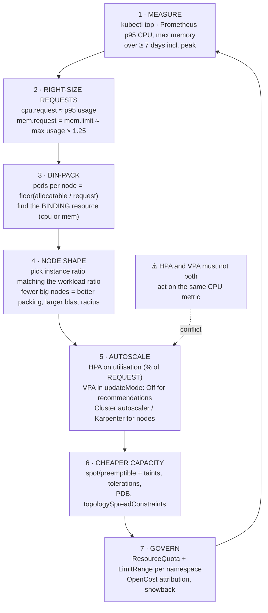

# Kubernetes Cost Optimization Lab

Almost every expensive cluster is expensive for the same reason: **requests were guessed high, once, and
never revisited**. You pay for reserved capacity, not for usage. This lab measures real consumption, does
the right-sizing arithmetic explicitly, and only then touches autoscaling, node shapes and spot capacity —
the verify-before-you-teach method from [`AGENTS.md`](../../../AGENTS.md).

## When to use

- Cluster CPU utilisation sits at 15–25% while the autoscaler keeps adding nodes.
- Requests were copied from a neighbouring service, then doubled "to be safe", years ago.
- Someone proposes deleting CPU limits or adding VPA, and the team needs the trade-offs rather than a
  slogan.
- Finance asks what the `payments` namespace costs and nobody can answer.
- **Don't use it for** application-level performance work — a service that burns four cores because of an
  N+1 query is a code problem ([debugging-coach](../debugging-coach/SKILL.md)) — and don't use it to
  justify removing memory limits on a workload with a known leak. Cost work must never be the first cause
  of an incident.

## First principles: you pay for requests, you are punished by limits

Two numbers per container, doing completely different jobs (Kubernetes documentation, *Resource Management
for Pods and Containers* and *Assign CPU/Memory Resources*, kubernetes.io):

- **`requests`** are what the **scheduler reserves**. Sum of requests ÷ node allocatable determines how
  many nodes you need — so **requests are the cost function**. Unused reserved capacity is money burned.
- **`limits`** are what the **runtime enforces**. CPU is compressible: exceeding a CPU limit causes CFS
  **throttling** (latency, not death). Memory is not compressible: exceeding a memory limit causes an
  **OOMKill**.

That asymmetry drives the whole practice: **size CPU from a high percentile of usage, size memory from the
observed maximum**, because being wrong about CPU costs milliseconds and being wrong about memory costs a
restart.

QoS class follows from the two numbers and decides who dies first under node pressure:

| QoS class | Condition | Eviction order under node pressure | Use for |
| --- | --- | --- | --- |
| `Guaranteed` | requests == limits, for **every** container, for **both** cpu and memory | evicted last | latency-critical, stateful, memory-sensitive |
| `Burstable` | at least one request set, but not equal to limits | middle | most services |
| `BestEffort` | no requests or limits at all | **evicted first** | batch you genuinely do not mind losing |



*Figure: the loop. Steps 1–3 are arithmetic and usually deliver most of the saving; everything below them
is optimisation of an already correctly sized workload.*

| Lever | Typical saving | Risk if done badly | Reversible? |
| --- | --- | --- | --- |
| Right-size requests | large — often 40–70% of reserved capacity | memory too low → OOMKill; CPU too low → throttling | yes, immediately |
| Remove idle/zombie workloads | large | deleting something load-bearing | yes, from Git |
| Improve bin-packing / node shape | medium | bigger blast radius per node | yes, by node pool |
| HPA (scale out on demand) | medium | flapping; scales on % of a wrong request | yes |
| Spot / preemptible nodes | large on the eligible fraction | interruption during a rollout or a stateful write | yes |
| Quotas + LimitRange defaults | preventive | too-tight quota blocks deploys at 02:00 | yes |
| Cluster/node autoscaler tuning | medium | slow scale-up hurts latency during spikes | yes |

| Autoscaler | API | Scales | Watch out |
| --- | --- | --- | --- |
| HPA | `autoscaling/v2` | replica count | `averageUtilization` is a percentage **of the request** — oversized requests mean the HPA never triggers |
| VPA | `autoscaling.k8s.io/v1` | per-pod requests/limits | in `Auto`/`Recreate` mode it **restarts pods**; conflicts with HPA on the same metric |
| Cluster autoscaler / Karpenter | node groups / NodePools | nodes | only removes a node if everything on it can be rescheduled — a single un-evictable pod pins an entire node |

⚠ Volatile: in-place pod resource resize (the `resize` subresource) has been progressing through alpha and
beta across recent releases, and VPA/Karpenter/OpenCost versions move quickly. Check the Kubernetes
version-skew and feature-gate notes for **your** cluster version before designing around it.

## Procedure

1. **Get real numbers before touching anything.** Install metrics-server on the lab cluster
   (`kubectl apply -f https://github.com/kubernetes-sigs/metrics-server/releases/latest/download/components.yaml`;
   on kind add `--kubelet-insecure-tls` to the deployment args), then:
   `kubectl top pods -A --sort-by=cpu` and `kubectl top nodes`.
   `kubectl top` is an instantaneous sample — good for triage, useless for sizing.
2. **Collect a real distribution over ≥ 7 days including a peak** with Prometheus
   ([prometheus-grafana-local-lab](../prometheus-grafana-local-lab/SKILL.md)):
   ```promql
   # p95 CPU actually used, per pod, over a week
   quantile_over_time(0.95, sum by (pod) (rate(container_cpu_usage_seconds_total{namespace="shop",container!=""}[5m]))[7d:5m])
   # MAXIMUM working set memory, per pod — use max for memory, never p95
   max_over_time(sum by (pod) (container_memory_working_set_bytes{namespace="shop",container!=""})[7d:5m])
   ```
3. **Compute the waste explicitly**: requested − used, per workload, multiplied by replicas. Rank by
   absolute waste, not by percentage — a 90%-idle pod requesting 50m is not where your money is.
4. **Right-size with a written rule**, not vibes:
   `cpu.request = p95_cpu × 1.2` (round up to a sane step), **no CPU limit or a generous one**;
   `memory.request = memory.limit = max_memory × 1.25` (Guaranteed for memory, so it is never OOMKilled by
   its own limit under normal peaks).
5. **Cross-check the HPA maths.** If a pod requests 1000m and the HPA targets 70% utilisation, it scales at
   700m of real usage. Cutting the request to 200m makes the same absolute load *look like* 350% and the
   HPA scales out — so **re-tune HPA targets in the same change**, or you will trade a cost problem for a
   scaling incident.
6. **Get a second opinion from VPA in recommendation-only mode** — `updateMode: "Off"` never touches your
   pods:
   `kubectl get vpa shop-web -o jsonpath='{.status.recommendation.containerRecommendations}' | jq`.
   Read `lowerBound`, `target` and `upperBound`; treat `target` as advice, not instruction.
7. **Re-do the bin-packing arithmetic** with the new requests: `kubectl describe node <n> | sed -n '/Allocatable/,/System Info/p'`
   gives allocatable (capacity minus kube/system reserved). Pods per node = `floor(allocatable ÷ request)`
   for **each** resource; the smallest result is the binding constraint. If CPU binds and memory is 70%
   idle, you have the wrong **node shape**, not the wrong request.
8. **Roll out to one workload, watch three signals for 48 hours**: OOMKills
   (`kubectl get events -A --field-selector reason=OOMKilling` and container `lastState.terminated.reason`),
   CPU throttling (`container_cpu_cfs_throttled_seconds_total`), and the service's own latency SLI.
   Cost work that degrades the SLI is not a saving, it is deferred incident cost.
9. **Move eligible workloads to spot/preemptible capacity**: taint the node pool, add matching
   `tolerations` and `nodeAffinity`, add a `PodDisruptionBudget`, and spread with
   `topologySpreadConstraints` so one reclaim event cannot take every replica. Stateful and
   singleton workloads stay on on-demand.
10. **Cap and default per namespace** with `ResourceQuota` (a ceiling for the tenant) plus `LimitRange`
    (defaults + per-container max), so an unsized deployment cannot land as `BestEffort` or request
    64 cores by accident.
11. **Attribute the spend** with OpenCost (a CNCF project — verify install instructions on opencost.io) or
    Kubecost, so each namespace has a number. Attribution changes behaviour more reliably than advice does.
12. **Re-measure and publish before/after** (nodes, reserved vCPU/GiB, $/month, SLI unchanged). Close with
    the **Learning Footer**.

## Output shape

```
Scope: <namespace/workload>     Window measured: <7d, YYYY-MM-DD → YYYY-MM-DD, incl. peak on <date>>
Source: <Prometheus | metrics-server (triage only)>       Replicas: <N>

Per container:
  cpu     request <before> → <after>   (p95 used <..>, ×<1.2> headroom)   limit: <none|value + why>
  memory  request <before> → <after>   (MAX used <..>, ×<1.25> headroom)  limit: <= request> (Guaranteed)
  QoS: <Burstable → Guaranteed(memory)>          Rationale: <one line>

Reserved capacity: <before vCPU/GiB> → <after vCPU/GiB>       Reduction: <X%>
Bin-packing: allocatable/node <cpu>/<mem> · pods per node <before> → <after> · binding resource: <cpu|memory>
Nodes required: <before> → <after>       Node shape: <current> → <recommended, ratio matches workload>
Estimated cost: <$before/mo> → <$after/mo>   Saving: <$X/mo (Y%)>   Basis: <price source + date>

Autoscaling: HPA target <X%> → <Y%> (retuned for the new request)  min/max <..>
             VPA updateMode=<Off (recommend only)>  target=<cpu/mem>  agrees with our numbers: <yes/no>
Spot: eligible workloads <list>  taint/toleration=<...>  PDB minAvailable=<N>  spread=<topologyKey>
Guardrails: ResourceQuota <ns>: cpu=<..> memory=<..>   LimitRange defaults: <..>
Safety check (48h after rollout): OOMKills <0> · CPU throttling <..%> · SLI p99 <unchanged>   ✔
Attribution: OpenCost/Kubecost per-namespace $ published: <yes/no>
Next: <k8s-autoscaling-lab | capacity-planning-coach | cloud-cost-optimizer>
Learning Footer
```

## Worked example — a right-sizing calculation, done as arithmetic

**Observed state.** `shop/web`, 60 replicas, requests copied from a template two years ago:

| Container | Request (before) | Limit (before) | p95 CPU used | max memory used |
| --- | --- | --- | --- | --- |
| `web` | cpu `1000m`, memory `2Gi` | cpu `2000m`, memory `2Gi` | `120m` | `470Mi` |

Reserved: 60 × 1 vCPU = **60 vCPU**, 60 × 2 GiB = **120 GiB**.
Actually used at p95/max: 60 × 0.12 = **7.2 vCPU**, 60 × 0.47 = **27.5 GiB**.
CPU reservation efficiency: 7.2 ÷ 60 = **12%**. That gap is the entire bill.

**Step 1 — new requests, from the written rule.**

```
cpu.request    = p95 × 1.2 = 120m × 1.2 = 144m  → round up to 200m   (generous, still 5× smaller)
memory.request = max × 1.25 = 470Mi × 1.25 = 588Mi → round up to 640Mi
memory.limit   = 640Mi                       (request == limit → memory is Guaranteed)
cpu.limit      = omitted                     (CPU is compressible; a limit here only adds throttling)
```

**Step 2 — bin-packing, with a real node.** An 8 vCPU / 32 GiB node does not give you 8 and 32: subtract
kube-reserved, system-reserved and eviction thresholds. Take the number from your own
`kubectl describe node`; a typical allocatable is **7.6 vCPU / 29 GiB**.

```
BEFORE   pods/node by CPU    = floor(7.6 / 1.0)    = 7
         pods/node by memory = floor(29  / 2.0)    = 14
         binding resource    = CPU → 7 pods/node
         nodes needed        = ceil(60 / 7)        = 9 nodes

AFTER    pods/node by CPU    = floor(7.6 / 0.2)    = 38
         pods/node by memory = floor(29  / 0.625)  = 46
         binding resource    = CPU → 38 pods/node
         nodes needed        = ceil(60 / 38)       = 2 nodes
         + 1 node of failure headroom (survive losing one node)   = 3 nodes
```

**Step 3 — the money, stated with its basis.** At an illustrative **$0.40 per node-hour** (substitute your
own list price and date — cloud pricing is volatile):

```
BEFORE  9 nodes × $0.40/h × 730 h = $2,628 / month
AFTER   3 nodes × $0.40/h × 730 h =   $876 / month
SAVING                              $1,752 / month  (67%)   — same 60 replicas, same workload
```

**Step 4 — the manifest, and why each field is what it is.**

```yaml
apiVersion: apps/v1
kind: Deployment
metadata: {name: web, namespace: shop}
spec:
  replicas: 60
  selector: {matchLabels: {app: web}}
  template:
    metadata: {labels: {app: web}}
    spec:
      securityContext:
        runAsNonRoot: true
        runAsUser: 10001
        seccompProfile: {type: RuntimeDefault}
      topologySpreadConstraints:
        - maxSkew: 1
          topologyKey: kubernetes.io/hostname
          whenUnsatisfiable: ScheduleAnyway     # packing beats perfect spread at 38 pods/node
          labelSelector: {matchLabels: {app: web}}
      containers:
        - name: web
          image: ghcr.io/acme/web:1.4.2@sha256:0f7c…   # deploy by digest
          resources:
            requests:
              cpu: "200m"        # p95 120m × 1.2, rounded up — this is the number you PAY for
              memory: "640Mi"    # max 470Mi × 1.25
            limits:
              memory: "640Mi"    # == request → memory Guaranteed, evicted last, never over-committed
              # NO cpu limit: CPU is compressible; a limit converts spare capacity into throttling
          securityContext:
            allowPrivilegeEscalation: false
            readOnlyRootFilesystem: true
            capabilities: {drop: ["ALL"]}
---
apiVersion: policy/v1
kind: PodDisruptionBudget
metadata: {name: web, namespace: shop}
spec:
  minAvailable: 55                    # node drains and spot reclaims cannot take more than 5 at once
  selector: {matchLabels: {app: web}}
```

**Step 5 — the HPA trap, checked before shipping.** The existing HPA targeted 70% CPU utilisation:

```
BEFORE  70% of a 1000m request = triggers at 700m real usage — with p95 at 120m it NEVER scaled.
AFTER   70% of a  200m request = triggers at 140m real usage — p95 120m is 60%, so it is now
        one modest traffic bump away from scaling out. That is correct behaviour, but it is NEW
        behaviour, so raise maxReplicas and watch it for a week.
```

```yaml
apiVersion: autoscaling/v2
kind: HorizontalPodAutoscaler
metadata: {name: web, namespace: shop}
spec:
  scaleTargetRef: {apiVersion: apps/v1, kind: Deployment, name: web}
  minReplicas: 40
  maxReplicas: 120                     # raised: each pod is now 5× smaller
  metrics:
    - type: Resource
      resource:
        name: cpu
        target: {type: Utilization, averageUtilization: 70}   # 70% of 200m = 140m
  behavior:
    scaleDown:
      stabilizationWindowSeconds: 300  # don't flap after a spike
```

**Step 6 — a second opinion, without touching the pods.**

```yaml
apiVersion: autoscaling.k8s.io/v1
kind: VerticalPodAutoscaler
metadata: {name: web, namespace: shop}
spec:
  targetRef: {apiVersion: apps/v1, kind: Deployment, name: web}
  updatePolicy:
    updateMode: "Off"        # RECOMMEND ONLY — Auto/Recreate would restart pods, and would
                             # fight the HPA because both would act on CPU
  resourcePolicy:
    containerPolicies:
      - containerName: web
        minAllowed: {cpu: "100m", memory: "256Mi"}
        maxAllowed: {cpu: "2",    memory: "2Gi"}
```

If VPA's `target` comes back near 200m/640Mi, your arithmetic is corroborated. If it comes back far higher,
your measurement window probably missed a peak — go back to step 1 rather than overriding it.

**Step 7 — the guardrail so the next team cannot re-create the problem.**

```yaml
apiVersion: v1
kind: LimitRange
metadata: {name: defaults, namespace: shop}
spec:
  limits:
    - type: Container
      default:        {cpu: "200m", memory: "256Mi"}   # applied when a container sets no limit
      defaultRequest: {cpu: "100m", memory: "128Mi"}   # applied when it sets no request → never BestEffort
      max:            {cpu: "4",    memory: "8Gi"}     # nobody requests half a node by accident
---
apiVersion: v1
kind: ResourceQuota
metadata: {name: shop-quota, namespace: shop}
spec:
  hard:
    requests.cpu: "20"
    requests.memory: 60Gi
    limits.memory: 60Gi
    pods: "150"
```

Sanity-trace the quota against the plan: 60 pods × 200m = 12 vCPU and 60 × 640Mi ≈ 37.5 GiB, both inside
the quota with room for an HPA scale-out to ~100 pods (20 vCPU) — so the quota constrains runaway growth
without blocking normal autoscaling. Set it too tight and you will discover it during a traffic spike.

## Tips

- **Requests are the bill; limits are the punishment.** Every cost conversation should start by asking what
  is *reserved*, not what is *used*.
- Size CPU from a high percentile and memory from the **maximum**. Memory is non-compressible: a too-low
  memory request/limit does not slow the pod down, it kills it.
- Setting `memory.request == memory.limit` buys `Guaranteed` treatment for memory and predictable
  eviction ordering — usually worth more than the few MiB you would save by over-committing.
- Deleting CPU limits is a legitimate, widely used choice (it converts throttling into best-effort bursting)
  — but it is a trade-off, not a law: it makes one noisy pod able to steal spare cycles. Decide per node
  pool, and never remove **memory** limits to "fix" OOMKills.
- Re-tune the HPA in the same PR as the request cut, or you ship a scaling change disguised as a cost
  change.
- Never run VPA in `Auto` and an HPA on the same CPU metric — they optimise the same variable in opposite
  directions. `updateMode: "Off"` plus human review is the safe default.
- A single pod without a PDB, or with local storage, can pin a whole node and defeat the cluster
  autoscaler. When node count will not drop, look for the un-evictable pod before blaming the autoscaler.
- Attribution beats exhortation: publish per-namespace cost with OpenCost and let teams see their own
  number.
- Related: [k8s-autoscaling-lab](../k8s-autoscaling-lab/SKILL.md),
  [k8s-scheduling-lab](../k8s-scheduling-lab/SKILL.md) for taints, affinity and spread,
  [capacity-planning-coach](../capacity-planning-coach/SKILL.md),
  [cloud-cost-optimizer](../cloud-cost-optimizer/SKILL.md) for the layer above the cluster,
  [prometheus-grafana-local-lab](../prometheus-grafana-local-lab/SKILL.md) for the measurements,
  [slo-designer](../slo-designer/SKILL.md) so you can prove reliability did not regress, and
  [chaos-engineering-lab](../chaos-engineering-lab/SKILL.md) to test that spot reclaims are survivable.
  End with the **Learning Footer** (`AGENTS.md`).
