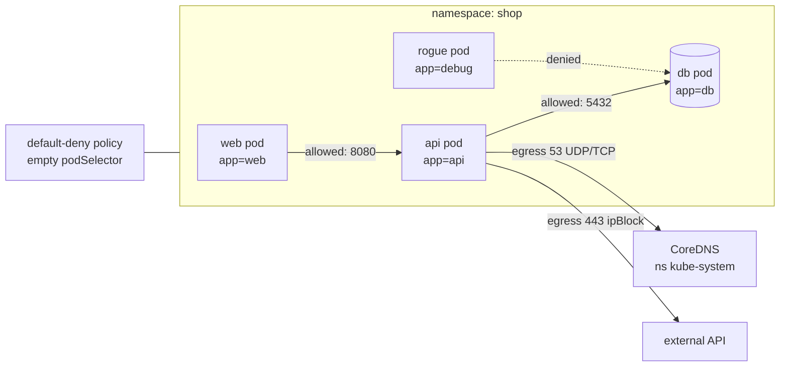

# Kubernetes NetworkPolicy Lab

Pod networking is **allow-all until something selects the pod** — you learn it by flipping a namespace to
default-deny and re-opening only what the app proves it needs, per [`AGENTS.md`](../../../AGENTS.md).
Run it all on a **free local cluster** and verify with real `curl` output, never with intent.

## When to use

- Moving an app toward zero-trust / micro-segmentation and needing a safe rehearsal.
- A NetworkPolicy "isn't working" — usually the CNI does not enforce policy, or the selector is wrong.
- Preparing for CKS-style questions, or a compliance requirement for default-deny.

## First principles

A `NetworkPolicy` (`networking.k8s.io/v1`) is **namespaced**, selects pods with `spec.podSelector`, and
declares `policyTypes: [Ingress]`, `[Egress]` or both. Rules are purely **additive allow-lists**: the moment
*any* policy of a given type selects a pod, all other traffic of that type is denied. There is no deny rule
and no ordering (Kubernetes docs, *Network Policies*, kubernetes.io). Crucially, **NetworkPolicy is enforced
by the CNI plugin, not by Kubernetes** — an unenforcing CNI accepts the object and silently ignores it.



| Selector / field | Matches | Classic mistake |
| --- | --- | --- |
| `podSelector: {}` | every pod **in this namespace** | Thought to be cluster-wide — it is not; apply per namespace |
| `from.podSelector` | pods in the **same** namespace only | Expecting it to reach across namespaces |
| `from.namespaceSelector` | **all** pods in matching namespaces | Needs namespace *labels*; `kubernetes.io/metadata.name` is set automatically |
| `namespaceSelector` + `podSelector` in **one** `from` item | pod X in namespace Y (AND) | Two separate list items mean OR — a much wider hole |
| `ipBlock.cidr` + `except` | external CIDRs | Cannot select pods by IP reliably; pod IPs churn |
| `ports.port` | the **container** port, not the Service port | Policy applied to the Service port matches nothing |
| Egress to DNS | UDP **and** TCP 53 to CoreDNS | Forgetting it breaks every name lookup |

## Procedure

1. **Create a cluster whose CNI enforces policy.** kind's default CNI historically does **not** enforce
   NetworkPolicy, so either verify first (step 4) or build the cluster without it:
   `kind create cluster --name netpol --config kind.yaml` with `networking: {disableDefaultCNI: true}`, then
   install Calico or Cilium per their docs. `k3d cluster create netpol` ships Flannel (no enforcement);
   `minikube start --cni=calico` is the quickest enforcing option.
2. **Deploy a three-tier target**: namespace `shop` with `web`, `api` and `db` Deployments plus Services,
   labelled `app=web|api|db`, and a `debug` pod (`kubectl run debug --image=busybox:1.36 -n shop -- sleep 1d`).
3. **Prove connectivity is open first**: from `debug`,
   `kubectl exec -n shop debug -- wget -qO- --timeout=3 http://db:5432` (or `nc -zv db 5432`) — it should reach.
4. **Enforcement check — do this before writing any real policy.** Apply a default-deny ingress policy
   (`podSelector: {}`, `policyTypes: [Ingress]`), re-run the same `wget`. If it still succeeds, your CNI is
   not enforcing and everything after this is theatre; go back to step 1.
5. **Establish the baseline**: default-deny for **both** directions in `shop`
   (`policyTypes: [Ingress, Egress]`, empty rule lists). Expect the whole app to break — that is correct.
6. **Restore DNS first**: an egress policy allowing `to.namespaceSelector` matching
   `kubernetes.io/metadata.name: kube-system` on ports `53/UDP` and `53/TCP`. Verify with
   `kubectl exec -n shop debug -- nslookup db.shop.svc.cluster.local`.
7. **Re-open one hop at a time**, ingress and egress must *both* allow it: `web → api:8080`, then
   `api → db:5432`, then any required external egress via `ipBlock`. Apply, then test after each hop.
8. **Verification step (must pass all three)**: `web → api` succeeds, `api → db` succeeds, and
   `debug → db` **times out**. Timeouts (not connection-refused) are the signature of a dropped packet.
9. **Inspect what you built**: `kubectl describe networkpolicy -n shop` and
   `kubectl get networkpolicy -n shop -o yaml`; map each rule back to a hop in the diagram.
10. **Clean up**: `kubectl delete ns shop`; `kind delete cluster --name netpol` (or `minikube delete`).

## Output shape

```
NetworkPolicy baseline — ns <ns>  | CNI: <calico|cilium|...>  enforcement verified: yes/no

Policies:
  1. default-deny-all       podSelector: {}   policyTypes: [Ingress, Egress]
  2. allow-dns-egress       podSelector: {}   egress -> kube-system :53 UDP+TCP
  3. allow-web-to-api       podSelector: app=api   ingress from app=web :8080
  4. allow-api-to-db        podSelector: app=db    ingress from app=api :5432
  5. allow-api-egress-ext   podSelector: app=api   egress ipBlock <cidr> :443

Verification (real exec output):
  web  -> api:8080   OK
  api  -> db:5432    OK
  debug-> db:5432    TIMEOUT (denied, expected)
  nslookup db.<ns>   OK
Gaps: <namespaces still allow-all>   Next: <policy to add>
```

## Tips

- **Verify the CNI enforces policy before trusting any test** — a silently ignored policy is the single most
  common cause of "my NetworkPolicy doesn't work".
- Denied traffic **hangs then times out**; `connection refused` means you reached the pod and no process was
  listening — a completely different bug (see [k8s-troubleshooting-lab](../k8s-troubleshooting-lab/SKILL.md)).
- `namespaceSelector` and `podSelector` in the *same* `from` element = AND; as *separate* elements = OR.
  This one character of YAML indentation is the difference between one pod and a whole namespace.
- Always allow DNS egress before anything else, or every symptom will look like a DNS outage.
- Trade-off: default-deny is the safest baseline but breaks apps loudly; roll it out namespace by namespace,
  and consider an audit-first approach with your CNI's flow logs.
- Policies match **pod (container) ports**; Service ports are irrelevant to NetworkPolicy.
- Pair with [k8s-service-networking-lab](../k8s-service-networking-lab/SKILL.md) for the traffic path,
  [k8s-rbac-lab](../k8s-rbac-lab/SKILL.md) for API-level least privilege, and
  [k8s-admission-policy-lab](../k8s-admission-policy-lab/SKILL.md) to *require* a policy per namespace.
  Ship them via [gitops-coach](../gitops-coach/SKILL.md) / [argocd-local-lab](../argocd-local-lab/SKILL.md).
- End with the **Learning Footer** (`AGENTS.md`) — one hop the learner should deny and re-test themselves.
