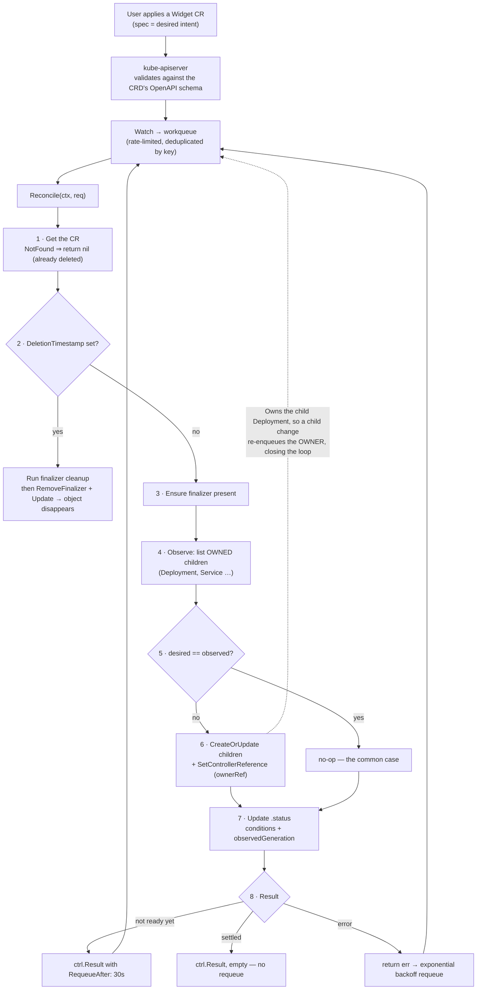

# Kubernetes Operator & CRD Lab

An operator is a **control loop with domain knowledge**: it reads a desired state you declared, observes
the world, and moves the world one step closer — over and over, forever. This lab builds one end to end on
a **free local kind cluster**, with the failure modes (non-idempotent reconciles, stuck finalizers, status
lies) triggered deliberately, following [`AGENTS.md`](../../../AGENTS.md).

## When to use

- You have an operational procedure with real domain knowledge — provision, back up, fail over, upgrade —
  that currently lives in a runbook and a human.
- Teams keep hand-assembling the same six objects (Deployment + Service + PDB + HPA + ServiceMonitor +
  NetworkPolicy) and drift apart.
- You need a first-class API object that other tooling (`kubectl get`, RBAC, GitOps) treats natively.
- **Don't use it for** things a template can do. If the answer is "render five static objects with
  substitutions", use [helm-chart-lab](../helm-chart-lab/SKILL.md) or
  [kustomize-lab](../kustomize-lab/SKILL.md) — an operator adds a permanently running, cluster-privileged
  Go program to your maintenance burden. The honest test: *is there ongoing decision-making after the
  objects exist?* No ⇒ no operator.

## First principles: level-triggered reconciliation, not event handling

Kubernetes controllers are **level-triggered**, not edge-triggered. `Reconcile` is not "handle this event";
it is *"bring `<namespace>/<name>` to its desired state, given whatever the world looks like right now"*.
The request carries only a key — deliberately — so the controller must re-read reality every time
(Kubernetes documentation, *Controllers* and *Operator pattern*, kubernetes.io; controller-runtime
documentation, book.kubebuilder.io).

Four properties follow, and every real operator bug is a violation of one of them:

1. **Idempotent** — running `Reconcile` ten times must produce the same result as running it once.
2. **No hidden state** — everything needed is in the cluster (spec, status, owned objects), because your
   process can be restarted at any moment.
3. **Requeue rather than block** — never sleep inside `Reconcile`; return `ctrl.Result{RequeueAfter: …}`.
4. **Status is observation, spec is intent** — users write `spec`, only the controller writes `status`, and
   the `status` subresource makes that split enforceable.



*Figure: one pass of the reconcile loop. The dotted edge is what makes it self-healing — deleting a child
object enqueues the parent, and the next reconcile recreates it.*

| Concept | Where it lives | Why it matters |
| --- | --- | --- |
| `spec` | written by users | intent; never written by the controller |
| `status` | written **only** by the controller, via the `status` subresource | observation; separate RBAC and separate update path |
| `metadata.generation` | bumped by the API server on **spec** changes only | lets you tell a real spec change from a status churn |
| `status.observedGeneration` | you set it | proves *which* spec version the status describes |
| `ownerReferences` (+ controller: true) | on child objects | garbage collection deletes children automatically; enables `Owns()` watches |
| finalizer | string in `metadata.finalizers` | blocks deletion until *external* cleanup completes |
| `conditions[]` | `status` | standard, machine-readable progress — `Type/Status/Reason/Message/LastTransitionTime/ObservedGeneration` |
| printer columns | CRD markers | makes `kubectl get widgets` useful rather than cryptic |

| Failure mode | Symptom | Root cause |
| --- | --- | --- |
| Non-idempotent reconcile | duplicate children, infinite churn, API rate-limiting | creating instead of `CreateOrUpdate`; comparing badly |
| Hot loop | 100% CPU, thousands of updates/min | writing status on every pass even when nothing changed |
| Object stuck `Terminating` forever | `kubectl delete` hangs | finalizer whose cleanup always errors, or a controller that is gone |
| Status lies | `Ready: True` for an unready workload | status updated before verifying children, or `observedGeneration` never set |
| Children not garbage-collected | orphans after deleting the CR | missing `SetControllerReference` |
| Fights another controller | endless flapping | two writers own the same field (e.g. `replicas` also managed by an HPA) |

⚠ Volatile: kubebuilder's scaffolding layout has changed across major versions (v4 places controllers in
`internal/controller/`), and controller-runtime's builder API evolves. Run `kubebuilder version` and
`go list -m sigs.k8s.io/controller-runtime` and check book.kubebuilder.io for **your** versions.

## Procedure

1. **Justify the CRD in one sentence** before writing code: *"A `Widget` is a durable API object whose
   controller keeps N replicas of an app plus its Service in sync, and de-registers it from an external
   catalogue on delete."* If you cannot name ongoing decision-making, stop and write a Helm chart.
2. **Local cluster + tools** (all free): `kind create cluster --name op`, plus Go, `kubebuilder`, `make`.
   Confirm: `kubectl get nodes`, `go version`, `kubebuilder version`.
3. **Scaffold the project**:
   ```bash
   mkdir widget-operator && cd widget-operator
   kubebuilder init --domain example.com --repo example.com/widget-operator
   kubebuilder create api --group apps --version v1alpha1 --kind Widget --resource --controller
   ```
4. **Design the API in `api/v1alpha1/widget_types.go`.** Put validation in **markers** so the API server
   rejects bad input before your code ever runs — that is free correctness. Add
   `//+kubebuilder:subresource:status` and printer columns.
5. **Generate and install the CRD**: `make manifests generate && make install`, then verify the schema is
   really enforced: `kubectl explain widget.spec` and try applying an invalid CR — expect a rejection from
   the API server, not from your controller.
6. **Write the reconcile loop** in the canonical order: Get → handle deletion/finalizer → observe children →
   `CreateOrUpdate` with `SetControllerReference` → update status → decide the `Result`.
7. **Declare RBAC as markers** next to the code that needs it
   (`//+kubebuilder:rbac:groups=apps,resources=deployments,verbs=...`), then re-run `make manifests`.
   Least privilege: if you never delete Secrets, do not grant `delete` on Secrets
   ([k8s-rbac-lab](../k8s-rbac-lab/SKILL.md)).
8. **Run the controller locally against the cluster**: `make run`. This is the fast loop — the binary runs
   on your laptop with your kubeconfig, no image build, no deployment.
9. **Prove idempotence**: apply the same CR three times, then `kubectl get deploy -n <ns> --show-labels` and
   check the controller's logs — expect *no* writes on passes 2 and 3. Repeated writes with no spec change
   are the number-one operator defect.
10. **Prove self-healing**: `kubectl delete deploy <child>` and watch the controller recreate it. This works
    only because of `Owns(&appsv1.Deployment{})` plus the controller reference.
11. **Prove garbage collection**: `kubectl delete widget demo` and confirm the child Deployment and Service
    disappear on their own (owner-reference GC), with no code from you.
12. **Exercise the finalizer, including its failure mode**: add cleanup that returns an error, delete the CR,
    watch it hang in `Terminating`, read `metadata.finalizers`, then fix the cleanup and watch it complete.
    Learn the escape hatch (`kubectl patch … -p '{"metadata":{"finalizers":[]}}' --type=merge`) *and* learn
    that using it leaks whatever the finalizer was protecting.
13. **Verify status is honest**: `kubectl get widget demo -o jsonpath='{.status.conditions}' | jq`. Every
    condition must carry `observedGeneration` equal to the CR's `metadata.generation`; otherwise you are
    reporting on a spec nobody applied any more.
14. **Test it** with envtest (`make test` runs against a real API server binary, no cluster required), then
    package it: `make docker-build docker-push IMG=...`, `make deploy IMG=...`.
15. **Clean up**: `make undeploy`, `make uninstall`, `kind delete cluster --name op`. Close with the
    **Learning Footer**.

## Output shape

```
Operator: <name>          Scaffold: kubebuilder <vX> · controller-runtime <vY> · Go <vZ>
CRD: <plural>.<group>/<version>   scope=<Namespaced|Cluster>   apiextensions.k8s.io/v1
  Justification (ongoing decisions, not templating): "<one sentence>"

API design:
  spec:   <field: type — validation marker>            ← users write this
  status: conditions[] + observedGeneration + <...>    ← controller writes this (status subresource: on)
  printer columns: <NAME, READY, AGE, ...>
  schema enforcement verified: invalid CR rejected by the API SERVER    ✔

Reconcile contract:
  order: Get → deletion/finalizer → observe children → CreateOrUpdate(+ownerRef) → status → Result
  idempotent: applied 3× → <0> writes after the first                    ✔
  requeue policy: RequeueAfter=<30s> while <condition>; errors → backoff
  owned kinds: <Deployment, Service>   watch: For(<Widget>).Owns(<...>)
  finalizer: <group/finalizer-name>  cleans up: <external resource>  failure tested: <✔>

Conditions emitted: <Ready | Progressing | Degraded>  reasons: <ReconcileSucceeded|ChildNotReady|...>
RBAC granted (least privilege): <group/resource: verbs>
Drills:
  delete a child Deployment      → recreated in <Ns>      ✔
  delete the CR                  → children GC'd, no orphans ✔
  finalizer cleanup fails        → object stuck Terminating, diagnosed via metadata.finalizers ✔
Tests: envtest <N passing>       Next: <k8s-rbac-lab | gitops-coach | helm-chart-lab>
Learning Footer
```

## Worked example — `Widget`, an operator that owns a Deployment

**The API type** (`api/v1alpha1/widget_types.go`). Every marker here becomes OpenAPI schema in the CRD, so
bad input is rejected by the API server before your controller is even called:

```go
// WidgetSpec is the DESIRED state. Users write this; the controller never does.
type WidgetSpec struct {
	// +kubebuilder:validation:Required
	// +kubebuilder:validation:MinLength=1
	Image string `json:"image"`

	// +kubebuilder:validation:Minimum=1
	// +kubebuilder:validation:Maximum=100
	// +kubebuilder:default=1
	Replicas int32 `json:"replicas,omitempty"`

	// +kubebuilder:validation:Minimum=1
	// +kubebuilder:validation:Maximum=65535
	// +kubebuilder:default=8080
	Port int32 `json:"port,omitempty"`
}

// WidgetStatus is OBSERVED state. Only the controller writes this.
type WidgetStatus struct {
	// +optional
	// +patchMergeKey=type
	// +patchStrategy=merge
	// +listType=map
	// +listMapKey=type
	Conditions []metav1.Condition `json:"conditions,omitempty"`

	// +optional
	ReadyReplicas int32 `json:"readyReplicas,omitempty"`

	// ObservedGeneration is the .metadata.generation this status was computed from.
	// Without it, a stale "Ready: True" is indistinguishable from a current one.
	// +optional
	ObservedGeneration int64 `json:"observedGeneration,omitempty"`
}

// +kubebuilder:object:root=true
// +kubebuilder:subresource:status
// +kubebuilder:printcolumn:name="Image",type=string,JSONPath=`.spec.image`
// +kubebuilder:printcolumn:name="Desired",type=integer,JSONPath=`.spec.replicas`
// +kubebuilder:printcolumn:name="Ready",type=integer,JSONPath=`.status.readyReplicas`
// +kubebuilder:printcolumn:name="Age",type=date,JSONPath=`.metadata.creationTimestamp`
type Widget struct {
	metav1.TypeMeta   `json:",inline"`
	metav1.ObjectMeta `json:"metadata,omitempty"`

	Spec   WidgetSpec   `json:"spec,omitempty"`
	Status WidgetStatus `json:"status,omitempty"`
}
```

**The reconcile loop** (`internal/controller/widget_controller.go`), annotated with the reason for each
step rather than the mechanics:

```go
const widgetFinalizer = "apps.example.com/widget-cleanup"

//+kubebuilder:rbac:groups=apps.example.com,resources=widgets,verbs=get;list;watch;create;update;patch;delete
//+kubebuilder:rbac:groups=apps.example.com,resources=widgets/status,verbs=get;update;patch
//+kubebuilder:rbac:groups=apps.example.com,resources=widgets/finalizers,verbs=update
//+kubebuilder:rbac:groups=apps,resources=deployments,verbs=get;list;watch;create;update;patch;delete
//+kubebuilder:rbac:groups="",resources=services,verbs=get;list;watch;create;update;patch;delete

func (r *WidgetReconciler) Reconcile(ctx context.Context, req ctrl.Request) (ctrl.Result, error) {
	log := logf.FromContext(ctx)

	// 1. Re-read the world. The request carries only a key, on purpose: level-triggered.
	var widget appsv1alpha1.Widget
	if err := r.Get(ctx, req.NamespacedName, &widget); err != nil {
		// Already deleted: nothing to do, and definitely do not requeue forever.
		return ctrl.Result{}, client.IgnoreNotFound(err)
	}

	// 2. Deletion path first — a CR being deleted must not be "reconciled" into existence again.
	if !widget.DeletionTimestamp.IsZero() {
		if controllerutil.ContainsFinalizer(&widget, widgetFinalizer) {
			if err := r.deregisterExternal(ctx, &widget); err != nil {
				// Returning the error keeps the finalizer in place and retries with backoff.
				// This is exactly why a broken cleanup shows up as "stuck Terminating".
				return ctrl.Result{}, fmt.Errorf("external cleanup: %w", err)
			}
			controllerutil.RemoveFinalizer(&widget, widgetFinalizer)
			if err := r.Update(ctx, &widget); err != nil {
				return ctrl.Result{}, err
			}
		}
		return ctrl.Result{}, nil
	}

	// 3. Ensure the finalizer exists BEFORE creating anything external.
	if !controllerutil.ContainsFinalizer(&widget, widgetFinalizer) {
		controllerutil.AddFinalizer(&widget, widgetFinalizer)
		if err := r.Update(ctx, &widget); err != nil {
			return ctrl.Result{}, err
		}
	}

	// 4+5+6. Desired vs observed, in one idempotent call. CreateOrUpdate GETs, applies the
	// mutation function, and only writes if the object actually changed — which is what makes
	// repeated reconciles cheap and non-churning.
	dep := &appsv1.Deployment{ObjectMeta: metav1.ObjectMeta{Name: widget.Name, Namespace: widget.Namespace}}
	op, err := controllerutil.CreateOrUpdate(ctx, r.Client, dep, func() error {
		dep.Spec.Replicas = &widget.Spec.Replicas
		dep.Spec.Selector = &metav1.LabelSelector{MatchLabels: labelsFor(&widget)}
		dep.Spec.Template.ObjectMeta.Labels = labelsFor(&widget)
		dep.Spec.Template.Spec.Containers = []corev1.Container{{
			Name:  "app",
			Image: widget.Spec.Image,
			Ports: []corev1.ContainerPort{{ContainerPort: widget.Spec.Port}},
			SecurityContext: &corev1.SecurityContext{ // so the child passes `restricted` admission
				AllowPrivilegeEscalation: ptr.To(false),
				ReadOnlyRootFilesystem:   ptr.To(true),
				Capabilities:             &corev1.Capabilities{Drop: []corev1.Capability{"ALL"}},
			},
		}}
		dep.Spec.Template.Spec.SecurityContext = &corev1.PodSecurityContext{
			RunAsNonRoot:   ptr.To(true),
			SeccompProfile: &corev1.SeccompProfile{Type: corev1.SeccompProfileTypeRuntimeDefault},
		}
		// The ownerRef is what gives you free garbage collection AND makes Owns() work.
		return controllerutil.SetControllerReference(&widget, dep, r.Scheme)
	})
	if err != nil {
		meta.SetStatusCondition(&widget.Status.Conditions, metav1.Condition{
			Type: "Ready", Status: metav1.ConditionFalse, Reason: "ChildDeploymentFailed",
			Message: err.Error(), ObservedGeneration: widget.Generation,
		})
		_ = r.Status().Update(ctx, &widget)
		return ctrl.Result{}, err
	}
	if op != controllerutil.OperationResultNone {
		log.Info("child deployment reconciled", "operation", op)
	}

	// 7. Status = observation. Report on the generation you actually acted on.
	widget.Status.ReadyReplicas = dep.Status.ReadyReplicas
	widget.Status.ObservedGeneration = widget.Generation
	ready := dep.Status.ReadyReplicas == widget.Spec.Replicas
	cond := metav1.Condition{
		Type: "Ready", Status: metav1.ConditionFalse, Reason: "WaitingForReplicas",
		Message:            fmt.Sprintf("%d/%d replicas ready", dep.Status.ReadyReplicas, widget.Spec.Replicas),
		ObservedGeneration: widget.Generation,
	}
	if ready {
		cond.Status, cond.Reason, cond.Message = metav1.ConditionTrue, "AllReplicasReady", "widget is serving"
	}
	// SetStatusCondition is a no-op when nothing changed — that is what stops the hot loop.
	meta.SetStatusCondition(&widget.Status.Conditions, cond)
	if err := r.Status().Update(ctx, &widget); err != nil {
		return ctrl.Result{}, err
	}

	// 8. Never sleep. Ask to be called again instead.
	if !ready {
		return ctrl.Result{RequeueAfter: 15 * time.Second}, nil
	}
	return ctrl.Result{}, nil
}

func (r *WidgetReconciler) SetupWithManager(mgr ctrl.Manager) error {
	return ctrl.NewControllerManagedBy(mgr).
		For(&appsv1alpha1.Widget{}).
		Owns(&appsv1.Deployment{}). // a change to an owned Deployment re-enqueues its Widget
		Complete(r)
}
```

**Tracing the important guarantees before you run it.**
`client.IgnoreNotFound` converts "the CR is gone" into a clean exit instead of an infinite error-requeue
loop. The deletion branch comes **before** any creation, so a CR being deleted is never re-materialised.
`CreateOrUpdate` performs a GET, applies your mutation, and issues an UPDATE **only if the object changed**
— which is why the third `kubectl apply` of an unchanged CR produces no API writes. `SetControllerReference`
does two jobs at once: it makes the API server garbage-collect the Deployment when the Widget goes away,
and it makes `Owns()` map a Deployment event back to its Widget so a manual `kubectl delete deploy` heals.
Finally, `meta.SetStatusCondition` only touches `LastTransitionTime` when `Status` actually flips, which is
what keeps status updates from becoming their own write storm.

**Run the drills — this is where the learning is:**

```bash
make manifests generate && make install     # CRD into the cluster
make run &                                  # controller on your laptop, against kind

cat <<'EOF' | kubectl apply -f -
apiVersion: apps.example.com/v1alpha1
kind: Widget
metadata: {name: demo, namespace: default}
spec:
  image: nginxinc/nginx-unprivileged:1.27-alpine
  replicas: 2
  port: 8080
EOF

kubectl get widgets                          # printer columns: Image / Desired / Ready / Age
kubectl apply -f widget.yaml                 # ×3 → logs should show NO further child writes  (idempotence)
kubectl delete deploy demo                   # → recreated within a second                    (self-healing)
kubectl get widget demo -o jsonpath='{.status.conditions}' | jq
#   observedGeneration must equal .metadata.generation, or the status describes an old spec

kubectl delete widget demo                   # children vanish via ownerReferences             (GC)
```

**Then break it on purpose.** Make `deregisterExternal` return an error unconditionally and delete the CR:
it hangs in `Terminating` forever, and `kubectl get widget demo -o jsonpath='{.metadata.finalizers}'` shows
why. That is the single most common operator support ticket in the wild, and now you can diagnose it in ten
seconds.

## Tips

- **Write `Reconcile` as if it is called at random.** Because it is: on restart, on resync, on a child
  event, on a retry. Any logic that depends on "this is the create event" is already broken.
- Push validation into CRD **markers** (`Minimum`, `Enum`, `Pattern`, `Required`, and CEL
  `XValidation` rules on modern clusters). Rejections from the API server are cheaper, clearer and
  impossible for your controller to skip.
- Never write `spec` from the controller and never let users write `status` — turn on the `status`
  subresource so the split is enforced by the API server, not by convention.
- Always set `observedGeneration` on conditions. Without it, "Ready: True" may describe a spec that was
  replaced ten seconds ago, and every downstream automation will believe it.
- Use `CreateOrUpdate`/server-side apply plus `SetControllerReference` instead of bare `Create` —
  idempotence and garbage collection come almost free once ownership is modelled.
- Add a finalizer **only** for state outside the cluster. In-cluster children are cleaned up by owner
  references, and every unnecessary finalizer is a future stuck deletion.
- Requeue with `RequeueAfter`; never `time.Sleep` inside a reconcile — you are holding a worker from a
  small pool and stalling every other object.
- Scope RBAC to exactly the verbs you use. An operator is a permanently running, cluster-privileged
  program: see [k8s-rbac-lab](../k8s-rbac-lab/SKILL.md) and
  [kubernetes-security-hardening-lab](../kubernetes-security-hardening-lab/SKILL.md).
- Related: [kubernetes-manifest-coach](../kubernetes-manifest-coach/SKILL.md),
  [helm-chart-lab](../helm-chart-lab/SKILL.md) and [kustomize-lab](../kustomize-lab/SKILL.md) for the
  "do I even need an operator" comparison, [k8s-admission-policy-lab](../k8s-admission-policy-lab/SKILL.md)
  for validating/mutating webhooks, [gitops-coach](../gitops-coach/SKILL.md) to ship CRs declaratively,
  [external-secrets-lab](../external-secrets-lab/SKILL.md) as a well-designed operator to read, and
  [tdd-coach](../tdd-coach/SKILL.md) for the envtest habit.
  End with the **Learning Footer** (`AGENTS.md`).
