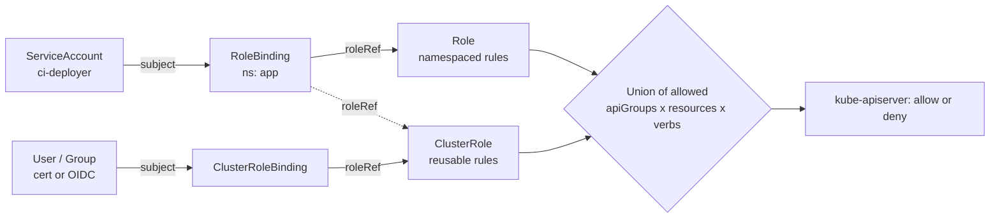

# Kubernetes RBAC Lab

Authorization is **additive and deny-by-default**: you build up exactly the verbs a workload needs and prove
it with an audit — per [`AGENTS.md`](../../../AGENTS.md). Run every step on a **free local cluster**
(kind/k3d/minikube) so mistakes are cheap.

## When to use

- A pod or CI job needs cluster access and the learner's instinct is `cluster-admin`.
- Auditing an existing cluster: "who can read Secrets?", "can this ServiceAccount escalate?".
- Preparing for CKA/CKS-style questions or a real least-privilege review.

## First principles

An RBAC decision needs three things: a **subject** (User, Group, ServiceAccount), a **rule**
(apiGroups × resources × verbs) held in a Role or ClusterRole, and a **binding** that connects them at a
scope. There are **no deny rules** — your permissions are the union of every binding that matches you.



| Object combination | Where rules are defined | Where the grant applies | Use it when |
| --- | --- | --- | --- |
| `Role` + `RoleBinding` | one namespace | that namespace | Default choice — app and CI identities |
| `ClusterRole` + `RoleBinding` | cluster-wide definition | **only** the binding's namespace | Reuse one rule set across many namespaces |
| `ClusterRole` + `ClusterRoleBinding` | cluster-wide | all namespaces + cluster-scoped objects | Controllers, node/PV access — rare and risky |
| `ClusterRole` with `aggregationRule` | merged from labelled ClusterRoles | as bound | Extending built-ins like `view`/`edit` cleanly |

**The three escalation verbs** (Kubernetes docs, *Using RBAC Authorization*, kubernetes.io): `escalate` lets a
subject create a Role with permissions it does not itself hold; `bind` lets it bind an existing, more powerful
Role to itself; `impersonate` lets it act as another user or group. Granting `create` on `rolebindings`
without restricting `roleRef` is effectively granting whatever roles already exist. Equally, `get` on
`secrets` in a namespace ≈ the power of every identity whose credentials live there.

## Procedure

1. **Start the cluster**: `kind create cluster --name rbac` (or `k3d`/`minikube`). Verify `kubectl get nodes`.
2. **Create the workload identity**: `kubectl create ns app`, then
   `kubectl create serviceaccount ci-deployer -n app`.
3. **Baseline the denial first** — the teachable moment:
   `kubectl auth can-i list deployments -n app --as=system:serviceaccount:app:ci-deployer` → expect `no`.
4. **Write the narrowest Role** you can justify (start with `get,list,watch`):
   `kubectl create role deploy-reader -n app --verb=get,list,watch --resource=deployments,pods --dry-run=client -o yaml > role.yaml`,
   read it, then `kubectl apply -f role.yaml`.
5. **Bind it**:
   `kubectl create rolebinding ci-deployer-read -n app --role=deploy-reader --serviceaccount=app:ci-deployer`.
6. **Re-audit**: `kubectl auth can-i --list -n app --as=system:serviceaccount:app:ci-deployer`.
   Add `update`/`patch` on `deployments` only after proving the job actually fails without them.
7. **Prove it from inside a pod** — the real path a workload uses. Run a pod with
   `serviceAccountName: ci-deployer`, then read the **projected, audience-bound, expiring** token at
   `/var/run/secrets/kubernetes.io/serviceaccount/token` and call the API with it. Compare with a
   short-lived token minted on demand: `kubectl create token ci-deployer -n app --duration=10m` (TokenRequest API).
8. **Hunt escalation paths** across the cluster:
   `kubectl get clusterrolebindings -o wide` (look for `cluster-admin` subjects),
   `kubectl auth can-i create rolebindings -n app --as=system:serviceaccount:app:ci-deployer`, and grep for
   `escalate`, `bind`, `impersonate`, `secrets`, and wildcard rules:
   `kubectl get clusterroles -o yaml | Select-String -Pattern '\*'`.
9. **Verification step (must pass both halves)**: the ServiceAccount *can* do its job
   (`can-i update deployments -n app` → `yes`) **and** *cannot* do anything else
   (`can-i get secrets -n app` → `no`, `can-i list nodes` → `no`, `can-i '*' '*' --all-namespaces` → `no`).
10. **Reconcile and clean up**: `kubectl auth reconcile -f role.yaml` is the safe way to update RBAC in place
    (it preserves extra subjects instead of clobbering them); finish with `kubectl delete ns app` and
    `kind delete cluster --name rbac`.

## Output shape

```
RBAC design — <identity>  | cluster: kind/k3d/minikube

Subject: system:serviceaccount:<ns>:<sa>
Job it must do: <verbs on resources>
Chosen shape: Role + RoleBinding (ns=<ns>)   [reason: <blast radius>]

rules:
  - apiGroups: ["apps"]  resources: ["deployments"]  verbs: ["get","list","watch","patch"]

Audit (kubectl auth can-i --as=...):
  update deployments -n <ns>  -> yes   (needed)
  get secrets -n <ns>         -> no    (correct)
  list nodes                  -> no    (correct)
  create rolebindings         -> no    (no bind/escalate path)
Token: projected, audience=<...>, expires in <mins>
Residual risk: <...>   Next tightening: <...>
```

## Tips

- Always run the **negative test**; a Role that grants too much still passes the positive test.
- Prefer a namespaced `Role`; reach for `ClusterRoleBinding` only for genuinely cluster-scoped work.
- Wildcards (`*`) in `resources` or `verbs` silently absorb every future API — write the list out.
- Legacy non-expiring Secret-based ServiceAccount tokens are discouraged; use projected volumes or
  `kubectl create token` so credentials expire on their own.
- RBAC controls *the API*, not the network or the kernel — pair it with
  [k8s-network-policy-lab](../k8s-network-policy-lab/SKILL.md) and
  [k8s-admission-policy-lab](../k8s-admission-policy-lab/SKILL.md) for defence in depth.
- Manifest hygiene lives in [kubernetes-manifest-coach](../kubernetes-manifest-coach/SKILL.md); GitOps
  controllers need their own scoped RBAC — see [gitops-coach](../gitops-coach/SKILL.md) and
  [argocd-local-lab](../argocd-local-lab/SKILL.md). Debug denials with
  [k8s-troubleshooting-lab](../k8s-troubleshooting-lab/SKILL.md).
- End with the **Learning Footer** (`AGENTS.md`) — one permission to remove and re-test on their own cluster.
