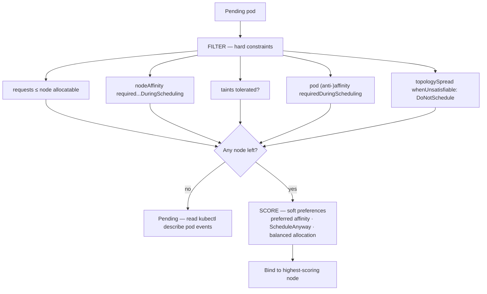

# Kubernetes Scheduling Lab

The scheduler is a **filter-then-score function over nodes**, and every knob you set — requests, affinity,
taints, spread — edits that function. Learn it by making pods land where you intend on a throwaway `kind`
cluster, in the visuals-and-verification style of [`AGENTS.md`](../../../AGENTS.md).

## When to use

- A pod is stuck `Pending` and the learner can't read the scheduler's "0/N nodes are available" message.
- Replicas are all piled onto one node or one zone, and a single node failure takes the service down.
- Someone set a CPU *limit* and the app got slow, or set a memory limit and the app died — and they don't
  know why those two failure modes differ.
- **Don't use it for** scaling decisions (how *many* replicas or nodes) — that is
  [k8s-autoscaling-lab](../k8s-autoscaling-lab/SKILL.md); scheduling only answers *where* a pod goes.

## First principles: filter, then score, then bind

`kube-scheduler` runs a two-phase cycle per pending pod: **filtering** removes nodes that cannot run it
(insufficient allocatable resources, unmet node affinity, an intolerated taint, a violated
`DoNotSchedule` spread constraint), then **scoring** ranks the survivors and the best node is bound
(Kubernetes documentation, *Kubernetes Scheduler* and *Scheduling Framework*, kubernetes.io, 2025). If
filtering leaves zero nodes, the pod stays `Pending` and the reason is printed in its events.



| Mechanism | Whose choice | Hard form | Soft form | Evaluated |
| --- | --- | --- | --- | --- |
| requests / limits | pod | request must fit allocatable | — | filter |
| nodeSelector | pod | exact label match | — | filter |
| node affinity | pod | `requiredDuringSchedulingIgnoredDuringExecution` | `preferredDuring…` (weight 1–100) | filter + score |
| pod (anti-)affinity | pod | `required…` + `topologyKey` | `preferred…` | filter + score |
| taints / tolerations | **node** repels | `NoSchedule`, `NoExecute` | `PreferNoSchedule` | filter (+ eviction) |
| topologySpreadConstraints | pod | `whenUnsatisfiable: DoNotSchedule` | `ScheduleAnyway` | filter + score |

**Requests vs limits — two different physics.** The *request* is what the scheduler reserves and the only
number that affects placement; the *limit* is what the kubelet/runtime enforces at runtime. CPU is
**compressible**: exceeding a CPU limit means CFS throttling, so the app gets slow. Memory is
**incompressible**: exceeding a memory limit means the container is **OOMKilled** (Kubernetes
documentation, *Resource Management for Pods and Containers*, kubernetes.io, 2025).

| QoS class | Condition | Eviction order under node pressure |
| --- | --- | --- |
| `Guaranteed` | every container sets cpu **and** memory, requests == limits | evicted last |
| `Burstable` | at least one request set, but not Guaranteed | evicted after BestEffort |
| `BestEffort` | no requests and no limits anywhere in the pod | **evicted first** |

`topologyKey` is the domain you are spreading over or packing into — `kubernetes.io/hostname` for
per-node, `topology.kubernetes.io/zone` for per-zone. `maxSkew` is the largest allowed difference in
matching-pod count between the busiest and emptiest domain.

## Procedure

1. **Create a multi-node cluster, free and local** — `kind create cluster --config kind.yaml` with one
   control-plane and three workers (`k3d cluster create -a 3` or `minikube start -n 4` work equally well).
2. **Fabricate topology** the same way a cloud provider would:
   `kubectl label node kind-worker  topology.kubernetes.io/zone=a` (worker2 → `b`, worker3 → `c`), and
   `kubectl label node kind-worker3 disktype=ssd`.
3. **Repel a node**: `kubectl taint nodes kind-worker3 tier=critical:NoSchedule`. Confirm with
   `kubectl describe node kind-worker3 | grep -A2 Taints`.
4. **Deploy without any hints** and observe the natural packing:
   `kubectl get pods -o wide --sort-by=.spec.nodeName`.
5. **Add requests/limits** and read the class back: `kubectl get pod <p> -o jsonpath='{.status.qosClass}'`.
   Then deliberately over-request (`cpu: "8"`) and read the Pending reason from
   `kubectl describe pod <p>` — the "Insufficient cpu" line is the filter talking.
6. **Add node affinity** on `disktype=ssd` — the pod is now confined to the tainted node and stays
   Pending until you add the matching **toleration**. Two independent mechanisms, both must pass.
7. **Add pod anti-affinity** with `topologyKey: kubernetes.io/hostname` and scale to 4 with only 3
   eligible nodes: `required` leaves the 4th pod Pending, `preferred` schedules it anyway. Try both.
8. **Add `topologySpreadConstraints`** with `maxSkew: 1` over `topology.kubernetes.io/zone`; scale up and
   down and verify the distribution with
   `kubectl get pods -o json | jq -r '.items[].spec.nodeName' | sort | uniq -c`.
9. **Explain each placement out loud** from the events, not from intuition, then close with the
   **Learning Footer**.

## Output shape

```
Workload: <name> · replicas <N>   Cluster: kind (<M> workers, zones a/b/c)
Resources: requests cpu=<..> mem=<..> · limits cpu=<..> mem=<..>  → QoS: <Guaranteed|Burstable|BestEffort>
Runtime risk: cpu over limit → throttled · mem over limit → OOMKilled
Node affinity: <required|preferred> <key>=<value>        Tolerations: <key>=<value>:<effect>
Pod anti-affinity: <required|preferred> topologyKey=<kubernetes.io/hostname>
Spread: maxSkew=<N> topologyKey=<topology.kubernetes.io/zone> whenUnsatisfiable=<DoNotSchedule|ScheduleAnyway>
Observed placement: <node → count, per zone>
Pending reason (verbatim from events): "<0/4 nodes are available: ...>"
Verify: kubectl get pods -o wide · kubectl describe pod <p> · kubectl describe node <n>
Next: <k8s-autoscaling-lab | k8s-troubleshooting-lab | kubernetes-manifest-coach>
Learning Footer
```

## Worked example — every mechanism in one Deployment

```yaml
apiVersion: apps/v1
kind: Deployment
metadata:
  name: web
spec:
  replicas: 6
  selector:
    matchLabels: {app: web}
  template:
    metadata:
      labels: {app: web}
    spec:
      tolerations:
        - key: tier
          operator: Equal
          value: critical
          effect: NoSchedule
      affinity:
        nodeAffinity:
          preferredDuringSchedulingIgnoredDuringExecution:
            - weight: 50
              preference:
                matchExpressions:
                  - {key: disktype, operator: In, values: ["ssd"]}
        podAntiAffinity:
          preferredDuringSchedulingIgnoredDuringExecution:
            - weight: 100
              podAffinityTerm:
                topologyKey: kubernetes.io/hostname
                labelSelector:
                  matchLabels: {app: web}
      topologySpreadConstraints:
        - maxSkew: 1
          topologyKey: topology.kubernetes.io/zone
          whenUnsatisfiable: DoNotSchedule
          labelSelector:
            matchLabels: {app: web}
      containers:
        - name: web
          image: registry.k8s.io/pause:3.9
          resources:
            requests: {cpu: "100m", memory: "64Mi"}
            limits:   {cpu: "100m", memory: "64Mi"}   # requests == limits ⇒ Guaranteed
```

Reasoning: 6 replicas over 3 zones with `maxSkew: 1` and `DoNotSchedule` forces 2-2-2 — scale to 7 and the
7th is *schedulable* (skew 2 vs 2 vs 3 would be 1 over the minimum only if a domain is empty, so check the
events rather than assuming). The anti-affinity is `preferred`, so it spreads across hosts but never blocks.
The toleration only *permits* the tainted node; the `preferred` node affinity is what attracts it there.

## Tips

- Limits do **not** affect scheduling — only requests do. A pod with a huge limit and a tiny request will
  schedule anywhere and then get throttled or OOMKilled in place.
- `BestEffort` pods are evicted first under node pressure; never run anything you care about without requests.
- `required` pod anti-affinity caps your replicas at the number of domains — a classic cause of permanently
  Pending pods after scaling.
- Taints repel, tolerations permit; a toleration is *not* an attraction. Pair it with node affinity if you
  actually want the pod on that node.
- `DoNotSchedule` spread constraints can deadlock a rolling update on a small cluster; test with
  `ScheduleAnyway` first, then tighten.
- Always quote the verbatim `kubectl describe pod` event line rather than guessing the filter that fired —
  the check, not the hunch (`AGENTS.md` §2).
- Related: [kind-lab](../kind-lab/SKILL.md), [k8s-deployment-lab](../k8s-deployment-lab/SKILL.md),
  [k8s-storage-lab](../k8s-storage-lab/SKILL.md), [k8s-troubleshooting-lab](../k8s-troubleshooting-lab/SKILL.md),
  [kubernetes-manifest-coach](../kubernetes-manifest-coach/SKILL.md), and
  [capacity-planning-coach](../capacity-planning-coach/SKILL.md).
  End with the **Learning Footer** (`AGENTS.md`).
