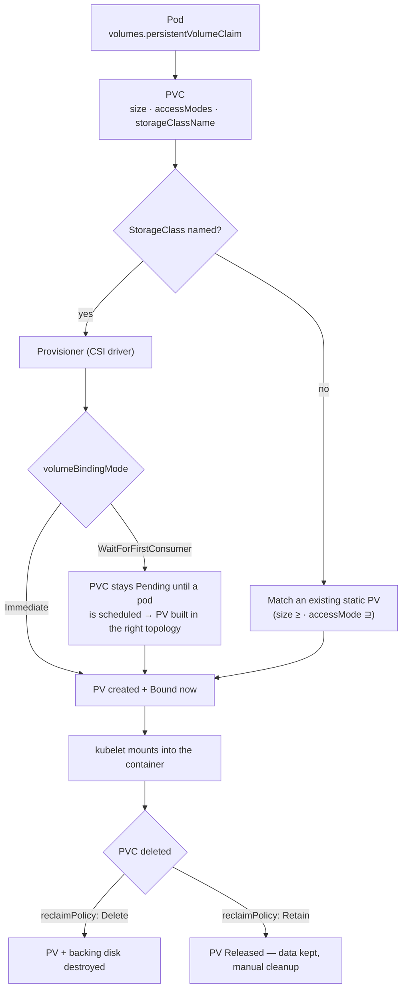

# Kubernetes Storage Lab

Persistent storage is a **claim/supply market**: the app writes a PVC (demand), a StorageClass provisions a
PV (supply), and the control plane binds them one-to-one. Learn it by breaking and fixing a binding on a
throwaway `kind` cluster, in the verify-then-teach style of [`AGENTS.md`](../../../AGENTS.md).

## When to use

- A PVC is stuck `Pending`, or data vanished on pod restart because the volume was `emptyDir` all along.
- The learner needs shared storage across pods and is about to request `ReadWriteMany` from a block-storage
  backend that cannot serve it.
- They are moving a database from a Deployment (all replicas fighting over one disk) to a **StatefulSet**
  with `volumeClaimTemplates`.
- **Don't use it for** non-persistent config or credentials — `ConfigMap`/`Secret` volumes are covered by
  [k8s-configmap-secret-lab](../k8s-configmap-secret-lab/SKILL.md).

## First principles: claim, provision, bind, mount

A **PersistentVolume (PV)** is a cluster-scoped piece of storage; a **PersistentVolumeClaim (PVC)** is a
namespaced request for one. If no matching PV exists and the PVC names a **StorageClass**, the class's
provisioner creates a PV on demand — *dynamic provisioning*. Binding is exclusive and one-to-one, and a PVC
is never rebound to a different PV (Kubernetes documentation, *Persistent Volumes*, kubernetes.io, 2025).



| Access mode | Short | Meaning | Typical backend |
| --- | --- | --- | --- |
| `ReadWriteOnce` | RWO | read-write by **one node** (several pods on that node may share it) | block: EBS, Azure Disk, local-path |
| `ReadOnlyMany` | ROX | read-only by many nodes | pre-seeded snapshots, some NFS exports |
| `ReadWriteMany` | RWX | read-write by many nodes | file: NFS, CephFS, Azure Files, EFS |
| `ReadWriteOncePod` | RWOP | read-write by exactly **one pod** cluster-wide | CSI drivers supporting it; strongest guard |

Access modes are a **capability negotiation, not a lock**: the backend must support the mode, and the mode
is enforced at attach/mount time — it does not make your application's concurrent writes safe.

| Knob | Field | Choices | Why it matters |
| --- | --- | --- | --- |
| Provisioner | `provisioner` | e.g. `rancher.io/local-path`, `ebs.csi.aws.com` | who actually creates the disk |
| Binding | `volumeBindingMode` | `Immediate` \| `WaitForFirstConsumer` | WFFC avoids a disk in the wrong zone/node |
| Reclaim | `reclaimPolicy` | `Delete` \| `Retain` | `Delete` is the default for dynamic PVs — it deletes data |
| Growth | `allowVolumeExpansion` | `true` \| `false` | PVCs can only grow, never shrink |
| Default | annotation `storageclass.kubernetes.io/is-default-class` | `"true"` | what a PVC gets when it names no class |

## Procedure

1. **Start a free local cluster**: `kind create cluster`. Inspect what you were given —
   `kubectl get storageclass` shows `standard (default)` backed by `rancher.io/local-path` with
   `WaitForFirstConsumer` binding, which is exactly the interesting case.
2. **Create a PVC alone** and watch it *not* bind: `kubectl get pvc` → `Pending`,
   `kubectl describe pvc data` → `waiting for first consumer to be created`. That message is the lesson.
3. **Create the consumer pod**; re-check `kubectl get pv,pvc` — a PV appears and both go `Bound`.
4. **Prove persistence**: `kubectl exec` a write into the mount, `kubectl delete pod`, let it come back,
   read the file again. Then repeat the experiment with `emptyDir` to see the data disappear.
5. **Break it on purpose**: request `ReadWriteMany` from the same class and read the failure; request
   `500Gi` and read the capacity failure. Quote the events verbatim.
6. **Expand**: author a class with `allowVolumeExpansion: true`, then
   `kubectl patch pvc data -p '{"spec":{"resources":{"requests":{"storage":"2Gi"}}}}'` and watch
   `kubectl get pvc -w`. Try shrinking to confirm it is rejected.
7. **Compare reclaim policies**: delete a PVC from a `Delete` class (PV vanishes) and from a `Retain`
   class (PV goes `Released`, data intact, needs manual cleanup).
8. **Go stateful**: apply the StatefulSet below and list `kubectl get pvc` — one PVC per ordinal, named
   `data-web-0`, `data-web-1`, … Delete pod `web-0`; it returns with **the same** PVC.
9. **Scale down and delete the StatefulSet**: the PVCs survive by default. Set
   `persistentVolumeClaimRetentionPolicy` and repeat, then close with the **Learning Footer**.

## Output shape

```
Workload: <name>   Cluster: kind   StorageClass: <name> (<provisioner>)
PVC: <name> · <size> · accessModes=[<RWO|ROX|RWX|RWOP>] · storageClassName=<..>
Binding: volumeBindingMode=<Immediate|WaitForFirstConsumer> → PVC phase <Pending|Bound> because "<event>"
PV: <name> · capacity <..> · reclaimPolicy=<Delete|Retain> · source <csi driver|hostPath>
Persistence test: wrote <file> → deleted pod → read back <ok|LOST>   (emptyDir control: LOST)
Expansion: allowVolumeExpansion=<true|false> · <old>→<new> · shrink rejected: yes
Stateful: volumeClaimTemplates → PVCs data-<sts>-0..N · retentionPolicy whenDeleted=<..> whenScaled=<..>
Verify: kubectl get sc,pv,pvc -o wide · kubectl describe pvc <name>
Next: <k8s-scheduling-lab | k8s-troubleshooting-lab | postgres-local-lab>
Learning Footer
```

## Worked example — a StatefulSet where every replica owns its disk

```yaml
apiVersion: v1
kind: Service
metadata:
  name: web
spec:
  clusterIP: None            # headless: stable DNS web-0.web, web-1.web, ...
  selector: {app: web}
  ports: [{port: 80, name: http}]
---
apiVersion: apps/v1
kind: StatefulSet
metadata:
  name: web
spec:
  serviceName: web
  replicas: 2
  selector:
    matchLabels: {app: web}
  persistentVolumeClaimRetentionPolicy:
    whenDeleted: Retain      # keep the data if someone deletes the StatefulSet
    whenScaled: Delete       # but reclaim disks when scaling in
  template:
    metadata:
      labels: {app: web}
    spec:
      containers:
        - name: web
          image: nginx:1.27-alpine
          volumeMounts:
            - name: data
              mountPath: /usr/share/nginx/html
  volumeClaimTemplates:
    - metadata:
        name: data
      spec:
        accessModes: ["ReadWriteOnce"]
        storageClassName: standard
        resources:
          requests:
            storage: 1Gi
```

Reasoning it through: `volumeClaimTemplates` is *not* a pod template field — the controller instantiates one
PVC per ordinal, named `<template>-<statefulset>-<ordinal>`, so you get `data-web-0` and `data-web-1`.
`ReadWriteOnce` is correct here precisely *because* each replica has its own volume; a Deployment with a
single shared RWO PVC would pin every replica to one node. Verify:

```bash
kubectl get pvc                       # data-web-0, data-web-1 → Bound
kubectl exec web-0 -- sh -c 'echo hello > /usr/share/nginx/html/index.html'
kubectl delete pod web-0              # controller recreates it with the SAME PVC
kubectl exec web-0 -- cat /usr/share/nginx/html/index.html   # hello
kubectl scale statefulset web --replicas=1   # whenScaled: Delete ⇒ data-web-1 removed
```

## Tips

- `Pending` PVC + `WaitForFirstConsumer` is **not a bug** — it is the class deliberately deferring until the
  scheduler picks a node, so the disk is created in the right topology.
- The default dynamic reclaim policy is `Delete`: deleting a PVC can delete the data. Use `Retain` for
  anything you would miss, and snapshot before experiments.
- RWO is per *node*, not per pod — use `ReadWriteOncePod` when you need a true single-writer guarantee.
- Nothing about an access mode prevents two processes corrupting the same files; application-level locking
  is still your job.
- PVCs grow only. Plan sizes with [capacity-planning-coach](../capacity-planning-coach/SKILL.md) rather
  than resizing under pressure.
- `local-path` on kind is node-local: a pod rescheduled to another node cannot reach it — great for
  teaching topology constraints alongside [k8s-scheduling-lab](../k8s-scheduling-lab/SKILL.md).
- Related: [kind-lab](../kind-lab/SKILL.md), [k8s-deployment-lab](../k8s-deployment-lab/SKILL.md),
  [k8s-configmap-secret-lab](../k8s-configmap-secret-lab/SKILL.md),
  [k8s-troubleshooting-lab](../k8s-troubleshooting-lab/SKILL.md),
  [kustomize-lab](../kustomize-lab/SKILL.md), and [postgres-local-lab](../postgres-local-lab/SKILL.md).
  End with the **Learning Footer** (`AGENTS.md`).
