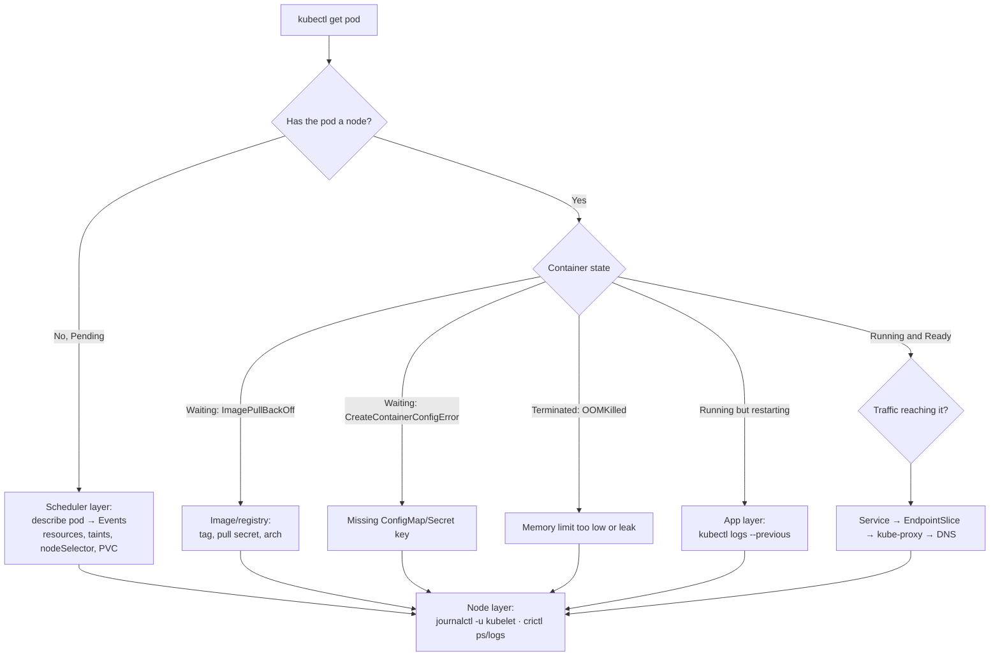

# Kubernetes Troubleshooting Lab

Debugging is a **search over a known state machine**, not guesswork — learn it by breaking a cluster you own,
per [`AGENTS.md`](../../../AGENTS.md). Everything below runs on a **free local cluster**
(kind, k3d or minikube); run every command yourself and read the real output.

## When to use

- A pod is `CrashLoopBackOff`, `ImagePullBackOff`, `Pending`, `OOMKilled`, `CreateContainerConfigError`,
  and the learner is guessing instead of triaging.
- A Service "doesn't work" and nobody knows whether it is selectors, endpoints, DNS, or the app itself.
- Building the muscle memory *before* it is needed in production.

## First principles: where the truth lives

Every symptom is a mismatch between **desired state** (your object), **scheduling** (control plane) and
**runtime** (kubelet + container runtime). Ask *which layer* first, then only look there.



| Symptom | First command | Usual root cause | Trade-off / gotcha |
| --- | --- | --- | --- |
| `Pending` | `kubectl describe pod` → Events | Insufficient CPU/memory, taint without toleration, unbound PVC | Adding requests fixes scheduling but can hide a too-small cluster |
| `ImagePullBackOff` | `kubectl describe pod` | Wrong tag, private registry without `imagePullSecrets`, arch mismatch | `:latest` makes the failure non-reproducible |
| `CrashLoopBackOff` | `kubectl logs <pod> --previous` | App exits non-zero, bad config, failing dependency | Backoff grows exponentially — you may wait for the next restart |
| `CreateContainerConfigError` | `kubectl describe pod` | ConfigMap/Secret or key missing | Pods do **not** auto-restart when the key appears later |
| `OOMKilled` (exit 137) | `kubectl describe pod` → Last State | Memory limit below real usage | Raising the limit hides leaks; measure first |
| `Ready` but no traffic | `kubectl get endpointslices -l kubernetes.io/service-name=<svc>` | Selector/port mismatch, readiness probe failing | Empty EndpointSlice = no backend, yet the Service still "exists" |
| DNS failure | `kubectl run -it --rm dns --image=busybox:1.36 -- nslookup <svc>` | CoreDNS down, wrong FQDN, NetworkPolicy blocking port 53 | Short names depend on the pod's search domains |

## Procedure

1. **Create the lab cluster** (free, local): `kind create cluster --name tshoot` (or `k3d cluster create tshoot`
   / `minikube start`). Verify: `kubectl get nodes` shows `Ready`.
2. **Make a scratch namespace**: `kubectl create ns tshoot` and
   `kubectl config set-context --current --namespace=tshoot`.
3. **Break it on purpose — one fault at a time.** Faults worth applying, then triaging blind: a bad image tag;
   a container command that exits 1; `resources.requests.memory: 100Gi`; an `envFrom` pointing at a
   non-existent ConfigMap; a Service whose `selector` has a typo.
4. **Triage in a fixed order** so the habit transfers:
   `kubectl get pods -o wide` → `kubectl describe pod <pod>` (read **Events** bottom-up) →
   `kubectl get events --sort-by=.lastTimestamp` → `kubectl logs <pod> -c <container> --previous`.
5. **Get inside a distroless or crashing pod** with an ephemeral container:
   `kubectl debug -it <pod> --image=busybox:1.36 --target=<container>`, or copy-and-patch with
   `kubectl debug <pod> --copy-to=<pod>-dbg --set-image=*=busybox:1.36 -- sleep 1d`
   (Kubernetes docs, *Debug Running Pods*, kubernetes.io).
6. **Drop to the node layer only when the API says the pod is fine but the container is not**:
   `kubectl debug node/<node> -it --image=busybox:1.36`; on a kind node
   `docker exec -it <node> crictl ps -a`, `crictl logs <container-id>`, `journalctl -u kubelet -n 200`.
7. **Walk the traffic chain** for Service problems, in this order — each step has a distinct fix:
   pod `Ready`? → `kubectl get endpointslices` non-empty? → `targetPort` matches `containerPort`? →
   in-cluster `curl http://<svc>.<ns>.svc.cluster.local:<port>` → `nslookup` against CoreDNS
   (`kubectl -n kube-system logs deploy/coredns`).
8. **Verify the fix, don't assume it**: re-apply, then confirm `kubectl get pods` shows `Running`/`Ready`,
   `kubectl rollout status deploy/<name>` succeeds, and the in-cluster `curl` returns HTTP 200.
9. **Write the one-line root cause** ("Service selector `app=web2` matched no pods") before moving on —
   naming it is what makes it recognizable next time.
10. **Clean up**: `kubectl delete ns tshoot`; `kind delete cluster --name tshoot`.

## Output shape

```
Troubleshooting run — <symptom>  | cluster: kind/k3d/minikube  | ns: <ns>

Layer identified: <scheduling | image | config | runtime | app | network/DNS>
Evidence:
  kubectl describe pod    -> Events: <verbatim line>
  kubectl logs --previous -> <verbatim line>
Root cause (one line): <...>
Fix applied: <manifest change / command>
Verification: kubectl get pods -> Running/Ready  |  in-cluster curl -> <status>
Time-to-diagnose: <mins>   Next fault to rehearse: <...>
```

## Tips

- Read **Events bottom-up**: the newest line names the current blocker; older lines are history.
- `--previous` is the whole game for `CrashLoopBackOff` — the live container has no logs yet.
- An empty EndpointSlice is a *selector or readiness* bug, never a kube-proxy bug; check that first.
- The DNS trap: a NetworkPolicy without an egress rule to `kube-system` on port 53 breaks name resolution
  while IP traffic still works — see [k8s-network-policy-lab](../k8s-network-policy-lab/SKILL.md).
- Trade-off: `kubectl debug` is fast but mutates the pod; on shared clusters inspect read-only first.
- Fix manifests properly afterwards with [kubernetes-manifest-coach](../kubernetes-manifest-coach/SKILL.md);
  practice the Service chain in [k8s-service-networking-lab](../k8s-service-networking-lab/SKILL.md); if the
  cluster itself is sick, go to [k8s-cluster-lifecycle-lab](../k8s-cluster-lifecycle-lab/SKILL.md).
- Turn recurring incidents into alerts with [slo-designer](../slo-designer/SKILL.md).
- End with the **Learning Footer** (`AGENTS.md`) — one fault the learner should re-break and re-fix unaided.
