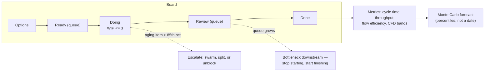

# Kanban Flow Coach

Delivery speed is mostly a **queueing** problem, not an effort problem. This skill teaches flow metrics —
WIP, cycle time, throughput, flow efficiency — plus Little's Law and Monte Carlo forecasting, with the
same "state the limits" discipline required by [`AGENTS.md`](../../../AGENTS.md).

## When to use

- Everything is "in progress", nothing finishes, and the team feels busy but slow.
- You need a delivery forecast and estimates keep being wrong in the same direction.
- You want to diagnose a board: where work queues, where it ages, where handoffs stall it.
- **Don't use it for** measuring individuals, or for choosing *what* to build — flow tells you how work
  moves, not whether it's worth moving. Pair with [roadmap-builder](../roadmap-builder/SKILL.md).

## First principles: Little's Law and the cost of WIP

For a stable system over a long-enough window, **Little's Law** relates the three flow quantities:

$$\text{Cycle Time} = \frac{\text{Work In Progress}}{\text{Throughput}}$$

You control WIP directly and throughput only indirectly, so **lowering WIP is the fastest lever on cycle
time**. Doubling WIP without adding capacity roughly doubles cycle time while throughput stays flat — you
just add queueing and context-switching.



| Metric | Definition | Read it as | Common misuse |
| --- | --- | --- | --- |
| WIP | items started but not finished | the dial you actually control | counting only "Doing", ignoring blocked/review |
| Cycle time | commitment point → done, in calendar days | report p50 **and** p85, never the mean | averaging a right-skewed distribution |
| Throughput | items finished per week | the forecasting input | equating it with "productivity" |
| Flow efficiency | touch time ÷ total elapsed time | typically 5–25% — waiting dominates | chasing 100%; some slack is healthy |
| Work item age | days since an in-progress item started | the *only* leading indicator on the board | reviewing only at standup end-of-sprint |
| CFD band width | vertical gap between columns over time | WIP; widening band = growing queue | reading it as "progress" |

**Limits, honestly.** Little's Law needs a roughly stable system and a consistent definition of arrival and
departure — apply it to a chaotic quarter and it will lie. Monte Carlo assumes the future resembles your
sampled history, so a reorg, a new domain, or a changed team invalidates it. Flow metrics say nothing about
value or quality, and they can be gamed by slicing tickets absurdly small: pair with the DORA stability
keys in [engineering-metrics-coach](../engineering-metrics-coach/SKILL.md).

## Procedure

1. **Define the commitment point** (where the cycle-time clock starts) and "done" (where it stops). Write
   them down; every disagreement about metrics later traces back to this step.
2. **Make every queue visible.** Split "In progress" into active vs waiting columns (Review, Waiting-on-QA,
   Blocked). Invisible queues are where cycle time hides.
3. **Set a WIP limit per column** — start at roughly team size, or `2n − 1` for pairs, then ratchet *down*
   until the pain surfaces. The limit is meant to be uncomfortable; that discomfort is the signal.
4. **Instrument dates only**: item ID, start date, end date, type, blocked days. That is enough for every
   metric in this skill. No story points required.
5. **Plot the CFD and the scatterplot.** The CFD shows band widths (WIP) and slopes (throughput); the
   cycle-time scatterplot with p50/p85/p95 lines shows the distribution and the outliers.
6. **Compute flow efficiency** on a sample of 10 items (touch days ÷ elapsed days). If it's under 15%,
   your problem is waiting, not working — stop optimising typing speed.
7. **Run the daily aging review**: walk the board right-to-left, oldest item first, and act on anything
   past the p85 line. Standups discuss items, not people.
8. **Forecast with Monte Carlo**: sample the last 8–12 weeks of weekly throughput, simulate 10,000 times,
   and quote percentiles ("85% chance of 24 items in 6 weeks"), never a single date.
9. **Attack the bottleneck** revealed by the widest queue — batch size, handoffs, review latency, external
   dependencies — then re-measure after two weeks.
10. Report using the shape below, close with the **Learning Footer**.

## Output shape

```
Commitment point: <...>   Done means: <...>   Sample window: <weeks>
Board: <col (WIP limit)> -> <col (limit)> -> ...   Queues made visible: <...>
Flow metrics:
  WIP now <x> (limit <y>) · Throughput <n>/week (last 8w: <list>)
  Cycle time p50 <a>d · p85 <b>d · p95 <c>d   (mean deliberately not reported)
  Flow efficiency <e>% (sample n=<10>)   Oldest in-progress item: <d> days
Little's Law check: WIP <x> / Throughput <n> ≈ <x/n> weeks vs observed p50 <a>d -> <consistent?>
Bottleneck: <column/queue> — evidence: <CFD band widening / age distribution>
Forecast (Monte Carlo, <n> sims from <window> history):
  50%: <date/count> · 85%: <date/count> · 95%: <date/count>   Assumes: <stability caveats>
Intervention: <lower WIP / split items / cut review latency>   Re-measure: <date>
Learning Footer
```

## Worked example — a team that was "fully utilised"

Twelve weeks of data from an 8-person team, one item = one story.

| Observation | Value | Interpretation |
| --- | --- | --- |
| WIP (all in-flight) | 19 items | 2.4 per person — everyone multi-tasking |
| Throughput | 4.2 items/week | steady, low variance |
| Little's Law | 19 ÷ 4.2 ≈ **4.5 weeks** | matches observed p85 of 31 days ✅ model holds |
| Cycle time | p50 = 12 d, p85 = 31 d | heavy right tail — a mean of 17 d would have hidden it |
| Flow efficiency | 11% (sample of 10) | ~89% of elapsed time was *waiting*, mostly in Review |
| CFD | Review band widening for 6 weeks | bottleneck is code review, not development |

**Intervention:** WIP limit of 8 in Doing, review SLA of one working day, reviewers rotated daily. After
four weeks: WIP 9, throughput 4.6/week, p85 → 17 days. Little's Law predicted 9 ÷ 4.6 ≈ 2 weeks — observed
p50 8 days, p85 17 days. Throughput barely moved; **cycle time nearly halved purely by cutting WIP.**

**Forecast for 24 remaining items** (Monte Carlo over the last 12 weekly throughput values): 50% by week 5,
85% by week 7, 95% by week 8. Communicated as "85% confident by <date>", with the caveat that two people
are on leave in week 6 — a condition absent from the sampled history.

## Tips

- Report p85, never the mean; cycle-time distributions are right-skewed and the mean flatters you.
- If WIP limits don't hurt, they aren't limits — the discomfort is the mechanism.
- Work item age is the only leading indicator on the board; everything else is an autopsy.
- Flow efficiency below 15% means you have a queueing problem, and hiring will not fix it.
- Never forecast with a single date; give percentiles and name the assumptions that would break them.
- Splitting tickets to inflate throughput is the classic gaming move — watch item size and the DORA
  stability keys in [engineering-metrics-coach](../engineering-metrics-coach/SKILL.md).
- Pair with [estimation-coach](../estimation-coach/SKILL.md),
  [retrospective-facilitator](../retrospective-facilitator/SKILL.md),
  [roadmap-builder](../roadmap-builder/SKILL.md), [tech-debt-coach](../tech-debt-coach/SKILL.md),
  [progress-charts](../progress-charts/SKILL.md), and
  [user-story-writer](../user-story-writer/SKILL.md) for slicing. Finish with the **Learning Footer**
  (`AGENTS.md`).
