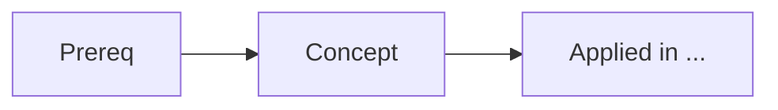

# Knowledge Graph

Turn scattered concepts into a connected map so the learner can sequence study and see the big
picture — following [`AGENTS.md`](../../../AGENTS.md) and the memory model in
[`docs/Memory.md`](../../../docs/Memory.md).

## When to use
- The learner wants to see how concepts relate, or find prerequisites/next steps.
- Building durable structure across many lessons.

## Procedure
1. Identify the **concepts** in scope and their **relationships**: `prerequisite-of`, `related-to`,
   `part-of`, `applied-in`.
2. Represent the graph two ways:
   - **Linked notes**: each concept is a note with a `## See also` section of relative links.
   - **Diagram**: a Mermaid `graph` showing edges (label the edge type).
3. Support **queries**: "prerequisites of X", "what builds on X", "shortest path from A to B",
   "gaps I haven't covered".
4. **Update** the graph as the learner completes topics (mark learned; reveal next best node).

## Output shape
````

````
Then: prerequisites list · what to learn next · any gaps.

## Tips
- Keep each node atomic; one concept per note.
- Use the graph to drive `learning-roadmap` ordering and to pick the "Next topic" for the Learning
  Footer. Don't invent relationships you can't justify. End with the **Learning Footer** (`AGENTS.md`).
