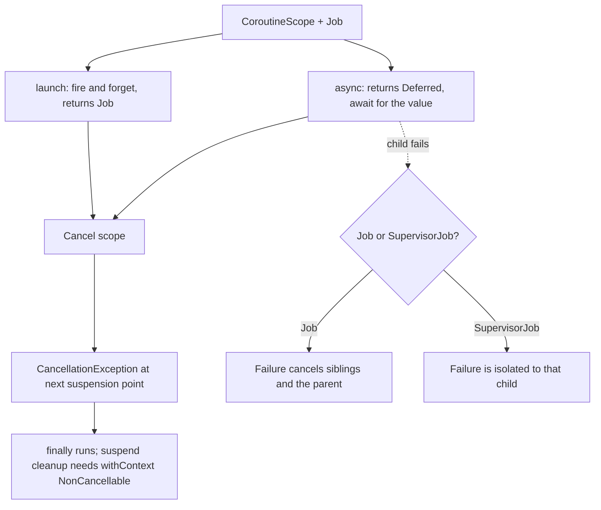

# Kotlin Coroutines & Flow Lab

Run real coroutines, cancel them, and watch what happens — one lab that turns "suspend is magic" into a
mental model you can predict, per the first-principles and **Learning Footer** rules in
[`AGENTS.md`](../../../AGENTS.md). Feeds directly into
[jetpack-compose-lab](../jetpack-compose-lab/SKILL.md) and
[mobile-state-management-coach](../mobile-state-management-coach/SKILL.md).

## When to use

- The learner uses `GlobalScope`, `runBlocking`, or fire-and-forget `launch` and cannot say who cancels what.
- Work keeps running after a screen closes, or a `finally` block never executes on cancel.
- They cannot decide between `Flow`, `StateFlow`, `SharedFlow`, or `Channel`.
- Coroutine tests are flaky, slow, or full of `Thread.sleep`.

## First principles

A suspending function is a **resumable computation**: the compiler rewrites it into a state machine that
hands back its continuation instead of blocking a thread. Two ideas follow.

**Structured concurrency:** every coroutine belongs to a scope, and a scope does not complete until all of
its children complete. That gives you three guarantees for free — no leaked work, cancellation propagates
down, and failures propagate up (kotlinlang.org, *Coroutines guide*).

**Cancellation is cooperative:** cancelling sets a flag; the coroutine actually stops at the next
suspension point in `kotlinx.coroutines`. A tight CPU loop with no suspension point **never notices** unless
you call `ensureActive()`/`yield()` or check `isActive`.



## Choosing the right tool

| Need | Use | Why / trade-off |
| --- | --- | --- |
| Fire work, no result | `launch` → `Job` | Failure cancels the parent (unless the scope has a `SupervisorJob`) |
| A value, in parallel | `async` → `Deferred.await()` | `async { }.await()` back-to-back is just sequential code — start both, *then* await |
| Blocking I/O, JDBC, file system | `Dispatchers.IO` | Large elastic pool; blocking here does not starve CPU work |
| CPU-bound work (parse, sort) | `Dispatchers.Default` | Pool sized to cores; blocking it stalls everything |
| Touching UI | `Dispatchers.Main` | Android/Swing main thread; keep bodies short |
| One child's failure must not kill siblings | `SupervisorJob` / `supervisorScope` | Isolates failures; you must handle each child's error |
| Cleanup that suspends after cancel | `withContext(NonCancellable) { }` | An already-cancelled coroutine cannot suspend normally |
| Stream produced per collector, lazily | cold `Flow` | Nothing runs until `collect`; each collector re-runs the producer |
| Always-available current value for UI | `StateFlow` | Hot, conflated, requires an initial value, `distinctUntilChanged` by default |
| One-shot events (navigate, snackbar) | `SharedFlow(replay = 0)` | Hot, no initial value; tune `replay`/`extraBufferCapacity` |
| Producer faster than consumer | `buffer` / `conflate` / `collectLatest` | Keep all (memory) vs keep latest (drop) vs cancel-and-restart |

Cold vs hot in one line: **a cold Flow is a recipe re-executed per collector; a hot flow is a running
broadcast that exists whether or not anyone is listening.**

## Procedure

1. **Set up.** A plain JVM Kotlin project (Gradle or a scratch file) with `kotlinx-coroutines-core` and
   `kotlinx-coroutines-test`. Everything below runs on the JVM — no Android device needed.
2. **Exercise 1 — structure.** Inside `runBlocking { }`, `launch` three children that print after different
   delays. Confirm the parent waits for all three. Now cancel the scope after the first print and observe
   which children never finish. Repeat with `coroutineScope` vs `supervisorScope`, making one child throw:
   record who dies in each case.
3. **Exercise 2 — launch vs async.** Time `async { a() }.await()` followed by `async { b() }.await()` versus
   `val da = async { a() }; val db = async { b() }; da.await() + db.await()`. Print elapsed millis and
   explain *why* only the second is parallel.
4. **Exercise 3 — dispatchers.** Print `Thread.currentThread().name` inside `Default`, `IO`, and after a
   `withContext(Dispatchers.IO)` switch. Then run a `Thread.sleep(2_000)` on `Dispatchers.Default` while
   other CPU tasks are queued and observe the starvation. Replace it with `delay` and re-observe.
5. **Exercise 4 — cancellation.** Write a `while (true) { heavyCpuStep() }` loop with no suspension point,
   cancel it, and prove it keeps running. Fix it with `ensureActive()` (or `yield()`). Add a `finally` that
   logs, then add a *suspending* cleanup inside `finally` — watch it fail — and repair it with
   `withContext(NonCancellable)`. Finally, wrap a call in `withTimeout` and catch `TimeoutCancellationException`.
6. **Exercise 5 — cold vs hot.** Build `flow { repeat(3) { emit(it); delay(100) } }`; collect it twice and
   note the producer ran twice. Convert with `stateIn`/`shareIn` and collect twice again — one producer,
   shared values. Compare `StateFlow` (initial value, conflated) and `SharedFlow(replay = 0)` for a one-shot
   navigation event: which one is correct and why.
7. **Exercise 6 — backpressure.** Emit every 10 ms, collect every 100 ms. Run the same pipeline four ways —
   plain, `.buffer()`, `.conflate()`, `collectLatest { }` — and tabulate how many items each *received* and
   how long each took. This is the whole latency-vs-completeness trade-off in one table.
8. **Exercise 7 — deterministic tests.** Rewrite the delays under `runTest { }`: `delay(10_000)` completes
   instantly on the test scheduler's virtual clock. Use `advanceTimeBy`/`advanceUntilIdle`, inject a
   `TestDispatcher` instead of hard-coding `Dispatchers.IO`, and assert Flow emissions with `toList()` on a
   background scope (or Turbine if available).
9. **Verify.** For every exercise, capture the observed output and compare it to your prediction *before*
   running. Any mismatch is the actual lesson — write one sentence explaining it.
10. **Run everything with `#run`** (`learningos_runcode`) on real inputs including edge cases: zero items,
    one item, a producer that throws mid-stream, cancellation *during* an emission, and a timeout that fires
    exactly at the boundary. Teach from the printed output, never from an assumed result.

## Output shape

```
Coroutines & Flow lab — <scenario> (kotlinx-coroutines <version>)

1 structure    : parent waited for <n> children; cancel killed <which>
                 coroutineScope: <who died> | supervisorScope: <who died>
2 launch/async : sequential <a> ms vs parallel <b> ms  (why: await placement)
3 dispatchers  : Default=<thread> IO=<thread>; Thread.sleep on Default starved <n> tasks
4 cancellation : no suspension point -> kept running; ensureActive() -> stopped at <ms>
                 finally ran: <y/n>; suspend cleanup needed withContext(NonCancellable)
5 cold vs hot  : cold collected twice -> producer ran <2>x; stateIn -> ran <1>x
                 StateFlow for <state>, SharedFlow(replay=0) for <event> because …
6 backpressure : plain <n> items/<ms> | buffer <n>/<ms> | conflate <n>/<ms> | collectLatest <n>/<ms>
7 tests        : runTest virtual time -> 10s delay finished in <ms> real time

#run edge cases: empty -> <output> | 1 item -> <output> | throws mid-stream -> <output>
                 cancel during emit -> <output> | timeout at boundary -> <output>

Prediction vs reality: <the one that surprised you>
Next: <linked skill>
```

## Tips

- Never use `GlobalScope`: it has no parent, so nothing cancels it — that is a leak by construction. Tie
  work to a lifecycle-owned scope instead.
- `suspend` does **not** mean "runs on a background thread". It means "can pause". Choosing a thread is the
  dispatcher's job — a suspend function should be main-safe by switching internally with `withContext`.
- Assign `async` to a variable, start both, and await afterwards; awaiting immediately makes it sequential.
- Never swallow `CancellationException` in a broad `catch (e: Exception)` — rethrow it, or cancellation
  silently stops working.
- `StateFlow` conflates and drops duplicates: it is right for *state* and wrong for one-shot *events*, where
  a dropped duplicate is a lost navigation.
- Inject dispatchers rather than hard-coding them; that single habit is what makes `runTest` deterministic.
- If a test needs `Thread.sleep`, the design is wrong — use virtual time.
- Close with the **Learning Footer** (`AGENTS.md`): recap, pitfalls, next topic, one exercise, level, time.
