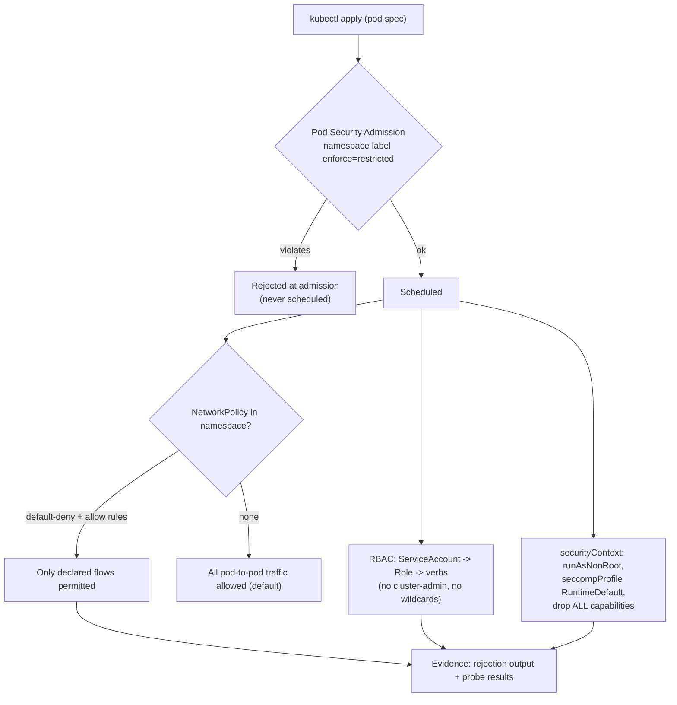

# Kubernetes Security Hardening Lab

Four controls, each proven by a rejection you can see, on a **local disposable cluster**: Pod Security
Admission, default-deny networking, least-privilege RBAC, and seccomp. Taught hands-on and defensively,
per [`AGENTS.md`](../../../AGENTS.md) — nothing here targets a cluster you do not own.

## When to use

- Workloads still run as root with default networking because "PodSecurityPolicy was removed and nobody
  replaced it".
- A namespace needs a demonstrable, testable baseline before it hosts anything sensitive.
- Reviewers ask "prove the control works", and the team has only YAML, not evidence.
- **Don't use it for** production change management ([kubernetes-manifest-coach](../kubernetes-manifest-coach/SKILL.md))
  or cluster-wide policy engines ([opa-policy-lab](../opa-policy-lab/SKILL.md), [k8s-admission-policy-lab](../k8s-admission-policy-lab/SKILL.md)).

## First principles: four independent controls

Pod Security Admission (PSA) is the built-in admission controller that replaced PodSecurityPolicy — it
became **stable in Kubernetes v1.25** and enforces the three **Pod Security Standards**:
`privileged`, `baseline`, `restricted`. It is configured by **namespace labels** of the form
`pod-security.kubernetes.io/<mode>=<level>` where mode ∈ `enforce | audit | warn`. NetworkPolicy,
RBAC, and the pod `securityContext` are independent layers — PSA does not touch networking, and
NetworkPolicy does not touch identity.



| Control | Enforced by | Level / setting to aim for | Fails how |
| --- | --- | --- | --- |
| Pod Security Admission | built-in admission controller (stable v1.25) | `enforce=restricted` (start `warn`+`audit`) | rejects the pod at admission |
| NetworkPolicy | CNI plugin (must support it) | default-deny ingress **and** egress, then allow | silently no-ops if CNI ignores it |
| RBAC | kube-apiserver | namespaced `Role`, named verbs/resources, no `*` | `Forbidden` on the API call |
| seccomp | kubelet → container runtime | `seccompProfile.type: RuntimeDefault` | syscall blocked inside the container |
| Capabilities / non-root | container runtime | `drop: ["ALL"]`, `runAsNonRoot: true` | container fails to start if it needed root |

**Trade-off to say out loud:** `restricted` will break images that bind ports < 1024, write to the image
filesystem, or assume UID 0. That breakage is the *finding* — fix the image (unprivileged port,
`readOnlyRootFilesystem` plus an `emptyDir`) rather than downgrading the namespace. Also note the
**kind gotcha**: kind's default CNI does **not** enforce NetworkPolicy, so the policy step needs a CNI
that does (or use k3d, whose default Flannel-based setup likewise needs checking) — verify enforcement
with a probe instead of assuming.

## Procedure

1. **Create a disposable cluster** (free, local; see [kind-lab](../kind-lab/SKILL.md) / [k3d-lab](../k3d-lab/SKILL.md)):

   ```bash
   kind create cluster --name hardening-lab      # or: k3d cluster create hardening-lab
   kubectl create namespace demo
   ```

2. **Label the namespace in `warn` + `audit` first**, so you see the blast radius before enforcing:

   ```bash
   kubectl label ns demo \
     pod-security.kubernetes.io/warn=restricted \
     pod-security.kubernetes.io/audit=restricted
   ```

3. **Apply a deliberately non-compliant pod** and read the warning — this is the teaching moment.
4. **Promote to enforcement** and watch the same pod get rejected at admission:

   ```bash
   kubectl label ns demo pod-security.kubernetes.io/enforce=restricted --overwrite
   ```

5. **Fix the workload**, don't weaken the namespace: `runAsNonRoot`, `allowPrivilegeEscalation: false`,
   `capabilities.drop: ["ALL"]`, `seccompProfile.type: RuntimeDefault`, `readOnlyRootFilesystem: true`.
6. **Default-deny the namespace network**, then add the minimum allow rules (DNS is the one people forget):

   ```bash
   kubectl apply -f default-deny.yaml   # spec below
   ```

7. **Prove segmentation empirically** with a probe pod — a timeout is the pass condition:

   ```bash
   kubectl -n demo run probe --rm -it --image=busybox --restart=Never -- \
     sh -c 'wget -qO- --timeout=3 http://api.demo.svc.cluster.local || echo BLOCKED-as-expected'
   ```

8. **Cut RBAC to least privilege**: a dedicated ServiceAccount, a namespaced `Role` with explicit verbs,
   and no wildcards. Verify with the built-in checker:

   ```bash
   kubectl auth can-i --as=system:serviceaccount:demo:app -n demo get secrets   # expect: no
   ```

9. **Scan the manifests too** ([trivy-scan-lab](../trivy-scan-lab/SKILL.md)) — `trivy config .` catches
   drift the cluster no longer rejects because someone relabelled the namespace.
10. **Record the evidence** (rejection text, probe timeout, `can-i` output), tear the cluster down, and
    close with the **Learning Footer**.

## Output shape

```
Cluster: <kind|k3d> <name> · k8s=<version> · CNI enforces NetworkPolicy=<yes|no|unverified>
Namespace: <ns> · labels: enforce=<level> warn=<level> audit=<level>
PSA evidence: <verbatim rejection/warning message for the non-compliant pod>
Workload fix: runAsNonRoot=<t> · allowPrivilegeEscalation=false · caps drop=ALL ·
              seccompProfile=RuntimeDefault · readOnlyRootFilesystem=<t> · runAsUser=<uid>
NetworkPolicy: default-deny ingress+egress=<applied> · allow rules=<from -> to : port>
Segmentation proof: <probe command> -> <BLOCKED-as-expected | reachable (control NOT enforcing)>
RBAC: sa=<name> · role verbs=<get,list on configmaps> · can-i get secrets => <no>
Residual risk: <node-level access, control-plane, image provenance, secrets at rest>
Teardown: <kind delete cluster --name …>
Next: [k8s-network-policy-lab] · [k8s-rbac-lab] · [security-hardening-checklist]
Learning Footer
```

## Worked example — restricted namespace, default-deny, verified

```yaml
# default-deny.yaml — denies all ingress and egress in the namespace
apiVersion: networking.k8s.io/v1
kind: NetworkPolicy
metadata: {name: default-deny, namespace: demo}
spec:
  podSelector: {}
  policyTypes: [Ingress, Egress]
---
# allow-dns.yaml — the rule everyone forgets; without it, name resolution fails
apiVersion: networking.k8s.io/v1
kind: NetworkPolicy
metadata: {name: allow-dns, namespace: demo}
spec:
  podSelector: {}
  policyTypes: [Egress]
  egress:
    - to: [{namespaceSelector: {matchLabels: {kubernetes.io/metadata.name: kube-system}}}]
      ports: [{protocol: UDP, port: 53}, {protocol: TCP, port: 53}]
---
# app.yaml — passes enforce=restricted
apiVersion: v1
kind: Pod
metadata: {name: app, namespace: demo}
spec:
  serviceAccountName: app
  securityContext:
    runAsNonRoot: true
    runAsUser: 10001
    seccompProfile: {type: RuntimeDefault}
  containers:
    - name: app
      image: nginxinc/nginx-unprivileged:stable
      ports: [{containerPort: 8080}]
      securityContext:
        allowPrivilegeEscalation: false
        readOnlyRootFilesystem: true
        capabilities: {drop: ["ALL"]}
      volumeMounts: [{name: cache, mountPath: /tmp}]
  volumes: [{name: cache, emptyDir: {}}]
```

Note the image swap: stock `nginx` binds port 80 as root and fails `restricted`, so the unprivileged
variant on 8080 is the correct fix — hardening changed the *image choice*, not the policy.

## Tips

- Always roll PSA out as `warn` + `audit` before `enforce`; enforcing blind takes an environment down.
- `restricted` breaking a pod is a finding about the image, not a reason to drop to `baseline`.
- NetworkPolicy is enforced by the **CNI** — verify with a probe; an ignored policy looks identical to a
  working one in `kubectl get`.
- Default-deny egress without an explicit DNS allow rule breaks everything in a confusing way.
- `kubectl auth can-i --as=system:serviceaccount:…` is the cheapest RBAC test there is; make it a CI step.
- PSA is namespace-scoped and does not cover node access, image provenance, or secrets at rest — record
  those as residual risk and cover them with
  [supply-chain-security-coach](../supply-chain-security-coach/SKILL.md) and
  [secrets-management-coach](../secrets-management-coach/SKILL.md).
- Pair with [k8s-network-policy-lab](../k8s-network-policy-lab/SKILL.md),
  [k8s-rbac-lab](../k8s-rbac-lab/SKILL.md),
  [k8s-admission-policy-lab](../k8s-admission-policy-lab/SKILL.md),
  [kubernetes-manifest-coach](../kubernetes-manifest-coach/SKILL.md),
  [trivy-scan-lab](../trivy-scan-lab/SKILL.md), and
  [zero-trust-architecture-coach](../zero-trust-architecture-coach/SKILL.md).
  End with the **Learning Footer** (`AGENTS.md`).
