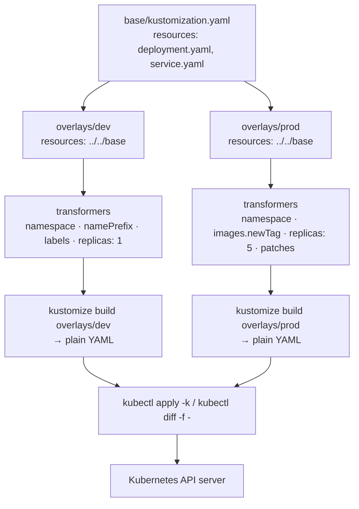

# Kustomize Lab

Kustomize takes **valid YAML in and valid YAML out** — no templating language, no `{{ }}`, no rendering
engine to learn. You keep one honest base and declare the *difference* each environment needs. Learn it by
building the overlays yourself, in the check-your-work style of [`AGENTS.md`](../../../AGENTS.md).

## When to use

- The learner has `deployment-dev.yaml`, `deployment-staging.yaml`, `deployment-prod.yaml` that have
  quietly drifted apart, and wants one source of truth.
- They need per-environment replica counts, image tags, namespaces, resource limits, or config values
  without a template engine.
- Config changes are applied but pods never restart, and they don't know that a generator name hash is the
  standard fix.
- **Don't use it for** packaging and distributing an app to *other people* with a values API and
  conditionals — that is [helm-chart-lab](../helm-chart-lab/SKILL.md) territory.

## First principles: overlays declare differences, not copies

`kustomize` is a **purely declarative, template-free** customization tool that reads a `kustomization.yaml`,
loads the listed resources, applies transformers, and prints the result. It deliberately avoids
parameterization by templating, because a template is not itself a valid Kubernetes object and cannot be
validated, diffed, or linted as one (Kustomize documentation, *Introduction* and *Eschewed Features*,
kubectl.docs.kubernetes.io, 2025). It ships inside kubectl as `kubectl kustomize` / `kubectl apply -k`.



| Field in `kustomization.yaml` | Does what | Use it for |
| --- | --- | --- |
| `resources` | includes files, directories, or a base | composition |
| `namespace` | rewrites `metadata.namespace` on everything | one overlay per environment |
| `namePrefix` / `nameSuffix` | renames resources *and* references to them | co-tenanting variants in a namespace |
| `labels` | adds labels (`includeSelectors: false` by default) | env/owner tagging without breaking selectors |
| `images` | swaps `newName` / `newTag` / `digest` | promoting a build between environments |
| `replicas` | sets replica count by resource name | per-environment scale |
| `patches` | strategic-merge **or** JSON6902, with a `target` | anything the fields above cannot express |
| `configMapGenerator` / `secretGenerator` | builds config objects **and appends a content hash** | forcing a rollout on config change |
| `components` | reusable opt-in slices of kustomization | a feature enabled in only some overlays |

**Choosing a patch type — this is the exam question:**

| | Strategic merge patch | JSON6902 patch |
| --- | --- | --- |
| Looks like | a partial Kubernetes object | a list of `{op, path, value}` (RFC 6902) |
| Merges lists by | the field's `patchMergeKey` (containers by `name`) | explicit array index or `-` to append |
| Best for | adding/overriding fields on a known container | precise edits, removals, list index surgery |
| Deleting | `$patch: delete` directive | `- op: remove` |
| Readability | high — reviewers see Kubernetes YAML | low — but unambiguous |

`patchesStrategicMerge` and `patchesJson6902` are deprecated; the single `patches` field accepts both and
infers the type from the patch body (Kustomize documentation, *Patches*, 2025).

## Procedure

1. **Install** either binary: `kustomize version` (standalone) or just use `kubectl version` — kubectl has
   embedded Kustomize since v1.14. Both are free and offline.
2. **Scaffold the tree**: `base/{kustomization.yaml,deployment.yaml,service.yaml}` and
   `overlays/{dev,prod}/kustomization.yaml`. Keep the base *deployable on its own* — that is the test of a
   good base.
3. **Render, never guess**: `kubectl kustomize base` and read the output before touching a cluster.
4. **Add the dev overlay** with `namespace`, `namePrefix: dev-`, and `replicas: 1`; render and diff the two
   outputs: `diff <(kubectl kustomize base) <(kubectl kustomize overlays/dev)`.
5. **Add the prod overlay** with an `images` tag bump and a strategic-merge patch that adds resource
   limits. Confirm the container matched by `name` — a mismatched name silently adds a *second* container.
6. **Add a JSON6902 patch** for something merge cannot express (removing an item, editing by index), then
   render and confirm the exact path took effect.
7. **Generate config**: add a `configMapGenerator`; render and note the `-<hash>` suffix and that the
   Deployment's `envFrom`/`volumes` reference was **rewritten automatically**. Change one literal, re-render,
   and watch the hash — and therefore the pod template — change.
8. **Dry-run against a live cluster**: `kind create cluster`, then
   `kubectl kustomize overlays/prod | kubectl diff -f -`, then `kubectl apply -k overlays/prod`.
9. **Gate it in CI** — `kubectl kustomize overlays/prod > /dev/null` fails the build on a broken overlay;
   wire it up with [ci-pipeline-builder](../ci-pipeline-builder/SKILL.md) and close with the
   **Learning Footer**.

## Output shape

```
App: <name>   Layout: base/ + overlays/{dev,staging,prod}
Base resources: <deployment.yaml, service.yaml, ...>   Base is standalone-deployable: <yes|no>
Per-overlay deltas:
  dev  → namespace=<..> namePrefix=<..> replicas=<N> patches=<none|list>
  prod → images.newTag=<..> replicas=<N> patches=[<strategic-merge: resources>, <json6902: /path>]
Patch choice: <field> → <strategic-merge|json6902> because <merge key ambiguity | removal | index>
Generators: configMapGenerator=<name> (hash suffix on) → rollout on config change: <yes|no>
Render check: kubectl kustomize overlays/<env>   Diff vs cluster: kubectl diff -f -
Apply: kubectl apply -k overlays/<env>
Next: <helm-chart-lab | gitops-coach | k8s-configmap-secret-lab>
Learning Footer
```

## Worked example — one base, a prod overlay that changes only what must change

`base/kustomization.yaml`

```yaml
apiVersion: kustomize.config.k8s.io/v1beta1
kind: Kustomization
resources:
  - deployment.yaml
  - service.yaml
```

`overlays/prod/kustomization.yaml`

```yaml
apiVersion: kustomize.config.k8s.io/v1beta1
kind: Kustomization
namespace: api-prod
resources:
  - ../../base
labels:
  - pairs:
      env: prod
    includeSelectors: false          # never mutate an existing Deployment's selector
images:
  - name: ghcr.io/acme/api
    newTag: "1.8.3"                  # promote the exact digest/tag you tested
replicas:
  - name: api
    count: 5
configMapGenerator:
  - name: api-config
    literals:
      - LOG_LEVEL=info
      - FEATURE_X=on
patches:
  - target: {kind: Deployment, name: api}
    patch: |-
      apiVersion: apps/v1
      kind: Deployment
      metadata:
        name: api
      spec:
        template:
          spec:
            containers:
              - name: api          # MUST match the base container name (patchMergeKey)
                resources:
                  requests: {cpu: "200m", memory: "256Mi"}
                  limits:   {cpu: "500m", memory: "512Mi"}
  - target: {kind: Deployment, name: api}
    patch: |-
      - op: add
        path: /spec/template/spec/containers/0/env/-
        value: {name: REGION, value: eu-west-1}
```

Reasoning through it: the strategic-merge patch merges into the existing container because `name: api`
matches the merge key — change that string and Kustomize appends a second container instead of editing the
first, which is the single most common Kustomize bug. The JSON6902 patch appends to the `env` array with
`-`; that requires `env` to already exist in the base. `includeSelectors: false` matters because a
Deployment's `spec.selector` is immutable after creation. Verify before applying:

```bash
kubectl kustomize overlays/prod | grep -E 'name: api-config|image:|replicas:'
kubectl kustomize overlays/prod | kubectl diff -f -
kubectl apply -k overlays/prod
```

## Tips

- The generator name hash is a **feature**: it changes the pod template, which is what makes a config edit
  actually roll pods. Disabling it with `disableNameSuffixHash: true` reintroduces the "config changed but
  nothing restarted" bug.
- A patch whose container `name` doesn't match adds a container rather than failing loudly — always grep
  the rendered output, don't trust the patch.
- `secretGenerator` base64-encodes; it does **not** encrypt. Keep real secrets out of git and use
  [secrets-management-coach](../secrets-management-coach/SKILL.md) / [vault-local-lab](../vault-local-lab/SKILL.md).
- Overlays must contain *differences only*; if an overlay re-declares the whole Deployment, you have three
  copies again with extra steps.
- Kustomize has no conditionals or loops by design — if you truly need them, that is the signal to reach
  for [helm-chart-lab](../helm-chart-lab/SKILL.md), not to fight the tool.
- Render in CI on every PR; a broken overlay should fail the pipeline, not the cluster.
- Related: [kubernetes-manifest-coach](../kubernetes-manifest-coach/SKILL.md),
  [k8s-configmap-secret-lab](../k8s-configmap-secret-lab/SKILL.md),
  [k8s-deployment-lab](../k8s-deployment-lab/SKILL.md), [gitops-coach](../gitops-coach/SKILL.md),
  [argocd-local-lab](../argocd-local-lab/SKILL.md), and
  [k8s-scheduling-lab](../k8s-scheduling-lab/SKILL.md).
  End with the **Learning Footer** (`AGENTS.md`).
