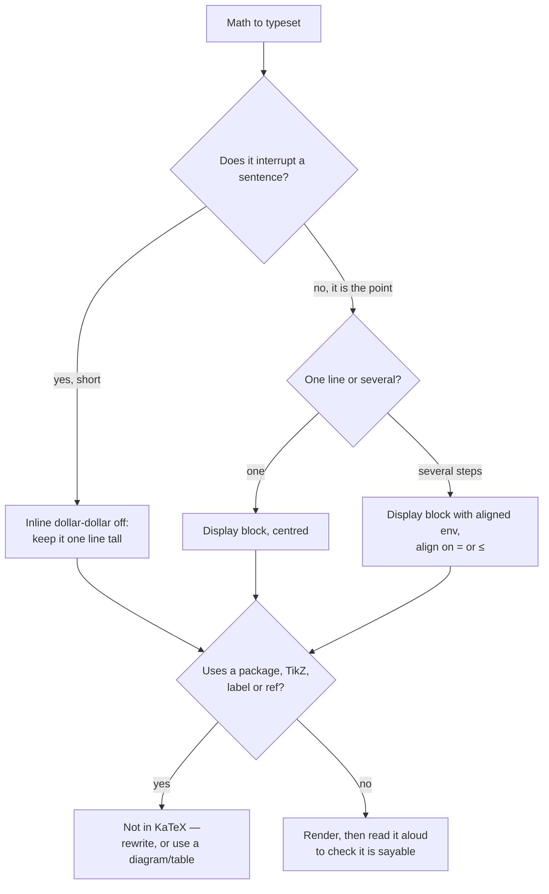

# LaTeX / KaTeX Math Coach

Math that doesn't render teaches nothing. This skill produces **valid, readable, copy-pasteable KaTeX**
and explains the notation as it goes — following [`AGENTS.md`](../../../AGENTS.md) §4 (KaTeX is a
first-class visual) and §2 (never invent a macro that doesn't exist).

## When to use

- Writing complexity analysis, probability, linear algebra or statistics into notes, READMEs or lessons.
- A `$$…$$` block renders as red error text, or renders in one tool but not another.
- A derivation is correct but unreadable — every step crammed into one line.
- Porting LaTeX from a paper into Markdown and hitting unsupported commands.

## First principles

KaTeX is a **subset** of LaTeX math mode: no document classes, no packages, no drawing. It renders
synchronously to HTML **plus MathML**, which is what screen readers announce — so well-formed KaTeX is
also accessible math. Two rules cover most errors: **every group is balanced** (`{}`, `\left…\right`,
`\begin…\end`), and **text belongs in `\text{}`**, never bare in math mode.



## Notation you actually need

| Goal | KaTeX source | Renders |
| --- | --- | --- |
| Inline in a sentence | `$O(n \log n)$` | $O(n \log n)$ |
| Display, centred | `$$ e^{i\pi} + 1 = 0 $$` | its own line |
| Fraction (display size inline) | `\dfrac{a}{b}` vs `\frac{a}{b}` | tall vs small |
| Sum with limits | `\sum_{i=1}^{n} i = \frac{n(n+1)}{2}` | limits above/below in display |
| Product / limit / integral | `\prod_{i=1}^{n}` · `\lim_{n \to \infty}` · `\int_0^1 f(x)\,dx` | note `\,` before `dx` |
| Complexity classes | `\mathcal{O}(n^2)`, `\Theta(n)`, `\Omega(1)`, `o(n)` | script O for Big-O |
| Text inside math | `\text{if } x > 0` | upright, with real spaces |
| Named operator | `\operatorname{softmax}(z)_i` | upright, correct spacing |
| Piecewise | `\begin{cases} x & x \ge 0 \\ -x & x < 0 \end{cases}` | brace + two rows |
| Matrix | `\begin{bmatrix} a & b \\ c & d \end{bmatrix}` | `pmatrix` for `( )`, `vmatrix` for determinant |
| Auto-sized delimiters | `\left( \frac{a}{b} \right)` | grows with content |
| Vectors / norms | `\mathbf{v}`, `\lVert x \rVert_2`, `\hat{y}`, `\bar{x}` | bold upright vector |
| Sets & logic | `\in \notin \subseteq \cup \cap \forall \exists \neg \implies` | — |
| Multi-line derivation | `\begin{aligned} a &= b \\ &= c \end{aligned}` | aligned at `&` |
| Spacing | `\,` `\:` `\;` `\quad` `\qquad` | thin → wide |

**A real aligned derivation** (master theorem style, copy-pasteable):

```
$$
\begin{aligned}
T(n) &= 2\,T\!\left(\frac{n}{2}\right) + \Theta(n) \\
     &= 2\left(2\,T\!\left(\frac{n}{4}\right) + \Theta\!\left(\frac{n}{2}\right)\right) + \Theta(n) \\
     &= \underbrace{\Theta(n) + \Theta(n) + \dots}_{\log_2 n \text{ levels}} \\
     &= \Theta(n \log n)
\end{aligned}
$$
```

## KaTeX vs LaTeX — the gaps that bite

| You wrote | Why it fails in KaTeX | Do this instead |
| --- | --- | --- |
| `\usepackage{amsmath}` | there is no preamble | drop it; `aligned`, `cases`, `bmatrix` are built in |
| `\begin{tikzpicture}` | KaTeX draws no graphics | use a **Mermaid** diagram ([visual-explainer](../visual-explainer/SKILL.md)) |
| `\label{eq:1}` / `\ref` / `\eqref` | no cross-reference system | number manually, or use `\tag{1}` |
| `\bm{x}` | `bm` is a package | `\boldsymbol{x}` or `\mathbf{x}` |
| `\mathbb{1}` | `\mathbb` covers uppercase letters | `\mathbf{1}` for the indicator |
| `\newenvironment` / `\newtheorem` | no environment definition | write the structure in Markdown around the math |
| `\[ … \]` | delimiter support is renderer-dependent | use `$$ … $$` in Markdown |
| `$x_10$` | only the first character subscripts | `$x_{10}$` — always brace multi-character scripts |
| `if x > 0` bare in math | letters are treated as variables | `\text{if } x > 0` |

## Procedure

1. **Ask where it renders** — Copilot Chat / VS Code / GitHub Markdown / MkDocs. GitHub and most Markdown
   pipelines use KaTeX or MathJax with `$…$` and `$$…$$`; assume the KaTeX subset to stay portable.
2. **Pick inline or display**: inline only if it fits on one line and doesn't grow the line height —
   fractions, sums with limits and matrices always go display.
3. **Write the math, then brace every multi-character script** (`x_{i+1}`, `2^{n-1}`) — the single most
   common silent error.
4. **Break derivations into `aligned` steps**, one idea per line, aligned at `&=`. Add a `\text{}`
   justification on the right of each step: `&= \Theta(n \log n) && \text{(master theorem, case 2)}`.
5. **Use `\operatorname{}` and `\text{}` for words**, `\,` before differentials, and `\left…\right` for
   any delimiter wrapping a fraction, sum or matrix.
6. **Validate before shipping**: balanced `{}`, balanced `\begin/\end`, every `&` matched by a row, no
   package commands, no `\label`. Then *read it aloud* — if you can't say it, the reader can't parse it.
7. **Explain the notation in prose the first time it appears** — `\Theta` is a tight bound, `\mathbb{E}`
   is expectation. Notation is vocabulary; pre-train it
   ([dual-coding-coach](../dual-coding-coach/SKILL.md)).
8. **Add an accessible text equivalent**: a plain-language reading of the formula ("T of n equals two T of
   n over two, plus theta of n"). MathML gives screen readers structure, but a spoken gloss gives meaning
   — see [diagram-accessibility-coach](../diagram-accessibility-coach/SKILL.md).
9. **Fall back gracefully**: if the target can't render math, degrade to code-style pseudo-math
   (`O(n log n)`) rather than shipping broken source.

## Output shape

```
Renders in: <Copilot Chat | GitHub | docs>  ·  Mode: <inline | display>

```
$$
\begin{aligned}
<step 1> &= <...> && \text{(reason)} \\
         &= <...> && \text{(reason)}
\end{aligned}
$$
```

Reads as: <plain-language spoken version, for accessibility and for checking>
Notation introduced: <symbol — meaning>
Validity check: braces ✔ · \begin/\end ✔ · no packages ✔ · scripts braced ✔
If it doesn't render: <ASCII fallback>
Next: <related skill link>
```

## Tips

- **Display math is a paragraph, not an ornament** — give it a lead-in sentence and a takeaway after it.
- One `aligned` step per idea; a six-line derivation people can follow beats a one-line proof they skip.
- `\text{}` for words, `\operatorname{}` for function names, `\mathrm{}` for units — bare letters become
  italic variables and quietly change the meaning.
- Prefer `\Theta` when you mean a tight bound; using `O` everywhere is the most common complexity
  imprecision ([complexity-analyzer](../complexity-analyzer/SKILL.md)).
- Never invent a macro to "make it work" — if KaTeX lacks it, restructure the math or use a diagram (§2).
- Pair with [math-for-programming-coach](../math-for-programming-coach/SKILL.md),
  [paper-summarizer](../paper-summarizer/SKILL.md),
  [technical-writing-coach](../technical-writing-coach/SKILL.md) and
  [visual-explainer](../visual-explainer/SKILL.md).
  End with the **Learning Footer** (`AGENTS.md`).
