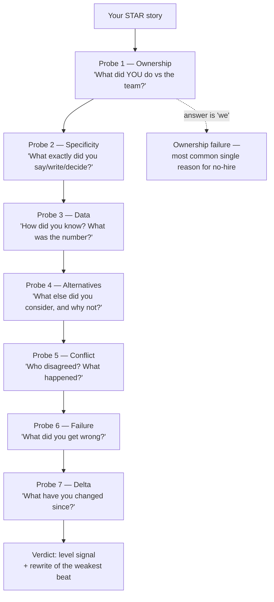

# Leadership Principles Drill

Behavioural interviews are won in the **follow-ups**, not the opening story. This drill plays the
bar-raiser: it probes each story until it breaks, then rebuilds it and maps your bank to a competency
matrix. Teaching stance and honesty rules per [`AGENTS.md`](../../../AGENTS.md).

## When to use

- You have STAR stories written but they collapse under "what did *you* do, specifically?"
- You need to cover a competency framework (Amazon LPs, Google's GCA/leadership, a company's own ladder)
  and want to see which principles you have no evidence for.
- One story is doing all the work in your bank and interviewers keep hearing it twice.
- **Don't use it for** writing stories from scratch — build them in
  [star-story-builder](../star-story-builder/SKILL.md) first, then bring them here to be broken.

## First principles: the probe hierarchy

A bar-raiser is testing whether the story is **yours**, **real**, and **at the level you claim**. They do
that with a predictable ladder of probes. Every level strips away a common way of over-claiming.



| Probe | What it detects | Failure tell | Fix |
| --- | --- | --- | --- |
| Ownership | borrowed credit | pronoun drifts to "we" under pressure | name your decision, then credit others explicitly |
| Specificity | rehearsed abstraction | adjectives, no artefacts | quote the doc, the message, the meeting |
| Data | opinion dressed as result | "it improved a lot" | baseline → result → how measured |
| Alternatives | shallow judgement | only one option ever existed | name the runner-up and its cost |
| Conflict | conflict avoidance | "everyone agreed" | who pushed back, and how you resolved it |
| Failure | defensiveness | a "failure" that's secretly a strength | a real cost, owned, no excuse |
| Delta | no learning loop | "I'd do the same" | a behaviour you changed *and* used since |

**Level calibration** matters as much as content: the same story scores differently by scope.

| Level | Scope of the story | Blast radius | Ambiguity handled |
| --- | --- | --- | --- |
| Mid | own workstream | one team, weeks | problem was given |
| Senior | across a team / service | multiple teams, a quarter | shaped the problem |
| Staff / EM | across orgs | company-visible, 2+ quarters | created the mandate |

**Limits, plainly.** Frameworks differ; a competency map is a rehearsal aid, not a company's real rubric,
and no drill predicts an outcome. Also: never fabricate. An invented metric is the fastest way to fail a
follow-up, because the second-order question ("how was that measured?") has no answer.

## Procedure

1. **Collect the bank** — aim for 8–12 stories covering: shipped something hard, conflict, failure, data-
   driven decision, influence without authority, customer obsession, a raised bar, a mistake you owned.
2. **Tag each story** against the target framework's competencies; note primary and secondary tags.
3. **Build the coverage matrix** and find (a) uncovered competencies and (b) any story used more than
   twice — over-reuse reads as a thin career.
4. **Pick one story and run all seven probes in order**, without warning, one at a time. Do not soften.
5. **Score ownership specifically**: count "I" decisions vs "we" statements in the answer. Under-2
   personal decisions in a 3-minute story is a fail.
6. **Force the failure probe.** If the failure has no real cost, reject it and ask again — "we shipped two
   weeks late but learned a lot" is not a failure.
7. **Rewrite the weakest beat only** (4–6 sentences), keeping the story true. Never invent numbers; if the
   number doesn't exist, use a defensible qualitative anchor ("three of five teams adopted it").
8. **Time-box the retelling to 2.5 minutes**, then a 30-second version for a rapid-fire round.
9. **Re-run the probes cold a day later.** Consistency across retellings is itself a signal.
10. **Output the coverage matrix, the gaps, and the two stories to build next.** Close with the
    **Learning Footer**.

## Output shape

```
Framework: <Amazon LPs | company ladder | generic competencies>   Target level: <mid|senior|staff|EM>
Bank size: <n> stories · unique competencies covered: <c>/<total>
Coverage matrix: <competency> -> <story id | GAP>
Over-used story: <id> (tagged <n> times)  -> risk: <...>
Story under drill: <id> — "<one-line>"
Probe transcript:
  P1 ownership -> <response> -> <pass|fail: why>
  ...
  P7 delta     -> <response> -> <pass|fail: why>
Ownership count: <I-decisions> vs <we-statements>
Level signal: <below | at | above> target — because <scope, blast radius, ambiguity>
Weakest beat: <situation|action|data|failure|delta>
Rewrite: "<4-6 sentences, true, first-person, with a real anchor>"
Gaps to fill: <competency> — build a story about <...>
Learning Footer
```

## Worked exchange — scored

> **Story (candidate, senior level):** "Our checkout was flaky, so we set up better monitoring and the
> error rate dropped."
>
> **P1 Ownership — "What did *you* do that wouldn't have happened otherwise?"**
> → "I noticed the pattern in the support queue and pushed for it." *(weak — 'pushed for it' isn't a
> decision.)* **Fail.**
>
> **P2 Specificity — "What did you write, and who did you send it to?"**
> → "A one-page doc showing 40% of refund tickets traced to one timeout, sent to my EM and the payments
> lead." **Pass** — now there's an artefact.
>
> **P3 Data — "Baseline, result, and how measured?"**
> → "Refund tickets 220/week → 130/week over six weeks; measured from the support tag, same tag both
> periods." **Pass.**
>
> **P4 Alternatives — "What else could you have done?"**
> → "Retry-with-backoff was faster to ship; I chose the timeout fix because retries would have masked the
> upstream bug." **Strong pass** — names the cost of the choice.
>
> **P5 Conflict — "Who disagreed?"** → "The payments lead wanted to wait a quarter. I brought the ticket
> data to their planning meeting and we agreed to a two-week spike." **Pass.**
>
> **P6 Failure — "What did you get wrong?"** → "I didn't check whether the tag definition had changed
> mid-window; a reviewer caught it and I re-pulled the numbers." **Pass** — real, owned, small.
>
> **P7 Delta — "What have you changed since?"** → "I now write the measurement definition before the
> proposal, not after." **Pass.**
>
> **Verdict:** level signal **at senior** (cross-team influence, self-corrected data). Weakest beat: the
> opener. **Rewrite:** *"In Q2 2025 I traced 40% of our refund tickets to a single 3-second checkout
> timeout. I wrote a one-page case, took it to the payments lead who wanted to defer, and negotiated a
> two-week spike instead. I chose fixing the timeout over adding retries, because retries would have
> masked the upstream bug. Refund tickets went from 220 to 130 a week over six weeks on the same support
> tag. I'd had the data for three weeks before I wrote it up — now I write the measurement definition
> first."*

## Tips

- The opener is the cheapest fix in the whole bank: one sentence with a date, a scope, and a number.
- Under pressure, pronouns regress to "we". Rehearse the ownership sentence until it's automatic.
- A "failure" with no cost is a humblebrag and interviewers score it as evasion.
- Never invent a metric — the follow-up "how was that measured?" is where invented numbers die.
- Two probes deep is where most candidates run out of story; prepare depth, not breadth, per story.
- Pair with [star-story-builder](../star-story-builder/SKILL.md),
  [em-interview-drill](../em-interview-drill/SKILL.md),
  [interview-debrief-coach](../interview-debrief-coach/SKILL.md),
  [career-ladder](../career-ladder/SKILL.md),
  [promotion-packet-builder](../promotion-packet-builder/SKILL.md), and
  [resume-tailor](../resume-tailor/SKILL.md). Close with the **Learning Footer** (`AGENTS.md`).
