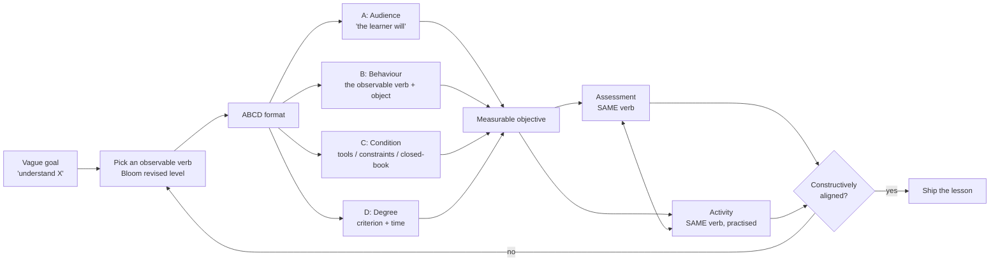

# Learning Objective Writer

"Understand recursion" cannot be observed, taught to, or assessed. This skill converts intent into
objectives you can *see a learner meet*, and then aligns the assessment and the activity to them —
following the teaching-first prime directive in [`AGENTS.md`](../../../AGENTS.md).

## When to use

- A lesson, course, or onboarding plan lists topics rather than outcomes ("covers Docker networking").
- Assessments and content have drifted apart — the exam asks for analysis, the lesson only demonstrated.
- A learner asks "how will I know I've learned this?" and there's no crisp answer.
- Don't use it to sequence a whole curriculum or set durations — pass the finished objectives to
  [curriculum-designer](../curriculum-designer/SKILL.md) and [lesson-plan-writer](../lesson-plan-writer/SKILL.md).

## First principles: verbs you can observe, aligned three ways

Anderson & Krathwohl's revised Bloom taxonomy (2001) replaced Bloom's 1956 nouns with verbs and made
the top two levels *Evaluate* then *Create*. The rule is simple: **if you cannot observe the verb, you
cannot assess it.** "Understand" and "know" are goals; "explain", "predict", "compare" are objectives.

Biggs' **constructive alignment** (1996) adds the second half: the objective's verb must reappear in the
assessment task *and* in the learning activity. A course that states "design", teaches by lecture, and
tests by MCQ is misaligned at both joints — and learners will study for the test, not the objective.



| Bloom (revised) | Observable verbs | Matching assessment | Matching activity |
| --- | --- | --- | --- |
| Remember | define, list, name, recall, label | cued recall, MCQ | flashcards, retrieval set |
| Understand | explain, summarise, classify, paraphrase, predict | short answer, self-explanation | worked examples, Socratic dialogue |
| Apply | implement, compute, execute, configure, use | lab task, code exercise | guided practice, completion problems |
| Analyze | compare, differentiate, debug, trace, decompose | trace/debug task, contrast pair | interleaved mixed set |
| Evaluate | critique, justify, prioritise, review, defend | code review, ADR critique | peer review, trade-off tables |
| Create | design, compose, build, architect, generate | project, RFC, architecture | open-ended build with feedback |

**Banned as behaviours** (unobservable): understand · know · appreciate · be familiar with · learn ·
be aware of · grasp. Each is a *goal*; convert it by asking "what would I watch them do?"

## Procedure

1. **Capture the raw goal verbatim**, then ask: what would the learner *do* that proves it?
2. **Choose the Bloom level honestly.** Aim at the level the real job demands — most technical work
   lives at *Apply* and *Analyze*, not *Remember*.
3. **Pick one observable verb** from the table. One verb per objective; "understand and apply" is two.
4. **Write ABCD**: *Audience* (the learner), *Behaviour* (verb + object), *Condition* (tools allowed,
   closed-book, dataset given), *Degree* (criterion and time limit).
5. **Set a defensible degree** — "with no syntax errors", "within 20 minutes", "≥ 8 of 10 items", "with
   two cited trade-offs". "Correctly" alone is not a criterion.
6. **Align forward to assessment**: write the task that would demonstrate the verb; if the natural task
   is an MCQ but the verb is *design*, the verb or the assessment is wrong.
7. **Align backward to activity**: learners must have practised the verb under similar conditions.
8. **Check the alignment triple** for every objective in a coverage table, then close with the
   **Learning Footer**.

## Output shape

```
Raw goal: "<verbatim vague goal>"
Objective <n>  [Bloom: <level>]
  A: <audience>  B: <observable verb + object>  C: <condition>  D: <degree + time>
  Full: "Given <condition>, the <audience> will <verb> <object> <degree>."
Alignment triple:
  Objective : <verb>
  Assessment: <task that elicits the SAME verb>          aligned? <yes|no>
  Activity  : <practice that rehearses the SAME verb>    aligned? <yes|no>
Prerequisites: <what must already be true>
Non-goals: <explicitly out of scope>
Coverage table: objective x assessment x activity (no orphan rows or columns)
Next: <exam-blueprint | item-writing-coach | lesson-plan-writer>
Learning Footer
```

## Worked example — "I want to understand Kubernetes networking"

| # | Bloom | ABCD objective | Assessment | Activity |
| --- | --- | --- | --- | --- |
| 1 | Understand | Given a running cluster diagram, the learner will **explain** the path of a packet from an external client to a pod, naming Service, kube-proxy, and CNI, in ≤ 5 minutes, closed-book. | verbal/written trace, graded against a 5-point checklist | annotated packet-path diagram + self-explanation prompts |
| 2 | Apply | Given a broken manifest and `kubectl` access, the learner will **configure** a `ClusterIP` Service that routes to the correct pods, verified by a successful `curl` from a test pod, within 15 minutes. | live lab task with a pass/fail curl check | guided worked example, then a completion problem |
| 3 | Analyze | Given a Service returning intermittent 502s, the learner will **diagnose** the root cause by comparing Endpoints, readiness probes, and selectors, identifying the fault in ≤ 20 minutes with one written line of evidence per hypothesis. | seeded-fault debugging exercise | interleaved fault set of ≥ 4 distinct failure modes |
| 4 | Evaluate | Given three ingress options (NodePort, LoadBalancer, Ingress controller), the learner will **justify** a choice for a stated cost and latency budget, citing ≥ 2 trade-offs per option. | short ADR reviewed against a rubric | trade-off table + peer critique |

Alignment audit: objective 1's original draft assessment was a 10-item MCQ — recognition, not
explanation, so it was replaced with a written trace. Objective 4 had no matching activity (lecture
only); a trade-off table exercise was added. **Note what did *not* survive:** "know Kubernetes
architecture" produced no observable verb and was dropped as a non-goal.

## Tips

- If you cannot name the artefact the learner produces, it isn't an objective yet — it's a topic.
- One verb per objective. Compound objectives can't be graded, because half-passing is undefined.
- The *Condition* is where realism lives: closed-book vs docs-allowed changes the skill entirely.
- Write the assessment immediately after the objective; the mismatch shows up instantly and cheaply.
- Beware inflated verbs — labelling recall as "analyze" produces an exam nobody can pass fairly.
- Pair with [item-writing-coach](../item-writing-coach/SKILL.md) to build aligned items,
  [exam-blueprint](../exam-blueprint/SKILL.md) for coverage weighting,
  [skill-assessment](../skill-assessment/SKILL.md) to set the mastery bar,
  [cognitive-load-coach](../cognitive-load-coach/SKILL.md) to fit the activity to working memory, and
  [curriculum-designer](../curriculum-designer/SKILL.md) to sequence the set.
  End with the **Learning Footer** (`AGENTS.md`).
