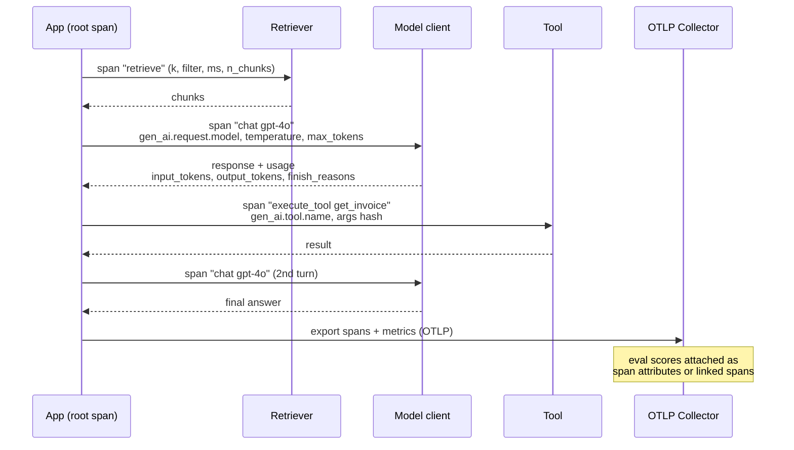

# LLM Observability Lab

You cannot debug what you cannot see: **span → attributes → metrics → evals → alert**, wired to the
OpenTelemetry **GenAI semantic conventions** so the data is portable across backends, following the
verify-before-you-teach rule in [`AGENTS.md`](../../../AGENTS.md).

## When to use

- p95 latency is bad and you cannot tell whether it is retrieval, the model, tool calls, or your own glue.
- Spend is rising and no one can attribute tokens to a feature, tenant, model, or prompt version.
- Quality regressed after a prompt or model change and there is no per-request record to diff.
- **Don't use it for** designing the eval set itself ([eval-designer](../eval-designer/SKILL.md)) or for
  choosing a cheaper model ([llm-cost-optimizer](../llm-cost-optimizer/SKILL.md)) — this is the telemetry
  substrate both of those consume.

## First principles: an LLM call is a span with a known shape

OpenTelemetry defines **traces** (causally linked spans), **metrics** (aggregates), and **logs/events**.
The GenAI semantic conventions add a *named vocabulary* for model calls so that a "chat" span from one SDK
means the same thing as from another. Span name convention: `{gen_ai.operation.name} {model}` — e.g.
`chat gpt-4o`. **Status: these conventions are marked Development/Experimental and attribute names have
churned** (for example `gen_ai.system` was superseded by `gen_ai.provider.name`, and prompt/completion
capture moved to structured `gen_ai.input.messages` / `gen_ai.output.messages`). **Pin the semconv version
you build against and re-check the current spec on opentelemetry.io before shipping dashboards.**



| Signal | Convention / instrument | Why it earns its keep |
| --- | --- | --- |
| Operation | `gen_ai.operation.name` = `chat`, `embeddings`, `execute_tool` | one dashboard covers every provider |
| Provider & model | `gen_ai.provider.name`, `gen_ai.request.model`, `gen_ai.response.model` | requested ≠ served model — silent version drift is real |
| Request knobs | `gen_ai.request.temperature`, `gen_ai.request.max_tokens`, `gen_ai.request.top_p` | correlates output variance with settings |
| Usage | `gen_ai.usage.input_tokens`, `gen_ai.usage.output_tokens` | the only honest basis for cost |
| Outcome | `gen_ai.response.finish_reasons`, `error.type` | `length` truncation looks like a quality bug |
| Conversation & tools | `gen_ai.conversation.id`, `gen_ai.tool.name`, `gen_ai.tool.call.id` | stitches sessions; agent loops live or die here |
| Metrics | `gen_ai.client.token.usage`, `gen_ai.client.operation.duration` (histograms) | dashboards and alerts without sampling loss |
| Content | prompt/completion as span **events**, off by default | PII risk; sample it, redact it, retain it briefly |

**Cardinality discipline:** attributes that vary per request (user id, full prompt, raw document text) must
not become *metric* dimensions — they explode a time-series database. Keep them on spans; keep metric
labels to `model`, `operation`, `provider`, `error.type`, and a low-cardinality `feature`/`tenant`.

## Procedure

1. **Name the question first**: "which step owns p95?", "cost per tenant per day?", "did quality drop after
   prompt v7?". Instrument to answer it; general-purpose tracing collects noise.
2. **Create a root span per user request** and propagate context through every async hop — a broken parent
   link turns a trace into confetti.
3. **Wrap each model call** in a span named `{operation} {model}` and set the request attributes *before*
   the call, the response and usage attributes *after*, including on the error path.
4. **Record two metrics** — a token histogram split by `gen_ai.token.type` (input/output) and an operation
   duration histogram. Derive cost in the query layer from a price table, not in the app: prices change.
5. **Instrument the non-model steps too**: retrieval (k, filters, chunk count, ms), tool calls, guardrail
   checks, and cache hits. In RAG the retriever is often the real latency owner.
6. **Attach evals to the trace** — groundedness, answer relevance, refusal, or a rubric score — as span
   attributes so a bad score is one click from the prompt that produced it.
7. **Gate content capture** behind an environment flag plus redaction, and set a short retention. Log
   *hashes* and lengths by default, full text only for a sampled subset.
8. **Alert on the derivative, not the level**: p95 duration, error rate, output-token drift, cost per
   request, and `finish_reason=length` share. Close with the **Learning Footer**.

## Output shape

```
Question: <the operational question the telemetry must answer>
Topology: root span=<name> · children=<retrieve|chat|execute_tool|guardrail ...>
Semconv version pinned: <e.g. 1.3x.y>   Attributes set: gen_ai.operation.name, gen_ai.request.model, ...
Metrics: gen_ai.client.token.usage{model,type} · gen_ai.client.operation.duration{model,operation}
Cost: derived in query layer from <price table + date>   $/1k in=<...> out=<...>
Content capture: <off | sampled N% + redacted>  retention=<days>  PII review=<owner>
Evals on trace: <groundedness|relevance|refusal|rubric> · sample=<%> · scorer=<model/heuristic>
Backend: <OTLP collector -> Jaeger|Tempo|vendor>  dashboards=<links>
Alerts: p95 duration > <ms> · error rate > <%> · cost/req > <$> · finish_reason=length > <%>
Blind spots: <what is still invisible>
Next: <eval-designer | llm-cost-optimizer | distributed-tracing-coach>
Learning Footer
```

## Worked example — a hand-instrumented RAG turn

Manual instrumentation teaches the shape; auto-instrumentation libraries emit the same attributes.

```python
# pip install opentelemetry-sdk opentelemetry-exporter-otlp
import time, hashlib, os
from opentelemetry import trace, metrics
from opentelemetry.sdk.trace import TracerProvider
from opentelemetry.sdk.trace.export import BatchSpanProcessor
from opentelemetry.sdk.metrics import MeterProvider
from opentelemetry.sdk.metrics.export import PeriodicExportingMetricReader
from opentelemetry.exporter.otlp.proto.grpc.trace_exporter import OTLPSpanExporter
from opentelemetry.exporter.otlp.proto.grpc.metric_exporter import OTLPMetricExporter

trace.set_tracer_provider(TracerProvider())
trace.get_tracer_provider().add_span_processor(BatchSpanProcessor(OTLPSpanExporter()))
metrics.set_meter_provider(MeterProvider(metric_readers=[
    PeriodicExportingMetricReader(OTLPMetricExporter())]))
tracer = trace.get_tracer("rag.app")
meter = metrics.get_meter("rag.app")
TOKENS = meter.create_histogram("gen_ai.client.token.usage", unit="{token}")
DURATION = meter.create_histogram("gen_ai.client.operation.duration", unit="s")

CAPTURE_CONTENT = os.getenv("OTEL_GENAI_CAPTURE_CONTENT") == "true"  # default: off
MODEL, PROVIDER = "gpt-4o", "openai"

def answer(question: str, tenant: str):
    with tracer.start_as_current_span("rag.turn") as root:
        root.set_attribute("gen_ai.conversation.id", tenant + ":42")
        root.set_attribute("app.tenant", tenant)

        with tracer.start_as_current_span("retrieve") as rs:
            t0 = time.perf_counter()
            chunks = retriever(question, k=5)                      # your retriever
            rs.set_attributes({"db.operation.name": "similarity_search", "app.retrieval.k": 5,
                               "app.retrieval.n_chunks": len(chunks),
                               "app.retrieval.duration_ms": (time.perf_counter() - t0) * 1000})

        span_name = f"chat {MODEL}"                                 # {operation} {model}
        with tracer.start_as_current_span(span_name) as ms:
            ms.set_attributes({"gen_ai.operation.name": "chat",
                               "gen_ai.provider.name": PROVIDER,
                               "gen_ai.request.model": MODEL,
                               "gen_ai.request.temperature": 0.2,
                               "gen_ai.request.max_tokens": 512,
                               "app.prompt.version": "v7",
                               "app.prompt.sha256": hashlib.sha256(question.encode()).hexdigest()[:16]})
            if CAPTURE_CONTENT:                                     # events, redacted + sampled
                ms.add_event("gen_ai.client.inference.operation.details",
                             {"gen_ai.input.messages": redact(question)})
            start = time.perf_counter()
            try:
                resp = client.chat.completions.create(              # your SDK
                    model=MODEL, temperature=0.2, max_tokens=512,
                    messages=build_messages(question, chunks))
            except Exception as exc:
                ms.set_attribute("error.type", type(exc).__name__)
                ms.set_status(trace.Status(trace.StatusCode.ERROR)); raise
            finally:
                elapsed = time.perf_counter() - start
                DURATION.record(elapsed, {"gen_ai.operation.name": "chat",
                                          "gen_ai.request.model": MODEL})

            u = resp.usage
            ms.set_attributes({"gen_ai.response.model": resp.model,
                               "gen_ai.usage.input_tokens": u.prompt_tokens,
                               "gen_ai.usage.output_tokens": u.completion_tokens,
                               "gen_ai.response.finish_reasons": [resp.choices[0].finish_reason]})
            for kind, n in (("input", u.prompt_tokens), ("output", u.completion_tokens)):
                TOKENS.record(n, {"gen_ai.token.type": kind, "gen_ai.request.model": MODEL})

            text = resp.choices[0].message.content
            root.set_attribute("eval.groundedness", groundedness(text, chunks))  # 0..1, sampled
            return text
```

Now one query answers "is p95 retrieval or generation?" (compare child span durations), "cost per tenant"
(`sum(gen_ai.client.token.usage)` × price, grouped by `app.tenant`), and "did prompt v7 regress?"
(`eval.groundedness` split by `app.prompt.version`).

## Tips

- Pin the semantic-convention version in a constant and review it on upgrade — GenAI semconv is still
  Development status and attribute renames have shipped more than once.
- Never put a prompt, user id, or document text in a **metric** label; cardinality explosions take down
  the metrics backend, not the app.
- Compute cost at query time from a dated price table. Hard-coding $/token in the app guarantees a stale
  dashboard within a quarter.
- `finish_reason=length` is a silent quality bug — truncated answers score badly and look like model
  regression. Alert on its share.
- Streaming responses need the span kept open until the last chunk, or your latency metric measures
  time-to-first-token while your users experience time-to-last-token. Record both.
- Sample content capture, redact before export, and set retention deliberately — prompts are user data
  under GDPR and under your own AI policy ([ai-governance-coach](../ai-governance-coach/SKILL.md)).
- Pair with [distributed-tracing-coach](../distributed-tracing-coach/SKILL.md),
  [jaeger-tracing-local-lab](../jaeger-tracing-local-lab/SKILL.md),
  [tempo-tracing-local-lab](../tempo-tracing-local-lab/SKILL.md),
  [eval-designer](../eval-designer/SKILL.md),
  [rag-evaluation-coach](../rag-evaluation-coach/SKILL.md),
  [llm-cost-optimizer](../llm-cost-optimizer/SKILL.md), and
  [observability-plan](../observability-plan/SKILL.md).
  End with the **Learning Footer** (`AGENTS.md`).
