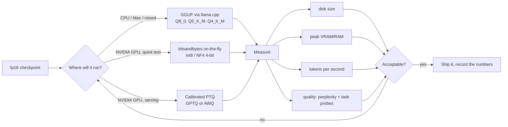

# LLM Quantization Lab

Shrink a model **on your own machine, for free**, and prove what it cost you — following the teaching and
source-discipline rules in [`AGENTS.md`](../../../AGENTS.md). Quantization is only interesting when it is
measured: size, speed and quality must all be on the same table before anyone claims a win.

## When to use

- A model does not fit the learner's VRAM/RAM and they want the smallest quality loss that makes it fit.
- They keep seeing `Q4_K_M`, `NF4`, `GPTQ`, `AWQ` and cannot say what differs.
- Before self-hosting with [vllm-inference-lab](../vllm-inference-lab/SKILL.md), or before/after adapting a
  model with [peft-lora-lab](../peft-lora-lab/SKILL.md) (QLoRA is quantization + LoRA).
- Prerequisite mental model: [transformer-architecture-explainer](../transformer-architecture-explainer/SKILL.md)
  (where the weights and the KV cache actually live).

## First principle

A weight is a number. `fp16` spends 16 bits on it; 4-bit spends 4. You are not deleting knowledge, you are
lowering the **resolution** of every weight. The error that introduces is small per weight and large in
aggregate — so every good method spends its cleverness on *where* to keep resolution: per-block scales,
outlier channels, and calibration data.



## Method comparison

| Method | Where it runs | Needs calibration data? | Typical use | Main trade-off |
| --- | --- | --- | --- | --- |
| **fp16 / bf16** (baseline) | GPU | No | The reference row | Largest, fastest per-token on GPU, no quality loss |
| **bitsandbytes int8** | NVIDIA GPU | No | Quick fit test | Simple, one flag; slower than fp16 due to dequant overhead |
| **bitsandbytes NF4** (4-bit) | NVIDIA GPU | No | QLoRA training base | ~4× smaller weights; NF4 is information-theoretically matched to normally-distributed weights (Dettmers et al., *QLoRA*, arXiv:2305.14314, 2023-05-23) |
| **GPTQ** | NVIDIA GPU | Yes (a few hundred samples) | Serving a fixed model | One-off quantization cost; layer-wise error compensation (Frantar et al., arXiv:2210.17323, 2022-10-31) |
| **AWQ** | NVIDIA GPU | Yes | Serving, activation-aware | Protects salient channels using activation statistics (Lin et al., arXiv:2306.00978, 2023-06-01) |
| **GGUF Q8_0 / Q5_K_M / Q4_K_M** | CPU, Apple Silicon, GPU offload | No (K-quants use per-block scales) | Laptops, Ollama, llama.cpp | Best portability and CPU speed; K-quant suffix = bits + quality tier (`_K_M` medium) |

**Rule of thumb to verify, not trust:** 8-bit is usually indistinguishable, 4-bit K-quants are usually
acceptable for chat, and anything below 4-bit degrades sharply on small models. Small models degrade *more*
than large ones at the same bit-width — measure on your own model.

## Procedure

1. **Set the budget.** Write down target VRAM/RAM, minimum tokens/sec, and the quality floor (which task,
   which metric, what score counts as pass). Without a floor, quantization always "works".
2. **Build the fp16 baseline.** Pick a genuinely small open model so the lab is fast on any laptop.

   ```bash
   python -m venv .venv && .venv\Scripts\activate      # Windows; use source .venv/bin/activate elsewhere
   pip install -U transformers accelerate torch datasets bitsandbytes
   python -c "from transformers import AutoModelForCausalLM, AutoTokenizer; import torch; m='Qwen/Qwen2.5-0.5B-Instruct'; tok=AutoTokenizer.from_pretrained(m); mod=AutoModelForCausalLM.from_pretrained(m, torch_dtype=torch.float16); print(sum(p.numel() for p in mod.parameters())/1e6, 'M params')"
   ```

3. **Quantize on the fly with bitsandbytes** (NVIDIA GPU) using `BitsAndBytesConfig` from Hugging Face
   Transformers — `load_in_8bit=True`, then `load_in_4bit=True` with `bnb_4bit_quant_type="nf4"` and
   `bnb_4bit_compute_dtype=torch.float16`. Record `torch.cuda.max_memory_allocated()` for each.
4. **Export to GGUF and quantize with llama.cpp** — the CPU/Apple-Silicon path that needs no GPU:

   ```bash
   git clone https://github.com/ggml-org/llama.cpp && cd llama.cpp
   cmake -B build && cmake --build build --config Release
   pip install -r requirements.txt
   python convert_hf_to_gguf.py <path-to-hf-model> --outfile model-f16.gguf --outtype f16
   ./build/bin/llama-quantize model-f16.gguf model-Q4_K_M.gguf Q4_K_M
   ./build/bin/llama-bench -m model-f16.gguf -m model-Q4_K_M.gguf
   ```

   Repeat for `Q8_0` and `Q5_K_M`. Check the current tool names in the llama.cpp README before running —
   that project renames binaries occasionally, so read, do not assume.
5. **Try a calibrated method** (optional, GPU): quantize with GPTQ or AWQ using a few hundred samples drawn
   from text that *resembles your real traffic*. Calibration data that does not match your domain is the
   single most common cause of a bad calibrated quant.
6. **Measure quality, not vibes.** Compute perplexity on a held-out text slice for every variant, then add
   3–5 task probes that matter to the learner (an instruction-following prompt, a JSON-format prompt, a
   long-context recall prompt). Perplexity alone hides format and instruction-following collapse.
7. **Run everything via `#run` (`learningos_runcode`)** on real inputs and real edge cases — an empty
   prompt, a very long prompt near the context limit, a non-English prompt, and a prompt that must return
   strict JSON. Report the actual outputs; a quant that "passes perplexity" but breaks JSON has failed.
8. ⚠ **Verification step:** the lab is only complete when one table holds, for every variant, *disk size ·
   peak memory · tokens/sec · perplexity · probe pass-rate*, and the learner can name which variant they
   would ship and why. If two variants tie, prefer the one with the fewer moving parts.
9. **Route onward:** serve the winner with [vllm-inference-lab](../vllm-inference-lab/SKILL.md), train on a
   4-bit base with [peft-lora-lab](../peft-lora-lab/SKILL.md), plan spend with
   [llm-cost-optimizer](../llm-cost-optimizer/SKILL.md), or formalize the quality gate with
   [eval-designer](../eval-designer/SKILL.md).

## Output shape

```
Goal: fit <model> in <VRAM/RAM> above <quality floor> at >= <tok/s>
Hardware: <GPU/CPU, memory>          Baseline: fp16

| variant      | disk  | peak mem | tok/s | perplexity | probes passed |
|--------------|-------|----------|-------|------------|---------------|
| fp16         | <..>  | <..>     | <..>  | <..>       | <n/5>         |
| bnb-int8     | <..>  | <..>     | <..>  | <..>       | <n/5>         |
| bnb-NF4      | <..>  | <..>     | <..>  | <..>       | <n/5>         |
| GGUF Q5_K_M  | <..>  | <..>     | <..>  | <..>       | <n/5>         |
| GGUF Q4_K_M  | <..>  | <..>     | <..>  | <..>       | <n/5>         |

#run evidence: <commands executed -> real measured numbers>
Edge cases run: <empty prompt | max-context prompt | non-English | strict-JSON> -> <outputs>
Decision: ship <variant> because <fits budget AND clears quality floor>
Rejected: <variant> — <the number that failed>
Next: <serve with vLLM | QLoRA fine-tune | cost model>
```

## Tips

- **Never report a quantized model without its fp16 baseline** on the same hardware, same prompts, same day.
  A number without a control is a story, not a measurement.
- Weights are not the whole footprint — at long context the **KV cache** can exceed the quantized weights;
  quantizing weights alone will not save a long-context workload.
- Calibrated methods (GPTQ/AWQ) are only as good as their calibration set; sample it from your real domain.
- Smaller models are more fragile under aggressive quantization than large ones — do not port a "4-bit is
  free" claim from a 70B model to a 1B model.
- Quantization changes *how* a model fails, not just how well: watch for lost JSON formatting, broken
  non-English output, and degraded long-context recall before you look at perplexity.
- Cite tool docs by name and check them live (Hugging Face Transformers quantization docs, bitsandbytes,
  llama.cpp README, AutoAWQ/GPTQ project docs) — never invent flags, file names, or version numbers.
- Close with the **Learning Footer** (`AGENTS.md`): one recap, one pitfall, one variant left to measure.
