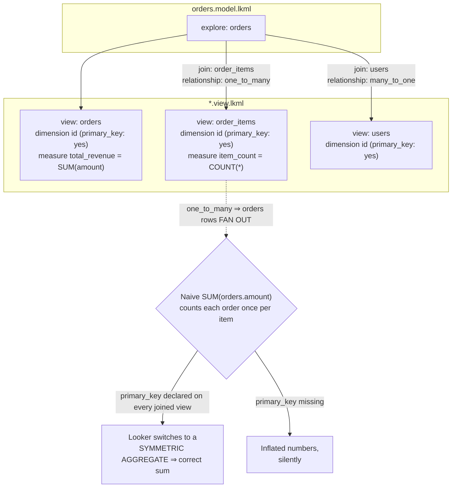

# LookML Coach

LookML is not SQL with extra steps — it is a **declaration of relationships** that lets Looker generate a
*different* correct SQL query for every question a business user asks. Get the `relationship` and
`primary_key` declarations wrong and every sum on the page is silently inflated. Taught from the join
semantics upward, per [`AGENTS.md`](../../../AGENTS.md).

## When to use

- Standing up a new Looker model and choosing what belongs in a view, an explore, or a derived table.
- Revenue in a dashboard is higher than revenue in the database and nobody can explain the multiple.
- Deciding between a SQL derived table, a **native** derived table (NDT), and a **persisted** derived table
  (PDT) — and whether the PDT should be incremental.
- Implementing "each regional manager sees only their region" without forking the model.
- **Don't use it for** vendor-neutral metric definitions (that's
  [`metrics-definition-coach`](../metrics-definition-coach/SKILL.md) and
  [`dbt-semantic-layer-coach`](../dbt-semantic-layer-coach/SKILL.md)), warehouse table design
  ([`data-warehouse-modeling`](../data-warehouse-modeling/SKILL.md)), or chart choice
  ([`data-viz-coach`](../data-viz-coach/SKILL.md)).

## First principles: the three objects, and the one that bites

LookML files are `*.view.lkml`, `*.model.lkml`, and (optionally) `*.explore.lkml`, all versioned in Git
(Looker docs, *LookML terms and concepts*; Looker is now documented under Google Cloud, so ⚠ parameter
names and availability should be verified on the current `cloud.google.com/looker/docs/reference` page).

| Object | Declares | Generates |
| --- | --- | --- |
| **view** | one table (or derived query) plus its `dimension`s and `measure`s | the `SELECT` list and `GROUP BY` |
| **explore** | one starting view + its `join`s | the `FROM` / `JOIN` clauses a user may traverse |
| **model** | connection, included files, explores, datagroups | the query scope |

A **dimension** is a row-level attribute (`GROUP BY`-able); a **measure** is an aggregate
(`SUM`, `COUNT`, …). A **dimension_group** of `type: time` expands into a family of fields (`_raw`,
`_date`, `_week`, `_month`, …) from one timestamp — declare once, get every grain.



*Figure: `relationship` tells Looker whether a join can duplicate rows; `primary_key` gives it the identity
it needs to de-duplicate. Missing either one produces wrong numbers with no error.*

### Fanout and symmetric aggregates — the core lesson

Join one order (amount 100) to its two line items and the joined result has **two rows**, both carrying
`amount = 100`. A naive `SUM(orders.amount)` returns **200**. This is *fanout*, and it is a property of SQL,
not a Looker bug.

Looker's answer is the **symmetric aggregate** (Looker docs, *Symmetric aggregates*). Conceptually, instead
of `SUM(amount)` it computes:

```
sum(DISTINCT hash(orders.primary_key) + amount) - sum(DISTINCT hash(orders.primary_key))
```

Each `(order, amount)` pair contributes exactly once because `DISTINCT` collapses the duplicated rows, and
subtracting the summed hashes removes the offset that made them distinct. That is why **every joined view
must declare `primary_key: yes` on exactly one dimension** — the hash needs a stable row identity. ⚠
Symmetric aggregates depend on dialect support and do not cover every measure type (`median` and
percentile-style measures in particular); verify against the current dialect-support page before promising
a number.

| Relationship | Meaning (left → joined) | Fanout risk | Symmetric aggregate needed |
| --- | --- | --- | --- |
| `many_to_one` | many left rows → one joined row | none | no |
| `one_to_one` | one → one | none | no |
| `one_to_many` | one left row → many joined rows | **yes** | yes |
| `many_to_many` | many → many | **yes** | yes |

⚠ If you omit `relationship`, Looker assumes `many_to_one` — the *no-fanout* case — so an unlabelled
one-to-many join produces inflated aggregates silently. Always declare it.

### Derived tables: three flavours

| Flavour | Written as | Runs | Choose when |
| --- | --- | --- | --- |
| SQL derived table | `derived_table: { sql: … ;; }` | inline sub-query on every use | logic is small, freshness must be live |
| **Native** derived table (NDT) | `derived_table: { explore_source: … }` | Looker generates the SQL from an existing explore | you want the derived query to inherit the model's joins, measures and access controls |
| **Persisted** derived table (PDT) | any of the above **plus** `datagroup_trigger:` / `sql_trigger_value:` / `persist_for:` | materialised into a scratch schema on the connection | the query is expensive and reused |
| Incremental PDT | PDT + `increment_key:` (+ optional `increment_offset:`) | rebuilds only recent partitions | large append-mostly fact tables |

PDTs require the database connection to have a **writable scratch schema with a temp/PDT-enabled user** —
this is a connection setting, not a LookML one, and is the usual reason a PDT "doesn't build."

### Governance primitives

| Parameter | Scope | Enforces |
| --- | --- | --- |
| `access_grant` + `required_access_grants` | explore, view, field, join | **field/explore visibility** based on a user attribute's allowed values |
| `access_filter` (inside an explore) | rows | **row-level filtering** by user attribute, e.g. `field: users.region  user_attribute: region` |
| `sql_always_where` | rows | a WHERE clause on the explore the user cannot remove (not a security boundary against the DB itself) |
| `sql_always_having` | aggregates | the same, applied post-aggregation |
| `fields: [ALL_FIELDS*, -orders.pii_email]` | explore | field allow/deny list |

⚠ These are *Looker-level* controls. A user with database credentials, or a different BI tool on the same
warehouse, is unaffected — pair them with warehouse-level enforcement from
[`rls-and-data-masking-coach`](../rls-and-data-masking-coach/SKILL.md).

## Procedure

1. **Start from the questions**, not the tables: list the 5–10 questions the explore must answer, and the
   grain of each answer. That fixes which view is the explore's base.
2. **Generate views from the schema**, then hand-curate. Auto-generated LookML gives you every column as a
   dimension; delete what nobody should group by and `hidden: yes` the rest.
3. **Declare `primary_key: yes` on exactly one dimension per view — including every joined view.** Do this
   before writing a single measure; symmetric aggregates depend on it.
4. **Convert timestamps to `dimension_group: { type: time }`** with an explicit `timeframes:` list, so one
   declaration serves date/week/month questions.
5. **Write measures against dimensions, not raw columns**: `sql: ${amount} ;;`, not `sql: ${TABLE}.amount ;;`.
   The `${}` reference keeps one definition of the column and lets Looker resolve joins.
6. **Build the explore and declare every join's `relationship:` and `sql_on:` explicitly.** Then run a query
   that groups by an `orders` dimension while a `one_to_many` view is joined, open **SQL** in the Explore's
   Data pane, and confirm the generated SQL contains the symmetric-aggregate expression.
7. **Verify the number against the warehouse.** Run `SELECT SUM(amount) FROM orders` directly and compare
   with the explore's total. If they differ, you have fanout, a missing `primary_key`, or a filter you
   forgot — do not proceed until they match.
8. **Extract repeated logic** into an NDT (`explore_source:`) rather than pasting SQL, so joins and access
   controls are inherited rather than re-implemented.
9. **Persist only what you measured as slow.** Add `datagroup_trigger:` tied to a datagroup whose
   `sql_trigger:` reflects real upstream freshness (e.g. `SELECT max(updated_at) FROM orders`), not a clock.
   For large append-mostly facts, add `increment_key:` and an `increment_offset:` that covers your
   late-arriving window.
10. **Layer governance**: `access_filter` for rows, `required_access_grants` for fields, `fields:` for the
    explore surface. Test by impersonating a user with each user-attribute value.
11. **Put it under review**: LookML lives in Git, so use branches, PRs, and the LookML validator before
    deploying to production. Content validation catches dashboards broken by a renamed field.
12. Close with the **Learning Footer**.

## Output shape

```
Model: <model.lkml>  connection: <name>  explore: <name>  base view: <view>
Questions served: <q1> · <q2> · <q3>            Grain of base view: <one row per ...>

Views:
  <view> | primary_key: <dimension> | dimensions: <n> | dimension_groups: <n> | measures: <n>
Joins:
  <joined view> | type: <left_outer|inner> | relationship: <many_to_one|one_to_many|...> | sql_on: <...>
  fanout risk: <none|yes> -> symmetric aggregate: <in generated SQL? yes/no>

Correctness check:
  warehouse:  SELECT SUM(<col>) FROM <table> [filters] = <X>
  explore:    <measure> with <joined view> in the query   = <Y>
  match: <yes|no>   if no -> cause: <missing primary_key | wrong relationship | filter diff>

Derived tables:
  <name> | <sql | explore_source (NDT)> | persistence: <none | persist_for <n> | datagroup <name>>
         | incremental: <increment_key + increment_offset | no> | scratch schema: <ok|missing>

Governance:
  access_filter: field=<view.field> user_attribute=<attr>
  required_access_grants: <grant> (user_attribute=<attr>, allowed_values=[...])
  fields: <ALL_FIELDS* minus ...>     warehouse-level backstop: <yes|no ⚠>

Next: dbt-semantic-layer-coach | metrics-definition-coach | dashboard-designer
Learning Footer
```

## Worked example — the inflated revenue number, found and fixed

Three tables: `orders`, `order_items` (one order has many items), `users`.

```
orders                          order_items
id | user_id | amount           id | order_id | sku   | qty
 1 |     10  | 100.00            1 |        1 | A     |  1
 2 |     11  |  50.00            2 |        1 | B     |  3
                                 3 |        2 | C     |  2
```

The ground truth from the warehouse is `SELECT SUM(amount) FROM orders` → **150.00**.

**The broken model** — note what is missing:

```lkml
view: orders {
  sql_table_name: public.orders ;;
  dimension: id { type: number  sql: ${TABLE}.id ;; }          # no primary_key!
  dimension: user_id { type: number  sql: ${TABLE}.user_id ;; }
  measure: total_revenue { type: sum  sql: ${TABLE}.amount ;; }
}

view: order_items {
  sql_table_name: public.order_items ;;
  dimension: id { type: number  sql: ${TABLE}.id ;; }          # no primary_key!
  dimension: order_id { type: number  sql: ${TABLE}.order_id ;; }
  measure: item_count { type: count }
}

explore: orders {
  join: order_items {
    sql_on: ${orders.id} = ${order_items.order_id} ;;
    # relationship omitted -> Looker assumes many_to_one -> no fanout protection
  }
}
```

Trace the join result the database actually produces:

```
orders.id | orders.amount | order_items.id
    1     |    100.00     |       1
    1     |    100.00     |       2
    2     |     50.00     |       3
```

`SUM(orders.amount)` over those three rows = 100 + 100 + 50 = **250.00**. The dashboard shows 250; the
finance team says 150; the model is the liar. Order 1 was counted twice because it has two line items.

**The fixed model:**

```lkml
view: orders {
  sql_table_name: public.orders ;;

  dimension: id {
    primary_key: yes                       # <- identity for the symmetric aggregate
    type: number
    sql: ${TABLE}.id ;;
  }
  dimension: amount { type: number  value_format_name: usd  sql: ${TABLE}.amount ;; }

  dimension_group: created {
    type: time
    timeframes: [raw, date, week, month, quarter, year]
    sql: ${TABLE}.created_at ;;
  }

  measure: order_count   { type: count }
  measure: total_revenue { type: sum      sql: ${amount} ;;  value_format_name: usd }
  measure: aov           { type: number   sql: 1.0 * ${total_revenue} / NULLIF(${order_count},0) ;; }
}

view: order_items {
  sql_table_name: public.order_items ;;
  dimension: id       { primary_key: yes  type: number  sql: ${TABLE}.id ;; }
  dimension: order_id { type: number  hidden: yes  sql: ${TABLE}.order_id ;; }
  dimension: sku      { type: string  sql: ${TABLE}.sku ;; }
  measure:   item_count { type: count }
}

view: users {
  sql_table_name: public.users ;;
  dimension: id     { primary_key: yes  type: number  sql: ${TABLE}.id ;; }
  dimension: region { type: string  sql: ${TABLE}.region ;; }
  dimension: email  { type: string  sql: ${TABLE}.email ;;  required_access_grants: [can_see_pii] }
}

explore: orders {
  join: order_items {
    type: left_outer
    relationship: one_to_many              # <- the truth about this join
    sql_on: ${orders.id} = ${order_items.order_id} ;;
  }
  join: users {
    type: left_outer
    relationship: many_to_one              # many orders -> one user: no fanout
    sql_on: ${orders.user_id} = ${users.id} ;;
  }

  access_filter: { field: users.region  user_attribute: region }
  fields: [ALL_FIELDS*, -users.email]      # belt and braces alongside the access grant
}
```

Re-run the same question. `total_revenue` now reports **150.00**, and the generated SQL (Explore → SQL tab)
contains a `SUM(DISTINCT …)`-style expression built from a hash of `orders.id` rather than a plain
`SUM(orders.amount)`. The arithmetic works because order 1 contributes `hash(1) + 100` **once** no matter
how many item rows duplicate it, and subtracting `SUM(DISTINCT hash(1))` removes the offset.

Sanity rule to keep: *if adding a `one_to_many` join changes a measure that does not come from the joined
view, the model is wrong.*

**Governance**, defined once in the model:

```lkml
access_grant: can_see_pii {
  user_attribute: pii_access
  allowed_values: ["yes"]
}
```

A user whose `pii_access` attribute is not `"yes"` cannot see `users.email` in the field picker at all, and
`access_filter` appends `users.region = <their region>` to every query on this explore. Regional isolation
and PII masking with no forked model — but remember these bind at the Looker layer, so enforce the same
rule in the warehouse too.

**Persistence**, added only after measuring:

```lkml
datagroup: orders_daily {
  sql_trigger: SELECT max(updated_at) FROM public.orders ;;    # data-driven, not clock-driven
  max_cache_age: "24 hours"
}

view: revenue_by_region {
  derived_table: {
    explore_source: orders {                # native derived table: inherits joins + access controls
      column: region        { field: users.region }
      column: total_revenue { field: orders.total_revenue }
      timezone: "UTC"
    }
    datagroup_trigger: orders_daily
    increment_key: "created_date"           # incremental PDT: rebuild only recent partitions
    increment_offset: 3                     # re-scan 3 periods back for late arrivals
  }
  dimension: region { type: string }
  measure:  total_revenue { type: sum  sql: ${TABLE}.total_revenue ;; }
}
```

## Tips

- **Every view gets a `primary_key`.** It is not optional metadata — it is the input to the de-duplication
  that keeps sums honest across joins.
- **Never omit `relationship:`.** The default (`many_to_one`) is the *safe-looking* wrong answer for a
  one-to-many join, and it fails silently.
- Reference fields as `${other_view.field}`, never raw `${TABLE}.col` from another view — the `${}` form is
  what lets Looker know a join is required and keeps one definition per concept.
- Read the generated SQL. The Explore's SQL tab is the ground truth about what your LookML actually means;
  "it should join correctly" is not evidence.
- Persist last. A PDT freezes a modelling mistake into a table and adds a build to maintain; fix the query
  or the warehouse layout first with [`sql-indexing-lab`](../sql-indexing-lab/SKILL.md) or
  [`bigquery-optimization-coach`](../bigquery-optimization-coach/SKILL.md).
- Trigger PDTs from data (`sql_trigger: SELECT max(updated_at) …`), not from a schedule, so a late upstream
  load cannot publish a half-built table.
- `access_filter` and `sql_always_where` govern *Looker*, not the warehouse. Anyone with a SQL client
  bypasses them — pair with [`rls-and-data-masking-coach`](../rls-and-data-masking-coach/SKILL.md).
- LookML syntax and parameter availability change with Looker releases; per `AGENTS.md` §2, verify each
  parameter on the current Looker (Google Cloud) reference page and note the version you validated against.
- Related: [`dbt-semantic-layer-coach`](../dbt-semantic-layer-coach/SKILL.md),
  [`metrics-definition-coach`](../metrics-definition-coach/SKILL.md),
  [`data-warehouse-modeling`](../data-warehouse-modeling/SKILL.md),
  [`dashboard-designer`](../dashboard-designer/SKILL.md),
  [`data-viz-coach`](../data-viz-coach/SKILL.md),
  [`sql-joins-lab`](../sql-joins-lab/SKILL.md), and
  [`power-bi-dax-coach`](../power-bi-dax-coach/SKILL.md) for the same fanout problem in another tool.
  End with the **Learning Footer** (`AGENTS.md`).
