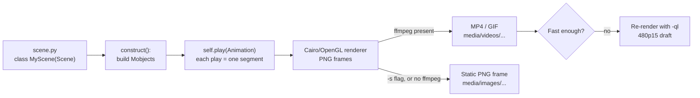

# Manim Animation Lab

Animation earns its keep when the **change** is the lesson — a swap, a rotation, a term moving across an
equation. This lab builds that locally with Manim Community Edition, per [`AGENTS.md`](../../../AGENTS.md).
**You will actually run these commands** — reading a Manim script teaches almost nothing.

## When to use

- A static diagram can't carry the idea because the *transition* is the point.
- The learner wants a reusable animation of an algorithm step, a transformation, or a proof rewrite, on an
  offline, free, no-account toolchain that produces files they own.
- **Don't** use it for a static structure or a data chart — use
  [visual-explainer](../visual-explainer/SKILL.md) or [data-viz-coach](../data-viz-coach/SKILL.md).

## First principles: the render pipeline



Two mental models make Manim click. **Mobject** = any drawable object (`Circle`, `Text`, `MathTex`,
`VGroup`). **Animation** = a function of time applied to Mobjects; `self.play(...)` renders one segment, so
your script's structure *is* the video's structure, and `Object.animate.shift(RIGHT)` turns any method
call into an animation.

| Flag | Meaning | Typical use |
| --- | --- | --- |
| `-ql` | low quality, 480p15 | every iteration while developing |
| `-qh` | high quality, 1080p60 | the final render only |
| `-s` | save the **last frame** as PNG, no video | the fallback when ffmpeg is missing |
| `--format=gif` | GIF instead of MP4 | embedding in a README or slide |

## Setup (free, local, offline after install)

```bash
python -m venv .venv
# Windows: .venv\Scripts\Activate.ps1     macOS/Linux: source .venv/bin/activate
pip install manim
manim --version        # confirm the install before writing a scene
```

**System dependencies, honestly:** Manim Community needs **ffmpeg** for video output (`winget install
Gyan.FFmpeg`, `brew install ffmpeg`, `apt install ffmpeg`) and a **LaTeX** distribution (MiKTeX or TeX Live)
*only* for `Tex` / `MathTex` — `Text` and `MarkupText` go through Pango. If either is missing, see step 6.

## Procedure

1. **Decide whether motion is required.** Write the one sentence the animation must convey ("the two bars
   exchange places, so the array becomes sorted at that pair"). If a still picture says it, stop here.
2. **Create the environment** with the commands above, inside the project — not a global install
   ([python-venv-lab](../python-venv-lab/SKILL.md)).
3. **Write `scene.py`** — start from Exercise A below: one `Scene` subclass, one `construct` method.
4. **Render a draft and watch it**: `manim -pql scene.py SquareToCircle` (`-p` previews when done) →
   `media/videos/scene/480p15/SquareToCircle.mp4`.
5. **Iterate on the timing**: `run_time=`, `self.wait(1)`, `rate_func=smooth|linear|there_and_back`. Slow
   the moment that carries the meaning; hurry the setup.
6. **Fallback — always have one.** No ffmpeg or LaTeX, or renders too slow to iterate?
   `manim -sql scene.py SquareToCircle` writes one PNG to `media/images/scene/` and needs no ffmpeg; swap
   `MathTex("x^2")` for `Text("x²")` to drop LaTeX. A still frame beats a broken pipeline every time.
7. **Export for the destination**: `manim -qh --format=gif scene.py SquareToCircle` for a README loop,
   `-qh` MP4 for slides. Commit the `.py`, `.gitignore` the `media/` folder.
8. **Explain what changed, in words**, and add alt-text — an animation without a caption is inaccessible.
   Then close with the **Learning Footer**.

## Exercise A — transformation (no LaTeX required)

```python
from manim import *

class SquareToCircle(Scene):
    def construct(self):
        title = Text("A square deforms continuously into a circle", font_size=28).to_edge(UP)
        square = Square(side_length=2, color=BLUE).set_fill(BLUE, opacity=0.4)
        circle = Circle(radius=1.2, color=YELLOW).set_fill(YELLOW, opacity=0.4)

        self.play(Write(title))
        self.play(Create(square))
        self.play(square.animate.rotate(PI / 4), run_time=1.5)
        self.play(Transform(square, circle), run_time=2)
        self.wait()
```

Run it: `manim -pql scene.py SquareToCircle` · still frame: `manim -sql scene.py SquareToCircle`.

## Exercise B — animate one algorithm step

```python
from manim import *

class BubbleSortSwap(Scene):
    def construct(self):
        data = [5, 2, 8, 1]
        bars = VGroup(*[
            Rectangle(width=0.8, height=0.5 * v, fill_opacity=0.8, color=BLUE) for v in data
        ]).arrange(RIGHT, buff=0.4, aligned_edge=DOWN).to_edge(DOWN, buff=1.5)
        labels = VGroup(*[
            Text(str(v), font_size=26).next_to(bar, UP, buff=0.15) for v, bar in zip(data, bars)
        ])

        self.play(Create(bars), Write(labels))
        focus = SurroundingRectangle(VGroup(bars[0], bars[1]), color=YELLOW)
        self.play(Create(focus))                       # compare a[0] and a[1]

        dx = bars[1].get_center()[0] - bars[0].get_center()[0]
        self.play(                                     # 5 > 2, so swap
            VGroup(bars[0], labels[0]).animate.shift(RIGHT * dx),
            VGroup(bars[1], labels[1]).animate.shift(LEFT * dx),
            run_time=1.5,
        )
        self.play(FadeOut(focus))
        self.wait()
```

Run it: `manim -pql scene.py BubbleSortSwap` · GIF: `manim -qh --format=gif scene.py BubbleSortSwap`.

## Output shape

```
Goal: <the one sentence the animation must convey>
Motion required? <yes — the change is the lesson | no — use a static diagram instead>
Scene: <ClassName> in scene.py    Mobjects: <Square, VGroup of Rectangles, Text ...>
Beats: 1) <setup>  2) <the moment that matters, slowed>  3) <resolution>
Setup:  python -m venv .venv && pip install manim
Draft:  manim -pql scene.py <ClassName>   -> media/videos/scene/480p15/<ClassName>.mp4
Final:  manim -qh scene.py <ClassName>    |  manim -qh --format=gif scene.py <ClassName>
Fallback: manim -sql scene.py <ClassName> -> media/images/scene/<ClassName>.png (no ffmpeg);
          LaTeX missing -> replace MathTex(...) with Text(...)
Run it yourself, then report: <what surprised you in the playback>
Caption + alt-text: <one line describing the change>   ·   Learning Footer
```

## Tips

- Iterate at `-ql`; a 1080p60 render of a scene you're still editing is wasted minutes.
- One idea per `Scene`. Several short scenes edit and re-render far better than one long one.
- `.animate` is sugar over the method call — `mob.animate.shift(RIGHT)`, not `mob.shift(RIGHT)` inside `play`.
- Manim interpolates *start* to *end*, so `mob.animate.rotate(2*PI)` can look like no motion — rotate in
  halves, or use `Rotate(mob, angle=2*PI)`.
- LaTeX errors from `MathTex` are almost always a missing TeX install, not bad Python — test with `Text` first.
- `media/` is generated output: `.gitignore` it, commit the scene source
  ([diagram-as-code-coach](../diagram-as-code-coach/SKILL.md)), and claim nothing you haven't played back
  (`AGENTS.md`) — verify by watching the render, not by reading the code.
- Pair with [algorithm-visualizer](../algorithm-visualizer/SKILL.md),
  [visual-explainer](../visual-explainer/SKILL.md), [data-viz-coach](../data-viz-coach/SKILL.md),
  [math-for-programming-coach](../math-for-programming-coach/SKILL.md), and
  [whiteboard-explainer](../whiteboard-explainer/SKILL.md).
  End with the **Learning Footer** (`AGENTS.md`).
