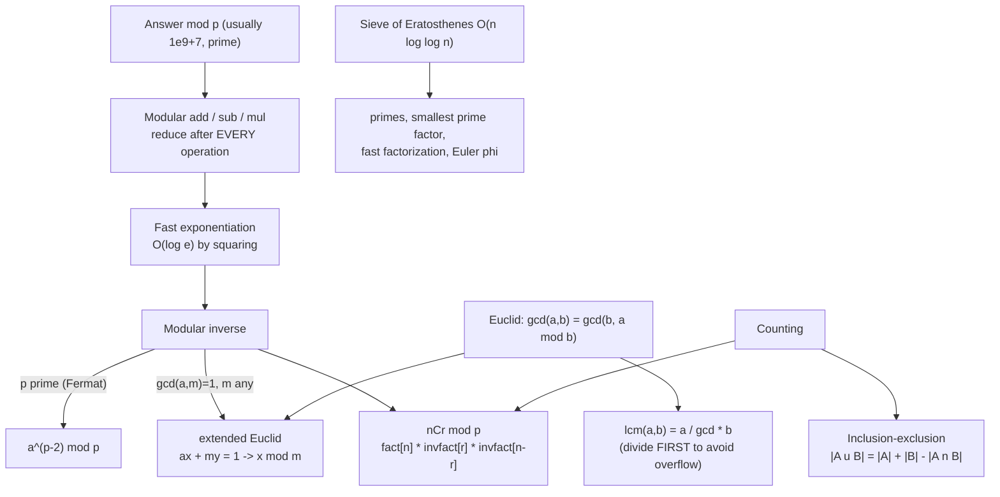

# Math for Programming Coach

Contest math is a small toolkit used constantly: **work in a ring, never overflow, and count without
enumerating**. Derive each tool, don't hand over a snippet, per [`AGENTS.md`](../../../AGENTS.md).
Pairs with [dynamic-programming-coach](../dynamic-programming-coach/SKILL.md),
[bit-manipulation-coach](../bit-manipulation-coach/SKILL.md), and
[cryptography-basics-coach](../cryptography-basics-coach/SKILL.md) (which uses the same modular machinery).

## When to use

- "Answer modulo 10⁹+7" appears in a problem and the learner isn't sure *where* to apply the mod.
- A result is negative, or wrong only for huge inputs — a mod or overflow bug.
- They need `nCr mod p`, a modular inverse, primes up to 10⁶, or a counting argument.
- A DP transition needs modular arithmetic and they're reducing in the wrong place.

## The toolkit map



## Modular arithmetic from first principles

Working "mod m" means keeping only the remainder. It is a **ring homomorphism**: reducing early never changes
the final answer for `+`, `-`, `*`. It does **not** distribute over division — that is why inverses exist.

| Operation | Rule | Trap |
| --- | --- | --- |
| Add | `(a + b) % m` | Reduce *both* operands first if they can already be near `m` |
| Subtract | `((a - b) % m + m) % m` | **Negative mod**: C/C++/Java/Go give `-3 % 5 == -2`; Python gives `3`. Always add `m` back |
| Multiply | `(a * b) % m` | `a*b` overflows 32-bit at ~46 341 and 64-bit at ~3·10⁹ — cast to 64-bit (or 128-bit for m near 2⁶²) |
| Power | binary exponentiation, O(log e) | Naive looping is O(e) and hopeless for `e ≈ 10¹⁸` |
| Divide | multiply by the **modular inverse** | `(a / b) % m ≠ (a % m) / (b % m)`. There is no plain division mod m |

```python
def power(base, exp, mod):
    """base^exp % mod in O(log exp). Invariant: result * base^exp == answer (mod)."""
    result, base = 1, base % mod
    while exp > 0:
        if exp & 1:            # this bit is set -> fold the current square in
            result = result * base % mod
        base = base * base % mod
        exp >>= 1
    return result
```

Worked mini-example: `3^13 mod 7`. `13 = 1101₂`. Squares mod 7: `3, 2, 4, 2`. Bits set at positions 0, 2, 3 →
`3 · 4 · 2 = 24 ≡ 3 (mod 7)`. Direct check: `3^13 = 1 594 323 = 227 760·7 + 3` ✓. Always confirm a derivation
like this with `#run` (`learningos_runcode`) rather than trusting the arithmetic on the page.

## gcd, lcm, extended Euclid, inverses

- **Euclid**: `gcd(a, b) = gcd(b, a mod b)`, base `gcd(a, 0) = a`. O(log min(a,b)) — the worst case is
  consecutive Fibonacci numbers.
- **lcm**: `a / gcd(a,b) * b` — divide **before** multiplying or you overflow for no reason.
- **Extended Euclid** returns `(g, x, y)` with `a·x + b·y = g`. When `g = 1`, `x mod m` is the inverse of `a`
  mod `m`. This works for **any** modulus coprime to `a`.
- **Fermat's little theorem**: if `p` is prime and `a % p ≠ 0`, then `a^(p-1) ≡ 1`, so `a⁻¹ ≡ a^(p-2) mod p`.
  Simplest choice when the modulus is prime (10⁹+7 and 998 244 353 both are).

| Need an inverse when… | Use | Cost | Condition |
| --- | --- | --- | --- |
| Modulus is prime | Fermat: `power(a, p-2, p)` | O(log p) | `a % p ≠ 0` |
| Modulus is composite | Extended Euclid | O(log m) | `gcd(a, m) = 1` |
| Inverses of `1..n` all at once | `inv[i] = -(m/i) * inv[m % i] % m` | O(n) | `m` prime |
| Inverse factorials `0..n` | `invfact[n] = power(fact[n], p-2, p)`, then walk down `invfact[i-1] = invfact[i] * i` | O(n + log p) | `p` prime |

## Primes

```python
def sieve(n):
    """Smallest-prime-factor sieve: primality AND O(log x) factorization. O(n log log n)."""
    spf = list(range(n + 1))
    i = 2
    while i * i <= n:
        if spf[i] == i:                       # i is prime
            for j in range(i * i, n + 1, i):  # start at i*i: smaller multiples already marked
                if spf[j] == j:
                    spf[j] = i
        i += 1
    return spf
```

- **Sieve** — all primes ≤ n in O(n log log n) time, O(n) memory. Practical to ~10⁷–10⁸.
- **Trial division primality** — test divisors up to `√x`, skipping evens after 2: O(√x). Fine for a handful
  of queries or `x ≤ 10¹²`.
- **Miller–Rabin** — deterministic for 64-bit integers with a known fixed base set; reach for it when `x` is
  huge and a sieve is impossible. Verify the base set against a primary source before using it.
- The **spf** sieve above factorizes any `x ≤ n` in O(log x) by repeatedly dividing by `spf[x]` — strictly
  better than re-running trial division per query.

## Combinatorics and counting

- `nCr = n! / (r!(n-r)!)`; `nCr = nC(n-r)`; **Pascal's rule** `C(n,r) = C(n-1,r-1) + C(n-1,r)` gives an
  O(n²) DP table — perfect when `n ≤ ~5000` and no modulus inverse is available.
- **nCr mod p (p prime, p > n)**: precompute `fact[0..n]` and `invfact[0..n]` once in O(n), then every query is
  `fact[n] * invfact[r] % p * invfact[n-r] % p` in O(1).
- If `p ≤ n`, factorials contain `p` and the inverse doesn't exist — use **Lucas' theorem** (or CRT for
  prime-power moduli).
- **Inclusion–exclusion**: `|A ∪ B ∪ C| = Σ|Aᵢ| − Σ|Aᵢ∩Aⱼ| + |A∩B∩C|`. Signs alternate with subset size;
  with `n ≤ 20` sets, enumerate subsets with a bitmask
  ([bit-manipulation-coach](../bit-manipulation-coach/SKILL.md)). Classic use: count integers ≤ N divisible by
  none of a given prime set.
- Stars and bars: non-negative integer solutions of `x₁+…+x_k = n` is `C(n+k-1, k-1)`.

## Procedure

1. **Identify the ring**: is the answer mod a prime, mod a composite, or exact? That single fact chooses your
   inverse strategy and whether big integers are needed.
2. **Write the formula mathematically first**, then translate — reducing mod `m` after *every* `+`, `−`, `*`,
   and replacing every `/` with a multiplication by an inverse.
3. **Do the overflow audit**: what is the largest intermediate value? `(10⁹)² ≈ 10¹⁸` fits in signed 64-bit
   (max ≈ 9.22·10¹⁸) but two such products do not. Cast before multiplying, not after.
4. **Pick the algorithm** from the tables and state its complexity against the constraints
   ([complexity-analyzer](../complexity-analyzer/SKILL.md)).
5. **Work a tiny numeric example by hand** (small modulus like 7 or 13) so the learner sees the machinery,
   then confirm with a brute-force computation.
6. **Verify with `#run`** on real inputs, always including: `0`, `1`, a negative operand, `r > n`, `r = 0`,
   `n = 0`, the maximum allowed value, and a randomized cross-check against a slow brute force for small n.
   Modular bugs are invisible until the input is large — execute, don't assume.
7. **Precompute once, query many** — factorials, inverse factorials, sieves, and inverse tables belong outside
   the query loop.
8. **Route onward**: counting DP with modular transitions →
   [dynamic-programming-coach](../dynamic-programming-coach/SKILL.md); the same modular arithmetic in
   security contexts → [cryptography-basics-coach](../cryptography-basics-coach/SKILL.md); timed practice →
   [competitive-programming-drill](../competitive-programming-drill/SKILL.md).

## Output shape

```
Math plan — <problem or formula>

Ring: mod <p = 1e9+7, prime | composite m | exact integers>
Formula (math):  <ans = n! / (r! (n-r)!) ...>
Formula (code):  fact[n] * invfact[r] % p * invfact[n-r] % p

Tools used: <fast pow | ext-Euclid inverse | sieve | inclusion-exclusion>
Inverse strategy: <Fermat a^(p-2) because p is prime | ext-Euclid because gcd(a,m)=1>

Overflow audit: max intermediate = <value> -> fits in <int64 | needs 128-bit / big-int>
Negative-mod guard: ((a - b) % m + m) % m   applied at <where>

Hand example (small modulus): <3^13 mod 7 = 3 — squares 3,2,4,2; bits 1101 -> 3*4*2 = 24 = 3>

Precomputation: <fact/invfact to n> in O(n); per query O(1)
Complexity: O(<...>) time / O(<...>) space

#run check: n=0 | r=0 | r>n | negative operand | max n | random cross-check vs brute force (n<=12)
             -> real outputs -> PASS/FAIL

Next: <dynamic-programming-coach | cryptography-basics-coach | drill>
```

## Tips

- Reduce mod `m` after **every** operation, not just at the end — one unreduced multiply is enough to overflow.
- The negative-mod trap is language-specific: `-3 % 5` is `-2` in C/C++/Java/Go/JS and `3` in Python. Write
  `((a % m) + m) % m` and stop thinking about it.
- `10⁹+7` and `998 244 353` are prime — that's *why* Fermat's inverse works. If the modulus isn't prime, that
  shortcut silently produces garbage.
- Compute lcm as `a / gcd(a,b) * b`; the naive `a*b/gcd` overflows for inputs that the correct form handles.
- Start the sieve's inner loop at `i*i`, and use a smallest-prime-factor sieve when you also need factorization.
- `nCr` overflows fast: `C(60,30) ≈ 1.18·10¹⁷` still fits in 64-bit, `C(70,35)` does not. If there's no
  modulus, ask whether big integers are required.
- Precompute factorials and inverse factorials **once**; recomputing `power(fact[r], p-2, p)` per query turns
  an O(1) answer into O(log p) for no reason.
- Never present arithmetic you haven't executed — verify every derivation with `#run` on real numbers.
- Use original examples only — never reproduce paywalled problem statements from LeetCode, Codeforces,
  HackerRank, or CodeChef; link out to those platforms to practise.
- End with the **Learning Footer** (`AGENTS.md`).
