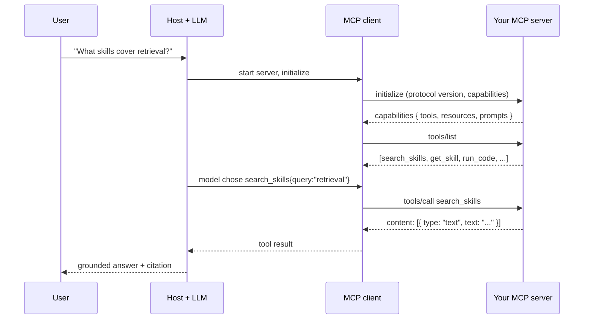

# MCP Server Builder

Turn a capability you already have into something **any** MCP client can use — teaching the protocol's
model, not just the boilerplate — per the principles in [`AGENTS.md`](../../../AGENTS.md).
The worked example is this repo's own server, `mcp/` (`learningos-drona`): **9 tools, 2 resources,
3 prompts, stdio transport, SSRF-guarded fetches**.

## When to use

- The learner has a database, an API, a script, or a corpus and wants an assistant to *use* it.
- They are copy-pasting the same context into a chat window every day and want it exposed as a resource.
- They built tools inside one agent framework and now want them portable across clients.
- They have an MCP server that "connects but shows no tools" and need to debug the handshake.
- Not for: designing the *agent* that consumes the tools → [agent-designer](../agent-designer/SKILL.md);
  coordinating several agents → [multi-agent-orchestration-coach](../multi-agent-orchestration-coach/SKILL.md).

## The mental model

MCP (specification at **modelcontextprotocol.io**, from Anthropic) is a **client–server protocol over
JSON-RPC 2.0**. A *host* application (Claude Desktop, VS Code, Cursor) runs an MCP *client* per server;
your server advertises capabilities during `initialize`, then answers `tools/list`, `tools/call`,
`resources/list`, `resources/read`, `prompts/list`, `prompts/get`.



## Tools vs. resources vs. prompts

The single most common design mistake is making everything a tool. Choose by **who initiates** and
**whether it has side effects**.

| Primitive | Controlled by | Side effects? | Shape | Use it for |
| --- | --- | --- | --- | --- |
| **Tool** | The *model* decides to call it | May read **or** write | name + input schema + handler → `content[]` | Search, query, compute, create, send |
| **Resource** | The *application/user* attaches it | Read-only, idempotent | URI (`scheme://path`) + mimeType → `contents[]` | Files, docs, config, a catalog, a constitution |
| **Prompt** | The *user* picks it (slash command) | None | name + args schema → seeded `messages[]` | Reusable workflows, personas, templates |

In `learningos-drona`: `search_skills` / `run_code` are **tools** (the model decides when to search or
execute); `learningos://constitution` and `learningos://catalog` are **resources** (stable, read-only
documents a user attaches); `drona` / `teach` / `plan` are **prompts** (a human invokes them).

## Transports

| | **stdio** | **Streamable HTTP** |
| --- | --- | --- |
| How | Host spawns your process; JSON-RPC over stdin/stdout | Client POSTs JSON-RPC to an endpoint; server may stream events back |
| Best for | Local tools, filesystem/DB access, dev machines | Remote/shared servers, multi-user, hosted SaaS |
| Auth | Inherits the local user | Needs real auth (e.g. OAuth) + origin checks |
| Gotcha | **Anything printed to stdout corrupts the protocol** — log to stderr | Session management, CORS, DNS-rebinding protection |
| Scaling | One process per client | One deployment, many clients |

Default to **stdio** while learning: no ports, no auth, no CORS. `learningos-drona` is stdio and routes
every diagnostic to `console.error` for exactly that reason.

## Procedure

1. **Name the capability and the audience.** Write one sentence: *"An assistant should be able to ___ on
   behalf of ___."* If you cannot, you are not ready to write schemas.
2. **Inventory the surface**, then classify each item with the table above. Aim for **few, well-named
   tools** — every tool is permanent context the model must read on every turn.
3. **Design each tool's contract** like an API you can never change: a verb-first snake_case name, a
   description written *for the model* (say when **not** to call it), and a typed input schema with
   required vs. optional fields and enums for closed sets. Deep dive:
   [function-calling-coach](../function-calling-coach/SKILL.md).
4. **Implement handlers.** With the official TypeScript SDK the shape is `server.registerTool(name,
   { title, description, inputSchema }, handler)`, where the handler returns
   `{ content: [{ type: "text", text }] }`. Resources are `registerResource(name, uri, meta, reader)`
   returning `{ contents: [...] }`; prompts are `registerPrompt(name, meta, builder)` returning
   `{ messages: [...] }`. Python and other SDKs mirror these three registrations.
5. **Validate every input at the boundary.** Arguments are model-generated text — treat them as
   untrusted. Parse with a schema library (this repo uses `zod`), bound sizes and limits, and reject
   rather than silently coerce.
6. **Apply security hygiene** (where most servers fail):
   - **SSRF-guard** any URL the model supplies — refuse loopback, private, link-local, and
     cloud-metadata addresses, and **re-validate on every redirect hop**, exactly as the repo's
     `mcp/src/net.ts` does for `fetch_page` and `tech_news`.
   - Path-normalize file access and confine it to a configured root (`LEARNINGOS_ROOT` in the example).
   - Read credentials from environment/secret storage — never from tool arguments, never echoed back.
   - Make destructive tools explicit, narrow, and ideally human-approved; see
     [prompt-injection-defense](../prompt-injection-defense/SKILL.md), because tool output re-entering
     the model is an injection surface.
7. **Smoke-test before wiring a client.** Drive the server over stdio with a tiny script: `initialize` →
   `tools/list` → a real `tools/call`, asserting on the result — precisely what `npm test` does in
   `mcp/`. Verify snippets with `#run` (`learningos_runcode`) when you want real output, not a guess.
8. **Wire it into clients** — one server, three config files: Claude Desktop
   (`claude_desktop_config.json`), VS Code (`.vscode/mcp.json` with `"type": "stdio"`), Cursor
   (`~/.cursor/mcp.json`) — each a command + args + optional env. Restart the host; a server that fails
   `initialize` disappears silently.
9. **Iterate on descriptions.** If the model calls the wrong tool, the bug is almost always the
   *description*, not the code.

## Output shape

```
MCP server design — <capability>

Capability: an assistant should be able to <verb> on behalf of <user>
Transport: stdio | streamable HTTP  — because <local vs. shared, auth need>

Surface:
  tools:
    - <verb_noun>(<arg>: <type>, <arg?>: <enum>) -> text|json   # side effects: <none|writes X>
      description-for-the-model: "<when to call, when NOT to call>"
  resources:
    - <scheme>://<path>  (<mimeType>) — <what it is>
  prompts:
    - /<name>(<args>) — <workflow it seeds>

Validation & safety:
  - inputs: <schema, bounds, enums>
  - network: <SSRF guard, allowlist, redirect re-validation>
  - secrets: <env only, never in args/results>
  - destructive ops: <gated how>

Smoke test:
  initialize -> tools/list (<n> tools) -> tools/call <tool> -> <real result> = PASS/FAIL

Client wiring: Claude Desktop | VS Code (.vscode/mcp.json) | Cursor — command + args + env
Next: <agent-designer | function-calling-coach | prompt-injection-defense>
```

## Tips

- **stdout is the protocol.** One stray `print`/`console.log` breaks JSON-RPC framing and the server
  appears to "connect but do nothing". Log to stderr.
- Tool descriptions *are* prompt engineering: the model reads them, so state trigger conditions and
  anti-conditions. Vague descriptions cause wrong-tool calls far more often than buggy code.
- Prefer **10 sharp tools over 40 fuzzy ones** — every listed tool costs context on every turn.
- Return **useful errors as content**, not process crashes: a model recovers from
  `"no results for X; try a broader query"`, never from a dead pipe.
- Version your server and keep old tool names working; clients cache nothing, but users build habits.
- Test headlessly (a scripted stdio client) *before* blaming the host app — it separates protocol bugs
  from configuration bugs.
- Trust boundary: everything a tool *returns* is later read by the model, so treat scraped or
  third-party text as data, never instructions →
  [prompt-injection-defense](../prompt-injection-defense/SKILL.md).
- Route onward to [agent-designer](../agent-designer/SKILL.md) for the consuming agent, or
  [multi-agent-orchestration-coach](../multi-agent-orchestration-coach/SKILL.md) when several agents
  share the server. End with the **Learning Footer** (`AGENTS.md`).
