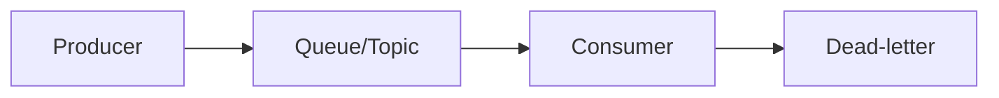

# Message Queue Coach

Design async messaging so the learner reasons about delivery and failure, not just plumbing — per
[`AGENTS.md`](../../../AGENTS.md). Complements [system-design-drill](../system-design-drill/SKILL.md).

## When to use

- Decoupling producers from consumers, smoothing spikes, or fanning out events reliably.
- Pairs with [api-design-review](../api-design-review/SKILL.md) and [system-design-drill](../system-design-drill/SKILL.md).

## Procedure

1. **Clarify the workflow** — one consumer or many? replay needed? ordering required? throughput and
   latency targets? These pick the model.
2. **Choose the model** — **queue** (work distribution, one consumer wins), **pub/sub** (fan-out to
   many), or **log/stream** (ordered, replayable): e.g. SQS vs. SNS vs. Kafka.
3. **Pick a delivery guarantee** — at-most-once (may drop), at-least-once (may dup, the common default),
   or effectively-once (at-least-once **+ idempotent** consumers). True exactly-once is rare.
4. **Idempotency & ordering** — dedupe on a message/business key; use a partition key for per-key order,
   accepting the ordering↔parallelism trade-off.
5. **Handle failure** — retries with backoff, visibility timeout, and a **dead-letter queue** for poison
   messages; alert on DLQ depth.
6. **Manage backpressure** — bounded queues, monitor consumer lag, and choose shed/drop vs. buffer.

## Output shape


```
Workflow: consumers … replay … ordering …
Model: queue/pubsub/stream (why) | guarantee: at-least-once + idempotent
Idempotency key: … | partition/order: …
Failure: retry/backoff → DLQ | backpressure: lag/shed …
```

## Tips

- Cite Kafka / SQS / AMQP docs with dates; don't promise exactly-once a broker can't give.
- Design every consumer to be **idempotent** — assume redelivery will happen.
- End with the **Learning Footer** (`AGENTS.md`).
