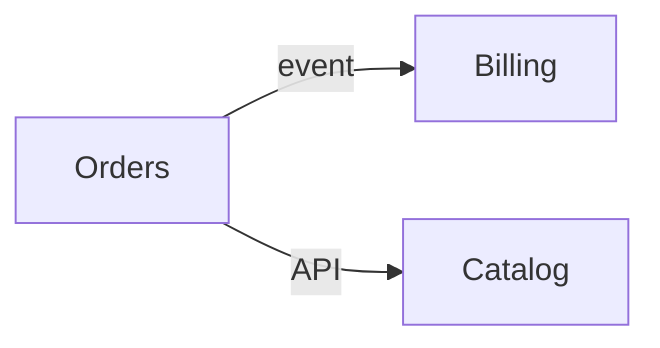

# Microservices Decomposer

Decompose honestly — the right answer is often *not yet* — teaching boundaries and their cost per
[`AGENTS.md`](../../../AGENTS.md). Complements [system-design-drill](../system-design-drill/SKILL.md) and [adr-writer](../adr-writer/SKILL.md).

## When to use

- Weighing whether to split a monolith, or defining service boundaries in a new system.
- Pairs with [api-design-review](../api-design-review/SKILL.md) and [data-modeling-drill](../data-modeling-drill/SKILL.md).

## Procedure

1. **Question the split first** — a **modular monolith** is often right; microservices buy independent
   deploy and scaling at a real operational cost. State honestly whether the pain justifies it.
2. **Find boundaries via DDD** — split by **bounded context** / business capability, not by technical
   layer; keep tightly-coupled logic (aggregates) together to minimize chatty calls.
3. **Assign data ownership** — each service owns its data; **no shared database**. Other services read
   it only through its API or events.
4. **Choose sync vs. async** — request/response (simple, but coupling + latency) vs. events (decoupled,
   but eventual consistency); prefer async across contexts.
5. **Handle distributed data** — use **sagas** for cross-service workflows instead of 2-phase commit;
   embrace eventual consistency and idempotent handlers.
6. **Count the cost** — network failure, observability, deploy/CI, and testing. Migrate incrementally
   with the **strangler-fig** pattern, not a big-bang rewrite.

## Output shape


```
Split? yes/no + why (or stay modular monolith)
Contexts: … → services … | data owner each
Comms: sync/async per edge | consistency: saga/eventual
Cost: ops/observability/testing | migration: strangler-fig
```

## Tips

- Cite DDD (Evans), Fowler's MicroservicesPremium, and the strangler-fig pattern with dates.
- "Don't distribute until the monolith hurts" — distribution multiplies failure modes; weigh it openly.
- End with the **Learning Footer** (`AGENTS.md`).
