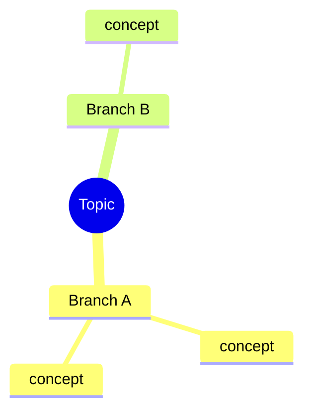

# Mind Map

Show the shape of a topic so the learner can see structure before detail — following
[`AGENTS.md`](../../../AGENTS.md).

## When to use
- The learner wants the big picture of a topic, or to organize it before deep study.
- Planning a learning order (which branch first).

## Procedure
1. Identify the **central topic**.
2. Break it into **4–7 main branches** (the major themes).
3. Add **sub-nodes** (2–5 per branch) — the key concepts.
4. Note **cross-links** (concepts that connect across branches).
5. Render as a Mermaid `mindmap` (or `flowchart` if links matter), then add a short **outline**.
6. Suggest a **study order** through the branches (prerequisites first).

## Output shape
````

````
Then: a bullet outline + suggested study order + a next step (e.g. `/concept-explainer` on branch A).

## Tips
- Keep node labels short; one idea per node.
- Facts must be correct; don't invent structure you can't justify.
- Pair with `learning-roadmap` (sequence) and `concept-explainer` (go deep). End with the **Learning
  Footer** (`AGENTS.md`).
