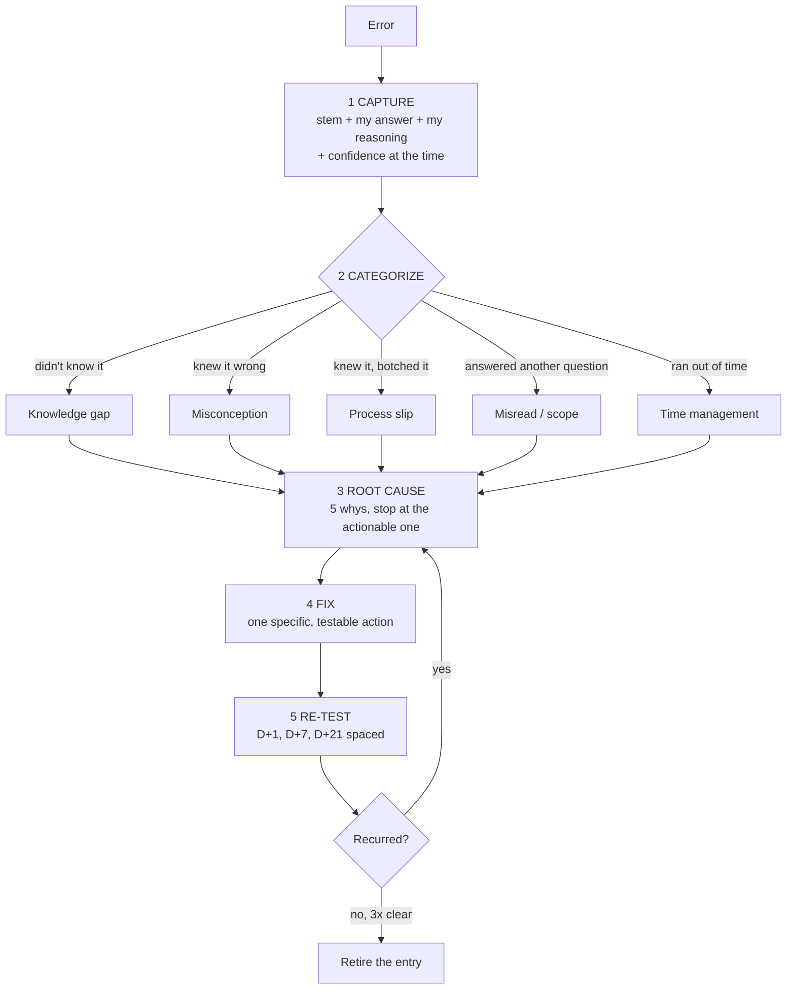

# Mistake Log Coach

An unexamined wrong answer teaches nothing; a categorized, root-caused, re-tested one is the highest-
yield study material a learner owns. This skill builds and runs that log, in the rigorous spirit of
[`AGENTS.md`](../../../AGENTS.md).

## When to use

- The same error type keeps reappearing across weeks of practice, exams, or code review.
- A practice exam is finished and the learner is about to "just do another one" without a post-mortem.
- Time is short and study must be aimed at demonstrated weaknesses, not at whole chapters.
- Don't use it to *generate* practice items — that's [quiz-generator](../quiz-generator/SKILL.md) and
  [item-writing-coach](../item-writing-coach/SKILL.md); this skill processes what already went wrong.

## First principles: not all mistakes are the same disease

A miss caused by never having learned something needs *instruction*. A miss caused by a confidently-held
wrong model needs *confrontation* — and, crucially, high-confidence errors are the ones learners never
flag, which is why the calibration signal matters (see
[confidence-calibration-coach](../confidence-calibration-coach/SKILL.md); Kruger & Dunning, 1999).
Encouragingly, the *hypercorrection effect* (Butterfield & Metcalfe, 2001) shows that errors committed
with **high** confidence are corrected especially well **once feedback arrives** — the surprise itself
aids memory. Each corrected item then re-enters retrieval practice, where the testing effect (Roediger &
Karpicke, 2006) and the spacing effect do the durable work.



| Category | Diagnostic question | Wrong fix (common) | Right fix |
| --- | --- | --- | --- |
| **Knowledge gap** | "Had I ever seen this?" | re-read the whole chapter | one atomic retrieval cue + spaced reps |
| **Misconception** | "Was I confident and wrong?" | more practice of the same type | confront the belief with a contrasting case, then re-explain |
| **Process slip** | "Would I catch it on a second pass?" | "be more careful" | a written checklist step at the exact failure point |
| **Misread / scope** | "Did I answer a different question?" | speed up | restate the question in your own words before solving |
| **Selection error** | "Right method, wrong choice?" | drill the method harder | discrimination practice — [interleaving-planner](../interleaving-planner/SKILL.md) |
| **Time management** | "Did I know it but run out of clock?" | study more content | timed sectioning and a skip rule |

**Trade-off to say out loud:** logging costs 3–5 minutes per error. Log every miss on a mock exam and
every *repeat* miss in daily practice; logging trivial one-off typos is overhead with no return.

## Procedure

1. **Capture within 24 hours**, while the reasoning is still recoverable. Record the learner's *actual
   reasoning*, not just the wrong letter — the reasoning is the diagnostic evidence.
2. **Record confidence at the time of the error** (0–100 %). High confidence + wrong ⇒ misconception,
   and per the hypercorrection effect, it is also the most fixable once confronted.
3. **Categorize with exactly one primary tag** from the table; a second tag is allowed but the fix
   follows the primary.
4. **Root-cause with 5 whys**, stopping at the first *actionable* cause. "I didn't study enough" is
   never actionable; "I never learned that Endpoints are separate objects" is.
5. **Write one specific, testable fix.** Ban "revise this topic" — prefer "add a cue: what object does
   a Service select on, and what breaks if the selector doesn't match?"
6. **Schedule the re-test** at D+1, D+7, D+21. Any recurrence resets the entry to D+1 and reopens the
   root cause — the fix was wrong, not the learner.
7. **Retire an entry** after three consecutive clean re-tests at increasing intervals.
8. **Review the log weekly by category** — the *dominant category* dictates next week's study mode, then
   close with the **Learning Footer**.

## Output shape

```
Log entry: <ID>   Date: <YYYY-MM-DD>   Source: <mock exam | lab | code review | daily practice>
Item: <question or task, one line>
My answer: <what I did>          Correct: <what was right>
My reasoning at the time: <verbatim>          Confidence then: <0-100%>
Category: <knowledge gap | misconception | process slip | misread | selection error | time>
Root cause (5 whys -> actionable): <the one sentence that is fixable>
Fix (specific + testable): <action>
Re-test: D+1 <date> <pass/fail> · D+7 <date> <pass/fail> · D+21 <date> <pass/fail>
Status: <open | recurring (n=<n>) | retired>
--- weekly roll-up ---
Counts by category: gap <n> · misconception <n> · slip <n> · misread <n> · selection <n> · time <n>
Dominant category -> study mode this week: <instruction | confrontation | checklist | interleaving>
Next: <retrieval-practice-coach | misconception-buster | interleaving-planner>
Learning Footer
```

## Worked example — post-mortem of a 40-question mock exam (11 misses)

| ID | Item (abbrev.) | Conf. | Category | Root cause (actionable) | Fix | Re-test |
| --- | --- | --- | --- | --- | --- | --- |
| M-01 | Service returns 502 | 90 % | misconception | believed Endpoints are auto-correct regardless of selector | contrast case: matching vs mismatched selector, both inspected with `kubectl get endpoints` | D+1 ✓ D+7 ✓ |
| M-02 | `kubectl` field selector syntax | 30 % | knowledge gap | never learned the syntax | atomic cue card + 3 spaced reps | D+1 ✓ D+7 ✓ D+21 ✓ retired |
| M-03 | Chose t-test, needed chi-square | 75 % | selection error | no cue for "counts vs means" | discrimination pair drill ×6 | D+1 ✗ → reopened |
| M-04 | Off-by-one in CIDR mask | 80 % | process slip | mental arithmetic under time pressure | write the binary boundary before answering | D+1 ✓ |
| M-05 | Answered "not required" as "required" | 85 % | misread | skipped the negation in the stem | underline the negation, restate the ask | D+1 ✓ |
| M-06…M-11 | last 6 items blank | — | time | spent 14 min on Q12 | skip rule: > 90 s ⇒ flag and move on | next mock |

Weekly roll-up: misconception 1 · gap 1 · slip 1 · misread 1 · selection 1 · **time 6**. The dominant
category is *time*, not knowledge — so this week's fix is a timed sectioning drill and a skip rule, not
more content. M-03 recurred, so its root cause was re-opened: the real cause was "I match on the word
*compare*", which is a surface cue, and it moved to
[interleaving-planner](../interleaving-planner/SKILL.md).

## Tips

- **Log the reasoning, not just the answer** — the wrong letter is the symptom; the reasoning is the
  disease.
- A recurrence means the *fix* was wrong. Reopen the root cause instead of blaming effort.
- "Revise topic X" is not a fix. If you can't re-test it in 60 seconds, it isn't specific enough.
- Confidence at the time of the error is the cheapest diagnostic you can collect — capture it always.
- Count categories weekly; a log dominated by *time* or *misread* means content study is the wrong lever.
- Pair with [misconception-buster](../misconception-buster/SKILL.md) for confrontation cases,
  [retrieval-practice-coach](../retrieval-practice-coach/SKILL.md) for the re-test schedule,
  [debugging-coach](../debugging-coach/SKILL.md) for code errors,
  [exam-strategy-coach](../exam-strategy-coach/SKILL.md) for timing rules, and
  [progress-tracker](../progress-tracker/SKILL.md) to watch recurrence fall.
  End with the **Learning Footer** (`AGENTS.md`).
