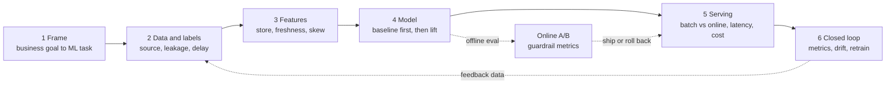

# ML System Design Drill

One timed applied-ML design round: **problem framing → data & labels → features → model → serving →
monitoring & retraining**, scored against a rubric — per [`AGENTS.md`](../../../AGENTS.md).
Distinct from [system-design-drill](../system-design-drill/SKILL.md) (which stops at the serving tier)
and [ml-pipeline-designer](../ml-pipeline-designer/SKILL.md) (which builds a real pipeline, untimed).

## When to use

- The learner has an applied-ML / MLE / research-engineer loop with a dedicated "ML design" round.
- They can train a model but freeze when asked "how would you *ship* this and know it still works?"
- They want reps on the parts candidates most often skip: label definition, train/serve skew,
  offline↔online metric mismatch, drift, and the cost/latency budget.

## The six stages (and where candidates lose points)



**The loop is the answer.** A candidate who draws the dotted feedback arrows — logged predictions become
tomorrow's labels, online results gate the next model — reads two levels more senior than one who stops
at "then we deploy the model."

## Decision table — the four forks every answer must resolve

| Fork | Option A | Option B | Choose A when… | Choose B when… |
| --- | --- | --- | --- | --- |
| **Serving mode** | Batch / precomputed scores | Online (real-time) inference | Inputs change slowly, candidate set is small, p99 budget is generous | Features depend on the live request (session, cart, device) |
| **Model family** | Simple baseline (logistic regression, GBDT) | Deep model (two-tower, sequence, transformer) | Tabular, modest data, interpretability or fast iteration matters | Huge sparse/embedding data, text/image/sequence signal, retrieval at scale |
| **Label source** | Explicit (purchase, chargeback, rating) | Implicit (click, dwell, skip) | Ground truth exists and is cheap to join | Explicit labels are rare or delayed — accept the bias and say so |
| **Retraining** | Scheduled (daily/weekly) | Triggered (drift or metric regression) | Traffic is stationary and pipelines are cheap | Seasonality or adversaries move fast and drift detection is trusted |

**Offline vs. online metrics — never conflate them.**

| Layer | Examples | What it can prove | Blind spot |
| --- | --- | --- | --- |
| Offline (held-out) | AUC-PR, NDCG@k, RMSE, calibration | The model ranks/predicts better than the incumbent on past data | Feedback loops, position bias, distribution shift, UX effects |
| Online (A/B) | CTR, conversion, revenue/session, complaint rate | Real user impact under real serving conditions | Slow, needs statistical power, can't test every variant |
| Guardrail | p99 latency, cost per 1k predictions, fairness slices, error rate | The win didn't come at an unacceptable price | Only catches what you thought to measure |

## Procedure

1. **Set the round.** Confirm scenario (use an **original** scenario — never a real company's proprietary
   prompt), level, and a **35–45 min** budget. Present one prompt with a business goal and no numbers yet.
2. **Require clarifying questions first (~5 min).** Reward pinning down: who is the user, what action follows
   the prediction, scale (DAU, QPS, candidate-set size), latency budget, cost ceiling, and what "success"
   means to the business. Answer only what is asked.
3. **Frame the ML task.** Push for the explicit mapping: business metric → ML objective → *label* → unit of
   prediction. Probe label delay (a chargeback lands 60 days later), label noise, and leakage.
4. **Data & features.** Ask for sources, joins, and freshness. Force the train/serve skew question: is the
   feature computed the same way in training and at request time? Introduce the **feature store** as the
   answer — one definition, an offline table for training plus an online store for serving, with
   point-in-time correct joins.
5. **Model.** Insist on a **baseline** (heuristic or simple model) before anything deep, plus how the learner
   would measure lift over it. Ask for the offline eval protocol: split by **time**, not randomly, whenever
   the data is temporal.
6. **Serving.** Have them draw the inference path — request → feature fetch → candidate generation →
   ranking → business rules → response — with the latency budget split per hop and a cost-per-1k estimate.
7. **Close the loop.** Require logging of features + predictions + outcomes, drift detection (input
   distribution, prediction distribution, label lag), an A/B design with guardrails, a retraining cadence,
   and a **rollback** plan (shadow → canary → ramp).
8. **Stress it.** Ask two: "the model degrades silently — what fires first?", "10× traffic at half the
   latency budget — what changes?", "your best feature becomes unavailable — what now?"
9. **Score against the rubric**, give one **model answer** sketch, name the single top improvement, then set
   one **targeted follow-up** that attacks the lowest-scoring dimension only.

## Output shape

```
ML Design Round — <original scenario> (<level> · <time>)

Prompt: <business goal, no metrics given>
Clarifying Qs asked → answers given: …

--- Candidate's design (as captured) ---
Framing:  business metric <X> -> ML task <classification|ranking|regression>; label = <...>; horizon <...>
Data:     sources <...> | label delay <...> | leakage risks <...>
Features: <top 5> | store: offline <table> / online <kv> | point-in-time correct: yes/no
Model:    baseline <...> -> candidate <...> | eval: time-based split, <metric>
Serving:  <batch|online> | p99 <Xms> = fetch <a> + rank <b> + post <c> | ~$<Y>/1k preds
Loop:     log <features+preds+outcomes> | drift <PSI/KS on inputs, pred dist> | retrain <cadence|trigger>
          A/B: primary <metric>, guardrails <latency, cost, fairness slice> | rollback shadow->canary->ramp

--- Scored rubric (1–5 each) ---
| Dimension                         | Score | Evidence                          |
|-----------------------------------|-------|-----------------------------------|
| Problem framing & label design    |  _/5  | …                                 |
| Data, leakage & train/serve skew  |  _/5  | …                                 |
| Feature design & freshness        |  _/5  | …                                 |
| Modeling & offline evaluation     |  _/5  | …                                 |
| Serving, latency & cost           |  _/5  | …                                 |
| Monitoring, drift & retraining    |  _/5  | …                                 |
| Communication & trade-off framing |  _/5  | …                                 |
Total: __/35   Signal: <no hire | mixed | hire | strong hire at level>

Top strength: …
Top gap: …            Why it costs you: …
Model answer (sketch): <3–6 lines showing what a strong answer covers>
Targeted follow-up: <one question aimed only at the lowest dimension>
```

## Tips

- **Framing is worth more than modeling.** A brilliant architecture on a mis-specified label is a no-hire;
  say the label out loud in one sentence before drawing anything.
- **Baseline or bust.** "GBDT on 20 features, ship it, measure lift" is a strong senior answer; jumping to a
  transformer without a baseline reads as inexperience.
- **Train/serve skew is the most common silent killer** — the same feature computed by two code paths will
  eventually diverge. One definition, two materializations, is the pitfall to name.
- **Split by time.** Random splits on temporal data leak the future and inflate offline metrics that then
  fail online — the classic "AUC went up, revenue went down" story.
- Offline wins are hypotheses; **only an A/B with guardrails is evidence**. Pair with
  [ab-test-designer](../ab-test-designer/SKILL.md) and
  [experiment-analysis-coach](../experiment-analysis-coach/SKILL.md) for the statistics.
- Budget latency and cost per hop out loud — an unbudgeted "we call a large model per request" answer
  collapses at the first follow-up; see [llm-cost-optimizer](../llm-cost-optimizer/SKILL.md).
- Deepen the monitoring half with [model-monitoring-coach](../model-monitoring-coach/SKILL.md), the pipeline
  half with [ml-pipeline-designer](../ml-pipeline-designer/SKILL.md), and features with
  [feature-engineering-coach](../feature-engineering-coach/SKILL.md).
- Use **original scenarios only** — never reproduce a specific company's proprietary interview prompt.
- One prompt per session, scored, then one follow-up. Pair with
  [system-design-drill](../system-design-drill/SKILL.md) for the non-ML infrastructure round and
  [coding-interview-drill](../coding-interview-drill/SKILL.md) for the algorithms round.
  End with the **Learning Footer** (`AGENTS.md`).
