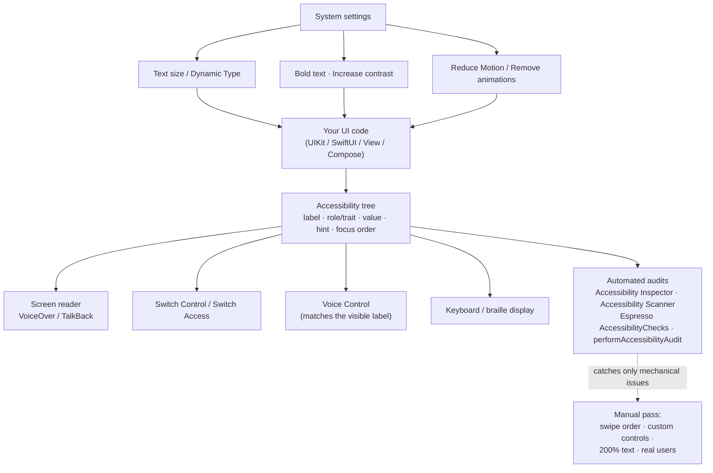

# Mobile Accessibility Coach

Make an app usable with a screen reader, one thumb, 200% text and low contrast vision — by learning what
the accessibility APIs actually do, not by sprinkling labels. Taught from first principles with trade-offs
and the **Learning Footer**, per [`AGENTS.md`](../../../AGENTS.md). The web-side sibling is
[accessibility-audit](../accessibility-audit/SKILL.md).

## When to use

- A screen reader announces "button, button, button" or reads raw asset names like `ic_chevron_24`.
- Swiping through a screen with VoiceOver/TalkBack lands in a nonsensical order, or skips content entirely.
- The layout breaks — clipped text, overlapping rows, an unreachable primary action — at the largest text
  size or with display zoom on.
- Small icon-only controls are hard to hit, or an audit flags touch targets and contrast.
- A procurement/compliance question arrives ("do we meet WCAG 2.2 AA / EN 301 549?") and you need evidence
  rather than an assertion.
- **Don't use it for** web pages or hybrid WebViews' HTML layer (use
  [accessibility-audit](../accessibility-audit/SKILL.md) and
  [accessibility-remediation-coach](../accessibility-remediation-coach/SKILL.md)), for diagram/alt-text
  authoring ([diagram-accessibility-coach](../diagram-accessibility-coach/SKILL.md)), or as a substitute for
  testing with actual disabled users — automation finds a minority of real barriers.

## First principles: you are publishing a semantics tree, not pixels

Both platforms build a parallel **accessibility tree** from your UI. Assistive technologies (VoiceOver,
TalkBack, Switch Control, Voice Control, external keyboards, braille displays) never see your pixels — they
read that tree. Every accessible element carries four kinds of information, and confusing them is the most
common bug:

| Concept | iOS (UIKit / SwiftUI) | Android (View / Compose) | Rule |
| --- | --- | --- | --- |
| **Label** — what it is | `accessibilityLabel` / `.accessibilityLabel("Save")` | `contentDescription` / `Modifier.semantics { contentDescription = "Save" }` | short, no control type in the text |
| **Role / trait** — what kind of thing | `accessibilityTraits` (`.isButton`, `.isHeader`, `.isSelected`) / `.accessibilityAddTraits(.isButton)` | inferred from the widget; Compose `Role.Button`, `Modifier.semantics { heading() }` | let the platform say "button" |
| **Value** — current state | `accessibilityValue` / `.accessibilityValue("70%")` | `stateDescription` / `Modifier.semantics { stateDescription = "on" }` | changes as state changes |
| **Hint** — what happens next | `accessibilityHint` / `.accessibilityHint("Saves the draft")` | `AccessibilityNodeInfo` action labels / `onClick(label = "save")` | optional, user-disableable |

Native controls come with all four for free. You lose them the moment you draw your own control — which is
why a custom `Box`/`UIView` "button" is the classic offender.

Two further principles:

**Scale is a contract.** Users set text size system-wide (iOS **Dynamic Type**, including the Larger
Accessibility Sizes; Android font scale, which supports up to 200% and uses non-linear scaling from Android
14). Honouring it means using text styles (`.font(.body)`, `UIFontMetrics`, `@ScaledMetric`) and `sp` units
— never hard-coded points/`dp` for text — and letting containers grow instead of clipping. WCAG 2.2 SC
**1.4.4 Resize Text** (Level AA) requires content to remain usable at 200%.

**Standards.** WCAG 2.2 became a W3C Recommendation on **5 October 2023**; it is written for web content but
is the reference target most mobile programmes adopt (and is normatively referenced by **EN 301 549**, the
EU procurement standard). W3C's WAI maintains guidance on applying WCAG to mobile apps — ⚠ that document has
been through several drafts, so check its current status on w3.org before citing it as normative. On top of
WCAG, follow the platform sources of truth: Apple's **Accessibility** developer documentation and the Human
Interface Guidelines (**minimum 44×44 pt** hit target), and Google's **Android accessibility** documentation
and Material Design (**minimum 48×48 dp** touch target). WCAG 2.2 adds SC **2.5.8 Target Size (Minimum)**
at 24×24 CSS px for AA — the platform minimums are stricter, so meeting 44 pt / 48 dp satisfies both.



*Figure: your code publishes one semantics tree that every assistive technology and every audit tool reads;
system settings feed back into layout. Automation checks the mechanical half — the swipe-through pass and
real users find the rest.*

## Procedure

1. **Set the target and scope.** e.g. *"Checkout flow, iOS + Android, WCAG 2.2 AA plus platform minimums
   (44 pt / 48 dp), verified with VoiceOver and TalkBack."* Write it down; "make it accessible" is not
   testable.
2. **Turn the screen reader on and navigate the flow end to end**, before touching any code. iOS: Settings ▸
   Accessibility ▸ VoiceOver (bind it to the Accessibility Shortcut, triple-click the side button). Android:
   Settings ▸ Accessibility ▸ TalkBack. Swipe right through every element and record, verbatim, what is
   announced. This single pass finds more than any tool.
3. **Fix names and roles first.** Every actionable element needs a meaningful label and the correct role.
   Purely decorative images must be *removed* from the tree (`.accessibilityHidden(true)`,
   `contentDescription = null`, `importantForAccessibility="no"`), not given a label. Never put the word
   "button" in a label — the trait/role already says it.
4. **Group and order.** Combine a card's title/subtitle/price into one element
   (`.accessibilityElement(children: .combine)`, `Modifier.semantics(mergeDescendants = true)`) so users hear
   one coherent item instead of four fragments. Verify swipe order matches visual order; on iOS override with
   `accessibilityElements` only when the default order is genuinely wrong.
5. **Announce state and changes.** Selected/expanded/loading must be exposed as value or state
   (`.accessibilityAddTraits(.isSelected)`, `stateDescription`, `toggleableState`). For asynchronous results,
   post an announcement (`UIAccessibility.post(notification: .announcement, argument:)` /
   `View.announceForAccessibility`) sparingly — over-announcing is its own barrier.
6. **Size the targets.** Enforce ≥44×44 pt (iOS) and ≥48×48 dp (Android) for anything tappable, using padding
   or an expanded hit area rather than a bigger icon. In Compose, `Modifier.minimumInteractiveComponentSize()`
   expresses this directly; in UIKit, expand the control's frame or override `point(inside:with:)`.
7. **Test at 200% text.** iOS: Settings ▸ Accessibility ▸ Display & Text Size ▸ Larger Text, drag to the
   largest accessibility size; in Xcode use the environment override or the Dynamic Type preview variants.
   Android: Settings ▸ Display ▸ Font size (max) and Display size, or `adb shell settings put system
   font_scale 2.0`. Fix by using text styles, `@ScaledMetric` for related spacing/icon sizes, `sp` units,
   and layouts that wrap or scroll instead of truncating.
8. **Check contrast.** Text ≥ **4.5:1** (or ≥ **3:1** for large text) and meaningful non-text/UI boundaries
   ≥ **3:1**, per WCAG 2.2 SC 1.4.3 and 1.4.11. Verify in **both** light and dark themes, and never rely on
   colour alone to convey status — add an icon, text or pattern (SC 1.4.1).
9. **Respect motion and other settings.** Gate parallax/auto-playing animation on
   `UIAccessibility.isReduceMotionEnabled` / `@Environment(\.accessibilityReduceMotion)` and Android's
   *Remove animations* (`Settings.Global.ANIMATOR_DURATION_SCALE == 0`), and honour bold-text/increase-contrast
   settings.
10. **Add automation as a regression net, not a verdict.** iOS: Accessibility Inspector (Xcode ▸ Open
    Developer Tool) and its audit, plus `XCUIApplication().performAccessibilityAudit()` in an XCUITest
    (available from Xcode 15). Android: the Accessibility Scanner app for manual sweeps, and
    `AccessibilityChecks.enable()` from `androidx.test.espresso:espresso-accessibility` inside your Espresso
    suite. Wire these into the suite you build in
    [mobile-ui-testing-lab](../mobile-ui-testing-lab/SKILL.md).
11. **Report findings with evidence and severity**: screen, what was announced/observed, which criterion or
    platform guideline it violates, the fix, and how it was verified. Close with the **Learning Footer**.

## Output shape

```
Mobile a11y review — <app / flow>   Platforms: <iOS x.y, Android API n>
Target: <WCAG 2.2 AA + platform minimums (44pt / 48dp)>   Assistive tech used: <VoiceOver, TalkBack, ...>

Screen-reader pass (verbatim announcements):
  <element>  ->  "<what was announced>"   expected: "<what it should say>"   [PASS/FAIL]

Findings (severity: blocker | major | minor):
  1. [<sev>] <screen · element>
     Observed : <announcement / measurement, e.g. 32x32 dp target, 2.9:1 contrast>
     Criterion: <WCAG 2.2 SC x.y.z (level) | Apple HIG 44pt | Material 48dp>
     Fix      : <API-level change>
     Verified : <how — re-announced text, measured size/ratio, screenshot at 200%>

Scale + contrast:
  200% text : <PASS/FAIL — what clipped>       Dark theme contrast: <PASS/FAIL>
  Targets   : <n> below minimum -> <n> after fix
Motion/settings: reduce-motion honoured <y/n> · colour-only signals <n>

Automated audit: <performAccessibilityAudit | Espresso AccessibilityChecks | Accessibility Scanner>
  -> <n> issues, <n> confirmed manually, <n> false positives
Residual risk / not covered: <custom control X still needs user testing>
Next: <linked skill>
Learning Footer
```

## Worked example — an icon-only "favourite" toggle in a card

**Observed.** TalkBack announces *"ic_star_24, button"*; VoiceOver announces *"star"* with no state. The
target measures 32×32 dp. The card's title, author and date are read as three separate swipes. At 200% text
the price is clipped.

**Android — Compose. Before:**

```kotlin
Icon(
    painter = painterResource(R.drawable.ic_star_24),
    contentDescription = null,                 // decorative? no — it IS the control
    modifier = Modifier.size(32.dp).clickable { onToggle() }   // 32dp < 48dp minimum
)
```

**After:**

```kotlin
IconToggleButton(
    checked = isFavourite,
    onCheckedChange = onToggle,
    modifier = Modifier
        .minimumInteractiveComponentSize()      // guarantees the 48x48 dp touch target
        .semantics {
            // Label states the OUTCOME; the Role (from IconToggleButton) supplies "switch/button",
            // and stateDescription supplies on/off — three distinct facts, three distinct APIs.
            contentDescription = "Favourite"
            stateDescription   = if (isFavourite) "on" else "off"
        },
) {
    Icon(
        painter = painterResource(
            if (isFavourite) R.drawable.ic_star_filled_24 else R.drawable.ic_star_24
        ),
        contentDescription = null,              // the parent already carries the semantics
        modifier = Modifier.size(24.dp),        // visual size stays 24dp; the TOUCH target is 48dp
    )
}

// Merge the card's text into one element so it is one swipe, not three.
Column(Modifier.semantics(mergeDescendants = true) { }) {
    Text(title); Text(author); Text(dateLabel)
}
```

TalkBack now announces *"Favourite, off, switch. Double tap to toggle."* — and the card reads as one item.

**iOS — SwiftUI. Before:**

```swift
Image(isFavourite ? "star.fill" : "star")
    .frame(width: 32, height: 32)              // below the 44pt minimum
    .onTapGesture { toggle() }                 // no trait: VoiceOver calls it an image
```

**After:**

```swift
Button(action: toggle) {                        // a real Button brings the .isButton trait for free
    Image(systemName: isFavourite ? "star.fill" : "star")
        .imageScale(.large)
        .frame(minWidth: 44, minHeight: 44)     // Apple HIG minimum hit target
}
.accessibilityLabel("Favourite")                // WHAT it is — no "button" in the text
.accessibilityValue(isFavourite ? "On" : "Off") // current STATE
.accessibilityHint("Adds this article to your favourites")   // optional: what happens next

// One coherent card element instead of three fragments:
VStack(alignment: .leading) {
    Text(title).font(.headline)                 // text styles scale with Dynamic Type automatically
    Text(author).font(.subheadline)
    Text(dateLabel).font(.caption)
}
.accessibilityElement(children: .combine)
```

**Fixing the 200% clipping.** The price used a fixed-height row. Replace the hard-coded height with an
intrinsic one and scale related metrics:

```swift
@ScaledMetric(relativeTo: .body) private var rowMinHeight: CGFloat = 44   // grows with Dynamic Type
// ...
.frame(minHeight: rowMinHeight)      // was .frame(height: 44) — which clipped at accessibility sizes
```

**Verification trace.** (1) VoiceOver swipe: *"Favourite, On, button"* ✅; card is one swipe ✅.
(2) Measured hit target in the Accessibility Inspector: 44×44 pt ✅ / 48×48 dp ✅. (3) Largest accessibility
text size: price fully visible, row scrolls ✅. (4) Contrast of the star on the card background measured at
4.9:1 in light and 5.4:1 in dark ✅ (needed ≥3:1 as a non-text UI component, SC 1.4.11).
(5) `performAccessibilityAudit()` and Espresso `AccessibilityChecks` both pass on this screen — and the
remaining custom slider is flagged for manual user testing, because automation cannot judge whether its
announcements make sense.

⚠ Verify menu paths, API availability (`performAccessibilityAudit`, `minimumInteractiveComponentSize`) and
the exact Settings labels on the current Apple Developer and developer.android.com pages — OS releases move
them.

## Tips

- **Never write the control type into the label.** "Save button" becomes "Save button, button". Set the
  trait/role instead and let the platform speak.
- Decorative images must be *hidden* from the accessibility tree, not labelled — an empty label still
  creates a stop for a screen-reader user.
- Prefer native controls. Every custom-drawn control is a promise to reimplement label, role, value, state,
  focus and actions yourself.
- Voice Control and Switch Access match the **visible** label — keep the accessible name aligned with the
  visible text, or users cannot say the command.
- Test at the *largest* accessibility text size, not one notch up: that is where fixed heights, single-line
  truncation and squeezed buttons break.
- Colour is never the only signal: pair it with icon, text or shape (WCAG 2.2 SC 1.4.1), and re-check
  contrast in dark theme where designs commonly regress.
- Automated audits catch a mechanical subset — labels, contrast, target size. The swipe-through pass and
  testing with disabled users find ordering, wording and workflow barriers no tool can.
- Related: [accessibility-audit](../accessibility-audit/SKILL.md),
  [accessibility-remediation-coach](../accessibility-remediation-coach/SKILL.md),
  [mobile-ui-testing-lab](../mobile-ui-testing-lab/SKILL.md) (automate the checks),
  [swiftui-lab](../swiftui-lab/SKILL.md), [jetpack-compose-lab](../jetpack-compose-lab/SKILL.md),
  [flutter-widgets-lab](../flutter-widgets-lab/SKILL.md) (its `Semantics` widget),
  [mobile-app-performance-lab](../mobile-app-performance-lab/SKILL.md) (reduce-motion and jank overlap), and
  [diagram-accessibility-coach](../diagram-accessibility-coach/SKILL.md) for in-app charts.
  End with the **Learning Footer** (`AGENTS.md`).
