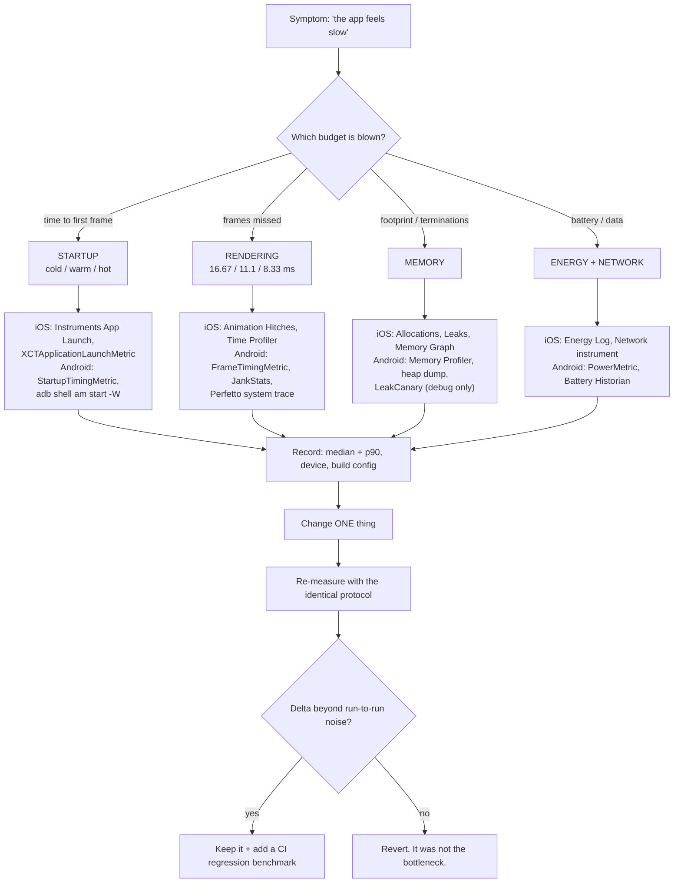

# Mobile App Performance Lab

A measurement-first lab: reproduce the symptom on a real device, attach the right profiler, get a **number
with a unit and a percentile**, change one thing, and re-measure. Taught from first principles with
trade-offs and the **Learning Footer**, per [`AGENTS.md`](../../../AGENTS.md). Pairs with
[ios-lifecycle-coach](../ios-lifecycle-coach/SKILL.md) and
[android-lifecycle-coach](../android-lifecycle-coach/SKILL.md).

## When to use

- The app takes "a few seconds" to launch and nobody knows which phase is slow.
- A list scrolls smoothly on the flagship dev device and stutters on the mid-range device users actually own.
- Memory climbs until the OS terminates the app in the background, or `OutOfMemoryError`/jetsam kills appear.
- Store consoles flag it: Android vitals reports slow/frozen frames or ANRs; Xcode Organizer → Metrics shows
  a launch-time or hang-rate regression after a release.
- Battery or cellular-data complaints, and you need to attribute cost to a specific wakeup, timer or upload.
- **Don't use it for** backend latency ([load-testing-coach](../load-testing-coach/SKILL.md) sizes server
  capacity; [web-perf-audit](../web-perf-audit/SKILL.md) covers web front-ends), for micro-optimising code
  with no measured hot path, or for profiling a **Debug** build and drawing conclusions from it — Debug
  builds are unoptimised and instrumented, and their numbers are fiction.

## First principles: latency is a budget, not a vibe

Three ideas explain almost every mobile performance bug.

**1. Startup has named phases, and only some are yours.** Android distinguishes **cold** start (process not
running: fork, `Application` init, first `Activity`, first frame), **warm** and **hot** start, and measures
*time to initial display* and then *time to full display* (developer.android.com, *App startup time*,
retrieved 2026). iOS splits launch into **pre-main** (dyld loading and linking, ObjC runtime setup, static
initialisers) and **post-main** work up to the first frame; Apple's *Optimizing your app's launch* guidance
(WWDC19 "Optimizing App Launch", WWDC22 "Track down hangs") uses a budget of roughly **400 ms to the first
frame**, with the watchdog terminating launches that take dramatically longer.

**2. Rendering is a hard real-time deadline.** The display refreshes on a fixed cadence; miss the deadline
and the previous frame is shown again — that is a *dropped frame*, and a run of them is *jank*. The budget
covers everything: your work, layout, and the compositor.

| Refresh rate | Frame budget | Typical device |
| --- | --- | --- |
| 60 Hz | 16.67 ms | baseline phones, most simulators/emulators |
| 90 Hz | 11.1 ms | many mid-range Android devices |
| 120 Hz | 8.33 ms | ProMotion iPhone/iPad, high-end Android |

A 120 Hz device halves your budget, so "smooth on my phone" is not evidence. Apple measures this as **hitch
time ratio** (ms of hitch per second) in the *Animation Hitches* Instruments template and via MetricKit's
`MXAnimationMetric.scrollHitchTimeRatio`; Android measures **slow** and **frozen** frames in Android vitals
and via `FrameTimingMetric`/`JankStats`. ⚠ The exact good/bad thresholds both vendors publish (hitch-ratio
bands, frozen-frame duration, ANR bad-behaviour rate) are revised over time — read the current *Animation
Hitches* and Android vitals pages rather than a remembered number.

**3. Memory and energy are shared, and the OS is the referee.** Both platforms terminate background apps
under memory pressure (iOS jetsam, Android's low-memory killer), so a "leak" often surfaces as *a cold start
that should have been warm*. Energy is dominated by radio and CPU wakeups, not arithmetic: one batched
upload every 15 minutes costs far less than a chatty request every 30 seconds, because the cellular radio
stays in a high-power state for a tail period after each transmission.



*Figure: name the blown budget first, then pick the tool — never open a profiler before you can state the
number you are trying to move.*

| Concern | iOS tool (confirm template names in your Xcode) | Android tool | Metric you report |
| --- | --- | --- | --- |
| Cold start | Instruments **App Launch**; `XCTApplicationLaunchMetric` in an XCUITest `measure` block | `MacrobenchmarkRule` + `StartupTimingMetric` with `StartupMode.COLD`; `adb shell am start -W` | ms to first frame, median + p90 |
| CPU hot path | Instruments **Time Profiler** (sampling) | Android Studio CPU profiler / Perfetto system trace | share of samples in the top frames |
| Jank | Instruments **Animation Hitches** | `FrameTimingMetric`; `JankStats` (`androidx.metrics:metrics-performance`) | frames over budget, p90/p99 frame duration |
| Memory | **Allocations**, **Leaks**, Memory Graph Debugger | Memory Profiler + heap dump; `MemoryUsageMetric`; LeakCanary in debug | peak footprint MB, retained instances |
| Energy / network | **Energy Log**, **Network**; Xcode Organizer → Battery Usage | `PowerMetric`, Battery Historian, Network Inspector | wakeups/min, bytes per session |
| Field data | **MetricKit** (`MXMetricManager`, `MXAppLaunchMetric`, `MXAnimationMetric`) | **Android vitals** (Play Console) | p50/p90 from real users |

## Procedure

1. **Write the budget down first.** One line: *"Cold start p90 ≤ 1.5 s on a Pixel 6a, release build, after
   reboot."* Without a target and a named device you cannot distinguish success from noise.
2. **Build like production.** iOS: Release configuration, no debugger attached — use `Product ▸ Profile`
   (⌘I), which builds Release and hands the binary to Instruments. Android: the `release` build type with
   shipping minification, and a deliberate Macrobenchmark `CompilationMode` — `None()` approximates a fresh
   install, `Partial()` measures with a Baseline Profile applied. Never benchmark a debuggable build.
3. **Measure on the device your users have.** Include one mid-range device and one high-refresh-rate device.
   Simulators and emulators share your workstation CPU and are worthless for absolute timing.
4. **Reproduce deterministically.** Fixed account and data set, stubbed or recorded network, fixed
   brightness, device thermally settled and off charge. Run **≥5 iterations** and report **median and p90**;
   one run is an anecdote.
5. **Startup, iOS.** Add an XCUITest:
   `measure(metrics: [XCTApplicationLaunchMetric()]) { XCUIApplication().launch() }`. Then run the
   **App Launch** template in Instruments to split pre-main (dyld, static initialisers) from post-main.
   Attack the biggest slice: defer non-essential work out of
   `application(_:didFinishLaunchingWithOptions:)`, remove heavy static initialisers, and reduce the number
   of dynamically linked frameworks.
6. **Startup, Android.** Add a Macrobenchmark module with `StartupTimingMetric`, `StartupMode.COLD` and
   `iterations = 10`, and wait for *real* content — call `reportFullyDrawn()` (or use the
   `FullyDrawnReporter`) so you measure usable UI, not an empty frame. Sanity-check with
   `adb shell am start -W -S <pkg>/<activity>`. Then generate a **Baseline Profile**
   (`androidx.baselineprofile` Gradle plugin + `BaselineProfileRule`) and re-run to quantify the AOT win.
7. **Jank.** iOS: run **Animation Hitches** while performing the exact gesture, read the hitch time ratio,
   then switch to **Time Profiler** to see what occupied the main thread during the hitch. Android: use
   `FrameTimingMetric` for lab numbers and `JankStats` for field numbers, and open the system trace in
   Perfetto to find main-thread work, extra layout passes, and per-item work in `RecyclerView`/`LazyColumn`.
   Usual culprits: image decode, JSON parsing, synchronous disk/database reads, over-invalidation, expensive
   `onDraw` or unstable recomposition.
8. **Memory.** iOS: **Allocations** with mark-generation snapshots around a repeated navigate-in/navigate-out
   cycle — a rising baseline across generations is a leak; **Leaks** and the Memory Graph Debugger find
   retain cycles, usually a closure capturing `self` strongly or a non-`weak` delegate. Android: Memory
   Profiler, force a GC, capture a heap dump and diff after the same cycle; add LeakCanary to **debug**
   builds for automatic retained-instance detection.
9. **Energy and network.** Count wakeups, timers, background tasks and requests per minute. Batch and
   coalesce (iOS: `BGTaskScheduler`, discretionary `URLSession` transfers; Android: `WorkManager` with
   constraints). Verify with Energy Log or `PowerMetric`, and check payload size and compression with the
   network instrument/inspector. Design the sync itself with
   [mobile-offline-sync-coach](../mobile-offline-sync-coach/SKILL.md).
10. **Change exactly one thing, then re-measure identically.** If the delta sits inside run-to-run variance,
    revert — "this was not the bottleneck" is a genuine result worth recording.
11. **Lock the win in.** Keep the Macrobenchmark/XCTest metric as a CI regression test with a threshold, and
    watch the field distribution in MetricKit / Android vitals after release. Close with the
    **Learning Footer**.

## Output shape

```
Perf lab — <app> · <symptom> · <device model, OS version> · build=<Release|release, minify=<on/off>>
Budget: <metric> <target>            (e.g. cold start p90 <= 1500 ms)

Baseline (n=<iterations>, median / p90):
  cold start      <..> / <..> ms      (fully drawn: <..> ms)
  frame duration  <..> / <..> ms      frames over <16.67|11.1|8.33> ms: <n> (<%>)
  peak memory     <..> MB             background terminations: <n>
  energy/network  <wakeups/min> · <requests/min> · <KB/session>

Diagnosis:
  tool            <Instruments App Launch | StartupTimingMetric | Animation Hitches | Perfetto | ...>
  hot path        <symbol / trace section> = <% of samples | ms per frame>
  root cause      <one sentence: mechanism, not adjective>

Change: <the single change>            Trade-off: <what it costs>
After (identical protocol, n=<iterations>, median / p90): <metric> <..> / <..>
Delta: <..>   Beyond noise? <yes/no — run-to-run spread was <..>>

Guardrail: <CI benchmark + threshold>  Field check: <MetricKit metric | Android vitals metric>
Ruled out (not the cause): <..>
Next: <linked skill>
Learning Footer
```

## Worked example — a 2.9 s cold start and a stuttering feed

**Symptom.** Release build on a Pixel 6a: `adb shell am start -W -S com.example.app/.MainActivity` reports
`TotalTime: 2870`. The same feed on an iPhone 13 visibly stutters while scrolling at 120 Hz.

**Android — trace the startup instead of guessing.**

```kotlin
// macrobenchmark/src/main/java/com/example/StartupBenchmark.kt
@RunWith(AndroidJUnit4::class)
class StartupBenchmark {
    @get:Rule val rule = MacrobenchmarkRule()

    @Test fun coldStartNoProfile()        = measure(CompilationMode.None())
    @Test fun coldStartBaselineProfile()  = measure(CompilationMode.Partial())

    private fun measure(mode: CompilationMode) = rule.measureRepeated(
        packageName    = "com.example.app",
        metrics        = listOf(StartupTimingMetric()),
        iterations     = 10,                 // 10 runs -> a distribution, not an anecdote
        startupMode    = StartupMode.COLD,   // process killed between iterations
        compilationMode = mode,
        setupBlock     = { pressHome() },
    ) {
        startActivityAndWait()               // returns once the first frame is drawn
    }
}
```

Trace: `timeToInitialDisplay` median **2 810 ms**. The Perfetto system trace shows two main-thread blocks
inside `Application.onCreate` — an analytics SDK initialising synchronously (**640 ms**) and a Room database
opened and migrated on the main thread (**910 ms**). That is 1.55 s of the 2.81 s; the remainder is
framework startup and first-frame layout.

Two changes, applied and measured **one at a time**:

```kotlin
// 1. Take the database off the critical path: open lazily, and never on the main thread.
private val db by lazy {
    Room.databaseBuilder(ctx, AppDb::class.java, "app.db").build()
}

// 2. Defer the analytics SDK until after the user has seen something.
override fun onCreate() {
    super.onCreate()
    Handler(Looper.getMainLooper()).post { Analytics.initialize(this) }  // runs after the first frame
}
```

Re-measured with the identical protocol: `timeToInitialDisplay` median **1 340 ms**, p90 1 480 ms. The
run-to-run spread was ±60 ms, so the improvement is real, not noise. Adding a Baseline Profile
(`CompilationMode.Partial()`) takes it to median **1 090 ms**, because the hot startup path ships
AOT-compiled instead of being interpreted and then JIT-ed on first launch.

**iOS — trace the hitch instead of the feeling.** Profile the Release build (⌘I) with the **Animation
Hitches** template and perform the exact scroll: the hitch ratio spikes as each new row appears. Switching
to **Time Profiler** puts the main thread inside image decoding and `DateFormatter` initialisation.

```swift
// BEFORE — two main-thread costs per cell, inside an 8.33 ms budget on a 120 Hz display.
func configure(with post: Post) {
    let f = DateFormatter()          // creating a DateFormatter is expensive (locale + ICU setup)
    f.dateStyle = .medium
    dateLabel.text = f.string(from: post.createdAt)
    imageView.image = UIImage(data: try! Data(contentsOf: post.imageURL))  // sync I/O + decode on main
}

// AFTER — hoist the formatter; decode off-main, at the size actually displayed.
private static let dateFormatter: DateFormatter = {
    let f = DateFormatter(); f.dateStyle = .medium; return f
}()

func configure(with post: Post) {
    dateLabel.text = Self.dateFormatter.string(from: post.createdAt)
    imageLoader.load(post.imageURL, targetSize: imageView.bounds.size) { [weak self] image in
        self?.imageView.image = image    // only the assignment touches main; [weak self] avoids a cycle
    }
}
```

Re-measured with the same template and gesture: hitch time ratio falls from ~34 ms/s to ~2 ms/s and p99
frame duration drops under the 8.33 ms budget. Lock it in so CI catches the regression instead of a
reviewer:

```swift
func testFeedScrollPerformance() {
    let app = XCUIApplication()
    measure(metrics: [XCTOSSignpostMetric.scrollDecelerationMetric,
                      XCTApplicationLaunchMetric()]) {
        app.launch()
        app.tables.firstMatch.swipeUp(velocity: .fast)
    }
}
```

**The transferable lesson.** Both fixes are the same rule in two dialects: *work not needed before the first
frame must not run before the first frame, and work proportional to visible items must be O(1) and off the
main thread.* The profiler's only job was to tell us which 1.5 s of the 2.8 s deserved attention.
⚠ Instrument template names, Macrobenchmark metric classes and the Studio profiler UI change between
releases — confirm exact names on the current Apple Developer and developer.android.com pages before you
script against them.

## Tips

- **Never optimise without a baseline number and a device name.** "It feels faster" is not a result;
  median + p90 over ≥5 runs on a named device is.
- Profile **Release** builds only. Debug builds disable optimisation, keep assertions and often a debugger —
  they routinely differ by 2–10×.
- Test on a 120 Hz device *and* a mid-range 60 Hz device: the first halves your frame budget, the second
  halves your CPU. Bugs hide in whichever one you skip.
- Startup work is a queue, not a pile — the fix is almost always *defer*, then *lazily initialise*, then
  *move off the main thread*, in that order of safety.
- Mobile "leaks" are usually retain cycles (iOS: closures capturing `self`, non-`weak` delegates) or
  long-lived listeners (Android: a `Context`/`View` retained by a singleton or static field).
- Batch network work: the radio's high-power tail after each transmission usually costs more energy than the
  bytes themselves.
- Field data beats lab data for *prioritisation* — MetricKit and Android vitals tell you which p90 real
  users suffer. The lab benchmark is the guardrail, not the goal.
- Related: [ios-lifecycle-coach](../ios-lifecycle-coach/SKILL.md),
  [android-lifecycle-coach](../android-lifecycle-coach/SKILL.md),
  [jetpack-compose-lab](../jetpack-compose-lab/SKILL.md) (recomposition cost),
  [swiftui-lab](../swiftui-lab/SKILL.md), [swift-concurrency-lab](../swift-concurrency-lab/SKILL.md),
  [kotlin-coroutines-flow-lab](../kotlin-coroutines-flow-lab/SKILL.md),
  [mobile-ui-testing-lab](../mobile-ui-testing-lab/SKILL.md) (where the benchmarks run) and
  [mobile-release-coach](../mobile-release-coach/SKILL.md) (watching vitals after rollout).
  End with the **Learning Footer** (`AGENTS.md`).
