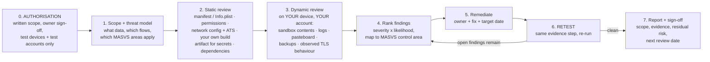

# Mobile App Security Coach

A repeatable review **process** for a mobile app you own: prove authorisation, scope it, evidence each
MASVS control area against the real build, and hand back ranked findings with fixes and a retest. Taught
with trade-offs and the **Learning Footer**, per [`AGENTS.md`](../../../AGENTS.md).

> **Defensive and authorised-only.** This skill covers reviewing software **you own or have explicit written
> permission to test**, on **devices and accounts you control**. It will not help you attack, reverse
> engineer, or bypass protections in third-party apps, and it deliberately contains no exploit recipes.
> Testing an app without authorisation is unlawful in most jurisdictions.

For the *underlying controls* — Keychain/Keystore, pinning, biometrics, sandbox — learn them in
[mobile-security-coach](../mobile-security-coach/SKILL.md); this skill is the review that verifies they are
actually present in the shipped build.

## When to use

- A release is approaching and someone asks "has anyone security-reviewed the app?"
- You must produce evidence against **OWASP MASVS** for a customer, auditor or app-store/enterprise review.
- You suspect a leak — data written outside the sandbox, tokens in logs, PII in analytics — and need a
  systematic sweep rather than a hunch.
- You are preparing for an external penetration test and want to fix the cheap findings first.
- A new third-party SDK is being added and you need to bound the risk it introduces.
- **Don't use it for** any app you do not own or are not authorised to test; for designing the controls in
  the first place ([mobile-security-coach](../mobile-security-coach/SKILL.md)); for backend/API assessment
  ([api-security-coach](../api-security-coach/SKILL.md),
  [broken-access-control-coach](../broken-access-control-coach/SKILL.md)); or for source-only reviews with
  no build artifact ([secure-code-review](../secure-code-review/SKILL.md) is the better fit).

## First principles: a review is evidence collection, not opinion

A security review answers one question per control: **"is this true of the build we are actually shipping?"**
Three consequences follow.

**1. Review the artifact, not the intention.** Source code says what a developer meant; the release APK/AAB
or IPA says what users get. Build flavours, `debug` leftovers, ProGuard/R8 rules, bundled SDKs and CI-injected
configuration all differ between them. Review the release artifact plus its source, and note the exact
version and build number in the report.

**2. Coverage comes from a standard, not from imagination.** OWASP's **Mobile Application Security (MAS)**
project provides three linked pieces: **MASVS** (the requirements, grouped as STORAGE, CRYPTO, AUTH, NETWORK,
PLATFORM, CODE, RESILIENCE and — from v2.1 — PRIVACY), the **MASTG** (test procedures and demos), and the
**MAS Checklist** (the sheet you fill in as evidence). Working from that list is what turns "we looked at it"
into "these controls were verified, on this date, this way." ⚠ MASVS v2 replaced the older v1 L1/L2/R level
scheme and control IDs are revised between versions — confirm exact IDs on `mas.owasp.org` before quoting
them.

**3. Static tells you what *can* happen; dynamic tells you what *does*.** Reading configuration proves the
Network Security Config forbids cleartext; running the app on a device you own and observing its traffic and
its sandbox proves nothing sensitive was written or sent. You need both, and dynamic work happens strictly on
**your** test devices, **your** test accounts, and **debug/test builds** where possible.



*Figure: authorisation gates the whole process; every finding must trace back to an evidence step, and no
finding is closed until the same evidence step is re-run.*

| MASVS area | The question this review answers | Typical evidence you collect |
| --- | --- | --- |
| **STORAGE** | Is sensitive data outside the sandbox, or inside it unprotected? | listing of the app container, `SharedPreferences`/`UserDefaults` contents, DB files, cache, backups |
| **CRYPTO** | Are keys hardware-backed, non-exportable, and algorithms current? | Keystore/Keychain flags in code, key generation parameters, no hard-coded keys |
| **AUTH** | Are session/token lifetimes, revocation and re-auth enforced **server-side**? | token lifetime observed, behaviour after server-side revoke |
| **NETWORK** | Is all traffic TLS 1.2+, correctly validated, with no permissive trust code? | ATS/Info.plist, `network_security_config.xml`, absence of all-trusting `TrustManager`/delegate |
| **PLATFORM** | Are exported components, deep links, WebViews and IPC safe by default? | exported `activity`/`provider` list, URL scheme handlers, WebView settings |
| **CODE** | Are dependencies current, debug code stripped, and logs clean? | dependency report + known-vulnerability scan, release log capture |
| **RESILIENCE** | Are anti-tamper/integrity signals present and used **server-side**? | attestation call flow, what the server does with the signal |
| **PRIVACY** | Is collection minimal, disclosed and consented? | data inventory vs. store privacy declaration, SDK data collection |

## Procedure

1. **Get authorisation in writing, first.** Record: the app and build under test, who owns it and who signed
   off, the permitted scope (in-app only? backend included?), the test window, the devices and accounts you
   may use, and an escalation contact. **No written scope, no review.** Use only test accounts and test data —
   never real customer data.
2. **Freeze the target.** Note the exact version/build (`versionName`+`versionCode`, `CFBundleShortVersionString`
   +`CFBundleVersion`), the commit SHA, and the build type. Get **both** the release artifact and the matching
   source. Any finding must name this build.
3. **Scope by data and flow.** Enumerate sensitive data and the 3–6 flows that touch it (sign-in, payment,
   document download, sync). Rank threats — device theft, hostile network, malicious co-resident app,
   compromised device — with [threat-model](../threat-model/SKILL.md). Select the MASVS areas in scope and say
   which are explicitly out.
4. **Static pass — configuration and manifest.** Android: check `AndroidManifest.xml` for `exported`
   components, `android:debuggable`, `android:allowBackup`, `usesCleartextTraffic`, and the
   `network_security_config.xml` (`cleartextTrafficPermitted="false"`, pin-set with backup pin and expiry).
   iOS: check `Info.plist` for App Transport Security exceptions (`NSAllowsArbitraryLoads` must not ship),
   declared URL schemes/universal links, and background modes. Grep the source for permissive trust code —
   an all-accepting `X509TrustManager`, `HostnameVerifier { _, _ -> true }`, or a `URLSessionDelegate` that
   calls the completion handler with the server trust unconditionally. These are the highest-yield checks.
5. **Static pass — secrets in your own artifact.** Because you own the build, inspect it directly: unzip the
   APK/IPA, run `strings` over the binary and assets, and inspect resources/`assets/` and any bundled `.plist`
   or `.json` configuration for API keys, credentials, private keys or internal hostnames. Also scan the
   **repository history** with a secret scanner (e.g. gitleaks/trufflehog) — committed keys survive deletion.
   Anything found must be **rotated**, not just removed. Pair with
   [secrets-management-coach](../secrets-management-coach/SKILL.md).
6. **Static pass — dependencies and SDKs.** Produce the dependency tree (`./gradlew :app:dependencies`,
   the Swift Package/CocoaPods manifest) and check it against known-vulnerability data. For every third-party
   SDK, record what data it collects and where it sends it — SDKs are a leading cause of undisclosed
   collection. See [supply-chain-security-coach](../supply-chain-security-coach/SKILL.md).
7. **Dynamic pass — data at rest, on your own device.** Exercise each in-scope flow, then inspect the app's
   private container: Android, on a **debug** build, `adb shell run-as <pkg> ls -R files shared_prefs
   databases cache`; iOS, Xcode ▸ Devices and Simulators ▸ *Download Container* and open the `.xcappdata`.
   Look for tokens, PII, or cached responses in plaintext; check what remains **after logout**; check
   external/shared storage; and check whether the platform backup includes anything sensitive.
8. **Dynamic pass — leak paths.** Capture the **release** build's log output during the flows
   (`adb logcat`, Console.app / `log stream`) and grep for tokens, emails, card data and identifiers. Check
   the pasteboard/clipboard, the app-switcher snapshot (is the screen obscured?), keyboard caching in
   sensitive fields, screenshots, and crash-report payloads. This step routinely produces the report's most
   embarrassing finding.
9. **Dynamic pass — data in transit.** On your own device and test account, route the app's traffic through
   an intercepting proxy you control with **your own CA installed on your own test device** and confirm the
   behaviour is what you designed: with the proxy CA trusted, does an app that claims to pin actually refuse
   the connection? Is any endpoint cleartext? Does any request carry more data than it needs? Record the
   observed behaviour per endpoint. *(Scope note: this validates **your** app's client behaviour; do not
   attempt to defeat protections in software you do not own.)*
10. **Rank every finding** by impact × likelihood **for the data involved**, not by tool severity. Each
    finding gets: title, MASVS area, affected build, reproduction steps for **your** environment, evidence,
    impact in plain language, and a concrete remediation. Avoid publishing reusable attack detail —
    a screenshot with the secret redacted and a file path is sufficient evidence.
11. **Agree remediation and dates with named owners**, then **retest by re-running the exact evidence step**.
    A finding is closed only by re-executed evidence, never by a claim.
12. **Publish the report and schedule the next review**, including residual risks accepted with a reason.
    Feed recurring classes of finding back into the SDLC gates
    ([secure-sdlc-maturity-coach](../secure-sdlc-maturity-coach/SKILL.md)). Close with the
    **Learning Footer**.

## Output shape

```
Mobile app security review — <app> <versionName/versionCode or CFBundleVersion> · commit <sha>
Authorisation: <owner name/role> · scope <in-app | + backend> · window <dates> · devices/accounts <test only>
Standard: OWASP MASVS <version> + MASTG   In scope: <areas>   Out of scope: <areas + why>

Evidence performed:
  [x] manifest / Info.plist + ATS + network security config
  [x] artifact inspection for secrets (+ repo history scan)
  [x] dependency + SDK data-collection review
  [x] sandbox contents after each flow + after logout
  [x] release-build log / pasteboard / app-switcher / backup review
  [x] observed transport behaviour per endpoint

Findings (ranked):
  F-01 [Critical] <title>            MASVS: <AREA>          Build: <version>
       Evidence   : <file path / redacted capture / config line>
       Impact     : <what an attacker with THIS access could obtain, plain language>
       Remediation: <specific change>       Owner: <name>   Due: <date>
       Retest     : <evidence step re-run>  Status: <open | fixed on <date>>
  F-02 [High] ...

Summary: Critical <n> · High <n> · Medium <n> · Low <n> · Informational <n>
Verified-good controls: <e.g. tokens in Keychain WhenUnlockedThisDeviceOnly; no cleartext endpoints>
Residual risks accepted: <risk + owner + compensating control + review date>
Secrets found -> rotated: <n/n>          Next review: <date>
Next: <mobile-security-coach for control design | linked skill>
Learning Footer
```

## Worked example — a pre-release review that found three things

**Scope.** `com.example.wallet` 4.2.0 (build 412), commit `a19f3c2`, release APK + matching IPA, both owned
by us; written authorisation from the product owner; test accounts only; in-app scope, backend explicitly out
of scope. Standard: MASVS, areas STORAGE, NETWORK, CODE, PRIVACY.

**Step 4 — configuration (static).** Reading the shipped manifest and plist:

```bash
# Android: what does the RELEASE build actually declare?
unzip -o app-release.apk -d ./review/apk >/dev/null
apkanalyzer manifest print ./review/app-release.apk | head -60
#   -> android:allowBackup="true"        ← F-02
#   -> <activity android:name=".DebugMenuActivity" android:exported="true" />   ← F-03

# iOS: any ATS exception in the shipped bundle?
plutil -p ./review/Payload/Wallet.app/Info.plist | grep -A5 NSAppTransportSecurity
#   -> (no NSAllowsArbitraryLoads)  ✅ verified-good
```

**Step 5 — secrets in our own artifact.**

```bash
# We own this build, so inspecting it is simply reading our own output.
strings ./review/apk/lib/arm64-v8a/libapp.so | grep -Ei 'api[_-]?key|secret|BEGIN [A-Z ]*PRIVATE KEY'
grep -rIE 'AIza[0-9A-Za-z_-]{20,}|sk_live_[0-9A-Za-z]{10,}' ./review/apk/assets ./review/apk/res
#   -> assets/config.json contains a third-party analytics API key   ← F-01
gitleaks detect --source . --redact          # history matters: deletion is not rotation
```

**Step 7/8 — dynamic, on our own device and test account.**

```bash
# Android debug build, our device: what is in the sandbox after logout?
adb shell run-as com.example.wallet ls -R files shared_prefs databases cache
adb shell run-as com.example.wallet cat shared_prefs/session.xml
#   -> <string name="refresh_token">eyJhbGciOi...</string>  present AFTER logout   ← F-04

# Release build logs during sign-in:
adb logcat -c && adb logcat | grep -Ei 'token|password|card|@'
#   -> D/AuthRepo: refreshing with token eyJhbGciOi...        ← F-05
```

**Findings, ranked by impact on the data involved:**

| ID | Sev | Finding | MASVS | Remediation |
| --- | --- | --- | --- | --- |
| F-01 | High | Third-party analytics API key shipped in `assets/config.json` | CODE / CRYPTO | **Rotate the key**, move the privileged call server-side, keep only a public/limited client identifier |
| F-04 | Critical | Refresh token persists in `SharedPreferences` in plaintext, and survives logout | STORAGE | Store under an Android Keystore key with `setUserAuthenticationRequired(true)`; wipe on logout |
| F-05 | High | Release build logs the refresh token | CODE / PRIVACY | Remove the statement; strip verbose logging via R8 rules; add a CI log-scan gate |
| F-02 | Medium | `allowBackup="true"` includes the app database in platform backups | STORAGE | `android:allowBackup="false"` or backup rules excluding sensitive files |
| F-03 | Medium | `DebugMenuActivity` exported in the release build | PLATFORM | Restrict to the debug source set; assert absence in a release test |

**Remediation trace for F-04 (the one that mattered).** The team applied the control from
[mobile-security-coach](../mobile-security-coach/SKILL.md) — a Keystore-backed, user-authentication-gated
key wrapping the token, plus an explicit wipe:

```kotlin
fun logout() {
    tokenStore.clear()                                        // remove the encrypted blob
    KeyStore.getInstance("AndroidKeyStore").apply { load(null) }
        .deleteEntry("refresh_token_key")                     // destroy the key: ciphertext becomes junk
    context.cacheDir.deleteRecursively()                      // and the cached API responses
}
```

**Retest (build 415), by re-running the identical evidence step:**

```bash
adb shell run-as com.example.wallet cat shared_prefs/session.xml
#   -> No such file or directory                              ✅ F-04 closed
adb shell run-as com.example.wallet ls files/
#   -> token.enc   (AES-GCM ciphertext; key requires user auth and is deleted on logout)
adb logcat | grep -Ei 'token|password|card'
#   -> (no matches during full sign-in/logout cycle)           ✅ F-05 closed
```

**Report line.** *Critical 1 · High 2 · Medium 2 · Informational 3. All Critical/High closed in build 415 and
verified by re-run evidence. Secrets found → rotated: 1/1. Verified-good: no ATS exceptions, no cleartext
endpoints observed, tokens no longer persist after logout. Residual risk accepted: no client-side root
detection (owner: security; compensating control: server-side Play Integrity signal on high-value actions;
review 2026-11-01).*

⚠ Tool invocations (`apkanalyzer`, `run-as`, container download paths) and MASVS control IDs change between
platform and standard releases — verify them on the current developer.android.com, Apple Developer and
`mas.owasp.org` pages before relying on the exact syntax.

## Tips

- **Authorisation is step zero and it is written.** Scope, owner sign-off, dates, devices and accounts —
  a review without it is not a review.
- Review the **release artifact**, not the debug build or the source alone. Debug leftovers and build-flavour
  differences are exactly where findings live.
- The three highest-yield checks in most reviews: permissive certificate/hostname validation code, secrets in
  the artifact or repo history, and sensitive data surviving logout.
- Deleting a leaked key is not remediation — **rotation** is. Assume anything ever committed is compromised.
- Keep evidence reproducible and non-weaponised: file paths, redacted captures and configuration lines are
  enough to prove a finding without publishing an exploit.
- Rank by impact on *the data involved*, not by scanner severity; a Medium in a wallet app can outrank a High
  in a brochure app.
- Nothing is closed without a **re-run of the same evidence step** — "fixed in the next sprint" is a status,
  not a result.
- Turn recurring findings into gates (log scanning, secret scanning, dependency checks) so the next review
  starts from a higher baseline: [secure-sdlc-maturity-coach](../secure-sdlc-maturity-coach/SKILL.md).
- Related: [mobile-security-coach](../mobile-security-coach/SKILL.md) (design the controls),
  [secure-code-review](../secure-code-review/SKILL.md), [threat-model](../threat-model/SKILL.md),
  [secrets-management-coach](../secrets-management-coach/SKILL.md),
  [supply-chain-security-coach](../supply-chain-security-coach/SKILL.md),
  [api-security-coach](../api-security-coach/SKILL.md),
  [security-logging-audit-coach](../security-logging-audit-coach/SKILL.md),
  [security-hardening-checklist](../security-hardening-checklist/SKILL.md) and
  [mobile-release-coach](../mobile-release-coach/SKILL.md) for shipping the fixes.
  End with the **Learning Footer** (`AGENTS.md`).
