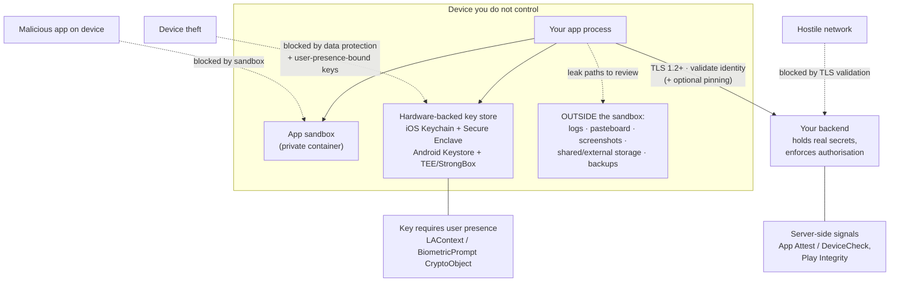

# Mobile Security Coach

Learn the defences a mobile app can actually rely on — sandbox, hardware-backed key storage, TLS, biometrics
— and, just as importantly, the ones it cannot. Ground-up teaching with trade-offs and the
**Learning Footer**, per [`AGENTS.md`](../../../AGENTS.md). **Defensive only:** everything here is about
hardening software **you own or are authorised to work on**. For running a structured review of a finished
build, use [mobile-app-security-coach](../mobile-app-security-coach/SKILL.md); this skill teaches the
underlying controls that review checks for.

## When to use

- You need to store a session token, refresh token or offline PII and don't know which API is right.
- The team is about to hard-code an API key in the app "because it's compiled".
- Someone proposes certificate pinning and nobody has costed the key-rotation and outage risk.
- A "log in with Face ID / fingerprint" feature is being specified as a boolean check.
- A compliance question arrives naming OWASP MASVS, and you need a mental map of its control areas.
- **Don't use it for** attacking, reverse-engineering or bypassing controls in apps you do not own — this
  skill will not help with that. It is also not the right tool for backend authorisation design
  ([auth-designer](../auth-designer/SKILL.md), [jwt-security-coach](../jwt-security-coach/SKILL.md),
  [oauth2-oidc-security-coach](../oauth2-oidc-security-coach/SKILL.md)), for server-side secret management
  ([secrets-management-coach](../secrets-management-coach/SKILL.md)), or for the review workflow itself
  ([mobile-app-security-coach](../mobile-app-security-coach/SKILL.md)).

## First principles: the device is not your computer

Everything follows from one honest premise: **the app runs on hardware the user controls.** A determined
owner of a device can read your binary, inspect your traffic through a proxy they trust, and — on a
compromised or rooted device — observe your process. Therefore:

1. **There is no client secret.** Anything shipped in the app (API keys, HMAC secrets, "hidden" endpoints)
   is readable. Secrets that grant privilege must live server-side; the client gets short-lived,
   narrowly-scoped, revocable tokens. OWASP MASVS-CODE and MASVS-CRYPTO both land on this point.
2. **The sandbox is your strongest control and it is free.** iOS and Android give each app a private data
   container; other apps cannot read it. Most real leaks are self-inflicted — data placed *outside* the
   sandbox (shared/external storage, pasteboard, logs, screenshots, backups, third-party SDKs).
3. **Storage classes differ by what protects the key.** A file in the sandbox is protected by the OS. A
   Keychain/Keystore item can additionally be bound to **hardware** (Secure Enclave / StrongBox / TEE) and
   to **user presence**, so the key material never becomes extractable plaintext, even to your own process.
4. **Transport security is about identity, not just encryption.** TLS gives confidentiality and integrity;
   what stops a proxy in the middle is *validating the right identity*. Pinning narrows the set of accepted
   identities — powerful, and a self-inflicted outage if you get rotation wrong.
5. **Biometrics are an unlock gesture, not an assertion to your server.** `true` returned by a local check
   proves nothing to a backend. The security comes from binding a **key** to biometric authentication so
   that a successful check is what makes a cryptographic operation possible.
6. **Anti-tamper is friction, not a boundary.** Root/jailbreak detection raises cost for casual abuse; it
   cannot be trusted by your server, because the client reporting it may be the thing that is compromised.



*Figure: four defences map to four threats. The sandbox stops other apps, data protection plus
user-presence-bound keys stop device theft, TLS identity validation stops the hostile network — and
authorisation always stays on the server, because the client can be lying.*

| Threat | Control that actually helps | Control that does **not** |
| --- | --- | --- |
| Another app on the device reads your data | the sandbox; never write secrets to shared/external storage | obfuscating a filename |
| Stolen/lost unlocked-once device | Keychain `...ThisDeviceOnly` accessibility, Android Keystore with `setUserAuthenticationRequired`, file data protection | storing a "isLoggedIn" flag |
| Hostile Wi-Fi / interception proxy | TLS 1.2+, correct certificate validation, ATS / Network Security Config, optional pinning | encrypting the body with a key that ships in the app |
| Reverse engineering of your binary | keeping privilege server-side; short-lived scoped tokens | hard-coded API keys, string obfuscation |
| Rooted/jailbroken device | server-side attestation signals, sensitive-action re-auth, minimising cached data | trusting a client-side "device is safe" boolean |

### The MASVS map (know the shape, look up the detail)

OWASP's **Mobile Application Security Verification Standard (MASVS) v2** organises requirements into control
groups — **STORAGE, CRYPTO, AUTH, NETWORK, PLATFORM, CODE, RESILIENCE** and (from v2.1) **PRIVACY** — with
the companion **MASTG** providing tests and the **MAS Checklist** for evidence. ⚠ MASVS v2 restructured the
older v1 L1/L2/R levels, and control IDs are revised between versions — read the current
`mas.owasp.org` pages for exact IDs before quoting one in a report.

## Procedure

1. **Inventory what you actually hold.** List every sensitive item: credentials, tokens, PII, health/financial
   data, encryption keys, analytics identifiers. For each, record where it is stored, how long it lives, and
   who needs it. Most hardening wins come from deleting an item from this list.
2. **Name the threats you are designing against** — device theft, hostile network, malicious co-resident app,
   backend compromise, malicious insider — and rank them. If you skip this, you will over-invest in the
   exotic and under-invest in logging leaks. [threat-model](../threat-model/SKILL.md) formalises it.
3. **Choose storage per item, by class not by habit.**
   - iOS: **Keychain** for secrets (`SecItemAdd` with `kSecAttrAccessibleWhenUnlockedThisDeviceOnly` so it
     is neither readable while locked nor migrated to a new device); file **Data Protection** classes such
     as `NSFileProtectionComplete` for files; the **Secure Enclave** (`kSecAttrTokenIDSecureEnclave`) for
     non-exportable EC keys. `UserDefaults` is **not** secure storage.
   - Android: **Android Keystore** (`KeyGenParameterSpec`) so key material stays in the TEE/StrongBox and is
     never exposed to your process; encrypt data with a Keystore key. ⚠ `androidx.security:security-crypto`
     (`EncryptedSharedPreferences`, `EncryptedFile`) has been **deprecated** by the Jetpack team — check the
     library's current status and the recommended replacement on developer.android.com before adopting it in
     new code. `SharedPreferences` alone is **not** secure storage.
4. **Set the transport baseline.** TLS 1.2+ everywhere, no cleartext. iOS: keep **App Transport Security**
   on and justify every exception in review (`NSAllowsArbitraryLoads` should never ship). Android: a
   **Network Security Config** with `cleartextTrafficPermitted="false"`, and no custom `TrustManager` that
   accepts everything — that is the single most common critical mobile finding.
5. **Decide on pinning with eyes open.** Pin the **SPKI public-key hash**, not the leaf certificate, so
   renewals don't break you; always pin a **backup key**; ship a kill switch and a monitored expiry.
   iOS supports declarative pinning via the `NSPinnedDomains` ATS keys (Apple, *Identity Pinning: How to
   configure server certificates for your app*), Android via `<pin-set>` in the Network Security Config with
   an `expiration` date. If you cannot commit to rotation discipline, correct validation without pinning is
   the safer choice. Foundations in [tls-ssl-explainer](../tls-ssl-explainer/SKILL.md).
6. **Design biometrics as a key gate.** Generate a key in the Keychain/Keystore that *requires* user
   authentication, and perform a real cryptographic operation with it — do not branch on a boolean. iOS:
   `SecAccessControlCreateWithFlags(..., .biometryCurrentSet, ...)` plus `LAContext`. Android:
   `KeyGenParameterSpec.Builder(...).setUserAuthenticationRequired(true)` with
   `BiometricPrompt.authenticate(BiometricPrompt.CryptoObject(cipher), ...)` and `BIOMETRIC_STRONG`.
   `.biometryCurrentSet` / `setInvalidatedByBiometricEnrollment(true)` invalidate the key when enrolment
   changes — that is a feature, and it must be handled in your re-enrolment flow.
7. **Close the accidental leak paths.** No secrets in logs (strip verbose logging from release builds), no
   sensitive data on the pasteboard without expiry, exclude sensitive files from backups
   (`isExcludedFromBackup` / `android:allowBackup="false"` or backup rules), blur or hide the screen in the
   app switcher, and audit third-party SDKs for what they collect. See
   [security-logging-audit-coach](../security-logging-audit-coach/SKILL.md).
8. **Treat root/jailbreak and integrity signals as inputs, not verdicts.** Send platform-attested signals to
   the server (Apple **App Attest**/**DeviceCheck**, Google **Play Integrity API**, which replaced SafetyNet
   Attestation), and make risk decisions **server-side**. Client-side detection alone is bypassable by
   design; use it to reduce cached data or require re-auth, never as your only gate.
9. **Keep authorisation on the server, always.** The app decides what to *show*; the backend decides what is
   *allowed*. Every client-enforced rule should have a server-side twin
   ([broken-access-control-coach](../broken-access-control-coach/SKILL.md)).
10. **Write the control set down and verify it.** Produce a short table of item → control → verification
    method, then confirm each empirically via
    [mobile-app-security-coach](../mobile-app-security-coach/SKILL.md). Close with the **Learning Footer**.

## Output shape

```
Mobile security design — <app> · platforms <iOS x, Android API n>
Threats prioritised: <device theft | hostile network | malicious co-resident app | ...>

Sensitive data inventory:
  <item>  | classification <secret|PII|token> | store <Keychain|Keystore|sandbox file|none - deleted>
          | protection <accessibility class / KeyGenParameterSpec flags> | lifetime <..> | why

Transport:
  TLS baseline   : <1.2+ ; cleartext disabled via ATS / network_security_config.xml>
  Validation     : <platform default | pinning: SPKI hash, backup key, expiry <date>, kill switch>
  Exceptions     : <domain + justification + expiry>            (target: zero)

Authentication:
  Local gate     : <biometric-bound key: Keychain .biometryCurrentSet | setUserAuthenticationRequired>
  Bound to crypto: <yes — operation performed with the gated key | NO (weak, boolean check)>
  Re-enrolment   : <what happens when biometrics change>
  Server trust   : <token type, lifetime, revocation, attestation signal used>

Leak paths reviewed: logs <..> · pasteboard <..> · screenshots/app switcher <..> · backups <..> · SDKs <..>
Integrity signals : <App Attest | Play Integrity> -> decision made <server-side>
Residual risks accepted: <risk + why + compensating control>
MASVS areas touched: <STORAGE | CRYPTO | AUTH | NETWORK | PLATFORM | CODE | RESILIENCE | PRIVACY>
Next: <mobile-app-security-coach to verify the build | linked skill>
Learning Footer
```

## Worked example — storing a refresh token, and gating it behind biometrics

**Requirement.** Keep the user signed in across launches, survive device theft, and require Face ID /
fingerprint before the token can be used. The access token stays in memory only (short-lived); the
**refresh** token is the item worth protecting.

**iOS — Keychain item bound to this device and to biometry.**

```swift
// Access control: the item can only be read when the device is unlocked, never leaves this device
// (no iCloud/backup migration), and requires a CURRENT biometric enrolment.
var error: Unmanaged<CFError>?
guard let access = SecAccessControlCreateWithFlags(
        nil,
        kSecAttrAccessibleWhenUnlockedThisDeviceOnly,  // not readable while locked; not migrated
        .biometryCurrentSet,                           // invalidated if Face ID/Touch ID enrolment changes
        &error) else { throw KeychainError.accessControl(error) }

let query: [String: Any] = [
    kSecClass as String:            kSecClassGenericPassword,
    kSecAttrService as String:      "com.example.app.refreshToken",
    kSecAttrAccount as String:      userID,
    kSecValueData as String:        Data(refreshToken.utf8),
    kSecAttrAccessControl as String: access,
]
SecItemDelete(query as CFDictionary)                    // idempotent write
let status = SecItemAdd(query as CFDictionary, nil)
guard status == errSecSuccess else { throw KeychainError.save(status) }
```

Reading it triggers the biometric prompt automatically, because the *item* — not a boolean in your code —
requires user presence. If the user adds a new fingerprint or face, `.biometryCurrentSet` invalidates the
item, and your app must fall back to a full sign-in. That is the intended behaviour: it prevents someone who
can enrol a new biometric on a stolen unlocked device from inheriting the session.

**Android — a Keystore key that cannot be used without authentication.**

```kotlin
// The AES key never leaves the TEE/StrongBox; the app only ever gets a handle to it.
val spec = KeyGenParameterSpec.Builder(
        "refresh_token_key",
        KeyProperties.PURPOSE_ENCRYPT or KeyProperties.PURPOSE_DECRYPT)
    .setBlockModes(KeyProperties.BLOCK_MODE_GCM)
    .setEncryptionPaddings(KeyProperties.ENCRYPTION_PADDING_NONE)   // GCM: no padding
    .setUserAuthenticationRequired(true)                            // usable only after a successful auth
    .setInvalidatedByBiometricEnrollment(true)                      // new enrolment -> key destroyed
    .setIsStrongBoxBacked(true)                                     // wrap in try/catch: not on every device
    .build()

KeyGenerator.getInstance(KeyProperties.KEY_ALGORITHM_AES, "AndroidKeyStore")
    .apply { init(spec) }.generateKey()

// Authenticate, then perform the real cryptographic operation with the gated cipher.
val cipher = Cipher.getInstance("AES/GCM/NoPadding").apply { init(Cipher.ENCRYPT_MODE, key) }
biometricPrompt.authenticate(
    BiometricPrompt.PromptInfo.Builder()
        .setTitle("Unlock your session")
        .setAllowedAuthenticators(BiometricManager.Authenticators.BIOMETRIC_STRONG)  // Class 3 only
        .setNegativeButtonText("Use password")
        .build(),
    BiometricPrompt.CryptoObject(cipher),      // ← the point: success unlocks the KEY, not an if-statement
)
// onAuthenticationSucceeded -> result.cryptoObject!!.cipher!!.doFinal(tokenBytes)
```

**Why this beats the common version.** The frequent anti-pattern is:

```kotlin
if (biometricSucceeded) { token = prefs.getString("refresh_token", null) }  // ❌
```

Here the token is plaintext in `SharedPreferences` and the gate is an `if`. Anyone able to read the app's
data on a compromised device gets the token without ever meeting the biometric check. In the corrected
version the ciphertext is useless without a key that only exists inside hardware and only becomes usable
after authentication.

**Transport, for the same feature.** Refresh calls go over TLS 1.2+ with ATS on (iOS) and a Network Security
Config on Android:

```xml
<!-- res/xml/network_security_config.xml -->
<network-security-config>
  <base-config cleartextTrafficPermitted="false">
    <trust-anchors><certificates src="system" /></trust-anchors>
  </base-config>
  <!-- Optional pinning: SPKI hashes, a BACKUP key, and an expiry so a stale pin degrades
       to normal validation instead of bricking the app. -->
  <domain-config>
    <domain includeSubdomains="true">api.example.com</domain>
    <pin-set expiration="2027-01-01">
      <pin digest="SHA-256">BASE64_SPKI_HASH_CURRENT_KEY</pin>
      <pin digest="SHA-256">BASE64_SPKI_HASH_BACKUP_KEY</pin>
    </pin-set>
  </domain-config>
</network-security-config>
```

**Trade-offs stated honestly.** Pinning defeats an interception proxy that holds a trusted CA, but it makes
certificate rotation a release-coupled operation — hence the backup pin, the expiry, and a server-controlled
kill switch. StrongBox is not present on every device, so the code must degrade to TEE-backed keys.
Biometric-bound keys are invalidated by enrolment changes, so a graceful re-authentication path is
mandatory, or you will lock out legitimate users.

⚠ Verify API availability and current guidance (`security-crypto` deprecation status, StrongBox support,
ATS `NSPinnedDomains` keys, Play Integrity migration) on the current Apple Developer,
developer.android.com and `mas.owasp.org` pages — these change between OS releases.

## Tips

- **If it ships in the app, it is public.** Design so that a fully-read binary costs you nothing but
  convenience; privilege belongs to the server.
- `UserDefaults` and plain `SharedPreferences` are configuration stores, not secret stores — no amount of
  base64 changes that.
- Prefer keys that are *non-exportable and hardware-backed*, then bind sensitive operations to user
  presence. A key you can print is a key an attacker can copy.
- Never implement a `TrustManager`/`URLSessionDelegate` that accepts all certificates, not even "just for
  the staging build" — those builds ship.
- Pin the SPKI hash, keep a backup pin, set an expiry, and monitor it. Pinning without rotation discipline
  is an outage waiting for a certificate renewal.
- Biometrics unlock a key; they do not authenticate a user to your server. Anything a client asserts about
  itself — including "I am not rooted" — must be treated as untrusted input.
- Logs, pasteboard, screenshots and backups leak more real data than exotic attacks do; review them first.
- Related: [mobile-app-security-coach](../mobile-app-security-coach/SKILL.md) (verify the built app),
  [tls-ssl-explainer](../tls-ssl-explainer/SKILL.md), [auth-designer](../auth-designer/SKILL.md),
  [jwt-security-coach](../jwt-security-coach/SKILL.md),
  [cryptography-basics-coach](../cryptography-basics-coach/SKILL.md),
  [threat-model](../threat-model/SKILL.md),
  [secrets-management-coach](../secrets-management-coach/SKILL.md),
  [owasp-top10-explainer](../owasp-top10-explainer/SKILL.md) and
  [mobile-release-coach](../mobile-release-coach/SKILL.md) for shipping the fix safely.
  End with the **Learning Footer** (`AGENTS.md`).
