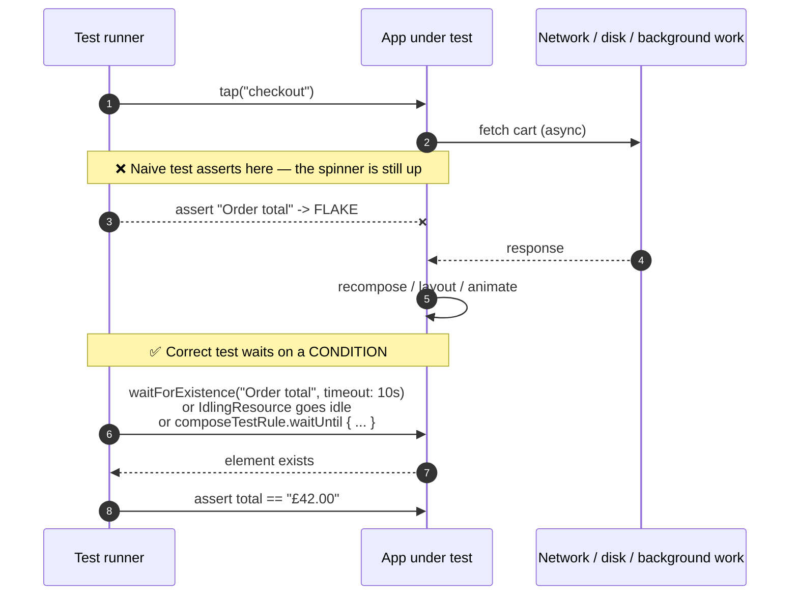

# Mobile UI Testing Lab

Build a UI suite people actually trust: a few high-value end-to-end flows, deterministic data, real
synchronisation instead of sleeps, and a flake budget you measure. Taught from first principles with
trade-offs and the **Learning Footer**, per [`AGENTS.md`](../../../AGENTS.md). Pairs with
[e2e-testing-coach](../e2e-testing-coach/SKILL.md) and [flaky-test-fixer](../flaky-test-fixer/SKILL.md).

## When to use

- You have no UI tests and need to choose the first three flows worth automating.
- The suite exists but is red half the time, and the team's fix is "re-run it".
- Tests pass locally and fail on CI or on a device farm — timing, locale, animations or data differ.
- Selectors break on every copy change because tests match on visible text.
- You need visual regression coverage (theming, Dynamic Type, RTL) without hand-checking screenshots.
- **Don't use it for** unit/business-logic tests ([test-writer](../test-writer/SKILL.md),
  [python-testing-lab](../python-testing-lab/SKILL.md)), API contracts
  ([contract-testing-coach](../contract-testing-coach/SKILL.md),
  [api-testing-coach](../api-testing-coach/SKILL.md)), web browsers
  ([playwright-test-lab](../playwright-test-lab/SKILL.md),
  [cypress-test-lab](../cypress-test-lab/SKILL.md)), or as a way to cover everything through the UI — that
  suite will be slow, flaky and expensive by construction.

## First principles: a UI test is a race you must not run

A UI test drives the app from **outside its process** (XCUITest and Appium literally do; Espresso runs
in-process but on a separate instrumentation thread). That creates a fundamental asymmetry: the test issues
an action, and the app responds *eventually* — after layout, animation, disk, network and background work.
Every flaky UI test is the same bug: **the test asserted before the app was ready, and the gap was usually
big enough — until CI was slow.**

There are only three legitimate answers to "wait for what?":

1. **Framework-level synchronisation.** Espresso automatically waits for the main looper to be idle and the
   view hierarchy to settle; anything asynchronous it cannot see must be published via an `IdlingResource`
   (e.g. `CountingIdlingResource`) registered with `IdlingRegistry`. Compose tests synchronise against the
   composition clock through `ComposeTestRule`, with `waitUntil { }` and manual `mainClock` control.
2. **Condition-based waiting.** XCUITest's `waitForExistence(timeout:)` and `XCTNSPredicateExpectation`
   poll a *condition*, not a duration. Appium exposes explicit waits over the W3C WebDriver protocol.
3. **Removing the race.** Disable animations, stub the network, and seed data deterministically so there is
   nothing to wait for.

`Thread.sleep` / `sleep(2)` is never one of the three: it is simultaneously too short on a loaded CI machine
and too long on every green run, so it makes the suite both flaky *and* slow.



*Figure: the flake window is the gap between action and readiness. You close it by waiting on a condition
the app publishes — never by sleeping for a guessed duration.*

**Pick the level deliberately.** UI tests are the slowest, most brittle and most expensive layer, so the
pyramid still applies: most logic in unit tests, integration for the seams, and a small set of UI tests for
the flows whose failure would be a P1.

| Framework | Runs | Strength | Cost / caveat |
| --- | --- | --- | --- |
| **XCUITest** (Apple, XCTest UI testing) | out of process, iOS/iPadOS/tvOS | first-party, records tests, works on the real system UI, parallel destinations | slower; queries can be brittle if you match on text |
| **Espresso** (`androidx.test.espresso`) | in-process instrumentation, Android | automatic main-looper synchronisation makes it fast and stable | in-app only — use UI Automator for cross-app/system UI |
| **Compose test** (`androidx.compose.ui:ui-test-junit4`) | in-process, Android | asserts on the **semantics tree**, so it shares selectors with accessibility | needs `waitUntil`/clock control for async or infinite animations |
| **UI Automator** | out of process, Android | system UI, permissions dialogs, multi-app | coarser selectors, no compile-time safety |
| **Appium** (W3C WebDriver; XCUITest + UiAutomator2 drivers) | out of process, both platforms | one language/suite for iOS + Android and hybrid apps | extra layer to debug; slowest; driver/version drift |
| **Snapshot/screenshot** (swift-snapshot-testing, Paparazzi, Roborazzi, Compose screenshot testing) | mostly host JVM/simulator | catches visual regressions cheaply, great for theme/Dynamic Type/RTL matrices | image diffs are environment-sensitive; pin OS, device and font settings |

⚠ Framework APIs and tool availability move (Appium 2 driver install, Gradle Managed Devices, Compose
Preview screenshot testing, `XCUIElement.waitForNonExistence`) — confirm names and availability on the
current Apple Developer, developer.android.com and appium.io pages before scripting them.

## Procedure

1. **Choose flows by blast radius, not by coverage.** Write down the 3–5 journeys whose breakage would be a
   P1 (sign-in, purchase, the core create action). Everything else belongs one layer down. Use
   [test-plan-designer](../test-plan-designer/SKILL.md) if the scope is contested.
2. **Make the app testable before writing a test.** Add stable identifiers:
   `accessibilityIdentifier` (iOS), `android:id` or `Modifier.testTag("checkout_button")` (Android). Never
   select on user-visible copy — it breaks on every wording change and on every locale.
3. **Make each run hermetic.** Launch with a flag that selects stubbed data and a fixed clock/locale
   (`app.launchArguments += ["-UITest", "-AppleLanguages", "(en)"]`; on Android pass instrumentation
   arguments or a debug-only `BuildConfig` switch). Reset state between tests: Android Test Orchestrator
   with `clearPackageData = true`; on iOS, uninstall or reset the simulator between suites.
4. **Kill the animations.** Android emulator: set window, transition and animator duration scales to 0
   (`adb shell settings put global window_animation_scale 0.0`, and the `transition_animation_scale` /
   `animator_duration_scale` equivalents). iOS simulator: `-UIAnimationDragCoefficient`/reduce-motion, or
   the `UIView.setAnimationsEnabled(false)` path behind your UI-test flag.
5. **Write the first test in Given/When/Then**, one behaviour per test, no shared mutable state between
   tests, and assert on something the *user* could observe.
6. **Replace every sleep with a wait on a condition.** iOS: `XCTAssertTrue(el.waitForExistence(timeout: 10))`
   and `XCTNSPredicateExpectation`. Espresso: register a `CountingIdlingResource` around your async work, or
   use `IdlingRegistry` with an OkHttp/WorkManager idling resource. Compose:
   `composeTestRule.waitUntil(5_000) { composeTestRule.onAllNodesWithTag("row").fetchSemanticsNodes().isNotEmpty() }`.
7. **Introduce the Page Object / Robot pattern** so selectors live in one place and tests read as prose.
   A copy change should then be a one-line edit, not a suite-wide sed.
8. **Add snapshot tests for the visual matrix** — light/dark, largest Dynamic Type/font scale, RTL,
   smallest and largest device. Pin the simulator/device, OS version and font settings, and review diffs as
   part of code review. Cross-check the accessibility side with
   [mobile-accessibility-coach](../mobile-accessibility-coach/SKILL.md), and add automated a11y assertions:
   `XCUIApplication().performAccessibilityAudit()` (Xcode 15+) and Espresso's
   `AccessibilityChecks.enable()`.
9. **Run it on CI the way it will actually run.** Parallelise (`xcodebuild ... -parallel-testing-enabled YES`,
   Gradle Managed Devices or a device farm such as Firebase Test Lab / AWS Device Farm / BrowserStack),
   pin OS and device models, and collect artefacts on failure — screenshots (`XCTAttachment`), video, and
   the device log. A failure you cannot diagnose from CI artefacts will be re-run instead of fixed.
10. **Measure flakiness explicitly.** Track per-test pass rate over the last N runs. Quarantine anything
    below your threshold (it must not block merges) and give it an owner and a deadline; auto-retries
    without measurement simply hide the defect. Use
    [flaky-test-fixer](../flaky-test-fixer/SKILL.md) for the root-cause loop.
11. **Report the suite's health**: runtime, pass rate, flake rate, coverage of the P1 flows, and what is
    deliberately *not* covered. Close with the **Learning Footer**.

## Output shape

```
Mobile UI test lab — <app> · <flows> · frameworks: <XCUITest | Espresso/Compose | Appium>
Scope: <3-5 P1 journeys>            Explicitly NOT covered by UI tests: <...>

Determinism setup:
  selectors      <accessibilityIdentifier / testTag>  — text-based selectors remaining: <n>
  data           <stub server | seeded fixture | fixed clock + locale>
  state reset    <Test Orchestrator clearPackageData | simulator reset>
  animations     <disabled: y/n, how>

Synchronisation:
  sleeps removed <n>  ->  <waitForExistence | IdlingResource | composeTestRule.waitUntil>
  default timeout <..s>   longest legitimate wait: <what and why>

Suite health (last <N> CI runs):
  tests <n>   runtime <mm:ss> (parallel <n> shards)   pass rate <..%>   flake rate <..%>
  quarantined <n> (owner, due date)
  artefacts on failure: <screenshot | video | logs>  — diagnosable without a re-run? <y/n>

Visual/a11y:
  snapshot matrix <light/dark × text sizes × RTL × devices>   diffs pending review: <n>
  a11y audit in-suite: <performAccessibilityAudit | AccessibilityChecks> -> <n> issues

Top flake cause found: <race | shared state | animation | network | device>
Fix applied: <...>          Verified by: <n consecutive green runs / re-run x50>
Next: <linked skill>
Learning Footer
```

## Worked example — de-flaking "add to cart → checkout"

**Symptom.** `testCheckoutShowsTotal` passes locally and fails ~30% of the time on CI, on both platforms.

**Trace the failure, don't re-run it.** The CI screenshot artefact shows the loading spinner still on
screen. So the app was not ready; the test asserted anyway. Now fix it at each level.

**iOS — before (three separate defects in six lines):**

```swift
func testCheckoutShowsTotal() {
    let app = XCUIApplication()
    app.launch()
    app.buttons["Add to cart"].tap()          // (1) selector = user-visible copy: breaks on rewording/locale
    sleep(2)                                  // (2) guessed duration: too short on CI, wasted time when green
    app.buttons["Checkout"].tap()
    XCTAssertTrue(app.staticTexts["£42.00"].exists)  // (3) `.exists` is a snapshot NOW, not a wait
}
```

**iOS — after:**

```swift
func testCheckoutShowsTotal() {
    let app = XCUIApplication()
    // Hermetic: stubbed catalogue, fixed locale/currency, animations off — no race to lose.
    app.launchArguments += ["-UITest", "-StubCatalogue", "-AppleLanguages", "(en)",
                            "-AppleLocale", "en_GB"]
    app.launch()

    app.buttons["addToCart_button"].tap()     // stable accessibilityIdentifier, set in the app code

    let checkout = app.buttons["checkout_button"]
    XCTAssertTrue(checkout.waitForExistence(timeout: 10),   // waits on a CONDITION, returns early
                  "Checkout never appeared — cart fetch did not complete")
    checkout.tap()

    let total = app.staticTexts["orderTotal_label"]
    XCTAssertTrue(total.waitForExistence(timeout: 10))
    XCTAssertEqual(total.label, "£42.00")     // assert the value, after proving readiness
}
```

**Android — Espresso, before and after.** The async cart fetch is invisible to Espresso's looper
synchronisation, so it must be published:

```kotlin
// Before: Espresso does not know about the OkHttp call, so it proceeds immediately.
onView(withText("Add to cart")).perform(click())
Thread.sleep(2000)                                   // the same three defects as iOS
onView(withText("£42.00")).check(matches(isDisplayed()))
```

```kotlin
// App code (debug/test source set): publish "I am busy" so the framework can wait for it.
object CartIdlingResource {
    val counter = CountingIdlingResource("cart")
    suspend fun <T> tracked(block: suspend () -> T): T {
        counter.increment()
        try { return block() } finally { counter.decrement() }
    }
}

// Test
@Before fun setUp()    { IdlingRegistry.getInstance().register(CartIdlingResource.counter) }
@After  fun tearDown() { IdlingRegistry.getInstance().unregister(CartIdlingResource.counter) }

@Test fun checkoutShowsTotal() {
    onView(withId(R.id.addToCart_button)).perform(click())   // stable id, not copy
    // No sleep: Espresso now blocks until the looper is idle AND the counter is zero.
    onView(withId(R.id.checkout_button)).perform(click())
    onView(withId(R.id.orderTotal_label)).check(matches(withText("£42.00")))
}
```

**Compose — the same flow against the semantics tree:**

```kotlin
@get:Rule val rule = createAndroidComposeRule<MainActivity>()

@Test fun checkoutShowsTotal() {
    rule.onNodeWithTag("addToCart_button").performClick()
    // waitUntil polls the composition instead of sleeping; it fails loudly on timeout.
    rule.waitUntil(timeoutMillis = 5_000) {
        rule.onAllNodesWithTag("checkout_button").fetchSemanticsNodes().isNotEmpty()
    }
    rule.onNodeWithTag("checkout_button").performClick()
    rule.onNodeWithTag("orderTotal_label").assertTextEquals("£42.00")
}
```

**CI hardening, then verification.**

```bash
# Android: zero animations + full state reset between tests
adb shell settings put global window_animation_scale 0.0
adb shell settings put global transition_animation_scale 0.0
adb shell settings put global animator_duration_scale 0.0
./gradlew connectedDebugAndroidTest      # with testOptions { execution "ANDROIDX_TEST_ORCHESTRATOR" }
                                         # and clearPackageData = true

# iOS: parallel, pinned destination, artefacts kept for diagnosis
xcodebuild test -scheme App \
  -destination 'platform=iOS Simulator,name=iPhone 15,OS=17.5' \
  -parallel-testing-enabled YES -maximum-concurrent-test-simulator-destinations 3 \
  -retry-tests-on-failure -test-iterations 2 -resultBundlePath ./TestResults.xcresult
```

**Result.** Ran the test 50× on CI: 50/50 green (was ~35/50). Median runtime fell from 46 s to 19 s, because
the two `sleep(2)` calls were paid on *every* green run while the real wait is ~300 ms. Note the
`-retry-tests-on-failure` flag stays only as a diagnostic safety net — the flake rate is still tracked per
test, so retries never become the fix.

## Tips

- **Every `sleep` in a UI test is a latent CI failure.** Wait on a condition the app publishes, or remove the
  asynchrony from the test environment entirely.
- Select on stable identifiers (`accessibilityIdentifier`, `testTag`, `R.id`), never on user-visible copy —
  and note that Compose selectors are the *accessibility semantics*, so good a11y makes tests easier.
- Hermetic beats realistic for UI tests: stub the network, fix the clock, locale and time zone, and seed the
  database. Keep one small smoke suite against a real backend if you need contract confidence.
- Disable animations everywhere; animation timing is the single most common cross-device flake source.
- Keep the pyramid: if a case can be proven in a unit test, it should not be a UI test. UI tests are for
  wiring and journeys.
- Use the Page Object / Robot pattern so a copy or layout change touches one file.
- Retries hide flakes; **measure** per-test pass rate and quarantine with an owner and a deadline.
- Make failures diagnosable from CI alone: screenshot + video + device log attached to every failure,
  otherwise the team's only tool is "re-run".
- Related: [flaky-test-fixer](../flaky-test-fixer/SKILL.md),
  [e2e-testing-coach](../e2e-testing-coach/SKILL.md), [test-plan-designer](../test-plan-designer/SKILL.md),
  [test-doubles-coach](../test-doubles-coach/SKILL.md), [test-writer](../test-writer/SKILL.md),
  [mobile-accessibility-coach](../mobile-accessibility-coach/SKILL.md),
  [mobile-app-performance-lab](../mobile-app-performance-lab/SKILL.md) (benchmarks live in the same suite),
  and [mobile-release-coach](../mobile-release-coach/SKILL.md) for the gate before rollout.
  End with the **Learning Footer** (`AGENTS.md`).
