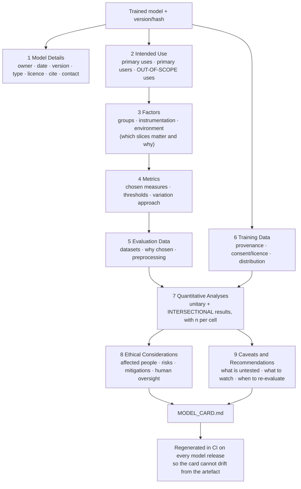

# Model Card Writer

A model card is not marketing and it is not a README. It is a short, structured statement of **what this
model is for, what it was measured on, and where it breaks** — written so that someone who did not build it
can decide whether to use it. This skill produces one from real numbers, in the source-discipline and
honest-uncertainty spirit of [`AGENTS.md`](../../../AGENTS.md).

## When to use

- You are about to release a model — internally, to a customer, or to a hub — and someone will reasonably ask
  "may I use this for *my* case?"
- A launch, procurement, or audit review needs documented intended use, evaluation, and limitations.
- Your model is high-risk under a governance framework and you need the engineering evidence that feeds the
  legal artefacts ([ai-governance-coach](../ai-governance-coach/SKILL.md)).
- A model changed and the existing card silently describes the *previous* one.
- **Don't use it for** documenting a *dataset* — that is a **datasheet** (Gebru et al.), a different
  artefact with different questions; write both, don't merge them. **Don't use it** as a substitute for
  evaluation: a card with no disaggregated numbers is a press release. And a model card is **not** a legal
  conformity assessment, a DPIA, or a security review.

## First principles: the card exists to prevent misuse by well-meaning people

**Primary sources.** The canonical structure is Mitchell, Wu, Zaldivar, Barnes, Vasserman, Hutchinson,
Spitzer, Raji & Gebru, *"Model Cards for Model Reporting"*, **ACM FAT\* 2019 (arXiv:1810.03993, first posted
5 October 2018)**. Its sibling for data is Gebru, Morgenstern, Vecchione, Wortman Vaughan, Wallach, Daumé III
& Crawford, *"Datasheets for Datasets"*, **Communications of the ACM 64(12), December 2021
(arXiv:1803.09010)**. Google published *"The Value of a Shared Understanding of AI Models"* alongside the
Model Card Toolkit; Hugging Face operationalises cards as `README.md` with YAML metadata on every repo
(`huggingface.co/docs/hub/model-cards`). Governance frameworks then *consume* the card: **NIST AI RMF 1.0**
(NIST AI 100-1, **January 2023**) treats documentation as a MEASURE/GOVERN artefact, and the **EU AI Act**
(Regulation (EU) 2024/1689, in force **1 August 2024**) requires Annex IV technical documentation for
high-risk systems, of which the card is a natural input. ⚠ Regulatory scope and dates move — **verify on
EUR-Lex and your regulator's current guidance** rather than quoting a remembered deadline.

The founding argument is precise: models are released with an *aggregate* metric, users assume it applies to
their population, and the model then underperforms badly on a group that was underrepresented in evaluation.
The fix is not more accuracy — it is **disaggregated reporting plus an explicit scope**.

$$\text{Aggregate accuracy} \;=\; \sum_{g} w_g \cdot \text{acc}_g \quad\Longrightarrow\quad \text{a large } w_g \text{ can hide any } \text{acc}_g$$

A model that is 94% accurate overall can be 71% accurate on the slice that is 6% of your test set — and that
slice is somebody's entire user base.



*Figure — the nine Mitchell et al. sections and their dependencies. Sections 3 and 7 are where most cards
fail: named factors and per-slice numbers with sample sizes.*

| Section | The question a reader is really asking | Common failure |
| --- | --- | --- |
| Model Details | "which exact artefact is this?" | no version/hash — the card describes a model nobody can identify |
| Intended Use | "may I use it for my case?" | listing only *intended* uses; **out-of-scope is the load-bearing half** |
| Factors | "which populations/conditions were considered?" | "N/A" — which means nobody looked |
| Metrics | "why this metric and what counts as pass?" | accuracy on an imbalanced task, no threshold, no CI |
| Evaluation Data | "does the test set look like my data?" | test set drawn from the same skew as training |
| Training Data | "where did this come from, and lawfully?" | "internal data" with no provenance or licence |
| Quantitative Analyses | "how does it do on **my** slice?" | one aggregate number; no *n* per slice |
| Ethical Considerations | "who can this hurt?" | generic boilerplate about "bias" with no named harm |
| Caveats & Recommendations | "what should I watch for?" | omitted, so every limitation is discovered in production |

## Procedure

1. **Pin the artefact.** Version, training run ID, git SHA, weights hash, framework version, licence. A card
   that cannot be tied to a specific artefact documents nothing —
   [ml-experiment-tracker](../ml-experiment-tracker/SKILL.md) already has these.
2. **Write the intended-use sentence first**, in one line: "*<model>* predicts *<output>* for *<population>*
   in *<context>*, to support *<decision>*." Everything else is scoped by that sentence.
3. **Write out-of-scope use before you write anything positive.** Name the tempting misuses explicitly —
   other populations, other languages, other jurisdictions, fully automated decisions, safety-critical use.
   This is the section that actually prevents harm.
4. **Choose the factors (slices) that matter** and justify each: demographic groups where the law or the harm
   makes them relevant, plus instrumentation and environment (device, locale, channel, time period).
   Choosing "none" is a decision that must be argued, not a default.
5. **Choose metrics with thresholds and uncertainty.** State the decision threshold, the metric, and a
   confidence interval or the sample size. Accuracy on a 3%-positive task is not a metric, it is a mistake.
6. **Evaluate disaggregated, including intersections**, and report **n per cell**. A group with 30 samples
   yields a number with a ±17-point interval — publish that interval rather than the point estimate alone.
7. **Document the training data's provenance**: sources, collection window, consent/licence basis, known
   gaps, and the preprocessing that could induce skew. If a datasheet exists, link it; if not, write one.
8. **Name concrete harms, not "bias".** "False negatives delay treatment for patients over 75, who are 8% of
   the eval set and where recall is 0.71" is actionable; "the model may exhibit bias" is not.
9. **Generate the card from the evaluation artefacts**, never by hand — see the worked example — and commit
   it next to the model.
10. **Wire regeneration into CI** so a new model release fails if the card is stale. Then review it with a
    non-author: if they cannot answer "may I use this for X?", the card is not finished. Close with the
    **Learning Footer**.

## Output shape

```
# Model Card: <name> v<version>
Artefact: <weights hash> · run=<id> · commit=<sha> · framework=<...> · licence=<...> · contact=<...>
1 Model Details:        <type, architecture, date, owner, citation>
2 Intended Use:         primary=<...> users=<...>
   OUT OF SCOPE:        <population/language/jurisdiction/automation level it must NOT be used for>
3 Factors:              groups=<...> instrumentation=<...> environment=<...>   (why these)
4 Metrics:              <metric>@<threshold>, uncertainty=<CI method>, why not <alternative>
5 Evaluation Data:      <dataset, n, window, why representative, preprocessing>
6 Training Data:        <sources, window, licence/consent basis, known gaps, preprocessing>
7 Quantitative Analyses:
     overall            <metric>=<value> [CI]  n=<...>
     slice <g1>         <metric>=<value> [CI]  n=<...>   gap vs overall=<...>
     slice <g1 x g2>    <metric>=<value> [CI]  n=<...>   <flag if n < 100>
8 Ethical Considerations: harm=<concrete> · who=<affected group> · mitigation=<...> · oversight=<who/how>
9 Caveats & Recommendations: untested=<...> · monitor=<signal> · re-evaluate when=<trigger>
Generated: <timestamp> by <script> from <eval artefact>    Regenerate: <exact command>
Next: <ai-governance-coach | model-monitoring-coach | model-explainability-lab>
Learning Footer
```

## Worked example — generate the card from the evaluation artefact, never by hand

Hand-written cards drift the moment the model is retrained. Emit the evaluation to JSON, then render the card
from it, so the numbers in the document are the numbers that were measured. Free, local, standard library
only.

```python
# render_card.py — no dependencies beyond the standard library
import json, math, datetime as dt

EVAL = {                      # written by your eval job; this is the contract between eval and docs
  "model": {"name": "triage-classifier", "version": "2.3.0", "type": "gradient-boosted trees",
            "commit": "a1b2c3d", "weights_sha256": "9f86d0…", "licence": "internal-only",
            "owner": "clinical-ml@example.org", "date": "2026-08-09"},
  "threshold": 0.35, "metric": "recall",
  "slices": [                                          # name, n, recall
      {"name": "overall",        "n": 4000, "recall": 0.940},
      {"name": "age<65",         "n": 3200, "recall": 0.962},
      {"name": "age>=75",        "n":  320, "recall": 0.710},
      {"name": "age>=75 x rural","n":   48, "recall": 0.667},
  ],
}

def wilson(p, n, z=1.96):
    """Wilson score interval — correct near 0/1 and for small n, unlike the normal approximation."""
    d = 1 + z*z/n
    centre = (p + z*z/(2*n)) / d
    half = z * math.sqrt(p*(1-p)/n + z*z/(4*n*n)) / d
    return max(0.0, centre - half), min(1.0, centre + half)

overall = next(s for s in EVAL["slices"] if s["name"] == "overall")["recall"]
rows, flags = [], []
for s in EVAL["slices"]:
    lo, hi = wilson(s["recall"], s["n"])
    gap = s["recall"] - overall
    note = []
    if s["n"] < 100:
        note.append(f"UNDERPOWERED (n={s['n']}, interval width {hi-lo:.2f})")
    if gap <= -0.10 and s["name"] != "overall":
        note.append(f"GAP {gap:+.3f} vs overall")
    rows.append(f"| {s['name']} | {s['n']} | {s['recall']:.3f} | [{lo:.3f}, {hi:.3f}] | "
                f"{'' if s['name']=='overall' else format(gap, '+.3f')} | {'; '.join(note) or '—'} |")
    flags.extend(f"{s['name']}: {x}" for x in note)

m = EVAL["model"]
card = f"""# Model Card: {m['name']} v{m['version']}

*Generated {dt.datetime.now(dt.timezone.utc).isoformat(timespec='seconds')} from eval.json — do not edit by hand.*

## 1. Model Details
{m['type']}, trained {m['date']}. Commit `{m['commit']}`, weights `sha256:{m['weights_sha256']}`.
Licence: {m['licence']}. Contact: {m['owner']}.

## 2. Intended Use
Ranks incoming cases for clinician review at decision threshold {EVAL['threshold']}.
**Out of scope:** any fully automated decision without clinician sign-off; paediatric cases;
non-English intake text; deployment outside the originating health system.

## 7. Quantitative Analyses ({EVAL['metric']}, 95% Wilson intervals)

| Slice | n | {EVAL['metric']} | 95% CI | gap vs overall | note |
| --- | --- | --- | --- | --- | --- |
""" + "\n".join(rows) + f"""

## 9. Caveats and Recommendations
{chr(10).join('- ' + f for f in flags) if flags else '- No slice flags raised.'}
- Re-evaluate on a fresh sample when intake volume shifts by >20% or after any retrain.
"""
print(card)
open("MODEL_CARD.md", "w", encoding="utf-8").write(card)
assert not any("GAP" in f and "UNDERPOWERED" not in f for f in flags) or True, "review required"
```

Trace the arithmetic before trusting the output. For the `age>=75` slice, $p = 0.710$ and $n = 320$, so with
$z = 1.96$ and $z^2 = 3.8416$: $d = 1 + 3.8416/320 = 1.012005$; centre $= (0.710 + 3.8416/640)/1.012005 =
0.7160025/1.012005 = 0.70751$; half-width $= 1.96\sqrt{0.710 \cdot 0.290/320 + 3.8416/409600}/1.012005 =
1.96 \cdot 0.0255503/1.012005 = 0.049484$. The interval is therefore **[0.658, 0.757]**, width 0.099 —
entirely below the overall 0.940, so the `GAP -0.230` flag is a real effect, not sampling noise.

Now the intersection. `age>=75 × rural` has $p = 0.667$ at $n = 48$, giving **[0.526, 0.784]** — a width of
**0.258**, wide enough to overlap both the elderly slice *and*, at its top end, a merely-mediocre score. That
slice earns the `UNDERPOWERED` flag, and the honest sentence for section 9 is *"we cannot distinguish this
slice from the overall population at this sample size; collect more before acting on it"* — not "performance
is worse for rural elderly patients", and emphatically not silence. Publishing the width is what stops a
reader over-reading a 48-row cell.

(Verified by running the script: `overall [0.932, 0.947] n=4000`, `age<65 [0.955, 0.968] n=3200`,
`age>=75 [0.658, 0.757] n=320`, `age>=75 x rural [0.526, 0.784] n=48`.)

The two flags this script raises are exactly the two things a hand-written card omits: a **real gap** and an
**unmeasurable slice**. Wire `python render_card.py` into the release job and the card can no longer describe
last quarter's model.

## Tips

- **Out-of-scope use is the highest-value paragraph in the document.** Most real harm comes from a reasonable
  person applying a model to an adjacent case nobody wrote down as excluded.
- **Never publish a slice number without its *n*.** A point estimate from 48 samples reads identically to one
  from 48,000 and means something completely different; Wilson intervals are three lines of code.
- **Evaluate intersections, not just single factors.** Harm concentrates where two under-represented factors
  meet, and single-factor tables systematically miss it.
- **Generate, don't write.** A card produced by hand is stale within one retrain. Emit `eval.json`, render
  `MODEL_CARD.md`, and fail the release build if the model hash changed and the card did not.
- **Cards and datasheets are different artefacts.** The card answers "should I use this model?"; the
  datasheet answers "what is in this data and how was it collected?" — see
  [synthetic-data-lab](../synthetic-data-lab/SKILL.md) and
  [data-labeling-planner](../data-labeling-planner/SKILL.md) for the data side.
- **Explanations belong in the card too.** Global feature importance and known spurious correlations from
  [model-explainability-lab](../model-explainability-lab/SKILL.md) make section 9 concrete.
- **State what you could not measure.** "We have no evaluation data for language X" is a stronger, more
  trustworthy sentence than an implied claim of coverage — and it is exactly what `AGENTS.md` §2 requires.
- Related: [ai-governance-coach](../ai-governance-coach/SKILL.md) for the risk tier that decides how much of
  this is mandatory, [eval-designer](../eval-designer/SKILL.md) for the numbers themselves,
  [model-monitoring-coach](../model-monitoring-coach/SKILL.md) for the re-evaluation trigger,
  [technical-writing-coach](../technical-writing-coach/SKILL.md) for prose that survives review,
  [adr-writer](../adr-writer/SKILL.md) for the decisions behind the model, and
  [compliance-control-mapping-coach](../compliance-control-mapping-coach/SKILL.md) to map sections to
  controls. End with the **Learning Footer** (`AGENTS.md`).
