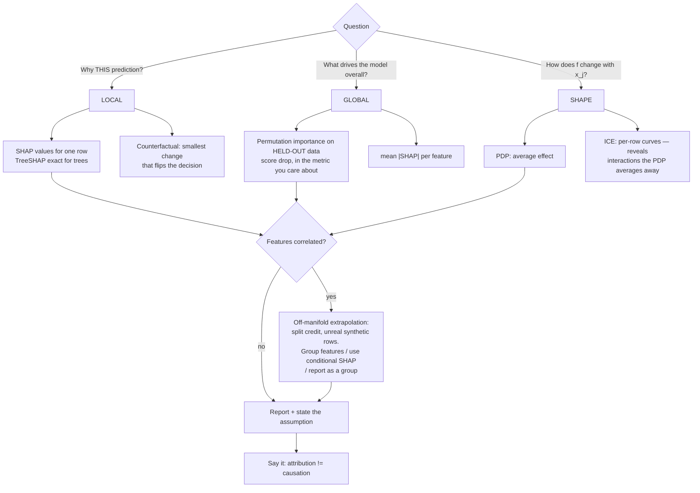

# Model Explainability Lab

Attribution done properly: **global vs local → method → assumption → caveat**, computed hands-on and
checked against the maths, following the verify-before-you-teach rule in
[`AGENTS.md`](../../../AGENTS.md). Every method here is *faithful to the model*, never to the world.

## When to use

- A stakeholder or regulator asks "why did the model output this?" for one case (local) or "what drives
  the model overall?" (global) — and the two require different tools.
- Default `feature_importances_` disagrees with domain knowledge and you need an importance you can defend.
- You need to show a monotone or threshold effect for a feature, or spot a subgroup where the effect flips.
- **Don't use it for** causal claims ("raising income *causes* approval"), model debugging of data leakage
  alone, or as a substitute for a model that is *inherently* interpretable in a high-stakes setting —
  Rudin (Nature Machine Intelligence, 2019) argues that point forcefully.

## First principles: attribution is a game, not a truth

**SHAP** (Lundberg & Lee, NeurIPS 2017, *A Unified Approach to Interpreting Model Predictions*) borrows
the Shapley value from cooperative game theory: each feature is a player, the payout is the prediction,
and the Shapley value is the *average marginal contribution* of a feature over all orderings. It is the
unique attribution satisfying local accuracy (additivity), missingness, and consistency — which gives the
identity you should always verify yourself:

$$f(x) = \phi_0 + \sum_{j=1}^{p}\phi_j, \qquad \phi_0 = \mathbb{E}[f(X)]$$

**TreeSHAP** (Lundberg et al., *Nature Machine Intelligence*, 2020) computes this exactly for tree
ensembles in polynomial time; KernelSHAP approximates it for arbitrary models by weighted local
regression (and is slow and noisy). **Permutation importance** (Breiman 2001; formalised as *model
reliance* by Fisher, Rudin & Dominici, JMLR 2019) measures the drop in a *score* when one column is
shuffled. **PDP** (Friedman 2001) averages the model over the marginal distribution of the other
features; **ICE** (Goldstein et al., 2015) draws one curve per row so averaging cannot hide heterogeneity.



| Method | Scope | Assumes | Cost | Fails when |
| --- | --- | --- | --- | --- |
| Impurity / gain importance | global | nothing stated | free | biased toward high-cardinality & continuous features; computed on *training* data |
| Permutation importance | global | feature independence when permuting | k × p model evaluations | correlated features share credit; creates impossible rows; sensitive to the chosen metric |
| TreeSHAP | local + global | tree structure; interventional vs conditional choice matters | fast, exact for trees | correlated features: interventional SHAP evaluates off-manifold, conditional SHAP spreads credit to proxies |
| KernelSHAP | local | model-agnostic sampling | very slow, high variance | small `nsamples` gives unstable values people then over-read |
| PDP | shape | the plotted feature is independent of the rest | m grid × n rows | extrapolates into regions with no data; hides opposing subgroups |
| ICE | shape | same as PDP | same | visually noisy above ~200 curves — sample and centre them |
| Counterfactual | local | actionable feature set | search cost | may propose changes that are immutable or unrealistic |

**The honest caveats.** SHAP's additivity holds in the model's *link* space — for a binary XGBoost
classifier that is log-odds, so values do not sum to a probability. `mean |SHAP|` is a magnitude, not a
signed effect, and it is not a permutation score, so the two rankings legitimately differ. Neither answers
a causal question: both describe the fitted function, including whatever confounding and proxy structure
the training data contained. Say that in every report.

## Procedure

1. **Fix the question**: one row (local), the whole model (global), or the shape of one feature — the
   answer determines the method, not vice versa.
2. **Explain on held-out data.** Importance computed on the training set measures memorisation. Permutation
   importance in particular must use validation/test rows and the deployed metric.
3. **Check correlation first** (`|r| > 0.7` pairs, or VIF). If features are correlated, plan to report
   *groups*, not individual features — otherwise credit splits arbitrarily between proxies.
4. **Prefer TreeSHAP** for tree models; reserve KernelSHAP for genuine black boxes and then report the
   sampling budget with the values.
5. **Verify additivity numerically** — `shap_values.sum(1) + base_value ≈ model_margin` — before you show
   anyone a beeswarm plot. If it fails, your `feature_perturbation` mode / background data or the link function is wrong (`TreeExplainer(model)` with no `data=` is `tree_path_dependent`; passing `data=` switches to `interventional`).
6. **Draw ICE with the PDP overlaid**, centred at the left edge. Crossing ICE curves mean an interaction,
   and the PDP alone would have lied by averaging.
7. **Run permutation importance with `n_repeats ≥ 10`** and report the standard deviation; a single shuffle
   is a coin flip.
8. **Write the caveat line** — data range, correlation, and "association within this model, not causation"
   — then close with the **Learning Footer**.

## Output shape

```
Question: <local (row id) | global | shape of feature x_j>   Audience: <engineer|regulator|end user>
Model: <xgboost|lightgbm|sklearn|black-box>   Explained on: <validation|test> n=<...>
Correlation check: <pairs with |r|>0.7 ...>  -> reporting as <individual features | groups>
Global: permutation importance (metric=<...>, n_repeats=<n>) top-5 = <feature: drop ± sd>
Global: mean|SHAP| top-5 = <...>   Disagreement with permutation: <feature(s)> because <...>
Local (row <id>): base=<phi_0> + contributions <f1:+x, f2:-y, ...> = <model output in log-odds/units>
Additivity check: sum(phi) + phi_0 = <...> vs model margin <...>  [PASS|FAIL]
Shape: PDP+ICE for <x_j> — effect <monotone|threshold at ...|non-monotone>; ICE crossing=<yes/no>
Caveats: correlated=<...> · off-manifold region=<...> · link space=<log-odds|raw> · NOT causal
Next: <ai-governance-coach | gradient-boosting-lab | model-monitoring-coach>
Learning Footer
```

## Worked example — TreeSHAP, permutation importance, PDP/ICE, all cross-checked

```python
# pip install shap xgboost scikit-learn matplotlib numpy
import numpy as np, xgboost as xgb, shap, matplotlib.pyplot as plt
from sklearn.datasets import make_classification
from sklearn.model_selection import train_test_split
from sklearn.inspection import permutation_importance, PartialDependenceDisplay

X, y = make_classification(n_samples=8000, n_features=12, n_informative=5,
                           n_redundant=3, random_state=0)          # redundant => correlated on purpose
names = [f"f{i}" for i in range(X.shape[1])]
X_tr, X_te, y_tr, y_te = train_test_split(X, y, test_size=0.3, stratify=y, random_state=0)

model = xgb.XGBClassifier(n_estimators=300, learning_rate=0.05, max_depth=4,
                          reg_lambda=2.0, tree_method="hist", eval_metric="logloss",
                          random_state=0).fit(X_tr, y_tr)

# --- 1) LOCAL + GLOBAL: TreeSHAP, then VERIFY the additivity identity ----------
explainer = shap.TreeExplainer(model)                 # margin (log-odds) space for binary:logistic
sv = explainer(X_te)                                  # sv.values (n, p), sv.base_values (n,)
margin = model.predict(X_te, output_margin=True)
recon = sv.values.sum(axis=1) + sv.base_values
assert np.allclose(recon, margin, atol=1e-4), "additivity broken — check background data / link space"
print("additivity OK; base(log-odds) =", round(float(sv.base_values[0]), 4))

row = 0
order = np.argsort(-np.abs(sv.values[row]))[:4]
for j in order:
    print(f"  local row0 {names[j]:>3}: {sv.values[row, j]:+.4f} log-odds (x={X_te[row, j]:.2f})")

mean_abs = np.abs(sv.values).mean(axis=0)
print("mean|SHAP| top5:", [names[j] for j in np.argsort(-mean_abs)[:5]])

# --- 2) GLOBAL: permutation importance on HELD-OUT data, with variance ---------
perm = permutation_importance(model, X_te, y_te, scoring="roc_auc",
                              n_repeats=20, random_state=0, n_jobs=-1)
for j in np.argsort(-perm.importances_mean)[:5]:
    print(f"  perm {names[j]:>3}: AUC drop {perm.importances_mean[j]:.4f} ± {perm.importances_std[j]:.4f}")

# --- 3) SHAPE: PDP with ICE overlaid, centred ---------------------------------
top = int(np.argmax(mean_abs))
PartialDependenceDisplay.from_estimator(
    model, X_te, features=[top], feature_names=names,
    kind="both", centered=True, subsample=150, random_state=0)
plt.tight_layout(); plt.savefig("pdp_ice.png", dpi=150)

# --- 4) Honest correlation caveat ---------------------------------------------
C = np.corrcoef(X_te, rowvar=False)
pairs = [(names[i], names[j], round(float(C[i, j]), 2))
         for i in range(len(names)) for j in range(i + 1, len(names)) if abs(C[i, j]) > 0.7]
print("correlated pairs (credit is shared, report as a group):", pairs)
```

Two results are expected and instructive. First, `assert` passes — SHAP is exactly additive **in log-odds**,
which is why you must never present those numbers as probability points. Second, the `mean|SHAP|` and
permutation rankings will *not* match exactly on the redundant features: permuting one member of a
correlated pair barely hurts AUC because its twin still carries the signal, while SHAP splits credit
between them. That disagreement is the lesson, not a bug.

## Tips

- Verify additivity with an `assert` before publishing any SHAP chart; a silently wrong background dataset
  produces beautiful, meaningless plots.
- Report SHAP for classifiers in **log-odds** or convert deliberately and say so — stakeholders will
  otherwise read `+0.4` as "40 % more likely".
- Permutation importance on training data measures memorisation. Held-out data, deployed metric,
  `n_repeats ≥ 10`, and always print the standard deviation.
- Correlated features make every attribution method share or shuffle credit. Group them, or say the
  ranking within the group is not identified.
- PDPs extrapolate: a curve drawn where no data exists is model fantasy. Overlay a rug plot or clip to the
  observed decile range.
- If the PDP is flat but ICE curves cross, you have an interaction and an averaging artefact — show ICE.
- Explanations are *not* causal and *not* a compliance artefact by themselves; feed them into
  [ai-governance-coach](../ai-governance-coach/SKILL.md) with the intended-use context.
- Pair with [gradient-boosting-lab](../gradient-boosting-lab/SKILL.md),
  [feature-engineering-coach](../feature-engineering-coach/SKILL.md),
  [sklearn-classification-lab](../sklearn-classification-lab/SKILL.md),
  [model-monitoring-coach](../model-monitoring-coach/SKILL.md),
  [model-selection-advisor](../model-selection-advisor/SKILL.md), and
  [data-viz-coach](../data-viz-coach/SKILL.md).
  End with the **Learning Footer** (`AGENTS.md`).
