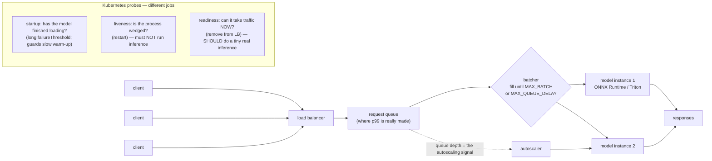

# Model Serving Lab

Training optimises a metric; serving optimises a **distribution of latencies under concurrency**. Those are
different engineering problems, and most model-serving incidents come from applying training intuitions to a
request queue. This lab builds a serving path you can defend with numbers, in the measure-honestly spirit of
[`AGENTS.md`](../../../AGENTS.md).

## When to use

- A trained model must answer synchronous requests and you need to choose the serving stack deliberately.
- p99 latency is far worse than p50 and nobody can say why (it is almost always queueing, see below).
- You need throughput per GPU/CPU-hour to go up without the tail going out of SLO.
- Kubernetes is scaling on CPU% and your GPU service either thrashes or never scales.
- Health checks pass while the service returns errors, because the probe never touched the model.
- **Don't use it for** offline/batch scoring — that is a data-pipeline problem where throughput is everything
  and latency is irrelevant; see [ml-pipeline-designer](../ml-pipeline-designer/SKILL.md). **Don't use it
  for** LLM token-streaming serving, which has its own scheduler and KV-cache economics — see
  [vllm-inference-lab](../vllm-inference-lab/SKILL.md). And don't optimise anything before you have a
  measured baseline and a written SLO.

## First principles: latency and throughput are not the same dial

**Primary sources.** **ONNX Runtime** (`onnxruntime.ai`, MIT, Microsoft) is the cross-framework inference
engine and the standard export target via the ONNX spec (`onnx.ai`). **NVIDIA Triton Inference Server**
(`github.com/triton-inference-server/server`) provides multi-framework serving with **dynamic batching**,
concurrent model instances, and model ensembles, configured per model in `config.pbtxt`. **FastAPI**
(`fastapi.tiangolo.com`) plus Uvicorn is the minimal ASGI path. **Kubernetes probe semantics** — `startup`,
`liveness`, `readiness` — are defined in the official docs at `kubernetes.io/docs/tasks/configure-pod-container/configure-liveness-readiness-startup-probes/`.
⚠ **TorchServe is in limited maintenance**: the `pytorch/serve` README carries an explicit notice that the
project is no longer actively maintained, with no planned updates, bug fixes, or security patches. Learn its
*concepts* (handlers, model archives, management API) but **do not choose it for a new production service** —
verify the current status on the repository before deciding either way.

The governing relationship is **Little's Law**, which holds for any stable queueing system:

$$L = \lambda W$$

where $L$ is the average number of requests in the system, $\lambda$ the arrival rate, and $W$ the average
time in system. Rearranged, it is the sentence that explains almost every model-serving incident: at a fixed
service rate, **the only way to absorb a higher arrival rate is to hold more requests in flight, and holding
more requests in flight is exactly what raises latency.** A service handling 200 req/s at 40 ms has
$L = 200 \times 0.040 = 8$ requests resident at all times; push $\lambda$ past the service rate and $W$ does
not degrade gracefully, it diverges.

Batching is the one lever that improves both — up to a point — because model inference has a **fixed
per-call overhead** plus a **marginal per-item cost**:

$$T(B) = c_0 + c_1 B \qquad \text{throughput}(B) = \frac{B}{c_0 + c_1 B} \;\xrightarrow[B \to \infty]{}\; \frac{1}{c_1}$$

Throughput rises with $B$ but saturates at $1/c_1$, while latency rises **linearly and without bound**. That
asymptote is why every serious server exposes a *pair* of knobs: max batch size and max queue delay.



*Figure — requests queue before they compute. Scale on **queue depth or concurrency**, not CPU%, and give
liveness and readiness genuinely different jobs.*

| Stack | Choose it when | Gives you free | Costs you |
| --- | --- | --- | --- |
| FastAPI + framework in-process | one model, modest QPS, custom pre/post-processing, CPU | full control, trivial debugging | you build batching, metrics, and multi-model yourself |
| **ONNX Runtime** in FastAPI | you want a 2–5× CPU speed-up and framework independence with almost no new infrastructure | graph optimisation, quantisation, execution providers | an export step; unsupported ops must be traced |
| **Triton Inference Server** | GPUs, multiple models, ensembles, or you need dynamic batching you did not write | dynamic batching, instance groups, model repository, metrics, gRPC+HTTP | a config surface and an ops footprint to learn |
| Managed endpoint (SageMaker / Vertex / Azure ML) | you want the ops handled | autoscaling, rollout, monitoring | cost, and less control over the tail |
| TorchServe | legacy systems only | — | **limited maintenance; no security patches** |

| Probe | Question | Should it run the model? | Failure action |
| --- | --- | --- | --- |
| `startupProbe` | "has the 90-second weight load finished?" | no | keep waiting (protects slow starts from liveness kills) |
| `livenessProbe` | "is this process wedged?" | **no** — a slow model must not trigger a restart storm | restart container |
| `readinessProbe` | "can it serve *right now*?" | **yes, a tiny fixed input** — this is the only probe that proves the model works | remove from the load balancer |

## Procedure

1. **Write the SLO before writing code**: p50, p99, sustained req/s, max acceptable error rate, and the
   hardware budget. Without it, "fast enough" is unfalsifiable — [slo-designer](../slo-designer/SKILL.md).
2. **Measure single-request latency, cold and warm.** Split it into pre-processing, inference, and
   post-processing. Teams routinely discover that tokenisation or image decode dominates the model.
3. **Export to a serving format** and re-verify numerical parity against the training framework — an export
   that silently changes outputs is worse than a slow one:
   ```python
   import torch
   torch.onnx.export(model, sample_input, "model.onnx",
                     input_names=["input"], output_names=["logits"],
                     dynamic_axes={"input": {0: "batch"}, "logits": {0: "batch"}},  # REQUIRED for batching
                     opset_version=17)
   ```
   ```python
   import numpy as np, onnxruntime as ort
   sess = ort.InferenceSession("model.onnx", providers=["CPUExecutionProvider"])
   out = sess.run(None, {"input": x.numpy()})[0]
   assert np.allclose(out, reference, atol=1e-4), "export changed the model's outputs"
   ```
   The `dynamic_axes` entry on dimension 0 is the difference between a model you can batch and one you can't.
4. **Wrap it in an endpoint with a real readiness probe.** `/livez` returns 200 if the process is alive;
   `/readyz` runs one tiny inference and returns 503 until the model is loaded and correct.
5. **Add dynamic batching** with two bounds — `MAX_BATCH` and `MAX_QUEUE_DELAY` — so a lone request is never
   held hostage waiting for company. In Triton this is declarative:
   ```protobuf
   # config.pbtxt
   max_batch_size: 32
   dynamic_batching {
     preferred_batch_size: [ 8, 16 ]
     max_queue_delay_microseconds: 5000        # 5 ms — the latency you are willing to trade
   }
   instance_group [ { count: 2, kind: KIND_GPU } ]
   ```
6. **Load-test the batch-size sweep** and plot throughput and p99 together. Pick the largest $B$ whose p99
   still fits the SLO — [k6-load-test-lab](../k6-load-test-lab/SKILL.md) or
   [locust-load-test-lab](../locust-load-test-lab/SKILL.md).
7. **Expose the right metrics**: queue depth, batch-size histogram, inference time, and end-to-end latency
   *separately*. If you only export end-to-end latency you cannot tell queueing from compute — which is the
   one distinction that matters.
8. **Choose the autoscaling signal.** For CPU models, concurrency or queue depth; for GPU models, CPU% is
   meaningless — scale on queue depth, in-flight requests, or GPU utilisation
   ([k8s-autoscaling-lab](../k8s-autoscaling-lab/SKILL.md)). Set `minReplicas` to survive a cold start.
9. **Cap the blast radius**: request timeouts, max payload size, a bounded queue that sheds load with 503
   rather than growing without limit, and per-client rate limits.
10. **Re-run the load test after every model or runtime change**, then close with the **Learning Footer**.

## Output shape

```
Model: <framework, params/size, input shape>   Hardware: <CPU cores | GPU type>   Runtime: <ORT|Triton|native>
SLO: p50 <= <..> ms · p99 <= <..> ms · sustained <..> req/s · error rate <= <..>%
Latency breakdown (single request, warm): preprocess <..> ms · inference <..> ms · postprocess <..> ms
Export parity: max abs diff vs training framework = <..>  [pass|FAIL]   dynamic_axes on batch dim = <yes|no>
Batching: MAX_BATCH=<..> MAX_QUEUE_DELAY=<..> ms   measured c0=<..> ms  c1=<..> ms/item
Sweep:  B=1 <thr> req/s p99 <..> | B=8 <thr> p99 <..> | B=32 <thr> p99 <..>   -> chosen B=<..> because <..>
Little's Law check: lambda=<..>/s x W=<..>s => L=<..> in flight   (queue bound set to <..>, sheds at <..>)
Probes: startup=<path, failureThreshold> · liveness=<path, NO inference> · readiness=<path, tiny inference>
Autoscaling: signal=<queue depth|concurrency|GPU util> target=<..> min=<..> max=<..> cold start=<..> s
Load-shedding: timeout=<..> s · max payload=<..> · 503 above queue=<..>
Metrics exported: queue_depth · batch_size · inference_seconds · e2e_seconds · errors
Next: <k8s-autoscaling-lab | slo-designer | model-monitoring-coach>
Learning Footer
```

## Worked example — a dynamic micro-batcher, and the arithmetic that predicts it

First, predict. Suppose one `session.run` costs a fixed 5 ms plus 2 ms per row, so $c_0 = 5$, $c_1 = 2$ ms.
From $T(B) = c_0 + c_1 B$:

| B | batch time $T(B)$ | throughput $B/T$ | best-case latency |
| --- | --- | --- | --- |
| 1 | 7 ms | 143 req/s | 7 ms |
| 2 | 9 ms | 222 req/s | 9 ms |
| 4 | 13 ms | 308 req/s | 13 ms |
| 8 | 21 ms | **381 req/s** | 21 ms |
| 16 | 37 ms | 432 req/s | 37 ms |
| 32 | 69 ms | 464 req/s | **69 ms** |

Going from $B=1$ to $B=8$ buys **2.7× throughput for 3× latency**; going from 8 to 32 buys only another 1.2×
throughput for another 3.3× latency. The asymptote is $1/c_1 = 500$ req/s, and you are already at 76% of it
at $B=8$. If the SLO says p99 ≤ 50 ms, $B=8$ or 16 is the answer and $B=32$ is a mistake — *decided on paper,
before any code.*

Now build it. Two bounds, `MAX_BATCH` and `MAX_DELAY_S`, and a background task that assembles batches while
the event loop stays free:

```python
# app.py — pip install fastapi uvicorn numpy   (swap _infer for onnxruntime session.run)
import asyncio, time, numpy as np
from contextlib import asynccontextmanager
from fastapi import FastAPI, HTTPException
from pydantic import BaseModel

MAX_BATCH, MAX_DELAY_S, MAX_QUEUE = 8, 0.005, 500
queue: asyncio.Queue = asyncio.Queue(maxsize=MAX_QUEUE)   # bounded: shed load, never grow forever
ready = False

def _infer(rows: np.ndarray) -> np.ndarray:
    """Blocking inference. Real code: sess.run(None, {"input": rows})[0]."""
    time.sleep(0.005 + 0.002 * len(rows))                  # c0 = 5 ms, c1 = 2 ms/row
    return rows.sum(axis=1)

async def batcher():
    loop = asyncio.get_running_loop()
    while True:
        batch = [await queue.get()]                        # block until the first request arrives
        deadline = loop.time() + MAX_DELAY_S               # start the queue-delay clock
        while len(batch) < MAX_BATCH:
            timeout = deadline - loop.time()
            if timeout <= 0:
                break
            try:
                batch.append(await asyncio.wait_for(queue.get(), timeout))
            except asyncio.TimeoutError:
                break                                      # lone request: never wait for company
        rows = np.stack([b[0] for b in batch])
        out = await loop.run_in_executor(None, _infer, rows)   # keep the event loop responsive
        for (_, fut), y in zip(batch, out):
            if not fut.done():
                fut.set_result(float(y))

@asynccontextmanager
async def lifespan(app: FastAPI):
    global ready
    task = asyncio.create_task(batcher())
    _infer(np.zeros((1, 4), dtype=np.float32))             # warm up before advertising readiness
    ready = True
    yield
    task.cancel()

app = FastAPI(lifespan=lifespan)

class Req(BaseModel):
    features: list[float]

@app.post("/predict")
async def predict(req: Req):
    fut = asyncio.get_running_loop().create_future()
    try:
        queue.put_nowait((np.asarray(req.features, dtype=np.float32), fut))
    except asyncio.QueueFull:
        raise HTTPException(503, "overloaded")             # shed, don't queue unboundedly
    return {"prediction": await asyncio.wait_for(fut, timeout=2.0)}

@app.get("/livez")
def livez():
    return {"status": "alive"}                             # process check only — NO inference

@app.get("/readyz")
async def readyz():
    if not ready:
        raise HTTPException(503, "model not loaded")
    await predict(Req(features=[0.0, 0.0, 0.0, 0.0]))       # tiny real inference: proves it works
    return {"status": "ready"}
```

Traced against the prediction — 200 concurrent requests through this exact batcher, run three times:

```
correct=True  200 reqs in 584 ms -> 342 req/s     batch sizes: {8: 25}
correct=True  200 reqs in 586 ms -> 341 req/s     batch sizes: {8: 25}
correct=True  200 reqs in 579 ms -> 345 req/s     batch sizes: {8: 25}
lone request result: 4.0   (returned without waiting for a full batch)
```

Three things to take from this:

- **The prediction held.** 200 requests formed exactly 25 full batches of 8, and 25 × 21 ms = 525 ms of pure
  inference; measured 584 ms, so ≈ 59 ms (11%) is framework and scheduling overhead. The paper model was
  accurate to within noise, which is why you do the arithmetic first.
- **Results are identical to unbatched inference.** The assertion `ys == [x.sum() for x in xs]` passes —
  batching must be transparent to the caller, and a test that checks this belongs in CI, because a
  row-misalignment bug in a batcher returns *plausible wrong answers* rather than errors.
- **The lone request still returned.** `MAX_DELAY_S` is what prevents the classic batching outage: under low
  traffic, a batcher that waits for `MAX_BATCH` deadlocks until the next customer arrives.

One portability warning worth internalising: `asyncio` timer resolution is coarse on some platforms
(Windows' monotonic clock ticks at ~15.6 ms), so a 5 ms queue delay is not honoured precisely everywhere.
Measure the *achieved* batch-size histogram in production rather than assuming the configured delay was
respected — which is exactly why "batch size" is on the metrics list in step 7.

## Tips

- **p99 is made in the queue, not the model.** If p50 is fine and p99 is terrible, you are saturated; adding
  a faster model will not help and adding a replica will. Export queue depth and you can see it directly.
- **Always set `dynamic_axes` on the batch dimension at export.** A model exported with a frozen batch size
  of 1 cannot be batched at all, and the failure appears only under load.
- **Liveness must not run inference.** A model that is merely *slow* will fail an inference-based liveness
  probe, get restarted, drop its warm cache, become slower, and restart again — a self-inflicted outage.
- **Bound the queue and shed with 503.** An unbounded queue converts a brief overload into unbounded latency
  for every client; graceful shedding is a feature ([caching-strategy-coach](../caching-strategy-coach/SKILL.md)
  for the requests you can avoid serving at all).
- **CPU% is not a GPU saturation signal.** Scale on in-flight requests, queue depth, or GPU utilisation, and
  size `minReplicas` around your cold-start time ([capacity-planning-coach](../capacity-planning-coach/SKILL.md)).
- **Quantisation buys latency but changes outputs.** Re-run the eval, never assume parity —
  [llm-quantization-lab](../llm-quantization-lab/SKILL.md) and
  [edge-ai-inference-lab](../edge-ai-inference-lab/SKILL.md).
- **A served model is still a model.** Drift, skew, and decay do not care that you added an HTTP layer —
  [model-monitoring-coach](../model-monitoring-coach/SKILL.md).
- Related: [fastapi-lab](../fastapi-lab/SKILL.md), [dockerfile-coach](../dockerfile-coach/SKILL.md),
  [k8s-deployment-lab](../k8s-deployment-lab/SKILL.md),
  [load-testing-coach](../load-testing-coach/SKILL.md),
  [observability-plan](../observability-plan/SKILL.md), and
  [vllm-inference-lab](../vllm-inference-lab/SKILL.md) for LLM-specific serving.
  End with the **Learning Footer** (`AGENTS.md`).
