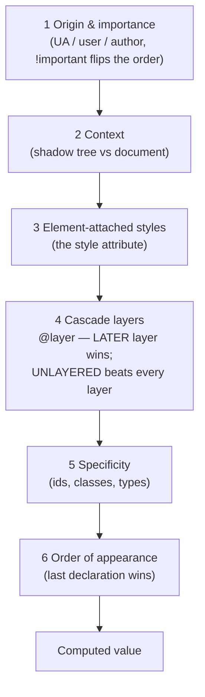

# Modern CSS Features Lab

A runnable single-file lab for the seven CSS features that removed a JavaScript or preprocessor dependency
each. Every feature is taught against the **cascade** — because "it doesn't apply" is almost always a
cascade question. Follows the first-principles and source-discipline rules in
[`AGENTS.md`](../../../AGENTS.md).

## When to use

- You are using a `ResizeObserver`, a Sass mixin, or a `!important` war to do something CSS now does natively.
- A rule "should" apply but doesn't, and you need the real resolution order rather than more specificity.
- You want a component that adapts to **its container**, not to the viewport.
- **Don't use it for** overall page layout strategy or responsive breakpoint design — start with
  [css-layout-coach](../css-layout-coach/SKILL.md) and
  [responsive-design-coach](../responsive-design-coach/SKILL.md).

## First principles: the cascade decides, specificity is only step 5

CSS Cascade Level 5 (the specification that introduced `@layer`) defines a strict, ordered sequence.
Everything below is decided *in order*, and a later step is only consulted when the earlier ones tie — which
is why a low-specificity rule in a later layer beats a high-specificity rule in an earlier one.



| Feature | At-rule / syntax | What it retires | The gotcha that bites |
| --- | --- | --- | --- |
| Container queries | `container-type: inline-size` + `@container (min-width: 30rem)` | `ResizeObserver`, viewport-only breakpoints | the *parent* must be the container; `inline-size` containment stops that element sizing to its content in the inline axis |
| Relational selector | `:has(> img)`, `:has(+ p)` | "parent selector" JS class toggles | specificity = the **most specific** selector inside; the argument list is **not** forgiving |
| Cascade layers | `@layer reset, base, components, utilities;` | `!important` wars, specificity inflation | unlayered CSS outranks every layer, and `!important` **reverses** layer order |
| Native nesting | `& { … }`, nested bare selectors | Sass/Less just for nesting | `&` is required for compounds (`&:hover`, `&.active`); nesting adds no specificity by itself |
| Subgrid | `grid-template-columns: subgrid` | magic numbers to line up cards | only valid on an item that is *itself* a grid; it inherits tracks, not `gap` defaults you forgot to set |
| Typed custom props | `@property --brand { syntax: '<color>'; inherits: false; initial-value: … }` | JS-driven gradient animation | without a registered `syntax` a custom property is an untyped token and **cannot** be interpolated |
| Colour mixing | `color-mix(in oklch, var(--brand) 70%, white)` | Sass `lighten()`/`darken()` | mix in `oklch`/`oklab`, not `srgb`, or mid-tones go muddy |

**Trade-off to say out loud:** cascade layers are the strongest tool here and the easiest to misuse — once
you declare an order, a third-party stylesheet you did not layer will outrank all of it. Declare the layer
order **once, at the top of your entry stylesheet**, and import vendor CSS *into* a layer
(`@import url(vendor.css) layer(vendor);`) so it cannot escape.

## Procedure

1. **Declare the layer order first**, on line 1 of your entry sheet:
   `@layer reset, vendor, base, components, utilities;`. The order of this one statement is the whole
   architecture; everything after it is just placement.
2. **Make the component's parent a container**: `container: card / inline-size` (name + type shorthand).
   Query it with `@container card (min-width: 30rem)`. Size the inside with `cqi` units so the component
   scales with its container, not the viewport.
3. **Replace state-toggling JavaScript with `:has()`** — `.form:has(:invalid)`, `.card:has(> img)`,
   `label:has(input:checked)`. Remember specificity comes from the argument, so `:has(#x)` is id-strength.
4. **Nest sparingly.** Native nesting is for locality (`&:hover`, `& .title`), not for rebuilding a
   directory tree; three levels is already too deep to read.
5. **Line rows up with `subgrid`** so a card's title/body/footer align across siblings without fixed heights.
6. **Register anything you want to animate** with `@property`, then transition it — this is how you animate
   a gradient stop or an angle without JavaScript.
7. **Derive colours with `color-mix(in oklch, …)`** instead of hand-picking hover/disabled shades.
8. **Verify support** per feature and per browser before shipping (MDN Browser compatibility / Baseline
   status), and provide a `@supports` fallback for anything not yet Baseline-widely-available.
9. Close with the **Learning Footer**.

## Output shape

```
Problem: <what the CSS must do>          Support target: <browsers/Baseline level>
Layer order: @layer <a>, <b>, <c>;       Vendor CSS imported into: layer(<name>)
Container: <selector> { container: <name> / inline-size }   Query: @container <name> (<cond>)
Selectors: :has(<...>)  ->  replaces <JS/class toggle>      Specificity note: <...>
Registered props: @property --<x> { syntax: '<type>'; inherits: <bool>; initial-value: <v> }
Colours: color-mix(in oklch, var(--brand) <n>%, <c>)
Fallback: @supports (<feature>) { … } else <...>
Code: <runnable HTML + CSS>
Verify: resize the CONTAINER (not the window); toggle the input; check computed styles in DevTools
Next: <css-layout-coach | responsive-design-coach | accessibility-audit>
Learning Footer
```

## Worked example — a container-driven card that uses all seven

Save as `modern-css.html` and open it directly. Drag the range slider to resize **the container** — the
card re-lays-out without a single media query or line of layout JavaScript.

```html
<!doctype html>
<meta charset="utf-8"><title>Modern CSS lab</title>
<style>
/* 1 — Architecture: one line decides every future conflict. Later layer wins. */
@layer reset, base, components, utilities;

/* 6 — Typed custom properties: registered => animatable/interpolatable. */
@property --brand   { syntax: '<color>'; inherits: true;  initial-value: #0b63ce; }
@property --tilt    { syntax: '<angle>'; inherits: false; initial-value: 0deg; }

@layer reset { *, *::before, *::after { box-sizing: border-box; margin: 0; } }

@layer base {
  body { font: 16px/1.5 system-ui, sans-serif; padding: 2rem; }
  /* 7 — derive shades instead of hand-picking them; mix in oklch for even mid-tones */
  :root { --brand-soft: color-mix(in oklch, var(--brand) 18%, white); }
}

@layer components {
  /* 2 — the PARENT is the container; the card queries it, not the viewport */
  .shell { container: card / inline-size; max-inline-size: 100%; }

  .card {
    display: grid; grid-template-columns: 1fr; gap: 1rem;
    background: var(--brand-soft); border: 1px solid var(--brand);
    border-radius: .75rem; padding: 1rem; rotate: var(--tilt);
    transition: --tilt .3s ease, --brand .3s ease;   /* only works because both are registered */

    /* 4 — native nesting: & is required for compounds */
    &:hover { --tilt: -1deg; --brand: #7a1fa2; }
    & h2 { font-size: clamp(1.1rem, 4cqi, 2rem); }   /* 2 — cqi = 1% of container inline size */

    /* 3 — :has() replaces a JS class toggle: style the card from its own content */
    &:has(> img) { grid-template-areas: 'media body'; }
    &:has(.badge--urgent) { outline: 3px solid #c62828; }
  }

  /* 2 — container query: reacts to .shell's width, so the same card works in a sidebar */
  @container card (min-width: 30rem) {
    .card { grid-template-columns: 12rem 1fr; align-items: start; }
  }

  /* 5 — subgrid: title/body/footer line up ACROSS siblings without fixed heights */
  .grid { display: grid; grid-template-columns: repeat(auto-fit, minmax(14rem, 1fr));
          grid-template-rows: auto 1fr auto; gap: 1rem; }
  .grid > .card { grid-row: span 3; display: grid; grid-template-rows: subgrid; }
}

/* Unlayered rules beat EVERY layer — that is the trap; keep utilities in a layer on purpose. */
@layer utilities { .u-flat { rotate: 0deg !important; } }

@supports not (container-type: inline-size) {
  .card { grid-template-columns: 1fr; }   /* honest fallback, not a broken layout */
}
</style>

<label>Container width <input id="w" type="range" min="240" max="900" value="380"></label>
<div class="shell" id="shell">
  <div class="grid">
    <article class="card"><h2>Signals</h2><p>Reacts to its container.</p><footer>Aligned by subgrid</footer></article>
    <article class="card"><h2>Layers</h2><p>Later layer wins; unlayered wins over all.</p><footer>—</footer></article>
    <article class="card"><h2>Has</h2><span class="badge--urgent">urgent</span><p>Outlined by :has().</p><footer>—</footer></article>
  </div>
</div>
<script>
  const shell = document.getElementById('shell');
  document.getElementById('w').oninput = e => shell.style.inlineSize = e.target.value + 'px';
</script>
```

Reason it through: the range input changes `.shell`'s inline size only — no window resize, no media query
fires — yet the cards reflow at 30 rem because `@container` measures the *container*. `rotate` animates
smoothly on hover only because `--tilt` was registered with `syntax: '<angle>'`; delete the `@property`
block and the transition snaps, which is the fastest way to feel why typing matters. The third card gets an
outline purely from its own child element via `:has()`, with no class on the card and no JavaScript.

## Tips

- **`:has()` reads upward, so keep the argument cheap.** `body:has(.x)` on a large document is far more work
  for the style engine than `.card:has(> img)`; scope it to a component root.
- Cascade layers **invert** under `!important`: an important declaration in an *earlier* layer beats an
  important one in a later layer. Design so you never need to know that.
- `container-type: inline-size` applies containment — the element can no longer be sized by its contents in
  the inline axis. Put the container on a wrapper, never on the component you are querying.
- An element cannot query itself. `@container` always looks at an *ancestor* container.
- Unregistered custom properties are untyped strings: they inherit and substitute, but never interpolate.
  `@property` is the fix, not a `transition` on `all`.
- `color-mix()` interpolates in the space you name — prefer `oklch`/`oklab`; `srgb` mixes go grey in the
  middle. Always re-check the result against WCAG contrast in
  [accessibility-audit](../accessibility-audit/SKILL.md).
- Nesting compiles to `:is()`-like semantics for the parent selector, which can raise specificity in
  unexpected ways — check the computed rule in DevTools rather than reasoning about it.
- Pair with [css-layout-coach](../css-layout-coach/SKILL.md),
  [responsive-design-coach](../responsive-design-coach/SKILL.md),
  [animation-coach](../animation-coach/SKILL.md),
  [view-transitions-lab](../view-transitions-lab/SKILL.md),
  [web-components-lab](../web-components-lab/SKILL.md) (shadow DOM is cascade step 2), and
  [tailwind-lab](../tailwind-lab/SKILL.md) for the utility-layer variant. Verify every feature's Baseline
  status on MDN before shipping (`AGENTS.md` §2), then end with the **Learning Footer** (`AGENTS.md`).
