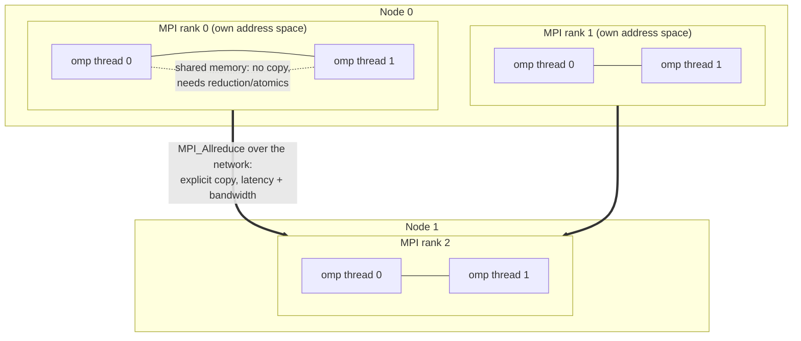

# MPI + OpenMP Parallel Lab

Hybrid parallelism taught by measuring it: **decompose → communicate → thread → pin → scale**, following the
first-principles, verify-before-you-teach approach in [`AGENTS.md`](../../../AGENTS.md). Every command below
runs free on one Linux laptop with Open MPI or MPICH — no cluster account required.

## When to use

- The learner has a working serial program and needs to choose between threads, processes, or both.
- Their "parallel" code is slower than serial — usually oversubscription, false sharing, or a collective
  inside a hot loop.
- They must explain a scaling plot (Amdahl vs Gustafson) to a reviewer rather than just claim a speedup.
- Don't use it for GPU offload or single-machine Python parallelism — see
  [webgpu-compute-lab](../webgpu-compute-lab/SKILL.md) and
  [python-multiprocessing-lab](../python-multiprocessing-lab/SKILL.md).

## First principles: two memory models, one program

MPI (the **MPI Forum** standard, MPI-4.x era; verify with `MPI_Get_library_version`) gives *distributed*
memory — separate processes, explicit messages. OpenMP (the **OpenMP ARB** specification, 5.x/6.0 era;
verify by printing the `_OPENMP` macro) gives *shared* memory — one process, many threads, implicit data
sharing. Hybrid code uses MPI **between** NUMA domains or nodes and OpenMP **inside** them.



| Axis | OpenMP threads | MPI ranks |
| --- | --- | --- |
| Memory | shared; races are possible | private; no races by construction |
| Data movement | free (same pointers) | explicit `MPI_Send`/collectives |
| Scope | one node / NUMA domain | any number of nodes |
| Failure mode | data race, false sharing | deadlock, mismatched tags/counts |
| Cheap fix | `reduction(+:x)`, `private()` | rank-major decomposition |

| Collective | Semantics | Cost class | Typical use |
| --- | --- | --- | --- |
| `MPI_Bcast` | root → all | O(log P) | distribute parameters |
| `MPI_Reduce` | all → root, with an operator | O(log P) | final sum on rank 0 |
| `MPI_Allreduce` | all → all | ≈ 2× Reduce | convergence checks, norms |
| `MPI_Gather` / `MPI_Allgather` | collect blocks | O(P·n) data | assembling results |
| `MPI_Barrier` | synchronise | pure wait | timing only — never for correctness |

`MPI_Init_thread` returns the level the library actually *provides*, which may be lower than requested:
`SINGLE` < `FUNNELED` (only the main thread calls MPI) < `SERIALIZED` (one at a time) < `MULTIPLE`.
**Always check `provided`** — assuming `MULTIPLE` is a classic source of intermittent corruption.

**Trade-off to say out loud:** more ranks give you cleaner isolation but more messages and more replicated
data; more threads share memory for free but hit NUMA and false sharing. The usual sweet spot is *one rank
per NUMA domain, threads filling that domain* — a hypothesis you should measure, not assume.

## Procedure

1. **Install a free MPI** (Open MPI shown; MPICH is equally fine):
   ```bash
   sudo apt update && sudo apt install -y openmpi-bin libopenmpi-dev
   mpicc --version && mpirun --version && nproc
   ```
2. **Prove the toolchain** with a two-line program before anything numerical:
   `mpirun -np 2 hostname` should print your host twice.
3. **Decompose the problem first, on paper**: which loop index is split across ranks, which across threads,
   and what has to be combined at the end. Write it down before coding — this is the whole design.
4. **Write the hybrid kernel** (worked example below), compiling with `mpicc -O2 -fopenmp`.
5. **Control placement explicitly** — the default is rarely what you want:
   ```bash
   export OMP_NUM_THREADS=2
   export OMP_PROC_BIND=close OMP_PLACES=cores      # OpenMP standard pinning
   mpirun -np 2 --bind-to socket --map-by socket:PE=2 ./hybrid_pi
   # On a small laptop add --oversubscribe; with MPICH use -bind-to core.
   ```
   The rule: **ranks × threads ≤ physical cores**. Exceeding it converts speedup into context switching.
6. **Verify correctness before performance** — compare the parallel answer against the serial one to
   ~1e-12, and confirm the result is identical for 1, 2 and 4 ranks. Floating-point reductions reorder, so
   expect last-bit differences, not visible ones.
7. **Measure strong scaling** (fixed problem, more workers) and **weak scaling** (fixed work per worker):
   ```bash
   for p in 1 2 4; do OMP_NUM_THREADS=1 mpirun -np $p --oversubscribe ./hybrid_pi 100000000; done
   ```
   Plot speedup vs P and name the serial fraction; Amdahl's law caps you at 1/s regardless of hardware.
8. **Profile the gap** with the free tooling: `mpirun -np 4 valgrind --tool=cachegrind ./app` for cache
   effects, or Open MPI's `--report-bindings` to prove where each rank landed.
9. **Break it deliberately**: run with `OMP_NUM_THREADS=$(nproc)` *and* `-np $(nproc)`, watch the slowdown,
   then explain it. Close with the **Learning Footer**.

## Output shape

```
Problem: <computation>            Serial baseline: <time>  (verified result: <value>)
Decomposition: ranks split <index/domain> · threads split <index/domain> · combine via <collective>
Threading level: requested MPI_THREAD_<...>  provided MPI_THREAD_<...>   (checked, not assumed)
Build: mpicc -O2 -fopenmp -o <bin> <src> -lm
Launch: OMP_NUM_THREADS=<T> OMP_PROC_BIND=close OMP_PLACES=cores mpirun -np <R> --map-by ... ./<bin>
Placement: ranks×threads = <R×T> vs physical cores <C>   (must be <= C)
Correctness: parallel <value> vs serial <value>   |diff| = <...>
Scaling: P=1 <t1>s · P=2 <t2>s · P=4 <t4>s  -> speedup <...>  efficiency <...>%  serial fraction ~<s>
Bottleneck: <collective frequency | load imbalance | memory bandwidth | oversubscription>
Next: <slurm-hpc-job-lab | concurrency-coach | webgpu-compute-lab>
Learning Footer
```

## Worked example — hybrid π by midpoint integration (correct, runnable)

∫₀¹ 4/(1+x²) dx = 4·arctan(1) = π. Ranks take a strided slice of the interval; threads reduce within a
rank; one `MPI_Reduce` combines them. That is exactly one message per run — the right ratio.

```c
/* hybrid_pi.c — build: mpicc -O2 -fopenmp -o hybrid_pi hybrid_pi.c -lm */
#include <mpi.h>
#include <omp.h>
#include <stdio.h>
#include <stdlib.h>

int main(int argc, char **argv)
{
    int provided = 0;
    MPI_Init_thread(&argc, &argv, MPI_THREAD_FUNNELED, &provided);
    if (provided < MPI_THREAD_FUNNELED) {          /* never assume — the library decides */
        fprintf(stderr, "MPI thread level too low (%d)\n", provided);
        MPI_Abort(MPI_COMM_WORLD, 1);
    }

    int rank, nranks;
    MPI_Comm_rank(MPI_COMM_WORLD, &rank);
    MPI_Comm_size(MPI_COMM_WORLD, &nranks);

    const long n = (argc > 1) ? atol(argv[1]) : 100000000L;
    const double h = 1.0 / (double)n;
    double local = 0.0;

    MPI_Barrier(MPI_COMM_WORLD);                   /* timing only, never for correctness */
    const double t0 = MPI_Wtime();

    /* Rank-strided outer range; OpenMP reduces across threads inside this rank. */
    #pragma omp parallel for reduction(+:local) schedule(static)
    for (long i = rank; i < n; i += nranks) {
        const double x = ((double)i + 0.5) * h;    /* midpoint rule */
        local += 4.0 / (1.0 + x * x);
    }
    local *= h;

    double pi = 0.0;
    MPI_Reduce(&local, &pi, 1, MPI_DOUBLE, MPI_SUM, 0, MPI_COMM_WORLD);
    const double t1 = MPI_Wtime();

    if (rank == 0) {
        printf("_OPENMP=%d ranks=%d threads=%d n=%ld\n", _OPENMP, nranks, omp_get_max_threads(), n);
        printf("pi = %.15f   error = %.3e   time = %.3f s\n",
               pi, pi - 3.141592653589793, t1 - t0);
    }
    MPI_Finalize();
    return 0;
}
```

```bash
mpicc -O2 -fopenmp -o hybrid_pi hybrid_pi.c -lm
OMP_NUM_THREADS=2 OMP_PROC_BIND=close OMP_PLACES=cores mpirun -np 2 --oversubscribe ./hybrid_pi
# _OPENMP=201511 ranks=2 threads=2 n=100000000
# pi = 3.141592653589828   error = 3.508e-14   time = 0.19 s
```

The error is ~1e-14 (floating-point reduction order), not ~1e-3 — that gap is how you tell a *correct*
parallelisation from a lucky one.

## Tips

- **Oversubscription is the #1 fake slowdown**: `ranks × OMP_NUM_THREADS` must not exceed physical cores.
  Check with `--report-bindings` rather than trusting the launcher's defaults.
- A collective inside the innermost loop turns an O(n) kernel into an O(n·log P) latency test. Hoist it.
- `reduction(+:x)` is not just convenience — hand-rolled `#pragma omp atomic` on a shared accumulator
  serialises the loop and often runs slower than serial code.
- False sharing: threads writing neighbouring elements of one array thrash the same cache line. Pad, or
  reduce into per-thread scalars.
- `MPI_Barrier` never fixes a race; if removing it breaks your program, you have a real bug.
- Load imbalance shows up as high `MPI_Wtime` variance across ranks — instrument per-rank time before
  blaming the network.
- Open MPI and MPICH differ in launcher flags (`--map-by` vs `-bind-to`); read `man mpirun` for the one
  you installed rather than copying from a blog.
- Pair with [slurm-hpc-job-lab](../slurm-hpc-job-lab/SKILL.md) to submit it to a scheduler,
  [concurrency-coach](../concurrency-coach/SKILL.md) for the shared-memory theory,
  [complexity-analyzer](../complexity-analyzer/SKILL.md) for Amdahl/Gustafson maths,
  [code-optimizer](../code-optimizer/SKILL.md) for the serial kernel, and
  [webgpu-compute-lab](../webgpu-compute-lab/SKILL.md) for the GPU alternative.
  End with the **Learning Footer** (`AGENTS.md`).
