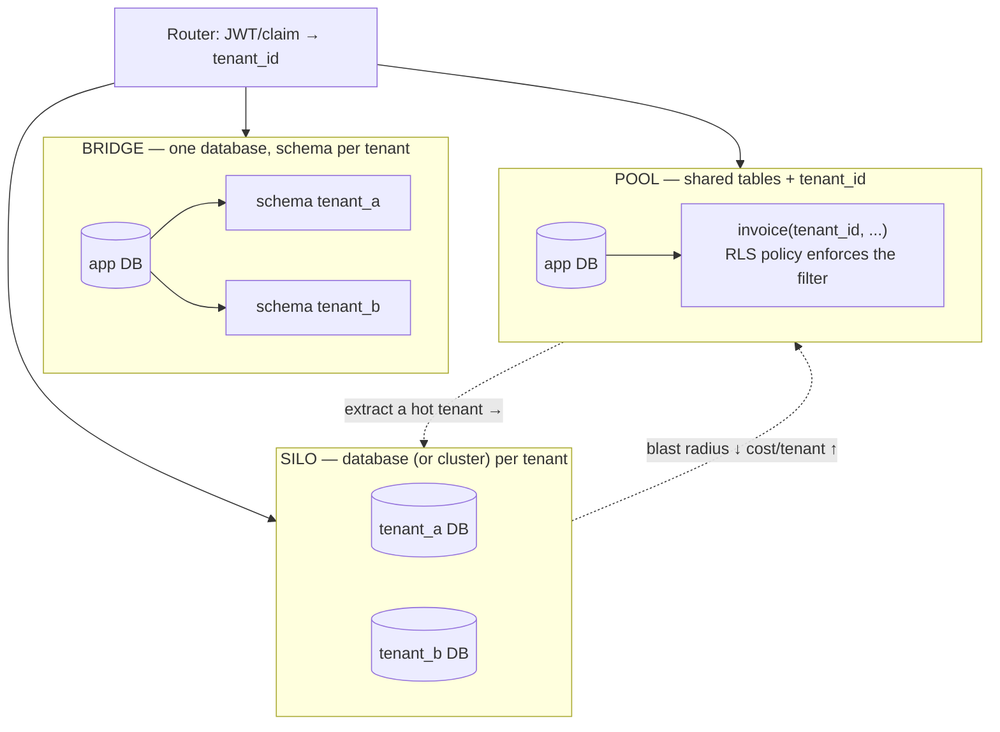

# Multi-Tenancy Data Coach

Multi-tenancy is a **trade of blast radius against unit cost**, made once and paid for daily. This skill
picks the isolation model from your numbers, then hardens it so that "forgot the `WHERE tenant_id`" cannot
become a breach — teaching the *why* before the *how*, per [`AGENTS.md`](../../../AGENTS.md).

## When to use

- Designing a SaaS data layer and choosing between database-per-tenant and a shared schema.
- One enterprise tenant is 60 % of your data and is degrading everyone else.
- A prospect demands data residency, their own encryption key, or a per-tenant restore.
- A cross-tenant data leak happened, or you want to make one structurally impossible.
- **Don't use it for** horizontal scale of a *single* tenant's data — that's
  [sharding-strategy-coach](../sharding-strategy-coach/SKILL.md); or app-level authorization rules — that's
  [broken-access-control-coach](../broken-access-control-coach/SKILL.md).

## First principles: one axis, three stops, and the escape hatch

The vocabulary here is AWS's (SaaS Lens / SaaS Factory: **silo**, **pool**, **bridge**) and Microsoft's Azure
Architecture Center guidance on *Architectural approaches for multitenancy* — both describe the same axis:
how much infrastructure two tenants share. Every property you care about is a monotone function of that axis.



*The axis runs left to right; the dotted arrow back is the escape hatch every mature system eventually needs.*

| Property | Silo (DB per tenant) | Bridge (schema per tenant) | Pool (shared tables + `tenant_id`) |
| --- | --- | --- | --- |
| Cross-tenant leak risk | near zero (separate connection) | low (search_path bug is possible) | **highest — one missing predicate** |
| Per-tenant restore / PITR | trivial | medium (schema-level dump) | hard (row-level extraction) |
| Noisy neighbour | isolated at DB level | shared buffers/CPU | fully shared |
| Cost per small tenant | worst (idle capacity, connections) | medium | best |
| Schema migration cost | N databases | **N schemas × M objects** | 1 |
| Connection budget | N pools → exhausts `max_connections` fast | 1 pool | 1 pool |
| Residency / BYOK per tenant | natural | awkward | column-level only |
| Analytics across tenants | painful (N sources) | medium | trivial |

Two numbers usually decide it. **Migration cost** grows as $O(N_{\text{tenants}} \times M_{\text{objects}})$
in the bridge model — 5 000 tenants × 40 tables is 200 000 relations in one catalog, which slows `pg_dump`,
autovacuum bookkeeping and every DDL deploy. **Connection cost** kills the silo model early, because each
tenant pool holds idle connections; pair with
[connection-pooling-coach](../connection-pooling-coach/SKILL.md) before committing.

### Pool safety: row-level security, and the two rules people get backwards

PostgreSQL RLS (docs: *Row Security Policies*, `CREATE POLICY`) turns the tenant predicate from a thing
developers must remember into a thing the engine enforces. Two rules are routinely inverted:

1. **`ENABLE ROW LEVEL SECURITY` does not apply to the table owner.** The owner (usually your migration role,
   often the same role the app connects as) bypasses its own policies until you also run
   `ALTER TABLE … FORCE ROW LEVEL SECURITY`. Teams test as the owner, see policies "not working", and disable
   them. **Superusers and roles with `BYPASSRLS` always bypass, even with FORCE** — so the app role must be a
   plain, non-owner, non-`BYPASSRLS` role.
2. **`USING` filters what you can see; `WITH CHECK` filters what you can write.** If `WITH CHECK` is omitted,
   PostgreSQL reuses the `USING` expression for new rows — which is what you want for tenant isolation, but
   only for `ALL`/`UPDATE` policies. A `FOR INSERT` policy takes `WITH CHECK` only.

Set the tenant with `SET LOCAL` inside a transaction, never plain `SET`: under PgBouncer `transaction` pooling
a plain `SET` leaks the previous client's tenant onto the next borrower of that server connection.

## Procedure

1. **Count and skew.** Record tenant count, p50/p99/max tenant size, and the largest tenant's share of total
   rows. Skew above ~20 % for a single tenant means plan the escape hatch on day one.
2. **List the hard constraints**: residency, customer-managed keys, per-tenant restore SLA, contractual
   isolation. Any one of these can force silo for a *subset* of tenants — that is normal, not a design failure.
3. **Pick a default model, then a tier map.** Most successful SaaS runs *pooled by default, silo for enterprise*.
   Write the tier table down: tier → model → price → SLA.
4. **Put `tenant_id` first in every key**, not merely in the `WHERE`. `PRIMARY KEY (tenant_id, id)` and
   composite indexes led by `tenant_id` keep each tenant's rows physically clustered and make plans predictable
   ([database-index-coach](../database-index-coach/SKILL.md)).
5. **Enforce isolation in the engine** (pool model), fail-closed:
   ```sql
   CREATE TABLE invoice (
     tenant_id uuid NOT NULL,
     id        bigint GENERATED ALWAYS AS IDENTITY,
     amount    numeric(12,2) NOT NULL,
     PRIMARY KEY (tenant_id, id)
   );
   ALTER TABLE invoice ENABLE ROW LEVEL SECURITY;
   ALTER TABLE invoice FORCE  ROW LEVEL SECURITY;          -- applies to the owner too
   CREATE POLICY tenant_isolation ON invoice FOR ALL
     USING      (tenant_id = current_setting('app.tenant_id', true)::uuid)
     WITH CHECK (tenant_id = current_setting('app.tenant_id', true)::uuid);
   ```
6. **Set the context per transaction**, from a verified claim — never from a request header or query string:
   ```sql
   BEGIN;
     SET LOCAL app.tenant_id = '8f1c…';   -- LOCAL: dies with the transaction, pooler-safe
     SELECT sum(amount) FROM invoice;      -- policy adds the predicate for you
   COMMIT;
   ```
7. **Bound the noisy neighbour** before it bites: `statement_timeout` per role, per-tenant request rate limits
   ([rate-limiter-designer](../rate-limiter-designer/SKILL.md)), a bounded work queue per tenant, and an
   alert on per-tenant query time so you can see who is eating the buffer cache.
8. **Design key management with deletion in mind.** Envelope encryption: one data key (DEK) per tenant, wrapped
   by a tenant-selectable KMS key. Deleting the tenant's key **crypto-shreds** their data even in shared tables
   and backups — the only practical way to honour erasure requests against immutable backups
   ([aws-kms-envelope-encryption-lab](../aws-kms-envelope-encryption-lab/SKILL.md)).
9. **Write the migration runbook before you need it** (pool → silo extraction): freeze tenant writes or enable
   dual-write, copy by `tenant_id`, verify row counts and checksums, flip the tenant's routing entry, keep the
   source rows read-only for a rollback window, then delete.
10. **Test isolation as code** — a CI test that runs the app role without a tenant context and asserts zero rows
    — then close with the **Learning Footer**.

## Output shape

```
Tenants: <N>   Skew: largest = <%> of rows   Growth: <+N/month>
Constraints: residency=<..> · BYOK=<..> · per-tenant restore SLA=<..> · contractual isolation=<..>
Model: default=<pool|bridge|silo>   Exceptions: <tier → model, with the rule that triggers promotion>
Key design: PK = (tenant_id, ...)  · indexes led by tenant_id: <yes/no>
Enforcement: RLS <ENABLE + FORCE> · app role is <non-owner, no BYPASSRLS> · context via <SET LOCAL from JWT claim>
Fail-closed check: missing app.tenant_id ⇒ <0 rows | ERROR>  (tested: <yes/no>)
Noisy neighbour: statement_timeout=<> · per-tenant rate limit=<> · isolation alarm=<metric>
Keys: <single CMK | per-tenant DEK wrapped by tenant KMS key>   Crypto-shred on delete: <yes/no>
Migration path: <pool → silo | none>  Steps: <dual-write | copy | verify | flip route | retire>
Migration cost today: <N schemas × M objects = X DDL ops per release>
Next: <connection-pooling-coach | database-migration-coach | sharding-strategy-coach>
Learning Footer
```

## Worked example — trace the RLS policy, including the failure you want

Local lab, no cloud account needed:

```bash
docker run --rm -d --name mt -e POSTGRES_PASSWORD=pw -p 5432:5432 postgres:16
```

```sql
-- as the owner role (migrations)
CREATE ROLE app LOGIN PASSWORD 'pw';                      -- NOT the owner, NOT BYPASSRLS
CREATE TABLE invoice (tenant_id uuid NOT NULL, id bigint GENERATED ALWAYS AS IDENTITY,
                      amount numeric(12,2), PRIMARY KEY (tenant_id, id));
INSERT INTO invoice (tenant_id, amount) VALUES
  ('11111111-1111-1111-1111-111111111111', 100),
  ('22222222-2222-2222-2222-222222222222', 250);
ALTER TABLE invoice ENABLE ROW LEVEL SECURITY;
CREATE POLICY tenant_isolation ON invoice FOR ALL
  USING (tenant_id = current_setting('app.tenant_id', true)::uuid);
GRANT SELECT, INSERT, UPDATE, DELETE ON invoice TO app;
```

Trace three sessions, carefully:

| # | Session | Statement | Result | Why |
| --- | --- | --- | --- | --- |
| 1 | **owner** | `SELECT count(*) FROM invoice;` | **2** | RLS is enabled but the owner is exempt until `FORCE` — the classic "policies don't work" moment |
| 2 | `app` | `BEGIN; SET LOCAL app.tenant_id='1111…'; SELECT count(*) FROM invoice; COMMIT;` | **1** | policy rewrites the query to `… WHERE tenant_id = '1111…'` |
| 3 | `app` | `SELECT count(*) FROM invoice;` (no context set) | **0** | `current_setting(…, true)` → `NULL`; `tenant_id = NULL` is `NULL`, never true ⇒ fail-closed |

Row 3 is the property worth engineering for: a forgotten tenant context returns *nothing*, not *everything*.
Contrast the two ways it can go wrong — using `current_setting('app.tenant_id')` **without** the `missing_ok`
second argument raises `ERROR: unrecognized configuration parameter`, which is also acceptable (loud), while
writing the policy as `USING (tenant_id = coalesce(current_setting('app.tenant_id', true)::uuid, tenant_id))`
is a catastrophe: with no context, `tenant_id = tenant_id` is true for every row and the policy silently
returns all tenants. Now fix session 1:

```sql
ALTER TABLE invoice FORCE ROW LEVEL SECURITY;   -- owner is now subject to the policy
-- session 1 re-run, still no app.tenant_id set → 0 rows.
-- A superuser (or a role with BYPASSRLS) would STILL see 2 rows: FORCE does not constrain them.
```

Check the write path too. As `app`, inside a transaction with `SET LOCAL app.tenant_id='1111…'`:

```sql
INSERT INTO invoice (tenant_id, amount) VALUES ('22222222-2222-2222-2222-222222222222', 9);
-- ERROR: new row violates row-level security policy for table "invoice"
```

That works because the policy is `FOR ALL` and omits `WITH CHECK`, so PostgreSQL reuses the `USING`
expression as the write check. Had the policy been declared `FOR SELECT` only, this insert would have
succeeded and written a row into another tenant — a silent cross-tenant write. Spell out `WITH CHECK`
anyway; explicit beats inherited when the blast radius is a breach.

## Tips

- The pooled model's entire safety argument is "the predicate cannot be forgotten". If any code path connects
  as the owner or a `BYPASSRLS` role, that argument is void — audit roles, not just SQL.
- Always `SET LOCAL` inside a transaction. Plain `SET` plus transaction pooling is a cross-tenant leak with a
  timer on it ([connection-pooling-coach](../connection-pooling-coach/SKILL.md)).
- Bridge (schema-per-tenant) looks like a compromise and behaves like the worst of both at scale: pooled
  noisy-neighbour behaviour *plus* N× migration cost. Choose it only for tens-to-low-hundreds of tenants.
- Put `tenant_id` in the primary key, not merely in an index — it changes physical layout and makes per-tenant
  extraction a range scan ([database-index-coach](../database-index-coach/SKILL.md)).
- Per-tenant keys are the only realistic way to honour "delete my data" against immutable backups; design
  crypto-shredding early ([privacy-by-design-coach](../privacy-by-design-coach/SKILL.md),
  [secrets-management-coach](../secrets-management-coach/SKILL.md)).
- Budget migrations honestly: a bridge deploy is N schemas × M objects and must be resumable — see
  [database-migration-coach](../database-migration-coach/SKILL.md) and
  [schema-evolution-coach](../schema-evolution-coach/SKILL.md).
- Price the model. Silo for a $20/month tenant is a negative-margin decision; make it a tier, not a favour
  ([cloud-cost-optimizer](../cloud-cost-optimizer/SKILL.md)).
- Practise the whole thing offline with [postgres-local-lab](../postgres-local-lab/SKILL.md) and load-test the
  noisy neighbour with [k6-load-test-lab](../k6-load-test-lab/SKILL.md). End with the **Learning Footer**
  (`AGENTS.md`).
