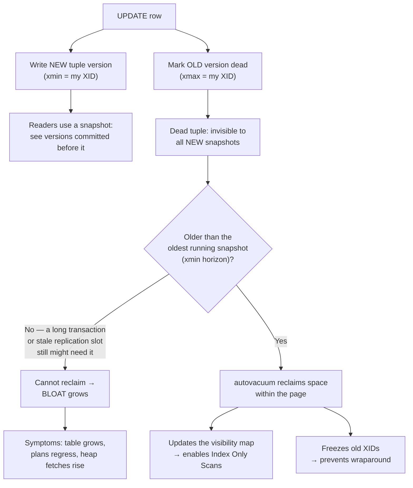

# MVCC & Vacuum Explainer

Explain why a database that never blocks readers must **keep old row versions — and then clean them
up**, per [`AGENTS.md`](../../../AGENTS.md). Almost every "Postgres got slow and the table grew" story
is this one mechanism. Pairs with
[transaction-isolation-explainer](../transaction-isolation-explainer/SKILL.md),
[storage-engine-explainer](../storage-engine-explainer/SKILL.md) and
[query-plan-tuning-lab](../query-plan-tuning-lab/SKILL.md).

## When to use

- A table's size grows far beyond its live row count; `VACUUM` seems to do nothing.
- `autovacuum` is "always running" or never runs on the hot table.
- A wraparound warning appears: *"database must be vacuumed within N transactions"*.
- Index Only Scans show high `Heap Fetches`, or plans regressed after a bulk update.
- Comparing PostgreSQL MVCC with InnoDB's undo-log design in an interview or migration.

## Mental model — first principles

To let readers proceed without locks, a writer must not destroy what a reader might still need. So an
`UPDATE` creates a **new version** and marks the old one dead; a `DELETE` only marks. Visibility is
decided per row version by comparing transaction ids against the reader's **snapshot**. The cost of
lock-free reads is therefore **garbage**, and vacuum is the collector.



## What vacuum actually does — and what it doesn't

| Operation | Reclaims space to OS? | Locks | Rebuilds indexes | Use when |
| --- | --- | --- | --- | --- |
| **`VACUUM`** (and autovacuum) | No — reuses space *inside* pages | Non-blocking (`SHARE UPDATE EXCLUSIVE`) | No | Always; routine |
| **`VACUUM (ANALYZE)`** | No | Non-blocking | No | Also refreshes planner statistics |
| **`VACUUM FULL`** | **Yes** — rewrites the table | `ACCESS EXCLUSIVE` — blocks everything | Yes | Emergency only, off-hours, needs 2× disk |
| **`REINDEX CONCURRENTLY`** | Index bloat only | Mostly non-blocking | Yes | Bloated indexes without full downtime |
| **`pg_repack`** (extension) | Yes | Brief exclusive lock | Yes | Online alternative to `VACUUM FULL` |
| **`TRUNCATE`** | Yes, instantly | `ACCESS EXCLUSIVE` | n/a | You want *all* rows gone |

Grounding: PostgreSQL documentation, "Routine Vacuuming" (dead tuples, the visibility map, freezing,
wraparound), "Concurrency Control / Transaction Isolation", and the `pg_stat_all_tables` /
`pg_stat_progress_vacuum` views.

## PostgreSQL vs InnoDB (MySQL)

| Aspect | PostgreSQL | InnoDB (MySQL) |
| --- | --- | --- |
| Old versions live | **In the table heap** as dead tuples | In **undo log** segments (rollback segments) |
| Cleaner | `VACUUM` / autovacuum | Background **purge** threads |
| Long transaction cost | Heap bloat; vacuum cannot advance | **Undo/history-list growth**; reads walk long version chains |
| Update in place? | Never; new tuple (HOT update can keep it on the same page and skip index writes) | Yes, in place; the old image goes to undo |
| Index entries | One per tuple version (except HOT) | Secondary indexes need the undo chain for old reads |
| Signature failure | Wraparound / bloat | History list length grows; purge lag |
| Monitor with | `pg_stat_all_tables.n_dead_tup`, `pg_stat_progress_vacuum` | `SHOW ENGINE INNODB STATUS` → *History list length* |

Grounding: MySQL Reference Manual, "InnoDB Multi-Versioning", "Undo Logs", and
`innodb_purge_threads` / `innodb_max_purge_lag`.

## Procedure

1. **Establish the symptom with numbers**, not vibes:
   `SELECT relname, n_live_tup, n_dead_tup, last_autovacuum, autovacuum_count FROM pg_stat_all_tables
   ORDER BY n_dead_tup DESC LIMIT 10;` and compare `pg_total_relation_size()` against
   `n_live_tup × avg row width` (or install `pgstattuple` for a real bloat estimate).
2. **Explain visibility from first principles**: each tuple carries `xmin`/`xmax`; a snapshot decides
   what is visible; a version is removable only once **no** snapshot could still need it.
3. **Find what holds the xmin horizon back** — this is the single most common root cause. Check all
   four: long-running transactions and `idle in transaction` sessions
   (`SELECT pid, state, xact_start, query FROM pg_stat_activity ORDER BY xact_start;`), abandoned
   **replication slots** (`pg_replication_slots.active = false`), prepared transactions
   (`pg_prepared_xacts`), and `hot_standby_feedback` on a busy replica.
4. **Fix the holder first.** Tuning autovacuum while a two-day transaction is open changes nothing —
   vacuum will still refuse to remove those tuples.
5. **Tune autovacuum for hot tables** rather than globally: lower `autovacuum_vacuum_scale_factor`
   (the 0.2 default means "20 % of a 100 M-row table" ≈ 20 M dead tuples before it triggers) with a
   per-table `ALTER TABLE … SET (autovacuum_vacuum_scale_factor = 0.02,
   autovacuum_vacuum_threshold = 1000);`, and give it throughput by raising
   `autovacuum_vacuum_cost_limit` / lowering `autovacuum_vacuum_cost_delay`. Also consider
   `autovacuum_max_workers` if many tables compete.
6. **Explain the visibility map payoff**: vacuum marks all-visible pages, which is what makes **Index
   Only Scans** avoid heap access. High `Heap Fetches` in a plan means "vacuum this table" — verify in
   [query-plan-tuning-lab](../query-plan-tuning-lab/SKILL.md).
7. **Cover freezing and wraparound**: transaction ids are 32-bit and wrap; vacuum *freezes* old tuples
   so they stay visible forever. Watch headroom with
   `SELECT datname, age(datfrozenxid) FROM pg_database ORDER BY 2 DESC;` — approaching
   `autovacuum_freeze_max_age` (default 200 M) triggers an aggressive anti-wraparound vacuum, and
   ignoring it far enough forces the database into read-only protection mode. Never cancel an
   anti-wraparound vacuum out of impatience.
8. **Reduce garbage at the source**: batch bulk updates and `VACUUM` between batches; avoid updating
   indexed columns so **HOT updates** stay possible; lower `fillfactor` on update-heavy tables to
   leave room on the page; keep transactions short.
9. **Choose the remediation** from the table — routine vacuum, `REINDEX CONCURRENTLY`, `pg_repack`,
   or (last resort, with a maintenance window and 2× disk) `VACUUM FULL`.
10. **Verify the fix**: `n_dead_tup` falls, table size stabilises, `last_autovacuum` advances, and the
    plan that regressed recovers. Then add monitoring: dead-tuple ratio, oldest transaction age,
    `age(datfrozenxid)`, and inactive replication slots.

## Output shape

```
MVCC / vacuum diagnosis — <table or database>

Symptom: <size X GB vs Y GB live | wraparound warning | heap fetches high>
Evidence:
  n_live_tup=<> n_dead_tup=<> (dead ratio <%>)  last_autovacuum=<ts>  autovacuum_count=<n>
  total_relation_size=<> vs estimated live=<>   bloat≈<%>

Horizon blockers (checked all four):
  long tx: pid <> age <>  | idle-in-tx: <> | replication slot <name> active=<f> | prepared xacts: <>
  => root cause: <...>

Actions (in order):
  1. <terminate/fix the holder>
  2. ALTER TABLE <t> SET (autovacuum_vacuum_scale_factor=<>, autovacuum_vacuum_threshold=<>);
  3. <REINDEX CONCURRENTLY | pg_repack | VACUUM FULL in window>  cost: <lock, disk, time>

Wraparound headroom: age(datfrozenxid)=<n> / autovacuum_freeze_max_age=<n>  → <ok | act now>
InnoDB equivalent (if MySQL): history list length=<n>, purge lag → <action>

VERIFY  dead ratio <before>→<after> | size <before>→<after> | plan node <regressed>→<recovered>
Monitors added: dead-tuple ratio, oldest xact age, datfrozenxid age, inactive slots
```

## Tips

- **Bloat is a symptom; the xmin horizon is the disease.** Always find what pins it before tuning.
- **Pitfall — `VACUUM FULL` as routine maintenance.** It takes an `ACCESS EXCLUSIVE` lock (full
  outage for that table) and needs a full extra copy on disk. Use `pg_repack` or fix autovacuum.
- **Pitfall — disabling autovacuum "because it causes load".** That trades steady, throttled I/O for
  an eventual emergency anti-wraparound vacuum at the worst possible time.
- **Pitfall — default scale factors on huge tables.** 20 % of 100 M rows is absurd; set per-table
  values on your hottest tables.
- **Pitfall — idle-in-transaction connections.** A pooled connection that opened a transaction and
  went to lunch freezes cleanup database-wide; set `idle_in_transaction_session_timeout`.
- Indexes bloat separately from the heap — a vacuumed table can still have fat indexes; check
  `pgstattuple` / `pgstatindex` and use `REINDEX CONCURRENTLY`.
- MVCC is *why* readers don't block writers — link the behaviour back to
  [transaction-isolation-explainer](../transaction-isolation-explainer/SKILL.md) so snapshots and
  isolation levels are learned as one idea, not two.
- Cite the PostgreSQL "Routine Vacuuming" chapter and the MySQL "InnoDB Multi-Versioning" section by
  name; never invent a GUC or a threshold value.
- End with the **Learning Footer** (`AGENTS.md`) — one horizon blocker to hunt, one table to re-tune.
