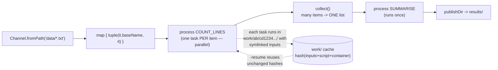

# Nextflow + nf-core Lab

Reproducible workflows taught by running them: **channel → process → operator → profile → resume**,
following the first-principles, verify-by-executing approach in [`AGENTS.md`](../../../AGENTS.md). The whole
lab runs free and locally; the same code later runs on Slurm or the cloud by changing one flag.

## When to use

- The learner has a chain of shell/Python steps and needs restartability, provenance and parallelism.
- `-resume` re-runs everything, or a process "can't find" a file — both are channel/staging misconceptions.
- They must run an nf-core community pipeline correctly (right revision, right profile, right params).
- Don't use it for scheduled service orchestration or Python-native DAGs — see
  [airflow-dag-coach](../airflow-dag-coach/SKILL.md) and
  [prefect-local-lab](../prefect-local-lab/SKILL.md).

## First principles: dataflow, not a task list

Nextflow (Seqera Labs, Apache-2.0) is a **dataflow** engine. You never write "run A then B"; you connect
processes with **channels**, and a process executes once per item that arrives. Parallelism is therefore
emergent, not configured. **DSL2 is mandatory** — DSL1 was removed from modern Nextflow releases, so any
tutorial without `workflow { }` blocks and module imports is obsolete. Check `nextflow -version` (Java 17+
is required by current releases) and confirm the LTS line on `nextflow.io/docs`.



| Concept | What it really is | Common misconception |
| --- | --- | --- |
| Channel | an asynchronous queue of items | "a list I can index" — it is consumed once |
| Process | a task template executed per item | "a function I call in order" |
| `work/` | per-task sandbox with hashed name | "temp files I can delete" — deleting it kills `-resume` |
| `publishDir` | copies/links outputs *out* of `work/` | "where the process runs" |
| `-resume` | reuse cached tasks by input+script+container hash | "continue where it crashed" |
| Profile | a named config bundle | "an environment variable" |

| Operator | Turns | Into | Use for |
| --- | --- | --- | --- |
| `map` | item | transformed item | reshaping to `tuple(meta, file)` |
| `filter` | items | fewer items | dropping failures/controls |
| `collect` | N items | 1 list | a step that needs *everything* |
| `groupTuple` | items with a key | one item per key | per-sample aggregation |
| `splitCsv` | a CSV file | one item per row | sample sheets |
| `fromFilePairs` | files | `[id, [R1, R2]]` | paired-end reads |
| `combine` / `join` | two channels | cartesian / keyed merge | reference + sample fan-out |

**Trade-off to say out loud:** the `work/` directory is large and ugly, but it is exactly what buys you
`-resume`, provenance and identical behaviour on a laptop and a 1000-node cluster. Publishing with
`mode: 'symlink'` keeps it cheap; `mode: 'copy'` makes results survive a `work/` clean-up.

## Procedure

1. **Install Nextflow** (free, single binary; needs Java 17+):
   ```bash
   sudo apt install -y openjdk-17-jre-headless
   curl -s https://get.nextflow.io | bash && sudo mv nextflow /usr/local/bin/
   nextflow -version
   ```
2. **Run a community pipeline first** so the learner sees the target quality bar. Always pin a revision —
   list the available ones instead of guessing a tag:
   ```bash
   pip install nf-core                 # nf-core/tools 3.x namespaces its commands
   nf-core pipelines list              # older docs say `nf-core list`
   nextflow run nf-core/demo -r <release-tag> -profile test,docker --outdir results
   ```
   `-profile test` supplies a tiny bundled dataset; swap `docker` for `singularity` or `conda` to match
   what your machine has.
3. **Write your own DSL2 pipeline** (worked example below): one process per tool, explicit `input:` and
   `output:` blocks, and a `workflow { }` that wires channels together.
4. **Keep configuration out of the code** — put executor, resources and containers in `nextflow.config`
   under named `profiles`, so the pipeline itself is portable.
5. **Prove the cache**: run twice, second time with `-resume`, and confirm the log shows `cached:` for
   every unchanged task. Then touch one input and watch only its branch re-run.
6. **Emit the evidence artefacts** — these are the deliverables a reviewer reads:
   ```bash
   nextflow run main.nf -resume -with-report report.html -with-trace -with-timeline timeline.html \
     -with-dag flow.mmd        # .mmd renders as Mermaid; .html/.png also supported
   ```
7. **Scale without editing code**: `-profile slurm` flips `process.executor` and Nextflow generates and
   submits the `sbatch` scripts itself — see [slurm-hpc-job-lab](../slurm-hpc-job-lab/SKILL.md).
8. **Lint if you are contributing**: `nf-core pipelines lint` enforces the community template.
9. **Break it deliberately**: `rm -rf work/` then `-resume` and observe a full re-run; explain why. Close
   with the **Learning Footer**.

## Output shape

```
Goal: <what the pipeline produces>          Nextflow: <version>  DSL2  Java: <17+>
Inputs: <channel factory + sample sheet>    Params: --<name> <value> ...
Graph: <CHANNEL> -> <PROCESS_A> -(<operator>)-> <PROCESS_B> -> publishDir <dir>
Processes: <NAME> cpus=<n> memory=<x> container=<image> — one task per <item>
Profiles used: -profile <standard|docker|conda|singularity|slurm>[,test]
Command: nextflow run <main.nf|nf-core/<pipe> -r <tag>> -profile <...> --outdir <dir> [-resume]
Run evidence: tasks=<n> cached=<n> failed=<n> · wall=<...> · report.html · trace.txt · flow.mmd
Reproducibility: revision pinned=<tag> · container digest=<...> · resume verified=<yes/no>
Next: <slurm-hpc-job-lab | airflow-dag-coach | data-pipeline-designer>
Learning Footer
```

## Worked example — a two-process DSL2 pipeline that resumes correctly

`main.nf` — no containers needed, so it runs anywhere with coreutils:

```groovy
#!/usr/bin/env nextflow

params.reads  = "$projectDir/data/*.txt"
params.outdir = "results"

process COUNT_LINES {
    tag "$sample_id"                                  // shows up in the log and trace
    publishDir "${params.outdir}/counts", mode: 'copy'

    input:
    tuple val(sample_id), path(reads)                 // path() stages the file into work/

    output:
    tuple val(sample_id), path("${sample_id}.count")

    script:
    """
    wc -l < ${reads} > ${sample_id}.count
    """
}

process SUMMARISE {
    publishDir params.outdir, mode: 'copy'

    input:
    path counts                                        // a LIST of files, thanks to collect()

    output:
    path 'summary.tsv'

    script:
    """
    for f in ${counts}; do
      printf '%s\\t%s\\n' "\${f%.count}" "\$(cat \$f)"
    done | sort > summary.tsv
    """
}

workflow {
    samples = Channel
        .fromPath(params.reads, checkIfExists: true)   // fail loudly if the glob matches nothing
        .map { f -> tuple(f.baseName, f) }

    counts = COUNT_LINES(samples)                      // one parallel task per sample
    SUMMARISE(counts.map { _id, f -> f }.collect())    // collect() -> exactly one task
}
```

`nextflow.config` — configuration, never in the pipeline body:

```groovy
manifest { name = 'line-count-demo'; nextflowVersion = '>=24.04.0' }
params   { outdir = 'results' }
process  { cpus = 1; memory = '1.GB' }

profiles {
    standard { process.executor = 'local' }
    docker   { docker.enabled  = true;  process.container = 'ubuntu:24.04' }
    conda    { conda.enabled   = true }
    slurm    { process.executor = 'slurm'; process.queue = 'debug'; process.time = '10m' }
}
```

```bash
mkdir -p data && printf 'a\nb\nc\n' > data/sampleA.txt && printf 'x\ny\n' > data/sampleB.txt
nextflow run main.nf -profile standard
# [c1/8f2a3d] process > COUNT_LINES (sampleA) [100%] 2 of 2 ✔
# [7d/91be04] process > SUMMARISE            [100%] 1 of 1 ✔
cat results/summary.tsv       # sampleA<TAB>3   sampleB<TAB>2

nextflow run main.nf -resume  # every line now reads "Cached process > ..." — nothing re-ran
printf 'z\n' >> data/sampleB.txt
nextflow run main.nf -resume  # ONLY COUNT_LINES(sampleB) and SUMMARISE re-run
```

## Tips

- `-resume` breaks when the *hash* changes: editing whitespace in a `script:` block, changing the container
  tag, or using a non-deterministic input (a timestamped filename) all invalidate the cache legitimately.
- `path()` inputs are **symlinked** into the task directory — never `cd` elsewhere or use absolute host
  paths in a script block, or the task stops being portable and reproducible.
- Channels are consumed once. Reusing the same channel variable in two processes silently starves one of
  them in older idioms; derive a fresh channel with an operator instead.
- Always pin `-r <revision>` for nf-core pipelines and record it — "latest" is not reproducible.
- `-profile test` is for smoke-testing only; combining `-profile test,docker` is the standard first run.
- Nextflow flags take a single dash (`-resume`, `-profile`); *pipeline* parameters take two (`--outdir`).
  Mixing them up is the most common beginner error and fails silently as an unknown param.
- Prefer `errorStrategy 'retry'` with `maxRetries` and rising `memory` over hard-coding a huge request.
- Pair with [slurm-hpc-job-lab](../slurm-hpc-job-lab/SKILL.md) to run at scale,
  [airflow-dag-coach](../airflow-dag-coach/SKILL.md) for scheduled orchestration,
  [data-pipeline-designer](../data-pipeline-designer/SKILL.md) for the architecture,
  [docker-compose-lab](../docker-compose-lab/SKILL.md) for the container layer, and
  [data-quality-checker](../data-quality-checker/SKILL.md) for output validation.
  End with the **Learning Footer** (`AGENTS.md`).
