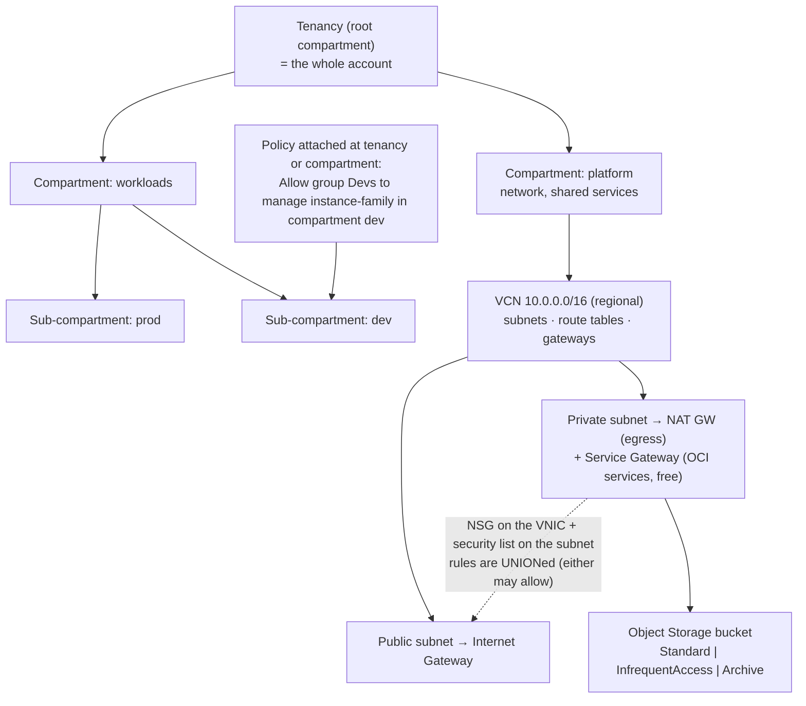

# OCI Core Services Lab

Learn Oracle Cloud from its four load-bearing primitives — **compartment → policy → VCN → Object Storage** —
per [`AGENTS.md`](../../../AGENTS.md). OCI's policy language is unusually readable, and its compartment model
does work that other clouds split across accounts, projects, and resource groups.

## When to use

- The learner comes from AWS/Azure/GCP and needs the OCI mental model mapped onto what they know.
- They are standing up a tenancy and must get compartments and policies right before workloads land.
- They want to practise on the OCI **Always Free** tier without a spending commitment.
- **Don't** use it for deep Oracle Database tuning — this lab is the infrastructure foundation only.

## First principles: the compartment is the noun every policy talks about

In OCI a **compartment** is a logical container inside a single tenancy that holds resources, forms the unit
of access control and quota, and nests up to six levels deep (Oracle Cloud Infrastructure documentation,
*Managing Compartments* and *How Policies Work*). Policies are plain-language statements attached to a
compartment or the tenancy, and — like AWS SCP-free IAM — nothing is permitted until a policy says so.



| OCI concept | Closest AWS analogue | Closest Azure analogue | Key difference to teach |
| --- | --- | --- | --- |
| Tenancy | account/organization | tenant | one tenancy, many compartments — no account sprawl |
| **Compartment** | account (isolation) + tag scope | resource group / subscription | nests 6 deep; resources move between compartments |
| Policy statement | IAM JSON policy | RBAC role assignment | plain-language grammar, attached to a compartment |
| Availability domain / fault domain | AZ / partition placement | zone / fault domain | some regions have a single AD; fault domains still apply |
| VCN | VPC | VNet | regional; subnets can be regional or AD-specific |
| Security list | NACL (but **stateful** by default) | NSG on subnet | evaluated *together* with NSGs |
| Network security group (NSG) | security group | NSG on NIC / ASG | attaches to VNICs; preferred for new designs |
| Service Gateway | gateway VPC endpoint | service endpoint | private path to OCI services, no NAT charge |
| Dynamic group | IAM role for EC2 | managed identity | matches instances by rule, then policies grant it |

**Policy grammar** — memorise this one line and most of OCI IAM follows:

```text
Allow <subject> to <verb> <resource-type> in <location> where <conditions>
      group Devs      manage instance-family  compartment dev   request.region = 'eu-frankfurt-1'
```

| Verb | Grants | Mental model |
| --- | --- | --- |
| `inspect` | list resources (metadata only) | "see that it exists" |
| `read` | inspect + get contents/details | "open it" |
| `use` | read + work with existing resources (no create/delete) | "operate it" |
| `manage` | use + create and delete | "own it" |

Verbs are strictly cumulative, so `manage` implies `use` implies `read` implies `inspect`. Least privilege in
OCI is mostly a matter of picking the *smallest verb* and the *narrowest compartment*.

## Procedure

1. **Install and configure the CLI** — `oci setup config` writes `~/.oci/config` with your user OCID, tenancy
   OCID, region, and an API key pair. Verify with `oci iam region list --output table`.
2. **Design the compartment tree before creating anything.** A durable baseline is `platform` (network,
   security, logging) and `workloads` with `prod`/`dev` beneath it. Resources can be moved later, but
   policies and quotas follow the tree, so the shape matters.

   ```bash
   TENANCY=$(oci iam compartment list --all --query "data[0].\"compartment-id\"" --raw-output)
   oci iam compartment create --compartment-id "$TENANCY" --name workloads \
     --description "application workloads" --wait-for-state ACTIVE
   ```

3. **Create a group and a policy** at the narrowest useful compartment — never at the tenancy "for now":

   ```bash
   oci iam policy create --compartment-id "$WORKLOADS_OCID" --name dev-compute \
     --description "developers operate compute in dev" \
     --statements '["Allow group Devs to manage instance-family in compartment workloads:dev",
                    "Allow group Devs to read all-resources in compartment workloads"]'
   ```

   ⚠ With identity domains, qualify the group name — `Allow group 'MyDomain'/'Devs' to …`.
4. **Prove the verb ladder.** Change `manage` to `use` and watch instance *creation* fail while start/stop
   still works. That single experiment teaches OCI IAM better than any diagram.
5. **Create the VCN and subnets.** The VCN is regional; give it a DNS label so instances get resolvable names:

   ```bash
   VCN=$(oci network vcn create --compartment-id "$C" --display-name vcn-lab \
     --cidr-blocks '["10.0.0.0/16"]' --dns-label vcnlab --query data.id --raw-output)
   oci network subnet create --compartment-id "$C" --vcn-id "$VCN" --display-name snet-public \
     --cidr-block 10.0.1.0/24 --dns-label pub
   ```

6. **Add gateways deliberately:** an **internet gateway** for the public subnet, a **NAT gateway** for private
   egress (⚠ billed), and a **service gateway** so traffic to OCI services such as Object Storage stays on
   the Oracle network without paying for NAT.
7. **Route explicitly.** A subnet is public only because its route table sends `0.0.0.0/0` to the internet
   gateway — the same rule as every other cloud:

   ```bash
   oci network route-table create --compartment-id "$C" --vcn-id "$VCN" --display-name rt-public \
     --route-rules '[{"cidrBlock":"0.0.0.0/0","networkEntityId":"'"$IGW"'"}]'
   ```

8. **Layer the firewalls correctly.** Security lists apply to every VNIC in the subnet; NSGs apply to the
   VNICs you attach. Both are **stateful by default**, and the rules that apply to a VNIC are the **union** of
   its NSG rules and the subnet's security-list rules — traffic is permitted if *either* allows it. So an
   unexplained *opening* is usually the legacy security list you forgot; an unexplained *block* means neither
   set has a matching allow rule (check both, plus route tables).
9. **Create Object Storage and choose the tier by access pattern:**

   ```bash
   oci os bucket create --compartment-id "$C" --name lab-bucket --storage-tier Standard
   oci os object put --bucket-name lab-bucket --file ./report.parquet --name reports/2026-08.parquet
   oci os object update-storage-tier --bucket-name lab-bucket --object-name reports/2026-08.parquet \
     --storage-tier InfrequentAccess
   ```

10. **Clean up:** delete the bucket contents and bucket, then NAT gateway → subnets → gateways → VCN, then
    the compartment (a compartment cannot be deleted until it is empty). Always Free resources cost nothing,
    but NAT gateways, load balancers, and paid compute shapes do.

## Output shape

```
Tenancy: <name> | Region: <eu-frankfurt-1> | CLI profile: <DEFAULT>
Compartments: root → platform | workloads → {prod, dev}   (depth <n>/6)
Policies:
  <compartment>: "Allow group <G> to <verb> <resource-type> in compartment <C> where <cond>"
  Verb rationale: <inspect|read|use|manage> because <smallest that works>
Network: VCN <name> 10.0.0.0/16 (regional, dns-label <x>)
  public  <cidr> → route 0.0.0.0/0 → Internet Gateway
  private <cidr> → route 0.0.0.0/0 → NAT GW ⚠ billed | OCI services → Service Gateway (no NAT cost)
  Firewalls: security list <name> (subnet, stateful) + NSG <name> (VNIC) — both evaluated
Object Storage: bucket <name> tier <Standard|Archive>
  Lifecycle: <objects > n days → InfrequentAccess → Archive>   Retrieval: Archive needs restore first
Always Free used: <compute shape / 20 GB Standard + 10 GB Archive / 10 TB egress> (confirm current limits)
Cleanup: objects → bucket → NAT → subnets → gateways → VCN → compartment (must be empty)
Next: <cloud-iam-least-privilege-coach | aws-vpc-lab | cloud-migration-planner>
Learning Footer
```

## Worked example — least-privilege policy plus the storage-tier decision

```bash
# Operators may start/stop and manage networking in prod, but MAY NOT create or delete instances.
oci iam policy create --compartment-id "$WORKLOADS_OCID" --name prod-operators \
  --description "operate, not own" \
  --statements '[
    "Allow group Operators to use instance-family in compartment workloads:prod",
    "Allow group Operators to read virtual-network-family in compartment workloads:prod",
    "Allow group Operators to inspect all-resources in compartment workloads"
  ]'
```

`use` on `instance-family` permits `instance-action` (start, stop, reset) but not `LaunchInstance` or
`TerminateInstance` — that is exactly the operator/owner split most teams try and fail to express in other
clouds' JSON. Add `where request.region = 'eu-frankfurt-1'` to region-lock it.

Now the storage decision, which is about *retention minimums and retrieval*, not just per-GB price:

| Tier | Access | Minimum retention | Retrieval | Choose for |
| --- | --- | --- | --- | --- |
| Standard | immediate | none | free | active data, anything read weekly |
| Infrequent Access | immediate | 31 days | per-GB retrieval fee | monthly reports, backups read occasionally |
| Archive | **must restore first** (~1 h) | 90 days | restore request + fee | compliance retention, rarely read |

Deleting an Infrequent Access object after 5 days still bills the 31-day minimum, and an Archive object is
*not* readable until `oci os object restore --bucket-name <b> --name <o> --hours 24` completes. Confirm
current minimums and pricing on the Oracle Cloud pricing page before committing a lifecycle policy.

## Tips

- Compartments do the job that AWS accounts and Azure resource groups split between them — design the tree
  before the first resource, because policies and quotas follow it.
- Verbs are cumulative (`inspect` ⊂ `read` ⊂ `use` ⊂ `manage`); pick the smallest that works and the
  narrowest compartment, then add `where` conditions.
- Security lists **and** NSGs are evaluated as a **union** (either may allow). New designs should prefer
  NSGs, but a legacy security list is the usual culprit behind unexplained *openings*, not drops.
- The **service gateway** keeps traffic to Object Storage on the Oracle network and avoids NAT charges — it
  is the OCI equivalent of an AWS gateway endpoint, and it is the cheap right answer.
- Archive is not "cold Standard": it needs an explicit restore and has a 90-day minimum. Model the retrieval
  path before you tier data down.
- Pair with [cloud-iam-least-privilege-coach](../cloud-iam-least-privilege-coach/SKILL.md),
  [aws-vpc-lab](../aws-vpc-lab/SKILL.md),
  [cloud-private-connectivity-coach](../cloud-private-connectivity-coach/SKILL.md),
  [cloud-migration-planner](../cloud-migration-planner/SKILL.md),
  [cloud-cost-optimizer](../cloud-cost-optimizer/SKILL.md), and
  [floci-oracle-local-lab](../floci-oracle-local-lab/SKILL.md).
  End with the **Learning Footer** (`AGENTS.md`): one verb to downgrade, one bucket tier to justify.
