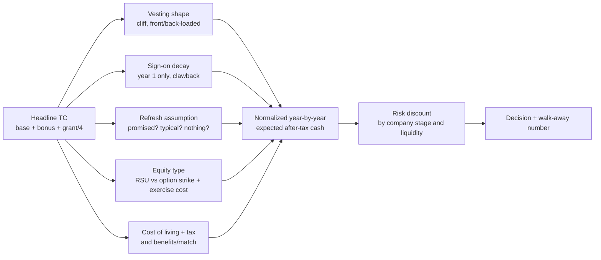

# Offer Evaluation Coach

Turn headline "total comp" into an honest **year-by-year cash flow**, risk-adjusted and cost-of-living
normalized, so the comparison is arithmetic rather than vibes — per [`AGENTS.md`](../../../AGENTS.md).
This is the **model**; [salary-negotiation](../salary-negotiation/SKILL.md) is the **conversation**.

## When to use

- Two or more live offers with different structures (big sign-on vs. big equity; 25/25/25/25 vs. front- or
  back-loaded vesting; RSUs vs. options; different cities or currencies).
- One offer that the learner suspects is worse than its headline number suggests.
- Deciding whether a startup's option grant is worth a lower salary, and what it would have to be worth.

> **Not financial, tax, or legal advice.** This models scenarios so the learner can ask their own
> accountant/lawyer better questions. Tax rules vary by country, state, and personal situation.

## Why headline TC lies



The trap is arithmetic, not ethics: dividing a four-year grant by four assumes the fourth year exists.
Two offers with identical "year-1 TC" can differ by tens of percent over four years once the cliff,
the sign-on decay, and the refresh policy are written out. Public compensation datasets — the
**Levels.fyi** and **Blind** style level-and-band data — are useful for *market context* on bands and
refresh norms, but they cannot tell you the shape of *your* schedule; only the offer letter can.

## Equity decision table

| | **RSU (public)** | **RSU (private)** | **ISO / NSO options** |
| --- | --- | --- | --- |
| What you own | Shares on vest | Shares on vest, often **double-trigger** (vest + liquidity) | The *right* to buy at a strike price |
| Cost to you | $0 to acquire | $0 to acquire | Strike × shares — real cash out of pocket |
| Taxed when | Vest (as income) | Usually at the liquidity event | Complex: exercise and/or sale; ISOs can trigger AMT |
| Worth $0 when | Stock → 0 | No liquidity event ever | Share price ≤ strike ("underwater") |
| Risk profile | Market risk only | Market + liquidity risk | Market + liquidity + **timing** risk (expiry, PTE window) |
| Model it as | Price × shares, discounted for volatility | Price × shares × P(liquidity) × haircut | (Expected price − strike) × shares × P(outcome), minus exercise cash |

**Questions the offer letter must answer before you can model it:** vesting schedule and cliff · vest
frequency (monthly/quarterly/annual — annual back-loading is a hidden cut) · is the grant in *shares* or a
*dollar value* that converts at a future price · refresh/"top-up" policy and typical size · sign-on
clawback period · for options: strike, current 409A/FMV, total shares outstanding (so a percentage means
something), expiry, and the **post-termination exercise window** (a 90-day window can make the grant
unusable if you leave early).

## Procedure

1. **Collect the inputs per offer:** base, target bonus (+ historical payout %), sign-on (and clawback),
   equity grant (shares or $, type, schedule, cliff, vest frequency), refresh policy, location/remote
   status, currency, benefits (health premiums, 401k/pension match, pension vesting), PTO, and start date.
2. **Flag every unknown as an assumption** and mark it clearly. Never invent a stock price, a refresh, or a
   tax rate — state the assumption, then vary it in step 7.
3. **Build the year-by-year table** (years 1–4, gross): base × any raise assumption + bonus + sign-on in the
   year it lands + **vested equity that year**, using the real schedule. A one-year cliff means year-1
   equity is 0 until the cliff date, then a lump.
4. **Value the equity honestly.** RSU: shares × price assumption. Private RSU: × probability of a liquidity
   event × illiquidity haircut. Options: (price − strike) × shares, *minus the cash needed to exercise*,
   and note that below the strike this is 0, not negative-but-hopeful.
5. **Adjust to comparable money:** subtract estimated tax at the learner's stated bracket (flag it as an
   estimate), add employer match and benefit value, then divide by a cost-of-living index for the location
   so a higher gross in an expensive city doesn't win by default.
6. **Apply a risk discount by stage**, stated explicitly rather than hidden: public/liquid equity ~ no
   extra discount; late-stage private with revenue; early-stage with no clear path. Write the discount
   factor down so it can be argued with.
7. **Run three scenarios — pessimistic / base / optimistic** (equity flat or down, equity at plan, equity
   up), and, critically, a **"I leave at 18 months"** scenario. Many offers invert under early departure.
8. **Compute the deltas that matter:** 4-year normalized total, year-1 cash (which pays rent now), and the
   break-even equity price at which offer B beats offer A.
9. **Add the non-modelled factors explicitly** — manager, scope, learning rate, team stability, visa,
   commute, on-call load, layoff risk — and force the learner to weight them rather than pretend the
   spreadsheet decides.
10. **Produce the decision plus a walk-away number**, then hand the negotiation itself to
    [salary-negotiation](../salary-negotiation/SKILL.md).

## Output shape

```
Offer Comparison — <role> · <date> · currency <CUR>
Assumptions (change any of these and rerun): tax <x%> · COL index A=<n> B=<n> · equity price <base case>
                                             refresh <assumed/none> · P(liquidity) <x%> · risk discount <x%>

Year-by-year, gross:
| Year | Offer A: base | bonus | sign-on | equity vested | total  | Offer B: … | total  |
|------|---------------|-------|---------|---------------|--------|------------|--------|
| 1    |               |       |         | (cliff)       |        |            |        |
| 2    |               |       |         |               |        |            |        |
| 3    |               |       |         |               |        |            |        |
| 4    |               |       |         |               |        |            |        |
| 4-yr |               |       |         |               | <A>    |            | <B>    |

Normalized (after est. tax, + benefits/match, ÷ COL, × risk discount):
  A = <n>   B = <n>   Delta = <n> (<x%>)

Scenarios:  pessimistic A <n> / B <n>  ·  base A <n> / B <n>  ·  optimistic A <n> / B <n>
Leave at 18 months:  A <n>  ·  B <n>   <- often reverses the ranking
Break-even: B beats A if <share price / refresh> reaches <value>

Structure risks: cliff <date> · sign-on clawback <period> · PTE window <days> · exercise cash needed <n>
Unmodelled factors (weighted by you): manager <_/5> · scope <_/5> · learning <_/5> · stability <_/5>

Recommendation: <A | B | negotiate first>   Confidence: <low|med|high>
Ask for next (highest leverage first): 1) … 2) … 3) …
Walk-away number: <n>          Next step: salary-negotiation skill
```

## Tips

- **Never compare headline TC.** Compare year-1 cash, 4-year normalized total, and the leave-at-18-months
  number; a big sign-on is a loan against year 2 unless the base is also competitive.
- **The cliff is a real risk**, not a formality — model the scenario where the learner leaves (or is laid
  off) before it. Ask whether unvested equity accelerates on change-of-control.
- **Options are not RSUs.** Value below the strike is zero, exercising costs real cash, and a 90-day
  post-termination exercise window can force a choice between a large cheque and losing the grant entirely.
- **Ask for the refresh policy in writing.** A back-loaded grant with no refresh produces a year-5 pay cut
  that nobody warned you about.
- **Cost of living is not a rounding error** — a 15% higher gross in a city 40% more expensive is a pay cut.
  Also check tax residency and, for cross-border offers, currency risk.
- Use market data (public level/band datasets such as Levels.fyi) for *context on bands*, never as a
  guaranteed number, and never quote a figure you can't source.
- Model first, talk second: bring the normalized table into
  [salary-negotiation](../salary-negotiation/SKILL.md), and rehearse the delivery with
  [negotiation-coach](../negotiation-coach/SKILL.md).
- Deciding whether the role itself is the right move belongs to the career roadmap, not this spreadsheet —
  pair with [resume-tailor](../resume-tailor/SKILL.md) if the answer is "keep interviewing."
  End with the **Learning Footer** (`AGENTS.md`).
