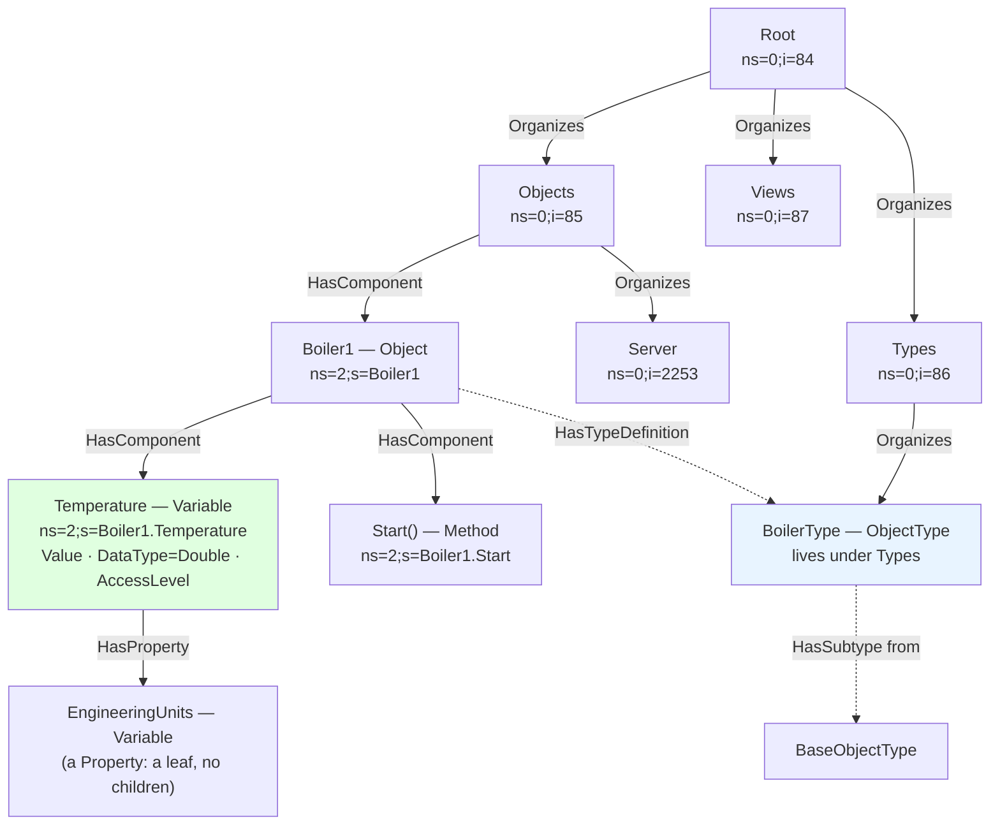
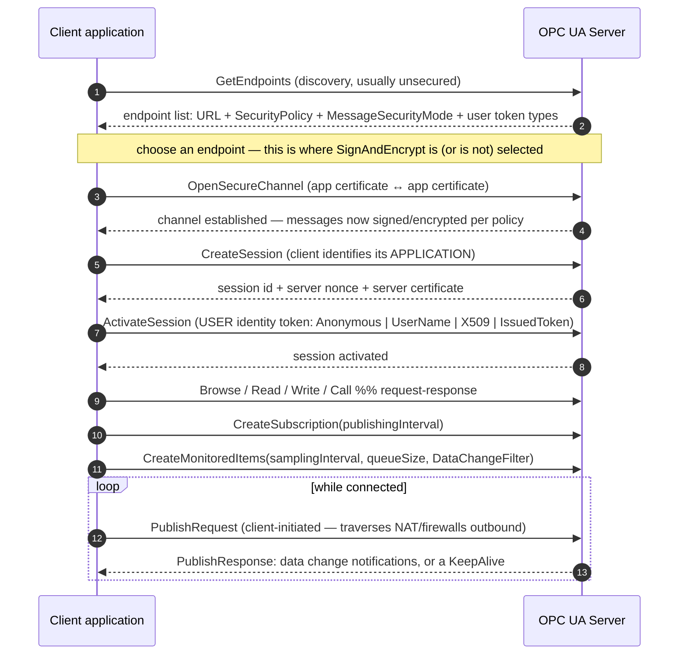

# OPC UA Coach

OPC UA taught as **a typed graph plus a layered connection** — model first, transport second, security
throughout — following the first-principles and primary-source discipline in
[`AGENTS.md`](../../../AGENTS.md). The normative source is the **OPC Foundation**'s **OPC Unified
Architecture specification, standardised as IEC 62541**: Part 1 (Overview), Part 2 (Security Model), Part 3
(Address Space Model), Part 4 (Services), Part 5 (Information Model), Part 6 (Mappings), Part 7 (Profiles)
and Part 14 (PubSub). ⚠ The specification is versioned (the 1.04 and 1.05 series) and parts are revised
independently — check the current release and part numbering at `opcfoundation.org` before quoting a clause.

## When to use

- A plant has machines from four vendors and someone has asked for "one integration" — this is the standard
  that was designed for exactly that.
- The learner can read a tag value but cannot explain what a NodeId, a namespace index or a type definition
  is, and their integration breaks after a server restart.
- A team is choosing between OPC UA client-server, OPC UA PubSub, and plain MQTT for a telemetry path.
- A connection fails at `BadSecurityChecksFailed` / `BadIdentityTokenRejected` and nobody knows which of the
  two identity layers is at fault.
- **Don't use it for** plain lightweight broker telemetry — see
  [mosquitto-mqtt-lab](../mosquitto-mqtt-lab/SKILL.md) — or for the firmware on the device itself
  ([esp-idf-lab](../esp-idf-lab/SKILL.md), [zephyr-rtos-lab](../zephyr-rtos-lab/SKILL.md)).

## First principles: OPC UA moves *meaning*, not just values

MQTT moves a payload to a topic. OPC UA moves a **self-describing, typed, browsable model**. A client that
has never seen your machine can connect, browse the address space, discover that a node is of type
`TemperatureSensorType`, learn its engineering units and range, and subscribe to it — without a data
dictionary emailed as a spreadsheet. That is the whole value proposition, and it is why the standard is so
much larger than a pub/sub protocol.

### The address space is a graph of Nodes joined by References



*Fig. 1 — a minimal address space. The dashed `HasTypeDefinition` edge is what separates OPC UA from a tag
list: it tells a client **what kind of thing** `Boiler1` is, so generic tooling can render, validate and
aggregate it. `HasComponent` builds structure; `HasProperty` attaches leaf metadata.*

| NodeClass | Purpose | Key attributes |
| --- | --- | --- |
| `Object` | a thing (machine, folder, device) | NodeId, BrowseName, DisplayName, EventNotifier |
| `Variable` | a value (process data or metadata) | Value, DataType, ValueRank, AccessLevel, Historizing |
| `Method` | a callable operation | InputArguments / OutputArguments (as Properties), Executable |
| `ObjectType` / `VariableType` | the template a node conforms to | IsAbstract |
| `ReferenceType` | the *kinds* of edges themselves | Symmetric, InverseName |
| `DataType` | value schema, incl. structures/enums | DataTypeDefinition |
| `View` | a filtered subset of the graph | ContainsNoLoops |

**NodeIds are the addresses**, written `ns=<index>;<type>=<identifier>` where the type is `i` (numeric),
`s` (string), `g` (GUID) or `b` (opaque). Two rules that cause most real integration bugs:

1. **The namespace *index* is not stable; the namespace *URI* is.** Index 0 is always the OPC UA namespace
   and index 1 is conventionally the server's own application URI, but anything above that can be
   renumbered when the server restarts or is reconfigured. Always read the server's `NamespaceArray` and
   resolve your URI to an index at connect time.
2. **BrowseName ≠ DisplayName ≠ NodeId.** BrowseName is a namespace-qualified programmatic name used for
   path translation; DisplayName is localised text for humans; the NodeId is the address you cache. Browse
   once to discover, then read/write by NodeId — re-browsing a path on every poll is a classic performance
   bug.

### The connection is layered, and each layer has its own identity



*Fig. 2 — client-server. Note the **two independent identities**: the *application instance certificate*
(mutual X.509, established at the SecureChannel) says which software is talking; the *user identity token*
(at ActivateSession) says who is asking. `BadSecurityChecksFailed` is layer one; `BadIdentityTokenRejected`
is layer two. Note also that the server never opens a connection — the client's outstanding
`PublishRequest`s are what let the server push, which is why OPC UA works outbound-only through a firewall.*

| Setting | Values | Guidance |
| --- | --- | --- |
| `MessageSecurityMode` | `None`, `Sign`, `SignAndEncrypt` | production: **SignAndEncrypt**. `Sign` gives integrity without confidentiality; `None` is for a lab bench only |
| `SecurityPolicy` | `None`, `Basic256Sha256`, `Aes128_Sha256_RsaOaep`, `Aes256_Sha256_RsaPss`, (legacy `Basic128Rsa15`, `Basic256`) | ⚠ the legacy policies are **deprecated** — confirm the currently recommended set in Part 2 / Part 7 for your spec version |
| User token | `Anonymous`, `UserName`, `Certificate` (X.509), `IssuedToken` (e.g. JWT/OAuth 2.0) | anonymous access should be read-only at most |
| Trust | mutual application-instance certificates + trust lists / rejected folder | "it works after I copy the cert into `trusted/`" is the normal onboarding step, not a hack |

### Client-server vs PubSub (Part 14)

| | Client-server | PubSub (Part 14) |
| --- | --- | --- |
| Shape | 1:1 sessions, request/response + subscriptions | 1:many, connectionless, fire-and-forget |
| Transport | `opc.tcp` (UA Binary), HTTPS, WebSockets | **UDP/UADP** (broker-less, multicast, TSN-friendly) or a **broker**: MQTT/AMQP carrying UADP or JSON |
| Entities | Session, Subscription, MonitoredItem | PublishedDataSet → DataSetWriter → WriterGroup; DataSetReader → SubscribedDataSet |
| Discovery/typing | full browse of the live address space | metadata shipped separately (DataSetMetaData) |
| Security | per-session handshake, mutual certs | group keys distributed by a **Security Key Service (SKS)** |
| Use it for | engineering, configuration, methods, historical access, anything needing browse | high-frequency machine-to-machine telemetry, controller-to-controller (OPC UA **FX**), one-to-many |

**OPC UA over MQTT is not "OPC UA vs MQTT".** Part 14 can use an MQTT broker as its transport while keeping
OPC UA's data typing and metadata — which is often the pragmatic answer when the IT side already runs a
broker. Compare with [mosquitto-mqtt-lab](../mosquitto-mqtt-lab/SKILL.md) before choosing.

### Interoperability is a Profile, not a promise

"Supports OPC UA" is not a specification. **Part 7 Profiles** define testable facet sets (for example the
*Nano Embedded Device Server* and *Micro Embedded Device Server* profiles for constrained devices, up to
full standard server profiles), and the OPC Foundation runs a **Compliance Test Tool** and independent
certification labs. **Companion specifications** — OPC UA for Machinery, Robotics, PackML, Euromap, umati,
and OPC UA FX for field-level exchange — define the *semantics* on top: without one, two certified servers
still expose incompatible models. Ask a vendor for its **profile** and its **companion specs**, plus
certification status, and verify the current list on `opcfoundation.org`.

## Procedure

1. **Model before you connect.** Write down the objects, their variables, engineering units, ranges, and the
   methods. Check whether a **companion specification** already defines your machine type — reusing one is
   what makes the data portable ([data-modeling-drill](../data-modeling-drill/SKILL.md) helps here).
2. **Choose your namespace URI** (a stable, owned URI like `http://example.com/UA/Boiler/`) and use
   **string NodeIds** derived from the model. Auto-generated numeric ids are convenient and unstable.
3. **Stand up a free local server** to learn against — the Python `asyncua` stack needs nothing but pip:
   ```bash
   python -m venv .venv && . .venv/bin/activate     # Windows: .venv\Scripts\Activate.ps1
   python -m pip install asyncua
   ```
   Alternatives, all free: **open62541** (C, MPL-2.0), **Eclipse Milo** (Java), **node-opcua** (JS), and
   **UaExpert** (a free GUI client from Unified Automation) for browsing.
4. **Enumerate endpoints before connecting**: `GetEndpoints` tells you the security policies, message
   security modes and user token types the server actually offers. Never hard-code an endpoint's security.
5. **Connect in layers and diagnose in layers**: SecureChannel (certificates, trust lists) → Session
   (`CreateSession`) → `ActivateSession` (user token). Map the error code to the layer before changing
   anything.
6. **Resolve the namespace index at runtime** from your URI via the `NamespaceArray`; never persist an index.
7. **Browse once, cache NodeIds, then read/write by NodeId.** For paths, use
   `TranslateBrowsePathsToNodeIds` rather than string-matching DisplayNames.
8. **Subscribe rather than poll.** Create a Subscription with a `publishingInterval`, then MonitoredItems
   with a `samplingInterval`, a `queueSize`, and a `DataChangeFilter` (trigger on Status / StatusValue /
   StatusValueTimestamp, plus an absolute or percent **deadband**). Polling a thousand tags in a loop is the
   most common cause of an "OPC UA is slow" complaint.
9. **Always read the StatusCode and timestamps, not just the value.** A `DataValue` carries `StatusCode`
   (`Good` / `Uncertain` / `Bad…`), a `SourceTimestamp` (when the device sampled it) and a `ServerTimestamp`
   (when the server saw it). Treating a `Bad` value as 0 is how a control room ends up staring at a
   confident, wrong number.
10. **Turn security on before the pilot, not after.** `SignAndEncrypt` + a modern policy + real user tokens +
    a managed trust list. Certificate lifecycle (issuance, renewal, revocation) is the operational work
    people forget — see [tls-ssl-explainer](../tls-ssl-explainer/SKILL.md) and
    [threat-model](../threat-model/SKILL.md).
11. **Prove interoperability with a second, different client** (UaExpert plus your code). One client and one
    server agreeing proves very little. Close with the **Learning Footer**.

## Output shape

```
Goal: <model a machine | integrate | choose transport | debug>   Spec version referenced: <1.04|1.05, part n>
Topology: <n servers> <n clients>   pattern: <client-server | PubSub UDP | PubSub over MQTT | both>
Information model:
  namespace URI: <http://...>   (index resolved at runtime, NOT hard-coded: <y>)
  ObjectType(s): <...>  companion spec reused: <OPC UA for Machinery | ... | none, and why>
  nodes: <ns=..;s=..> <NodeClass> <DataType> <AccessLevel> <EngineeringUnits/Range>
Endpoint chosen: <opc.tcp://host:4840/...>
  SecurityPolicy <Basic256Sha256|Aes...|None>  MessageSecurityMode <None|Sign|SignAndEncrypt>
  user token <Anonymous|UserName|X509|IssuedToken>   app cert trust: <trusted list managed by ...>
Connection layers verified: SecureChannel <ok> -> CreateSession <ok> -> ActivateSession <ok>
Data access: browse-once + cached NodeIds <y> · subscription publishingInterval <ms>
  monitored items <n> samplingInterval <ms> queueSize <n> deadband <abs/percent, value>
  StatusCode + SourceTimestamp handled (not just .Value): <y>
PubSub (if used): PublishedDataSet <..> DataSetWriter/WriterGroup <..> transport <UDP UADP|MQTT+JSON>
  security keys via SKS: <...>
Interop evidence: profile claimed <...> · certification <...> · tested with 2nd client <UaExpert|...>
Volatile facts to re-verify on opcfoundation.org: <spec part versions · deprecated policies · companion spec version>
Next: <mosquitto-mqtt-lab | streaming-pipeline-designer | threat-model>
Learning Footer
```

## Worked example — a local server, a client that resolves the namespace, and a subscription

Entirely free and offline: two Python files, `pip install asyncua`, two terminals.

`server.py`:

```python
import asyncio
from asyncua import Server, ua

NS_URI = "http://learningos.example/UA/Boiler/"      # YOUR stable URI — this is the real identifier

async def main():
    server = Server()
    await server.init()
    server.set_endpoint("opc.tcp://0.0.0.0:4840/learningos/server/")
    server.set_server_name("LearningOS Boiler Server")

    # Lab only. In production: load_certificate/load_private_key + Basic256Sha256_SignAndEncrypt.
    server.set_security_policy([ua.SecurityPolicyType.NoSecurity])

    idx = await server.register_namespace(NS_URI)     # returns an INDEX; the URI is what's stable
    print(f"namespace {NS_URI} -> index {idx}")

    boiler = await server.nodes.objects.add_object(ua.NodeId("Boiler1", idx), "Boiler1")
    temp = await boiler.add_variable(
        ua.NodeId("Boiler1.Temperature", idx),        # explicit STRING NodeId: stable across restarts
        "Temperature",
        20.0,
        varianttype=ua.VariantType.Double,
    )
    await temp.set_writable()
    print("temperature node:", temp.nodeid.to_string())   # ns=2;s=Boiler1.Temperature

    async with server:                                 # starts the server, stops it cleanly on exit
        value = 20.0
        while True:
            await asyncio.sleep(1.0)
            value += 0.5
            await temp.write_value(value)              # SourceTimestamp is set by the server here

asyncio.run(main())
```

`client.py`:

```python
import asyncio
from asyncua import Client, ua

URL = "opc.tcp://127.0.0.1:4840/learningos/server/"
NS_URI = "http://learningos.example/UA/Boiler/"

class SubHandler:
    """Callbacks run on the client's task — keep them fast and non-blocking."""
    def datachange_notification(self, node, val, data):
        dv = data.monitored_item.Value                 # the full DataValue, not just the number
        print(f"change {node} = {val}  status={dv.StatusCode}  source_ts={dv.SourceTimestamp}")

async def main():
    async with Client(url=URL) as client:
        # In production, before connecting:
        # await client.set_security_string("Basic256Sha256,SignAndEncrypt,client_cert.der,client_key.pem")

        ns_array = await client.get_namespace_array()
        print("NamespaceArray:", ns_array)
        idx = await client.get_namespace_index(NS_URI)     # RESOLVE — never hard-code "2"
        print(f"{NS_URI} -> index {idx}")

        # Browse once by BrowseName path, then keep the NodeId.
        node = await client.nodes.root.get_child(
            ["0:Objects", f"{idx}:Boiler1", f"{idx}:Temperature"]
        )
        print("cached NodeId:", node.nodeid.to_string())    # ns=2;s=Boiler1.Temperature

        dv = await node.read_data_value()                   # value + status + timestamps
        print("read:", dv.Value.Value, dv.StatusCode)

        # Subscribe instead of polling. 500 ms publishing interval.
        sub = await client.create_subscription(500, SubHandler())
        await sub.subscribe_data_change(node)
        await asyncio.sleep(5)
        await sub.delete()

asyncio.run(main())
```

```bash
python server.py     # terminal 1
python client.py     # terminal 2
```

Expected client output (timestamps will differ):

```
NamespaceArray: ['http://opcfoundation.org/UA/', 'urn:...:freeopcua:python:server',
                 'http://learningos.example/UA/Boiler/']
http://learningos.example/UA/Boiler/ -> index 2
cached NodeId: ns=2;s=Boiler1.Temperature
read: 21.0 StatusCode(Good)
change ns=2;s=Boiler1.Temperature = 21.5  status=StatusCode(Good)  source_ts=...
change ns=2;s=Boiler1.Temperature = 22.0  status=StatusCode(Good)  source_ts=...
```

**Trace it, and note the two lessons.**

- **Namespace resolution.** The `NamespaceArray` has index 0 = `http://opcfoundation.org/UA/` (always), index
  1 = the server's own application URI (conventional), index 2 = ours. So `idx == 2` *today*. Add another
  namespace to the server ahead of this one, restart, and your URI becomes index 3 — every hard-coded
  `ns=2;…` in the fleet breaks at once. Resolving the URI is three lines and removes the entire class of
  failure.
- **Subscription rate versus change rate.** The server writes every 1000 ms; the subscription publishes every
  500 ms. You therefore see roughly **one notification per second** (the value only changes once per second)
  and keep-alives in between — the publishing interval is an *upper bound on latency*, not a sampling rate.
  Now add an absolute **deadband of 1.0**: since each write moves the value by only 0.5, notifications arrive
  roughly every **2 seconds** ($1.0 / 0.5 = 2$ writes per reported change) — exactly the knob you use to cut
  network load on a noisy analogue signal. (Configure it with a `DataChangeFilter`; check the current
  `asyncua` API for the precise call.)
- **`read_data_value()` not `read_value()`.** The first gives you `StatusCode` and `SourceTimestamp`. A
  `Bad_…` status with a stale value looks exactly like a good reading if you only take `.Value`.

To finish the lab honestly, browse the same server with **UaExpert** (free) and confirm it sees the same
model. Two independent clients agreeing is the smallest real interoperability test there is.

## Tips

- **Resolve the namespace index from its URI at every connect.** Hard-coded `ns=2` is the single most common
  OPC UA integration bug, and it fails *after* deployment, not during development.
- **Browse to discover, NodeId to operate.** Re-browsing a path on every read multiplies round trips;
  `TranslateBrowsePathsToNodeIds` exists precisely so you can do the lookup once.
- Always consume the whole `DataValue`: `StatusCode`, `SourceTimestamp` **and** `ServerTimestamp`. Silently
  mapping `Bad`/`Uncertain` to a number is how bad data reaches an operator with full confidence.
- Subscriptions beat polling by a wide margin, and a **deadband** beats a shorter interval for noisy analogue
  signals. Tune `publishingInterval` (latency) and `samplingInterval` (fidelity) separately.
- Two identity layers, two error families: certificate/trust problems fail the **SecureChannel**
  (`BadSecurityChecksFailed`, `BadCertificate…`); user credentials fail **ActivateSession**
  (`BadIdentityTokenRejected`, `BadUserAccessDenied`). Diagnose the layer first.
- `SecurityPolicy None` is a lab setting. Plan certificate issuance, renewal and revocation *before* the
  pilot — that lifecycle, not the handshake, is what makes or breaks an OPC UA rollout.
- Ask vendors for the **Part 7 profile** and the **companion specifications** they implement, plus
  certification status. "OPC UA compatible" without a profile is marketing.
- Choose PubSub (Part 14) for high-rate one-to-many machine data and client-server for engineering, methods
  and browsing — they are complementary, and OPC UA over MQTT lets you keep the model while reusing existing
  broker infrastructure.
- Version-volatile: specification part versions, deprecated security policies, companion-spec releases, and
  library APIs (`asyncua`, open62541, Milo) all change — verify on `opcfoundation.org` and the library's
  current documentation, and record the versions you tested with.
- Pair with [mosquitto-mqtt-lab](../mosquitto-mqtt-lab/SKILL.md) to compare transports hands-on,
  [esp-idf-lab](../esp-idf-lab/SKILL.md) for the device firmware that feeds the server,
  [tls-ssl-explainer](../tls-ssl-explainer/SKILL.md) for the certificate machinery underneath,
  [threat-model](../threat-model/SKILL.md) for OT/IT boundary risks,
  [data-modeling-drill](../data-modeling-drill/SKILL.md) for designing the information model,
  [message-queue-coach](../message-queue-coach/SKILL.md) and
  [streaming-pipeline-designer](../streaming-pipeline-designer/SKILL.md) for what happens downstream, and
  [architecture-diagram](../architecture-diagram/SKILL.md) to draw the resulting plant topology.
  End with the **Learning Footer** (`AGENTS.md`).
