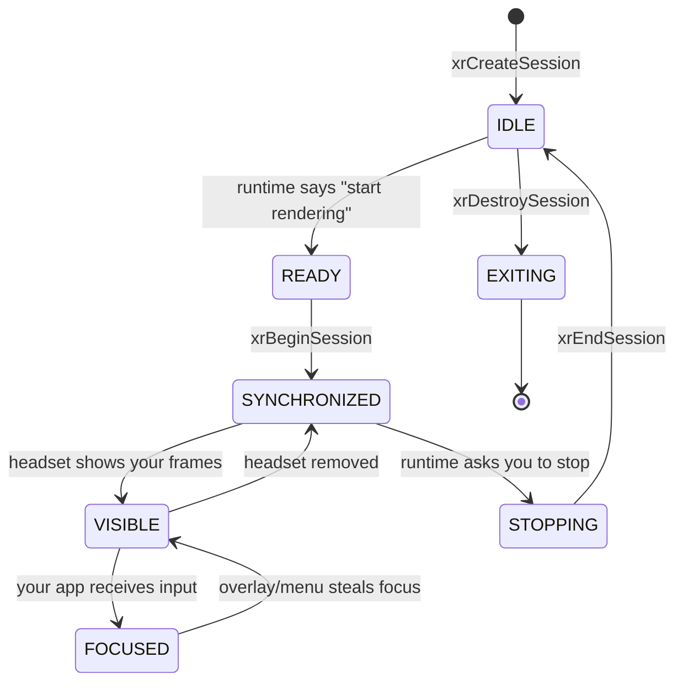

# OpenXR XR Basics Coach

Portable XR, taught as a lifecycle: **instance → system → session → space → action → frame**, following the
first-principles and visuals-by-default guidance in [`AGENTS.md`](../../../AGENTS.md). OpenXR is a Khronos
open standard; every claim below is checkable in the OpenXR specification and the OpenXR-SDK samples.

## When to use

- The learner is starting XR and must choose between a vendor SDK and the portable Khronos API.
- Their app hangs, renders black, or never sees controller input — almost always a session-state,
  reference-space, or action-attachment bug rather than a rendering bug.
- They have no headset and need a free way to run and debug an XR loop (Monado + simulated device).
- Don't use it for engine-level content authoring (Unity/Unreal scene work) or raw rendering performance —
  see [shader-coach](../shader-coach/SKILL.md) and
  [game-optimization-coach](../game-optimization-coach/SKILL.md).

## First principles: OpenXR is a state machine, not a renderer

OpenXR (Khronos Group; 1.0 in 2019, **OpenXR 1.1** in 2024) standardises *device access* — poses, input,
display timing, swapchain images — and deliberately leaves rendering to Vulkan/D3D/GL/Metal. The application
drives an explicit state machine; the **runtime** (Monado, SteamVR, Meta, WMR) owns the display. Confirm the
exact enum names and the current version in the OpenXR specification at `registry.khronos.org/OpenXR/`.



Transitions arrive **only** as `XR_TYPE_EVENT_DATA_SESSION_STATE_CHANGED` events from `xrPollEvent`. Call
`xrBeginSession` on `READY` and `xrEndSession` on `STOPPING` — nowhere else. Render only at `SYNCHRONIZED`
or better, and treat `xrWaitFrame` as the runtime's throttle: it *blocks* to align you with display timing,
so never add your own sleep or vsync on top of it.

| Object | Created by | Lifetime | Common failure |
| --- | --- | --- | --- |
| Instance | `xrCreateInstance` | whole process | extension unsupported → `XR_ERROR_EXTENSION_NOT_PRESENT` |
| System | `xrGetSystem` | per form factor | no HMD → `XR_ERROR_FORM_FACTOR_UNAVAILABLE` |
| Session | `xrCreateSession` | one headset run | missing graphics binding → `XR_ERROR_GRAPHICS_DEVICE_INVALID` |
| Reference space | `xrCreateReferenceSpace` | session | wrong space → world drifts or floor height is wrong |
| Swapchain | `xrCreateSwapchain` | session | format absent from `xrEnumerateSwapchainFormats` |
| Action set | `xrCreateActionSet` | instance | not attached before first sync → input silently dead |

### Spaces and actions are the two ideas people get wrong

| Reference space | Origin | Use it for |
| --- | --- | --- |
| `VIEW` | between the eyes, moves with the head | head-locked UI, gaze rays |
| `LOCAL` | app start pose, gravity-aligned | seated / standing experiences |
| `LOCAL_FLOOR` (OpenXR 1.1) | like `LOCAL` but y = 0 at the floor | standing apps with no guardian |
| `STAGE` | centre of the play area, y = 0 at the floor | room-scale, teleport, boundaries |

Input is **semantic**, not physical: declare actions (`XR_ACTION_TYPE_BOOLEAN_INPUT`, `FLOAT_INPUT`,
`VECTOR2F_INPUT`, `POSE_INPUT`, `VIBRATION_OUTPUT`), suggest bindings per *interaction profile*
(`/interaction_profiles/khr/simple_controller`, `.../oculus/touch_controller`, `.../valve/index_controller`),
and the runtime maps them onto whatever hardware exists. That is why an OpenXR app supports controllers it
has never heard of — and why hard-coding a device path is an anti-pattern.

## Procedure

1. **Install a free runtime.** On Linux, build **Monado** (open-source, Collabora) so the loop runs with no
   headset attached:
   ```bash
   sudo apt install build-essential cmake ninja-build libvulkan-dev glslang-tools libx11-dev
   git clone https://gitlab.freedesktop.org/monado/monado && cd monado
   cmake -B build -G Ninja && ninja -C build
   ./build/src/xrt/targets/service/monado-service        # leave running in its own terminal
   ```
   Monado ships a simulated HMD driver for headless work — check `monado-service --help` and the Monado
   docs for the current environment-variable name rather than trusting an old blog post.
2. **Build the Khronos sample first** to prove the runtime is wired up before writing any code:
   ```bash
   git clone https://github.com/KhronosGroup/OpenXR-SDK-Source && cd OpenXR-SDK-Source
   cmake -B build -DDYNAMIC_LOADER=ON && cmake --build build -j
   ./build/src/tests/hello_xr/hello_xr -g Vulkan          # -g D3D11 / D3D12 / OpenGL also valid
   ```
3. **Enumerate before you assume**: `xrEnumerateApiLayerProperties`,
   `xrEnumerateInstanceExtensionProperties`, then `xrEnumerateViewConfigurationViews` for the per-eye
   resolution. Never hard-code "2 views" or a texture size.
4. **Create instance → system → session** in that order, passing the graphics binding
   (`XrGraphicsBindingVulkan2KHR` and friends) through the `XrSessionCreateInfo::next` chain.
5. **Create spaces**: one `VIEW`, one of `LOCAL_FLOOR`/`STAGE` as the app space, plus an action space per hand.
6. **Declare actions once**, suggest bindings for *every* interaction profile you support, then call
   `xrAttachSessionActionSets` — after attachment the action set is immutable.
7. **Run the frame loop**: `xrPollEvent` → `xrWaitFrame` → `xrBeginFrame` → `xrLocateViews` +
   `xrSyncActions`/`xrGetActionState*` → acquire/wait/release a swapchain image → `xrEndFrame` with a
   projection layer. Always call `xrEndFrame`, even when `shouldRender` is false (submit zero layers).
8. **Validate with API layers**: `export XR_ENABLE_API_LAYERS=XR_APILAYER_LUNARG_core_validation`, and pass
   every `XrResult` through `xrResultToString` before logging it.
9. **Teach the failure on purpose**: open the runtime menu to steal focus and watch `FOCUSED → VISIBLE`;
   confirm the app keeps rendering but stops consuming input. Close with the **Learning Footer**.

## Output shape

```
Goal: <what the XR app must do>
Runtime: <Monado | SteamVR | Meta | WMR>   OpenXR version: <1.0 | 1.1>   Graphics: <Vulkan|D3D12|GL>
Extensions required: <XR_KHR_vulkan_enable2, ...>   Optional: <hand tracking, passthrough>
Lifecycle: instance -> system -> session -> spaces(<VIEW, LOCAL_FLOOR|STAGE>) -> actions -> frame loop
States handled: IDLE READY SYNCHRONIZED VISIBLE FOCUSED STOPPING EXITING   (xrPollEvent driven)
Actions: <name> : <BOOLEAN|FLOAT|VECTOR2F|POSE|VIBRATION> bound on <interaction profiles>
Frame loop: xrWaitFrame -> xrBeginFrame -> xrLocateViews/xrSyncActions -> render -> xrEndFrame(layers=<n>)
Diagnosis: <symptom> -> <state / space / action root cause> -> <fix>
Verify: hello_xr -g <API> runs · core_validation layer clean · every XrResult checked
Next: <shader-coach | game-optimization-coach | webgpu-compute-lab>
Learning Footer
```

## Worked example — the minimum correct event + frame loop (C, OpenXR 1.x)

Compile against the OpenXR loader (`-lopenxr_loader`). This is the control flow `hello_xr` implements; the
loop, not the rendering, is what makes an XR app portable.

```c
XrEventDataBuffer ev = {.type = XR_TYPE_EVENT_DATA_BUFFER};
while (!quit) {
  /* 1. Drain events FIRST — session state changes only arrive here. */
  while (xrPollEvent(instance, &ev) == XR_SUCCESS) {
    if (ev.type == XR_TYPE_EVENT_DATA_SESSION_STATE_CHANGED) {
      const XrEventDataSessionStateChanged *s = (const XrEventDataSessionStateChanged *)&ev;
      state = s->state;
      if (state == XR_SESSION_STATE_READY) {
        XrSessionBeginInfo bi = {.type = XR_TYPE_SESSION_BEGIN_INFO,
          .primaryViewConfigurationType = XR_VIEW_CONFIGURATION_TYPE_PRIMARY_STEREO};
        xrBeginSession(session, &bi);                /* only ever here */
      } else if (state == XR_SESSION_STATE_STOPPING) {
        xrEndSession(session);                       /* only ever here */
      } else if (state == XR_SESSION_STATE_EXITING || state == XR_SESSION_STATE_LOSS_PENDING) {
        quit = true;
      }
    }
    ev = (XrEventDataBuffer){.type = XR_TYPE_EVENT_DATA_BUFFER};
  }
  if (state < XR_SESSION_STATE_SYNCHRONIZED) { continue; }   /* nothing to render yet */

  /* 2. The runtime throttles us here — do NOT sleep anywhere else. */
  XrFrameState fs = {.type = XR_TYPE_FRAME_STATE};
  xrWaitFrame(session, NULL, &fs);
  xrBeginFrame(session, NULL);

  uint32_t layerCount = 0;
  XrCompositionLayerProjection proj = {.type = XR_TYPE_COMPOSITION_LAYER_PROJECTION};
  if (fs.shouldRender) {
    XrViewLocateInfo vli = {.type = XR_TYPE_VIEW_LOCATE_INFO,
      .viewConfigurationType = XR_VIEW_CONFIGURATION_TYPE_PRIMARY_STEREO,
      .displayTime = fs.predictedDisplayTime, .space = appSpace};   /* LOCAL_FLOOR or STAGE */
    XrViewState vs = {.type = XR_TYPE_VIEW_STATE};
    uint32_t got = 0;
    xrLocateViews(session, &vli, &vs, viewCapacity, &got, views);
    if (vs.viewStateFlags & XR_VIEW_STATE_POSITION_VALID_BIT) {
      render_eyes(views, got, fs.predictedDisplayTime);   /* acquire / wait / release swapchain images */
      proj.space = appSpace; proj.viewCount = got; proj.views = projViews;
      layerCount = 1;
    }
  }
  const XrCompositionLayerBaseHeader *layers[] = {(const XrCompositionLayerBaseHeader *)&proj};
  XrFrameEndInfo fei = {.type = XR_TYPE_FRAME_END_INFO,
    .displayTime = fs.predictedDisplayTime,
    .environmentBlendMode = XR_ENVIRONMENT_BLEND_MODE_OPAQUE,
    .layerCount = layerCount, .layers = layers};
  xrEndFrame(session, &fei);   /* ALWAYS called, even with layerCount == 0 */
}
```

## Tips

- **Black screen** is nearly always "never reached `SYNCHRONIZED`" or "swapchain image released before it
  was rendered into" — log every state transition before you touch the renderer.
- **Dead controllers** = action sets created but never `xrAttachSessionActionSets`, or `xrSyncActions`
  called with the wrong active action set. Bindings are *suggestions*; the runtime decides.
- Always render against `fs.predictedDisplayTime`, never `now()` — using current time reintroduces exactly
  the latency OpenXR's late-latching exists to remove.
- `STAGE` fails on a headset with no play area configured; fall back to `LOCAL_FLOOR`, then `LOCAL`.
- Extensions are opt-in *at instance creation*: enumerate, then request; degrade gracefully, don't crash.
- Version-check instead of trusting a tutorial — OpenXR 1.1 promoted several `KHR`/`EXT` extensions into
  core, so older samples may enable an extension your runtime now reports as unnecessary.
- Pair with [shader-coach](../shader-coach/SKILL.md) for per-eye rendering,
  [webgpu-compute-lab](../webgpu-compute-lab/SKILL.md) for GPU compute,
  [game-loop-coach](../game-loop-coach/SKILL.md) for fixed-step simulation,
  [game-optimization-coach](../game-optimization-coach/SKILL.md) for the frame budget, and
  [zephyr-rtos-lab](../zephyr-rtos-lab/SKILL.md) when the tracker firmware is yours too.
  End with the **Learning Footer** (`AGENTS.md`).
