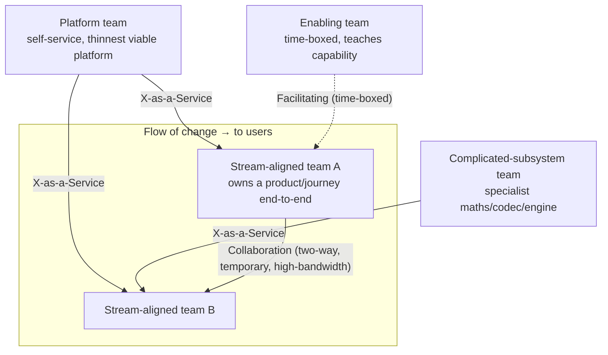

# Org Design Coach

Org charts are architecture. This skill designs teams as a **sociotechnical system** optimised for the flow
of change — with explicit trade-offs and no reorg-for-its-own-sake — following the teach-the-why rule in
[`AGENTS.md`](../../../AGENTS.md).

## When to use

- Delivery is slow and the delays are **between** teams (waiting, handoffs, tickets), not inside them.
- Nobody can answer "who owns this?" for a service, or three teams own it jointly and none on call.
- A platform/infra team has become a ticket queue and is the bottleneck for every stream.
- You are about to split a monolith and want the team boundaries to match the intended architecture rather
  than fight it ([microservices-decomposer](../microservices-decomposer/SKILL.md)).
- **Don't use it for** individual growth and levelling ([career-ladder](../career-ladder/SKILL.md)),
  performance conversations ([one-on-one-coach](../one-on-one-coach/SKILL.md),
  [performance-review-coach](../performance-review-coach/SKILL.md)), hiring loops
  ([hiring-process-coach](../hiring-process-coach/SKILL.md)), or as cover for a headcount decision that has
  already been made.

## First principles

**1. Conway's law is a constraint, not a slogan.** Melvin Conway, *How Do Committees Invent?*
(**Datamation, April 1968**): "organizations which design systems … are constrained to produce designs which
are copies of the communication structures of these organizations." Four teams will produce four components
with interfaces shaped by who talks to whom. The **inverse Conway manoeuvre** (popularised via the
Thoughtworks Technology Radar) says: decide the architecture you want, then shape teams so that
architecture is the path of least resistance.

**2. Optimise for flow of change, not resource utilisation.** Skelton & Pais, *Team Topologies*
(IT Revolution, **2019**), reduce team design to **four team types** and **three interaction modes**. The
central claim: only stream-aligned teams should routinely deliver end-to-end value; the other three exist to
*reduce the cognitive load* on those teams.

**3. Cognitive load is the binding constraint.** Sweller's Cognitive Load Theory (*Cognitive Science*,
**1988**) distinguishes intrinsic (inherent difficulty), extraneous (accidental — bad tooling, unclear
ownership, five deploy paths) and germane load. Applied to teams: a team can only own as much domain as it
can hold in its head. Most "we need more people" is really "we have too much extraneous load."

**4. Team size has hard limits.** Dunbar's work on group size (Dunbar, *Journal of Human Evolution*, **1992**,
and later popularisations) gives the nesting ~5 / ~15 / ~50 / ~150 that Team Topologies uses to argue for
long-lived teams of roughly 5–9 and trust boundaries at ~50 and ~150.

**5. The team is the unit, not the individual.** Teams are long-lived and work is routed to them; software
is *owned*, not assigned. Reorganising individuals per project destroys exactly the shared context that made
the team fast.



*Figure 1 — Four team types and three interaction modes. Solid arrows into a stream team = X-as-a-Service (low bandwidth, durable); dotted = Facilitating (temporary, teaching); the Collaboration edge between A and B is deliberately two-way and deliberately short-lived.*

| Team type | Purpose | Success signal | Classic failure mode |
| --- | --- | --- | --- |
| **Stream-aligned** | own a single value stream end-to-end, including run/on-call | ships without waiting on another team | becomes a feature factory with no ownership of run |
| **Platform** | reduce cognitive load via **self-service** internal products | streams self-serve; adoption is voluntary and high | ticket queue; mandated adoption hiding a bad product |
| **Enabling** | raise a capability in stream teams, then **leave** | the stream team no longer needs them | becomes a permanent consultancy or a shadow gatekeeper |
| **Complicated-subsystem** | own a part needing deep specialism (codec, pricing engine, ML core) | streams consume it as a clean service | used as an excuse to hoard normal work |

| Interaction mode | Bandwidth | Intended duration | Use when | Smell |
| --- | --- | --- | --- | --- |
| **Collaboration** | high | **weeks–months, explicitly ending** | discovering an unknown interface together | "permanent collaboration" = the boundary is wrong |
| **X-as-a-Service** | low | long-lived | the interface is known and stable | streams keep filing tickets to get anything done |
| **Facilitating** | medium | time-boxed | a team must *learn* something | enabling team never exits |

### Fracture planes — where to cut

Cut along boundaries that reduce load, not along technology layers:

| Fracture plane | Cut here when | Anti-pattern it replaces |
| --- | --- | --- |
| Business domain / bounded context | domains have distinct language & change rhythm | "frontend team / backend team / DBA team" |
| Regulatory compliance | a slice needs audit, segregation of duties | compliance sprinkled everywhere |
| Change cadence | one part changes daily, another quarterly | fast work stuck behind slow release trains |
| Risk / blast radius | tier-0 path vs internal tool | one deploy pipeline for everything |
| Performance / specialism | genuinely deep expertise required | hero-dependency on one person |
| User persona | distinct users with distinct journeys | one team serving five personas badly |

Bounded contexts come from Domain-Driven Design (Evans, **2003**) — see
[domain-driven-design-coach](../domain-driven-design-coach/SKILL.md).

## Procedure

1. **Map the flow, not the org chart.** For the 3–5 most valuable change types, trace who must touch what,
   end to end, and mark each **wait**. Waits between teams are the design problem.
2. **Measure cognitive load per team** — cheap and honest: list every system, domain, tool and on-call
   surface the team must know. Then ask the team directly ("which of these do you feel unable to keep up
   with?"). Anything above roughly 3–4 significant domains is a warning
   ([cognitive-load-coach](../cognitive-load-coach/SKILL.md)).
3. **Name the target architecture first**, then apply the **inverse Conway manoeuvre**: if you want
   independently deployable services per domain, you need one owning team per domain, or Conway will
   quietly restore the old shape.
4. **Choose fracture planes** from the table and cut. Prefer domain boundaries; resist technology-layer
   splits, which guarantee handoffs on every change.
5. **Assign a team type to every team.** If you can't, the team is probably a *component* team pretending —
   the most common hidden bottleneck.
6. **Target roughly 5–9 people, long-lived.** Larger teams fragment into informal sub-teams; smaller ones
   can't sustain on-call ([capacity-planning-coach](../capacity-planning-coach/SKILL.md)).
7. **Declare every interaction mode explicitly, with an expiry date** for Collaboration and Facilitating.
   Undated collaboration is how two teams become one blurred team with no owner.
8. **Publish a Team API** per team: what we own, our services and their SLOs, how to ask for something, our
   roadmap, how to reach us, what we will *not* do. This is what makes X-as-a-Service real.
9. **Build the thinnest viable platform.** A platform is an internal **product** with users who could refuse
   it; if adoption must be mandated, fix the product ([slo-designer](../slo-designer/SKILL.md),
   [observability-plan](../observability-plan/SKILL.md)).
10. **Change teams sparingly and observe.** Reorgs cost months of context. Predict the effect on flow before
    the change, then re-measure with [dora-metrics-coach](../dora-metrics-coach/SKILL.md) and team health
    ([team-health-coach](../team-health-coach/SKILL.md)). Close with the **Learning Footer**.

## Output shape

```
Flow problem: <the specific delay/ownership gap this design must fix>
Target architecture (stated first): <...>        Conway check: <does the team map produce it? yes/no>

Teams
  <team> — type: <stream-aligned|platform|enabling|complicated-subsystem>
     owns: <services/domains>          size: <n>        on-call: <yes/no>
     cognitive load: <domains counted> → <ok | over — shed X to Y>
     fracture plane used: <domain|cadence|risk|compliance|persona|specialism>
     Team API: owns <..> · request via <..> · SLO <..> · will NOT do <..>

Interactions
  <A> --X-as-a-Service--> <B>            (durable)
  <A> <--Collaboration--> <C>            expires <date> → then becomes <mode>
  <E> ..Facilitating..> <B>              expires <date>, exit criterion <...>

Removed/merged: <team> — because <...>       Explicitly not changing: <team> — because <...>
Expected effect on flow: <metric + direction>      Re-measure on: <date> via <DORA + team health>
Risks: <context loss | on-call gaps | platform adoption>   Mitigation: <...>
Next: <cognitive-load-coach | dora-metrics-coach | domain-driven-design-coach>
Learning Footer
```

## Worked example — the platform team that became a ticket queue

**Symptom.** 6 stream teams; every environment, database and DNS change goes through one 8-person
"Platform & Infra" team. Median wait for a request: 6 days. Stream teams' lead time p85 is 11 days, of which
~7 is waiting. Nobody is idle — utilisation is ~95%, which is precisely the problem.

**Diagnosis.** Platform is running the **wrong interaction mode**: it is doing *collaboration-by-ticket*
instead of X-as-a-Service. Every request is bespoke, so nothing compounds. Meanwhile stream teams carry
extraneous cognitive load — each knows three deploy paths and none well.

**Design.**

| Change | From | To | Why |
| --- | --- | --- | --- |
| Split Platform | one 8-person queue | 5-person **platform team** (self-service paved road) + 3-person **enabling team** (time-boxed, 2 quarters) | separates "build the product" from "teach the users" |
| Interaction | tickets to Platform | **X-as-a-Service**: Terraform modules + a golden pipeline, self-service | removes the human from the common path |
| Enabling exit | — | exits when ≥5 of 6 streams provision an environment unaided, ≤30 min, no ticket | a *dated, testable* exit criterion |
| Ownership | shared DBs | each stream owns its datastore + on-call | closes the ownership gap |
| Sizing | 8 | 5 + 3 | both inside 5–9 |

**Predicted mechanism, stated before the change:** the 6-day wait disappears from the common path because
the common path no longer contains a queue; the enabling team temporarily *increases* load on stream teams
(learning) before decreasing it — expect flow to dip for ~4 weeks. Publishing that prediction is what
distinguishes a design from a reorg.

**Measure:** lead-time p85 and the waiting share within it, platform self-service adoption (% of
environments created without a ticket), and stream-team cognitive load (self-reported domain count), at
week 0, 6 and 12. If self-service adoption is high but lead time is unchanged, the constraint was never the
platform — go find it rather than reorganise again.

## Tips

- **You cannot beat Conway's law; you can only choose which side of it to fight from.** Set the architecture,
  then align teams to it.
- "Permanent collaboration" between two teams means the boundary is in the wrong place — merge them or
  define a real service interface.
- A platform whose adoption must be **mandated** is a failed product. Voluntary adoption is the only honest
  measure of a paved road.
- An enabling team without an **exit criterion and date** becomes a gatekeeper within two quarters.
- Count the team's domains before adding people. Shedding load is usually cheaper and faster than hiring.
- Frontend/backend/QA/DBA splits guarantee a handoff on **every** user-visible change — the cut is along the
  grain of the technology, against the grain of the work.
- Reorgs cost real months of lost context. Prefer changing *interaction modes* and *ownership* first; move
  people last.
- Related: [cognitive-load-coach](../cognitive-load-coach/SKILL.md),
  [team-health-coach](../team-health-coach/SKILL.md),
  [domain-driven-design-coach](../domain-driven-design-coach/SKILL.md),
  [microservices-decomposer](../microservices-decomposer/SKILL.md),
  [dora-metrics-coach](../dora-metrics-coach/SKILL.md),
  [stakeholder-management-coach](../stakeholder-management-coach/SKILL.md),
  [career-ladder](../career-ladder/SKILL.md), [okr-coach](../okr-coach/SKILL.md),
  [engineering-culture-coach](../engineering-culture-coach/SKILL.md).
  End with the **Learning Footer** (`AGENTS.md`).
