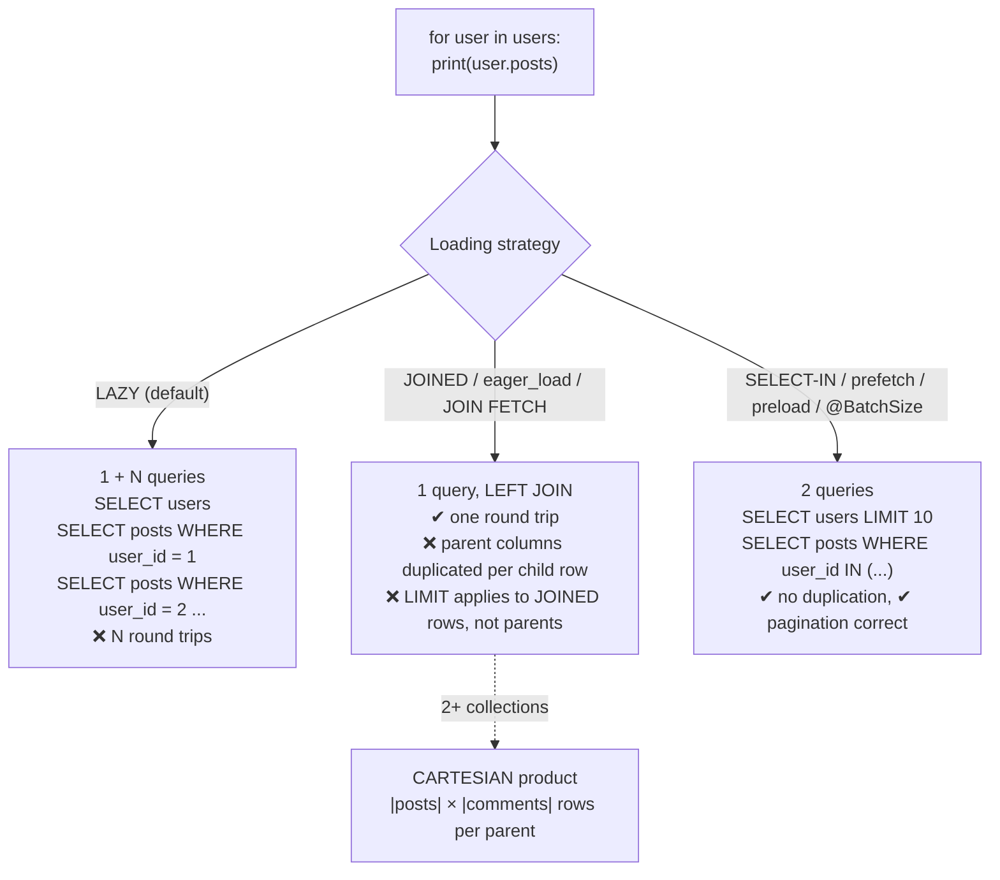

# ORM Performance Coach

Almost every "the ORM is slow" report is really "we issued 300 round trips where 2 would do". This skill makes
the SQL visible, counts it, and fixes the *loading strategy* rather than blaming the mapper — measuring before
prescribing, as [`AGENTS.md`](../../../AGENTS.md) requires.

## When to use

- A list page is slow, the database looks idle, and the query log scrolls forever.
- You are choosing between `joinedload`/`selectinload`, `select_related`/`prefetch_related`,
  `JOIN FETCH`/`@BatchSize`, `includes`/`preload`/`eager_load`, or Prisma's `relationLoadStrategy`.
- `LazyInitializationException`, `HHH000104`, or "pagination returns the wrong number of parents".
- Someone wants to "replace the ORM with raw SQL" and you need the evidence-based version of that decision.
- **Don't use it for** a single slow statement whose plan is bad — that's
  [query-plan-tuning-lab](../query-plan-tuning-lab/SKILL.md) and
  [database-index-coach](../database-index-coach/SKILL.md); or for pool sizing —
  [connection-pooling-coach](../connection-pooling-coach/SKILL.md).

## First principles: you are paying per round trip, not per row

A query has two costs: the database's work, and the **round trip**. In a typical service the round trip
(network + parse + plan lookup + result assembly) is 0.3–1 ms even for a primary-key lookup. So:

$$T_{N+1} \approx (N + 1)\times(RTT + t_{\text{db}})
\qquad
T_{\text{batched}} \approx 2\times(RTT + t_{\text{db}}')$$

With $N = 100$ and $RTT = 1$ ms, that is **~101 ms versus ~2 ms** even if every individual query is
"fast — 0.2 ms!" in the slow-query log. This is why N+1 is invisible to slow-query monitoring: no single
statement is slow. Only the *count* is wrong.



*Three strategies, three failure modes. The default is almost always the worst one, and joined loading — the
usual "fix" — is only correct for **to-one** relations or a single collection without pagination.*

| ORM | Lazy default | JOIN strategy (one query) | Batch/IN strategy (two queries) | Make N+1 loud |
| --- | --- | --- | --- | --- |
| **SQLAlchemy** | `lazy="select"` | `joinedload()` | **`selectinload()`** | `lazy="raise"`, `raiseload("*")` |
| **Django** | lazy | `select_related()` — FK / one-to-one only | `prefetch_related()` — M2M, reverse FK | `assertNumQueries`, `django-debug-toolbar` |
| **Hibernate/JPA** | `@OneToMany`/`@ManyToMany` = LAZY; **`@ManyToOne`/`@OneToOne` = EAGER by default** | `JOIN FETCH`, `@EntityGraph` | `@BatchSize(size=n)`, `hibernate.default_batch_fetch_size` | `hibernate.show_sql`, statistics, `spring.jpa.open-in-view=false` |
| **ActiveRecord** | lazy | `eager_load` (LEFT OUTER JOIN) | `preload` (separate queries); `includes` picks one | `strict_loading` (Rails 6.1+), `bullet` gem |
| **Prisma** | `include` issues separate queries | `relationLoadStrategy: "join"` (LATERAL JOIN + JSON), needs the `relationJoins` preview feature — PostgreSQL 5.7.0+, MySQL 5.10.0+ | `relationLoadStrategy: "query"` (the default) | query event logging |

Note the JPA default carefully, because it is backwards from most people's mental model: **to-one associations
are EAGER by default and to-many are LAZY**. An entity with five `@ManyToOne` fields fetches five joins on
every single `find()` unless you write `fetch = FetchType.LAZY` explicitly.

### Why joined loading breaks pagination

`LEFT JOIN` multiplies rows: 10 users × 20 posts = 200 result rows. `LIMIT 10` on that statement returns the
first 10 *joined* rows — perhaps two users. ORMs handle this differently, and the difference matters:

- **SQLAlchemy** wraps the primary entity in a subquery when `LIMIT`/`OFFSET` is combined with `joinedload()`
  of a collection, so pagination stays correct (verify the exact behaviour in the version's loader docs).
- **Hibernate** historically logs `HHH000104: firstResult/maxResults specified with collection fetch; applying
  in memory` — it fetches **all** matching rows and paginates in the JVM, which is a memory bomb on a large
  table. Behaviour changed across Hibernate 5 → 6; ⚠ verify for your version.

The safe habit: **paginate parents, batch-load children** — i.e. select-in/prefetch, never a collection join.

## Procedure

1. **Turn the SQL on** and count it. This is the whole diagnosis:
   ```python
   # SQLAlchemy: echo every statement
   engine = create_engine(url, echo=True)
   ```
   ```python
   # Django: assert the count in a test — the best regression guard there is
   with self.assertNumQueries(2):
       list(Author.objects.prefetch_related("books").all()[:10])
   ```
   ```properties
   # Hibernate / Spring Boot
   spring.jpa.properties.hibernate.show_sql=true
   spring.jpa.properties.hibernate.format_sql=true
   logging.level.org.hibernate.stat=DEBUG
   spring.jpa.open-in-view=false
   ```
   ```ruby
   # Rails: raise instead of silently lazy-loading
   config.active_record.strict_loading_by_default = true
   ```
2. **Record queries-per-request** for the endpoint before any change. If it scales with the number of rows
   rendered, you have N+1 — no further proof needed.
3. **Classify each relation**: to-one or to-many? Paginated or not? That answers the strategy:
   | Relation | Paginated? | Use |
   | --- | --- | --- |
   | to-one (`ManyToOne`, FK) | either | JOIN (`joinedload`, `select_related`, `JOIN FETCH`) |
   | to-many, one collection | no | JOIN is acceptable |
   | to-many, one collection | **yes** | **select-in / prefetch / `@BatchSize`** |
   | two or more collections | either | **select-in per collection** (a JOIN is a cartesian product) |
4. **Apply the fix at the query site, not globally.** Global eager loading turns every query into the widest
   one; per-query loader options keep each endpoint honest.
   ```python
   # SQLAlchemy 2.x — 2 queries total, pagination-safe
   stmt = (select(User)
           .options(selectinload(User.posts), selectinload(User.comments))
           .order_by(User.id).limit(10))
   ```
   ```python
   # Django — one JOIN for the to-one, one extra query per collection
   Order.objects.select_related("customer").prefetch_related("items").all()[:20]
   ```
   ```java
   // JPA — entity graph, no in-memory pagination
   @EntityGraph(attributePaths = {"customer"})
   Page<Order> findAll(Pageable pageable);
   ```
5. **Stop over-fetching columns.** A 40-column `SELECT *` with a `TEXT` blob costs bandwidth and buffer cache
   on every row:
   ```python
   session.scalars(select(User).options(load_only(User.id, User.email)))   # SQLAlchemy
   ```
   ```python
   User.objects.only("id", "email")          # Django   (defer() for the inverse)
   ```
   ```java
   // JPA constructor projection — no entity, no dirty checking, no lazy proxies
   select new com.acme.UserDto(u.id, u.email) from User u
   ```
6. **Fix write paths too**: replace per-row `save()` loops with `bulk_create` / `insert().values([...])` /
   `insert_all` / JDBC batching (`hibernate.jdbc.batch_size`). A 1000-row loop is 1000 round trips.
7. **Drop to raw SQL deliberately** when the query is set-based rather than object-shaped — window functions,
   recursive CTEs, `INSERT … ON CONFLICT`, multi-table aggregation — and keep it in one repository/DAO module
   so it is testable ([sql-coach](../sql-coach/SKILL.md)).
8. **Re-measure the same endpoint**: queries per request, rows transferred, p95 latency. Then add a permanent
   guard (query-count assertion, `strict_loading`, `raiseload`) so the regression cannot come back silently.
9. Report the before/after and the guard, then close with the **Learning Footer**.

## Output shape

```
Endpoint: <route>   Rows rendered: <n>   ORM: <SQLAlchemy|Django|Hibernate|ActiveRecord|Prisma>
BEFORE: queries=<n> (scales with rows? <yes/no>) · rows transferred=<n> · p95=<ms>
Diagnosis: <select N+1 on <relation> | over-fetch of <cols> | cartesian join | per-row writes>
Relation map: <relation → to-one|to-many → paginated? → chosen strategy>
Fix applied: <selectinload | prefetch_related | @BatchSize=n | relationLoadStrategy: join | projection | bulk insert>
Pagination safety: parents limited in <subquery | separate query>; collection JOIN avoided: <yes/no>
Over-fetch: columns <before → after>   payload <KB before → KB after>
Raw SQL used for: <query + why the ORM was the wrong shape>  (none if n/a)
AFTER: queries=<n> · rows transferred=<n> · p95=<ms>   Improvement: <x>
Guard added: <assertNumQueries | strict_loading | raiseload("*") | bullet>   Test: <path>
Next: <database-index-coach | query-plan-tuning-lab | caching-strategy-coach>
Learning Footer
```

## Worked example — count the queries, then count the bytes

A dashboard lists 10 users with their posts. Each user row has a 5 KB `bio`; each user has ~20 posts and ~30
comments.

**Version 1 — the default (lazy).**

```python
users = session.scalars(select(User).limit(10)).all()
for u in users:
    render(u.name, len(u.posts))      # ← touches the lazy collection
```

Emitted SQL: `SELECT … FROM users LIMIT 10`, then **one query per user**:

```
SELECT * FROM posts WHERE posts.user_id = 1;
SELECT * FROM posts WHERE posts.user_id = 2;   -- ... ten times
```

**11 round trips.** At 1 ms RTT: ≈ 11 ms of pure latency for a page that needs ~2 ms of database work. Render
100 users instead of 10 and it becomes 101 round trips ≈ 101 ms — the endpoint's latency is now a linear
function of page size, which is the signature of N+1.

**Version 2 — `joinedload`, the intuitive "fix".**

```python
stmt = select(User).options(joinedload(User.posts), joinedload(User.comments)).limit(10)
```

One round trip, but count the rows the database must produce. Joining two collections is a **cartesian
product per parent**:

$$10 \text{ users} \times 20 \text{ posts} \times 30 \text{ comments} = 6{,}000 \text{ rows}$$

and each of those 6 000 rows carries a full copy of the parent's columns, including the 5 KB bio:

$$6{,}000 \times 5\,\text{KB} = 30\,\text{MB transferred to return 10 users.}$$

The ORM will faithfully de-duplicate it back into 10 objects — after the network and the driver have paid for
all 30 MB. One round trip, catastrophically worse than eleven.

**Version 3 — `selectinload`, the correct fix.**

```python
stmt = (select(User)
        .options(selectinload(User.posts), selectinload(User.comments))
        .order_by(User.id).limit(10))
```

Emitted SQL — **3 queries, no duplication:**

```sql
SELECT users.* FROM users ORDER BY users.id LIMIT 10;
SELECT posts.*    FROM posts    WHERE posts.user_id    IN (1,2,3,4,5,6,7,8,9,10);
SELECT comments.* FROM comments WHERE comments.user_id IN (1,2,3,4,5,6,7,8,9,10);
```

Rows: $10 + 200 + 300 = 510$. Parent bytes: $10 \times 5\,\text{KB} = 50\,\text{KB}$ — a **600× reduction in
transferred parent data** versus version 2, and 3 round trips instead of 11.

| Version | Round trips | Rows returned | Parent bytes | Pagination correct? |
| --- | --- | --- | --- | --- |
| 1 lazy (posts only) | 11 (→ 101 at 100 users; 21 if comments are touched too) | 210 | 50 KB | yes |
| 2 joined ×2 collections | 1 | 6 000 | 30 MB | only because SQLAlchemy wraps in a subquery; Hibernate would paginate in memory |
| 3 select-in | 3 | 510 | 50 KB | yes |

Finally, add the projection: the dashboard shows `name` and a post count, not the bio. Replace the entity load
with `load_only(User.id, User.name)` plus an aggregate `count(*)` grouped by `user_id`, and the page becomes
**2 queries, ~30 rows, a few KB** — at which point the ORM was never the problem.

## Tips

- Count queries per request in a test and fail the build when the count grows. It is the only N+1 defence that
  survives refactoring.
- Never JOIN-fetch **two** collections — the row count is the product of their sizes. Batch each one.
- Never JOIN-fetch a collection together with `LIMIT`/`OFFSET` unless you have verified your ORM rewrites it
  into a subquery; Hibernate's in-memory pagination is a silent OOM waiting for a big customer.
- In JPA, set every `@ManyToOne`/`@OneToOne` to `FetchType.LAZY` explicitly — the spec default is EAGER and it
  compounds across an entity graph.
- Disable `open-in-view` in Spring Boot; it hides N+1 until it appears in production as connection-pool
  exhaustion ([connection-pooling-coach](../connection-pooling-coach/SKILL.md)).
- Over-fetching is the silent half of the problem: projections/DTOs remove entity tracking, lazy proxies and
  wide `SELECT *` in one move.
- Batch writes. A per-row `save()` loop is the write-side N+1 and it also multiplies transaction log volume.
- The fix order is: (1) stop the N+1, (2) stop the over-fetch, (3) index the predicate
  ([database-index-coach](../database-index-coach/SKILL.md)), (4) read the plan
  ([query-plan-tuning-lab](../query-plan-tuning-lab/SKILL.md),
  [sql-query-explainer](../sql-query-explainer/SKILL.md)), (5) cache
  ([caching-strategy-coach](../caching-strategy-coach/SKILL.md)) — caching first only hides the bug.
- Practise against a real database with [postgres-local-lab](../postgres-local-lab/SKILL.md),
  [django-lab](../django-lab/SKILL.md) or [spring-boot-lab](../spring-boot-lab/SKILL.md); verify the win under
  load with [load-testing-coach](../load-testing-coach/SKILL.md) and attribute it with
  [distributed-tracing-coach](../distributed-tracing-coach/SKILL.md). End with the **Learning Footer**
  (`AGENTS.md`).
