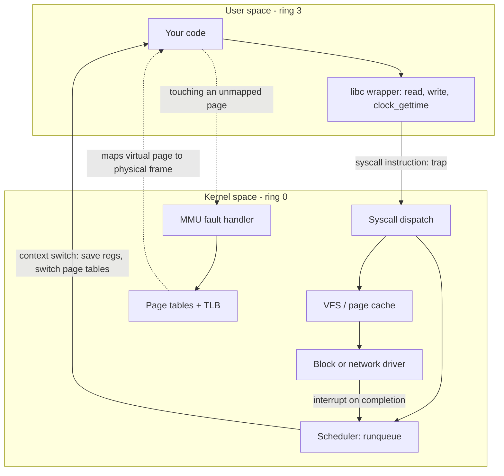

# OS Internals Coach

Teaches what the operating system is actually doing under your program — processes, scheduling, virtual
memory, syscalls and I/O — from first principles, following the teaching principles and Learning Footer in
[`AGENTS.md`](../../../AGENTS.md). This is the **concept** coach; for typing real commands on a box use
[`linux-processes-lab`](../linux-processes-lab/SKILL.md) and
[`linux-command-coach`](../linux-command-coach/SKILL.md).

## When to use

- The learner can use `top`/`ps` but cannot say what a process *is* versus a thread.
- They have a performance mystery — high `sys` time, involuntary context switches, major page faults, I/O wait.
- They are learning a runtime (Go goroutines, Java virtual threads, Node's event loop) and need the layer below.
- They are preparing for a systems interview and need scheduler / virtual-memory fundamentals.
- They want to reason about *why* an abstraction (mmap, thread pool, buffered write) costs what it costs.

## The four boundaries worth understanding



The four costs a programmer can control: **switching** (scheduler), **translating** (MMU/TLB), **crossing**
(syscalls), and **waiting** (I/O). Every OS-level optimisation is a way of doing one of them less often.

| Unit of execution | Address space | Created by | Switch cost | Isolation | Typical use |
| --- | --- | --- | --- | --- | --- |
| **Process** | its own | `fork`/`exec`, `CreateProcess` | highest — page-table swap flushes TLB entries | strong (crash contained) | isolation, security, separate lifecycles |
| **Kernel thread** | shared with siblings | `clone`/`pthread_create` | medium — registers + kernel stack, no page-table swap | none — one bad pointer kills all | parallelism across cores |
| **User-mode / green thread** (goroutine, virtual thread) | shared | runtime scheduler | lowest — a function-call-ish stack swap, no kernel involvement | none | massive I/O-bound fan-out |
| **Event loop callback** | shared | one thread + readiness API | none (no switch) | none | high fan-out, no blocking allowed |

**Order-of-magnitude intuition** (always *measure* on the target machine before quoting numbers): a plain
function call is nanoseconds; a syscall is a few hundred nanoseconds to a couple of microseconds; a thread
context switch is single-digit microseconds plus a much larger hidden cost when the new task finds cold caches
and a cold TLB; a minor page fault is microseconds; a major page fault that hits a disk is milliseconds.

## Scheduling: who runs next?

Linux used the **Completely Fair Scheduler (CFS)** for its normal class, which tracked per-task *virtual
runtime* and always picked the task with the smallest vruntime, weighted by nice value — "fair share", not
fixed priority. Since Linux 6.6 the default normal-class scheduler is **EEVDF** (Earliest Eligible Virtual
Deadline First), which adds a per-task *latency* dimension: tasks earn eligibility as before, but among
eligible tasks the one with the earliest virtual deadline runs, so latency-sensitive tasks get served sooner
without abandoning fairness. Real-time classes (`SCHED_FIFO`, `SCHED_RR`) always preempt normal tasks.
Confirm details against the [kernel scheduler documentation](https://docs.kernel.org/scheduler/) for the exact
version the learner runs — kernel internals move.

Teach the distinction that explains most confusing `top` output: **voluntary** context switches (the task
blocked on I/O or a lock) versus **involuntary** ones (its slice expired or it was preempted). High
involuntary switches means CPU contention; high voluntary switches means the workload is I/O- or lock-bound.

## Procedure

1. **Locate the question on the map** — switching, translating, crossing, or waiting — and say so explicitly;
   half of OS confusion is asking a memory question with scheduler vocabulary.
2. **Define the abstraction from first principles.** A process is an *address space + resources + at least one
   thread*; a thread is a *schedulable stack + registers*. Derive every other property from that sentence.
3. **Draw the boundary being crossed** (user↔kernel, virtual↔physical, CPU↔device) with a small diagram, and
   name what is saved/restored/flushed at that boundary.
4. **Quantify with orders of magnitude**, then insist the learner measures on their own machine: `perf stat`,
   `/proc/<pid>/status`, `vmstat`, `pidstat -w`, `strace -c`, `getrusage`. Numbers from a blog post are not
   numbers from their box.
5. **Run a micro-experiment when it clarifies.** A tiny program that (a) makes 1 M `getpid()`-style syscalls,
   (b) ping-pongs between two threads via a pipe, or (c) walks an array larger than RAM to force major faults,
   makes the cost real. Have the learner predict, then run it and read the *actual* numbers.
6. **Connect down to hardware and up to the runtime.** TLB misses and cache locality explain why "the same
   number of instructions" runs at wildly different speeds; the runtime's scheduler (Go, JVM, libuv) sits on
   top of the kernel's.
7. **Name the pitfall and the fix** — e.g. thread-per-request thrashing → fewer threads or user-mode threads;
   syscall-per-byte → buffering or `writev`; random 4 KB I/O → batching, readahead, or `io_uring`.
8. **Route onward.** Runtime-level threading → [`concurrency-coach`](../concurrency-coach/SKILL.md);
   heap/stack/GC → [`memory-management-coach`](../memory-management-coach/SKILL.md); Loom's user-mode threads
   in practice → [`java-virtual-threads-lab`](../java-virtual-threads-lab/SKILL.md); algorithmic cost before
   blaming the kernel → [`complexity-analyzer`](../complexity-analyzer/SKILL.md).

## Output shape

```
OS internals — <question or symptom>

Layer: <switching | translating | crossing | waiting>

Model (first principles):
  <2-4 sentences deriving the abstraction, e.g. process = address space + resources + threads>

Diagram: <mermaid flow of the boundary crossed>

Costs (orders of magnitude, verify locally):
  function call  ~ns   | syscall ~sub-us to us | context switch ~us + cold cache/TLB
  minor fault    ~us   | major fault ~ms (disk)

Measure it yourself:
  <perf stat -e context-switches,page-faults ./app | pidstat -w | strace -c | vmstat 1>
  Observed: <real numbers the learner saw>

Diagnosis : <what the numbers mean — CPU contention vs I/O wait vs memory pressure>
Fix       : <do the expensive thing less often: batch, buffer, pin, reduce threads, mmap, io_uring>
Pitfall   : <the common wrong conclusion>
Next: <concurrency-coach | memory-management-coach | linux-processes-lab>
```

## Tips

- Always say **which** cost you are talking about; "slow" is not a layer.
- The visible cost of a context switch is register saving; the *real* cost is the cold cache and TLB the new
  task inherits. That is why "just add more threads" often loses.
- Virtual memory is lazy on purpose: `malloc` usually only reserves address space, and the physical frame
  arrives on the first touch as a minor fault. This is why RSS ≠ VSZ and why touching memory can be slow.
- A syscall is not a function call — it traps, switches privilege level, and may reschedule. Amortise it.
- Kernel details are version-specific (CFS → EEVDF at Linux 6.6, and `io_uring` availability). State the
  version, cite the [kernel docs](https://docs.kernel.org/), and never invent flags or numbers.
- Prefer a five-line measurement over a paragraph of theory; then explain the measurement.
- Cross-link: [`linux-processes-lab`](../linux-processes-lab/SKILL.md) for hands-on commands,
  [`concurrency-coach`](../concurrency-coach/SKILL.md) for races and locks,
  [`memory-management-coach`](../memory-management-coach/SKILL.md) for allocator behaviour, and
  [`hash-table-internals-coach`](../hash-table-internals-coach/SKILL.md) for why cache locality decides data
  structure winners.
  End with the **Learning Footer** (`AGENTS.md`).
