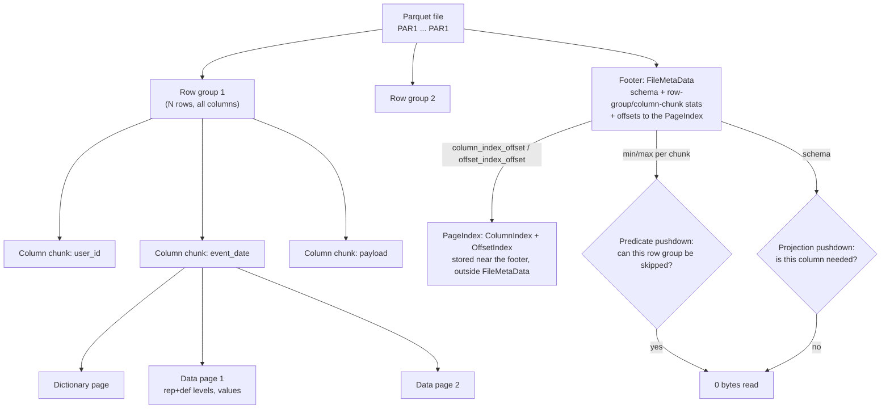

# Parquet Internals Coach

Parquet is not "a compressed file format" — it is a **skipping** format, and every performance question
reduces to *which bytes did the reader avoid?* Taught from first principles per the visuals-first
guidance in [`AGENTS.md`](../../../AGENTS.md).

## When to use

- A Parquet scan is slow, or the learner wants to know *why* columnar beats CSV beyond "it compresses".
- They are choosing a row group size, sort order, or compression codec, or debugging why pushdown did
  not fire and the engine read the whole file anyway.
- They need to inspect real footer metadata — statistics, encodings, page offsets — before tuning.
- **Don't use it for** table-level layout decisions (partitions, manifests, time travel): that is
  [lakehouse-designer](../lakehouse-designer/SKILL.md) and [delta-lake-lab](../delta-lake-lab/SKILL.md).

## First principles: the physical layout

The **Apache Parquet format specification** (`apache/parquet-format`, Thrift-defined) fixes the layout:
the file opens and closes with the magic bytes `PAR1`, and the **footer** holds `FileMetaData` — schema,
row group metadata, and per-column-chunk `Statistics` (min, max, `null_count`, `distinct_count`). Readers
therefore seek to the *end* first, then read only the chunks they still need.



| Level | Unit | Governs | Spec guidance |
| --- | --- | --- | --- |
| File | one object in storage | parallelism across workers | aim for ≥ 1 object per worker task |
| Row group | horizontal slice, all columns | **predicate pushdown** granularity | spec README recommends 512 MB–1 GB |
| Column chunk | one column inside a row group | **projection pushdown** granularity | contiguous → one sequential read |
| Page | smallest encoded/compressed unit | decode + `ColumnIndex` page skipping | spec suggests ~8 KB; Arrow defaults ~1 MiB |
| Level data | repetition + definition levels | nesting & nulls (Dremel model) | RLE / bit-packed hybrid, always |

**Encodings** (spec `Encoding` enum) are where the compression actually comes from — the codec is second:

| Encoding | Best for | Mechanism |
| --- | --- | --- |
| `RLE_DICTIONARY` | low-cardinality strings/ints | values → dictionary indices; falls back to `PLAIN` if the dict exceeds the page limit |
| `DELTA_BINARY_PACKED` | sorted or monotonic integers, timestamps | stores deltas, bit-packed |
| `DELTA_BYTE_ARRAY` | strings with common prefixes (URLs, paths) | incremental prefix encoding |
| `BYTE_STREAM_SPLIT` | floats/doubles | splits bytes into planes so a codec sees runs |
| `RLE` | booleans, def/rep levels | run-length + bit-packed hybrid |
| `PLAIN` | high-cardinality / fallback | raw values — the "we gave up" signal |

**Trade-off to say out loud:** bigger row groups prune coarsely but read sequentially; smaller row groups
prune finely but add footer overhead and tiny I/O. Sorting the filter column matters more than either —
unsorted data gives every row group nearly the same min/max, so *no* row group can ever be skipped.

Two extra structures beyond row-group stats, both in the spec: the **PageIndex** (`ColumnIndex` +
`OffsetIndex`) enables *page*-level skipping without decoding, and **bloom filters** enable equality
skipping on high-cardinality columns where min/max is useless.

## Procedure

1. **State the query pattern first**: which columns are projected, which are filtered, and is the filter
   an equality, a range, or an `IN` list? Pushdown is a property of the pair (layout, query).
2. **Read the footer before guessing.** Inspect row group count, sizes, encodings, and stats (below).
3. **Check projection**: count the columns in the file vs. the columns the query needs. `SELECT *` forfeits
   the format's main advantage.
4. **Check predicate pruning**: compare each row group's `stats_min`/`stats_max` for the filter column.
   Overlapping ranges across every row group ⇒ pruning is impossible ⇒ **sort on write**.
5. **Fix the write side, not the read side**: sort by the highest-selectivity filter column, then set row
   group size (`parquet.block.size` in Spark, `row_group_size` in pyarrow, `ROW_GROUP_SIZE` in DuckDB).
6. **Verify encodings**: `PLAIN` on a low-cardinality string means the dictionary overflowed — shrink the
   page/dict budget or reduce cardinality. Choose `ZSTD` over `SNAPPY` when storage/egress dominates CPU.
7. **Enable the page index / bloom filter** when filters are highly selective equalities on many-valued
   columns; confirm your writer *and* reader both support it before relying on it.
8. **Measure bytes read**, not wall clock (`EXPLAIN ANALYZE` in DuckDB/Trino, Spark UI "size of files read").
9. Close with the **Learning Footer**.

## Output shape

```
Query pattern: projected=<cols> · filter=<col op value> · selectivity=<~%>
Layout now:  files=<n> · row groups=<n> · rows/RG=<n> · avg RG size=<MB> · sorted by=<col|none>
Encodings:   <col>=<RLE_DICTIONARY|DELTA_*|PLAIN> · codec=<snappy|zstd> · page index=<yes|no>
Pushdown:    projection=<k of N cols> · predicate=<row groups kept / total> · pages skipped=<y/n>
Bytes read:  before=<X> → after=<Y>  (measured with <EXPLAIN ANALYZE | Spark UI>)
Fix:         <sort on write | resize row groups | drop SELECT * | add bloom filter>  Why: <mechanism>
Verify:      <exact command that proves bytes read fell>
Next: <lakehouse-designer | bigquery-optimization-coach | spark-partitioning-lab>
Learning Footer
```

## Worked example — proving pushdown with DuckDB and pyarrow

A 40-column event file, 4 row groups × 1 M rows, written **sorted by `event_date`**. Inspect the footer
(column names per DuckDB's `parquet_metadata` documentation — run `DESCRIBE SELECT * FROM
parquet_metadata('events.parquet')` to confirm them on your version):

```sql
SELECT row_group_id,
       row_group_num_rows,
       path_in_schema,
       stats_min,
       stats_max,
       encodings,
       total_compressed_size
FROM parquet_metadata('events.parquet')
WHERE path_in_schema = 'event_date'
ORDER BY row_group_id;
```

```
row_group_id | rows    | stats_min  | stats_max  | encodings              | compressed
0            | 1000000 | 2026-01-01 | 2026-01-31 | RLE_DICTIONARY,RLE     | 1.2 MB
1            | 1000000 | 2026-02-01 | 2026-02-28 | RLE_DICTIONARY,RLE     | 1.1 MB
2            | 1000000 | 2026-03-01 | 2026-03-31 | RLE_DICTIONARY,RLE     | 1.2 MB
3            | 1000000 | 2026-04-01 | 2026-04-30 | RLE_DICTIONARY,RLE     | 1.2 MB
```

Reasoning for `SELECT user_id, event_date, amount FROM events WHERE event_date = DATE '2026-03-14'`:

- **Predicate**: only row group 2's `[min, max]` contains the date → 3 of 4 row groups skipped ⇒ ~25 % of
  rows survive.
- **Projection**: 3 of 40 column chunks are opened inside that row group ⇒ ~7.5 % of its bytes (approximate —
  columns differ in width, so confirm with `total_compressed_size`).
- **Combined** ≈ 0.25 × 0.075 ≈ **~2 % of the file read**. Had the file been written unsorted, every row
  group's min/max would span Jan–Apr, no row group could be skipped, and the same query would read ~7.5 %.

Confirm with the engine rather than trusting the arithmetic:

```sql
EXPLAIN ANALYZE
SELECT user_id, amount FROM 'events.parquet' WHERE event_date = DATE '2026-03-14';
```

Same footer from pyarrow, when you need it in Python (`pyarrow.parquet` API):

```python
import pyarrow.parquet as pq

pf = pq.ParquetFile("events.parquet")
md = pf.metadata
print(md.num_rows, md.num_row_groups, md.created_by)

col = md.row_group(2).column(1)          # column index 1 == event_date here
print(col.path_in_schema, col.encodings, col.compression)
print(col.statistics.min, col.statistics.max, col.statistics.null_count)
print(col.total_compressed_size, col.total_uncompressed_size)
```

## Tips

- `SELECT *` on Parquet is the single most expensive habit — it disables projection pushdown entirely.
- Statistics prune nothing if the data is unsorted; **sort order is the tuning knob**, row group size is second.
- A row group is the *pruning* unit, not the parallelism unit — one giant row group means one reader task.
- `PLAIN` encoding on a repetitive string column = the dictionary overflowed; treat it as a warning light.
- Many small Parquet files defeat the format: footer reads and object-store round trips dominate. Compact them.
- Nulls and nesting cost definition/repetition levels; deeply nested schemas decode slower than flat ones.
- Verify claims against the `apache/parquet-format` spec before repeating them (`AGENTS.md` §2) — writer
  defaults differ from spec recommendations, and page index / bloom filter support varies by engine.
- Pair with [lakehouse-designer](../lakehouse-designer/SKILL.md),
  [delta-lake-lab](../delta-lake-lab/SKILL.md),
  [spark-partitioning-lab](../spark-partitioning-lab/SKILL.md),
  [bigquery-optimization-coach](../bigquery-optimization-coach/SKILL.md),
  [data-pipeline-designer](../data-pipeline-designer/SKILL.md), and
  [dbt-duckdb-lab](../dbt-duckdb-lab/SKILL.md).
  End with the **Learning Footer** (`AGENTS.md`).
