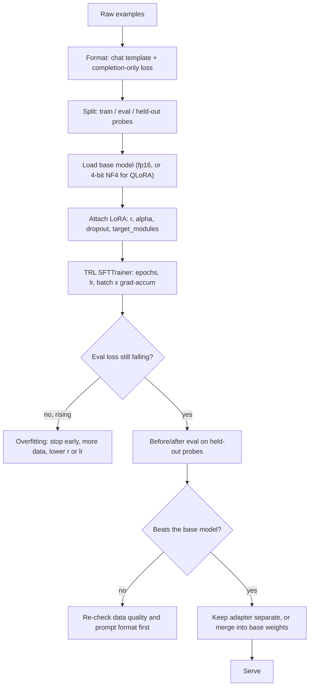

# PEFT LoRA Lab

Actually train an adapter, locally and cheaply, then **prove it helped** — following the teaching and
source-discipline rules in [`AGENTS.md`](../../../AGENTS.md). A fine-tune without a before/after eval is a
guess with a loss curve attached.

## When to use

- The learner has decided fine-tuning is the right tool — confirm that first with
  [fine-tuning-planner](../fine-tuning-planner/SKILL.md), because prompting or retrieval
  ([rag-designer](../rag-designer/SKILL.md)) usually wins on cost.
- They want the model to learn a **behaviour, format, or style** (not new facts — that is retrieval's job).
- They have one consumer GPU, or none, and need QLoRA to fit; pair with
  [llm-quantization-lab](../llm-quantization-lab/SKILL.md).
- Background: [transformer-architecture-explainer](../transformer-architecture-explainer/SKILL.md) explains
  which linear layers LoRA is attaching to and why.

## First principle

Full fine-tuning updates every weight `W`. LoRA freezes `W` and learns a low-rank correction:
`W + (α/r)·B·A`, where `A` is `r×k` and `B` is `d×r` with `r ≪ d`. The bet is that the *update* a task
needs is intrinsically low-rank, even when the model is not — so you train a few million parameters instead
of billions, and the optimizer states shrink with them (Hu et al., *LoRA*, arXiv:2106.09685, 2021-06-17).
**QLoRA** adds the second trick: freeze the base model in 4-bit NF4 and backprop *through* it into fp16
adapters, which is what makes single-GPU fine-tuning of larger models possible (Dettmers et al.,
arXiv:2305.14314, 2023-05-23).



## Choosing the knobs

| Knob | Typical starting point | What raising it buys / costs |
| --- | --- | --- |
| `r` (rank) | 8–16 for style/format; 32–64 for harder skills | More capacity to fit; more parameters, more overfitting risk on small datasets |
| `lora_alpha` | ~2×`r` (scaling is `α/r`) | Larger effective update magnitude; too large destabilizes training. Change `r` *or* `α`, never both at once, or you cannot attribute the result |
| `target_modules` | attention projections (`q_proj`,`k_proj`,`v_proj`,`o_proj`) | Adding the MLP projections (`gate_proj`,`up_proj`,`down_proj`) or `"all-linear"` raises capacity and VRAM; QLoRA reports targeting all linear layers matters more than raising `r` |
| `lora_dropout` | 0.0–0.1 | Regularizes small datasets; pure overhead on large ones |
| Learning rate | ~1e-4 to 2e-4 (adapters tolerate more than full FT) | Faster fit; too high produces a flat, confidently wrong model |
| Epochs | 1–3 | More passes memorize; watch eval loss, not train loss |
| Base precision | fp16 (LoRA) vs 4-bit NF4 (QLoRA) | QLoRA cuts VRAM sharply for a modest speed cost and small quality cost |
| Adapter handling | keep separate vs `merge_and_unload()` | Separate = swap many adapters on one base, hot-swappable; merged = one artifact, simplest to serve, but merging into a *quantized* base loses fidelity — merge into the fp16 base |

## Procedure

1. **Confirm fine-tuning is the answer.** State the failure prompting could not fix. If the gap is *facts*,
   stop and build retrieval instead.
2. **Define the eval before training.** 20–50 held-out prompts with an explicit pass rule (format valid?
   style matched? task solved?). Hand the design to [eval-designer](../eval-designer/SKILL.md). This is the
   step everyone skips and the reason most fine-tunes cannot be defended.
3. **Install and pick a small base** so the lab finishes on a laptop-class GPU:

   ```bash
   python -m venv .venv && .venv\Scripts\activate
   pip install -U torch transformers datasets peft trl accelerate bitsandbytes
   ```

4. **Format the data with the model's own chat template.** Use `tokenizer.apply_chat_template`; a
   mismatched template silently costs more quality than any hyper-parameter. Mask the prompt so loss is
   computed on the **completion only** — TRL provides this; verify it by decoding one batch's labels and
   confirming prompt tokens are ignored.
5. **Attach LoRA** with `LoraConfig(r=..., lora_alpha=..., lora_dropout=..., target_modules=[...],
   task_type="CAUSAL_LM")`, then call `model.print_trainable_parameters()` and read the percentage out loud
   — seeing "<1% trainable" is the moment LoRA clicks.
6. **Train with TRL's `SFTTrainer`**, small batch plus gradient accumulation, and an eval split so you can
   see the train/eval gap. Log every hyper-parameter alongside the run; an unlogged run is unreproducible.
7. **Verify with `#run` (`learningos_runcode`)**: run the training script on a tiny subset first (a handful
   of steps) to catch shape, template and dtype errors cheaply, then run the real job. Afterwards run the
   held-out probes through **base vs. adapter** and print both outputs side by side — including edge cases:
   an empty input, a very long input, an out-of-domain input (does it now over-apply the new style?), and
   an adversarial input that should be refused.
8. **Read the curves honestly.** Train loss down and eval loss up = overfitting → fewer epochs, more data,
   lower `r`. Both flat = learning rate too low, template wrong, or loss masked incorrectly.
9. **Decide adapter vs merge.** Merge with `merge_and_unload()` into the **fp16** base when you want one
   artifact; keep adapters separate when you want to serve several behaviours from one loaded base.
10. **Route onward:** serve it with [vllm-inference-lab](../vllm-inference-lab/SKILL.md), shrink it with
    [llm-quantization-lab](../llm-quantization-lab/SKILL.md), give it tools with
    [function-calling-coach](../function-calling-coach/SKILL.md), or wrap it in an agent via
    [agent-designer](../agent-designer/SKILL.md).

## Output shape

```
Task: <behaviour/format to learn>   Base: <small open model>   GPU: <VRAM>
Why not prompting/RAG: <the specific failure>

Config: r=<..> alpha=<..> dropout=<..> target_modules=<..> lr=<..> epochs=<..> 4-bit=<yes/no>
Trainable params: <n> (<x>% of base)

Curves: train loss <start -> end> | eval loss <start -> end> | verdict: <fitting | overfitting | stuck>

Before/after on held-out probes:
  base    : <pass n/N>   <one real output>
  adapter : <pass n/N>   <one real output>

#run evidence: <smoke run on subset -> real training run -> probe comparison>
Edge cases run: <empty | very long | out-of-domain | must-refuse> -> <real outputs>

Decision: <keep adapter | merge into fp16 base | reject and fix data>
Regression watch: <capability that must not degrade>
Next: <serve | quantize | eval harden>
```

## Tips

- **Data quality beats every hyper-parameter.** A few hundred consistent, correctly-templated examples beat
  tens of thousands of noisy ones; when a fine-tune disappoints, inspect ten random training samples before
  touching `r`.
- Fine-tuning teaches **behaviour**, retrieval supplies **facts**. Trying to inject knowledge with LoRA
  produces fluent, confident, wrong answers.
- Change one variable per run and log it — otherwise you learn nothing from the comparison.
- Watch for **catastrophic narrowing**: the model gets great at your format and worse at everything else.
  Always keep a few off-task probes in the eval set.
- Merging into a quantized base is a common trap; merge into the fp16 base, then quantize the merged model
  if you need it small.
- Ground the API surface in the current Hugging Face PEFT, TRL, Transformers and bitsandbytes docs — read
  them at run time and never invent argument names or version numbers.
- Close with the **Learning Footer** (`AGENTS.md`): recap, the pitfall they nearly hit, and the next run to
  try (one knob changed).
