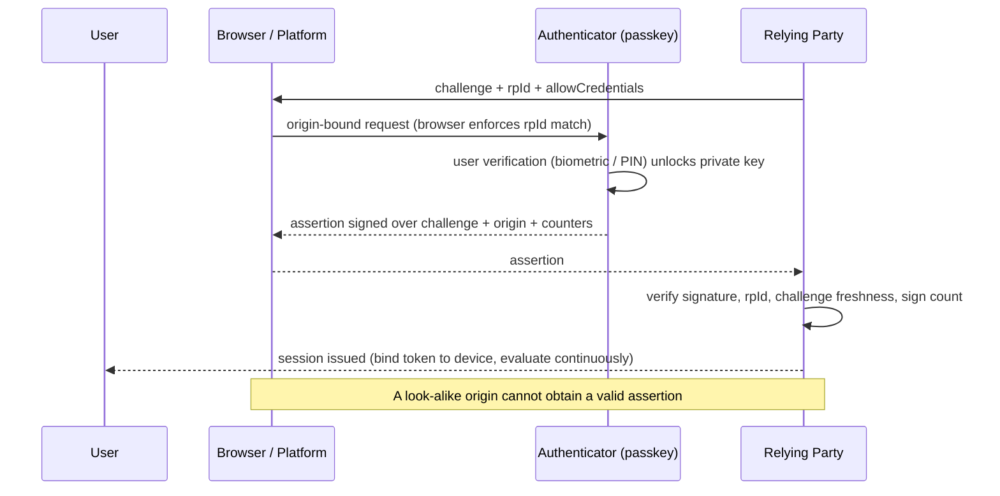

# Phishing-Resistant Auth Coach

**Scope guardrail:** defensive only — this skill designs authentication that *resists* phishing on systems
you own; it will not produce phishing kits, AiTM proxies, OTP-relay tooling, or MFA-bypass techniques, and
redirects such requests to authorized red-team testing and coordinated disclosure. Follows
[`AGENTS.md`](../../../AGENTS.md); pairs with [auth-designer](../auth-designer/SKILL.md) and
[jwt-security-coach](../jwt-security-coach/SKILL.md).

## When to use

- You still ship SMS or TOTP codes and want to know what "phishing-resistant" actually buys you.
- You are rolling out passkeys and must decide synced vs device-bound, and what the recovery path is.
- Users are getting worn down by push prompts (MFA fatigue) and approving the wrong ones.
- Attackers are stealing *sessions*, not passwords, and your MFA no longer helps after login.

## First principles

Phishing works because the user is the transport for a **replayable secret** — a password, an OTP, or a
push approval. Phishing resistance removes that transport: WebAuthn/FIDO2 signs a challenge with a private
key that **never leaves the authenticator** and that is **cryptographically bound to the origin**
(the relying-party id). A proxy on `contos0.example` cannot obtain a signature valid for `contoso.example`,
because the browser refuses to produce one.

NIST SP 800-63-4 frames the choice as **authenticator assurance levels**: AAL1 (single factor), AAL2 (two
factors), AAL3 (hardware-based, verifier-impersonation-resistant). Only phishing-resistant factors reach
AAL3, and AAL2 is not automatically phishing-resistant.



## Factor comparison

| Factor | Phishing-resistant? | Typical AAL | Strength | Real cost / pitfall |
| --- | --- | --- | --- | --- |
| Password only | No | AAL1 | Universal | Reuse, credential stuffing |
| SMS / voice OTP | No | AAL1–2 (restricted) | Easy onboarding | SIM swap, relay; 800-63-4 discourages |
| TOTP app | No | AAL2 | Offline, cheap | Code is replayable — relayed in real time |
| Push approval | No (number-matching helps) | AAL2 | Low friction | MFA fatigue / prompt bombing |
| **Synced passkey** | **Yes** | AAL2 | Great UX, cross-device recovery | Trust follows the cloud account; not AAL3 |
| **Device-bound passkey / security key** | **Yes** | AAL2–**AAL3** | Strongest; hardware-held key | Loss/recovery process, cost, enrollment |
| PIV / smart card | Yes | AAL3 | Mature in regulated estates | Middleware, issuance overhead |

**Rule of thumb:** synced passkeys for the general workforce and consumers (a huge upgrade over OTP);
device-bound keys for admins, break-glass, and anything at AAL3.

## Procedure

1. **Classify populations and risk**: consumers, workforce, privileged admins, service accounts. Set a target
   AAL per population using SP 800-63-4 (impact of a false authentication drives the level).
2. **Inventory current factors** and mark each as phishing-resistant or not, using the table.
3. **Design the passkey flow**: registration (verify identity *before* binding a credential), the `rpId`
   scope you commit to, user verification requirements, attestation policy (only if you must restrict to
   certified authenticators), and discoverable-credential support for usernameless login.
4. **Design recovery before rollout.** Recovery is the new attack surface: never let a weaker factor
   (SMS, help-desk answer) reset a stronger one. Require a second registered passkey, an in-person or
   verified-video check for high-tier users, and a documented, audited help-desk script.
5. **Kill the fallback quietly, then loudly.** Run passkey and legacy MFA in parallel, measure adoption, then
   disable weak factors per population. A phishing-resistant factor with an SMS fallback is an SMS factor.
6. **Defend the session after login.** The modern attack is token theft, so bind tokens to the device
   (sender-constrained tokens — DPoP or mTLS; see
   [oauth2-oidc-security-coach](../oauth2-oidc-security-coach/SKILL.md)), keep access tokens short-lived,
   rotate refresh tokens with reuse detection, and enable **continuous access evaluation** so revocation,
   risk, or network change kills the session in near real time instead of at expiry.
7. **Add signals and step-up**: device compliance, impossible travel, unfamiliar client — trigger re-auth
   with the *phishing-resistant* factor for sensitive operations, not with another push.
8. **Reduce MFA fatigue** while legacy factors remain: number matching, context (app, location) in the
   prompt, strict rate limits and lockout on repeated denials, and an obvious "this wasn't me" report path
   that opens an incident.
9. **Instrument it.** Log registration, authentication, factor type, step-up, and revocation events; feed
   [detection-engineering-coach](../detection-engineering-coach/SKILL.md) so anomalies become detections.
10. **Verify**: test enrollment, cross-device sign-in, lost-device recovery, admin break-glass, and confirm
    that revoking a session actually stops API access within the promised window.

## Output shape

```
Phishing-resistant auth plan — <app / population>

Populations & targets (NIST SP 800-63-4):
  consumers  -> AAL2  via synced passkeys
  workforce  -> AAL2  via synced passkeys + device compliance
  admins     -> AAL3  via device-bound security keys (2 registered, no fallback)

Current factors: <list> -> phishing-resistant: <yes/no each>
Retire: <SMS OTP, push-only>  by <date, per population>

WebAuthn design:
  rpId: <domain>   user verification: required   discoverable creds: yes
  attestation: <none | policy-restricted, with reason>
  registration binding: <identity proofing step before credential bind>

Recovery: 2nd passkey required | help-desk script + audit | no weaker-factor reset
Session defense:
  access token TTL <...>, sender-constrained (DPoP/mTLS)
  refresh rotation + reuse detection
  continuous access evaluation -> revocation propagates in <...>
  step-up on: <sensitive ops, risk signals>

Anti-fatigue (while legacy remains): number matching, context, rate limits, report path
Telemetry: registration | auth | step-up | revoke  -> detection rules
Verification tests: enroll | cross-device | lost device | break-glass | revoke-kills-API
Next: <auth-designer | oauth2-oidc-security-coach | jwt-security-coach>
```

## Tips

- **Any fallback defines your real security level.** The attacker chooses the weakest enabled factor.
- Origin binding, not user vigilance, is what defeats phishing — never ship training as the control.
- Synced passkeys move trust to the platform account: protect *that* account at the same tier.
- Admins should register **two** authenticators before the first is enforced, or the first loss becomes an
  outage handled by an insecure exception.
- Post-authentication is where the fight is now: a stolen session token ignores how strong your login was —
  bind it, shorten it, and be able to revoke it.
- Never treat "MFA enabled" as a KPI; measure "phishing-resistant factor enforced, no fallback" instead.
- Related: [auth-designer](../auth-designer/SKILL.md),
  [jwt-security-coach](../jwt-security-coach/SKILL.md),
  [oauth2-oidc-security-coach](../oauth2-oidc-security-coach/SKILL.md),
  [threat-model](../threat-model/SKILL.md).
- End with the **Learning Footer** (`AGENTS.md`).
