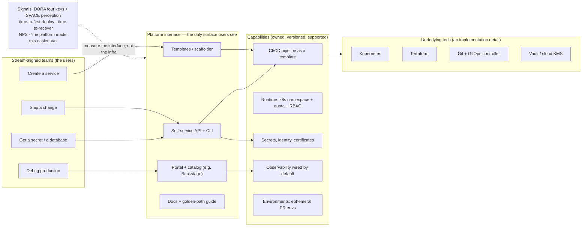

# Platform / IDP Coach

An internal developer platform is a **product whose users are engineers**. It succeeds when the paved road
is genuinely the easiest route, and fails the moment it becomes a mandatory toll booth. This skill designs
one from the developer journey inwards, with explicit scope limits and measurable outcomes, following the
teach-the-trade-offs stance in [`AGENTS.md`](../../../AGENTS.md).

## When to use

- Every new service takes weeks of ticket ping-pong across infra, security and networking teams.
- Five teams have five different Terraform layouts, five CI shapes, and five ways of getting a secret.
- A platform team exists but reports usage as "27 repos onboarded" and cannot say whether anyone is
  faster.
- Leadership has said "let's install Backstage" and nobody has yet asked which developer problem that
  solves.
- **Don't use it for** building a platform when you have three engineers and one service — the coordination
  cost dominates, and a good README plus a template repo beats a platform. Also don't use it as cover for
  centralising control: a platform whose value proposition is "you must" is a governance project wearing a
  platform costume.

## First principles: paved roads, not fences

Two ideas do most of the work.

**Platform as a product** (Team Topologies, Skelton & Pais, 2019 — the *platform team* is one of four
fundamental team types, and its interaction mode with stream-aligned teams is **X-as-a-Service**): the
platform has users, a value proposition, a roadmap, adoption you must *earn*, and a support model. If you
would not ship it to an external customer in that state, do not ship it internally either.

**Thinnest viable platform**: the platform should be the smallest thing that removes cognitive load from
stream-aligned teams. Sometimes that is a wiki page and a template repo, not a control plane.

**Golden path / paved road**: an opinionated, fully supported, end-to-end route for the most common case —
"a new HTTP service in Go, with CI, observability, secrets, and a production deployment". Off-road remains
legal, but unsupported. The CNCF *Platforms White Paper* (CNCF Platforms Working Group, tag-app-delivery,
first published 2023 — verify the current revision on tag-app-delivery.cncf.io) frames this as platforms
providing **capabilities as a service** over a curated set of underlying tools.

**Developer experience** is measured, not asserted. The **SPACE framework** (Forsgren, Storey, Maddila,
Zimmermann, Houck & Butler, *The SPACE of Developer Productivity*, ACM Queue, March 2021) gives five
dimensions — Satisfaction, Performance, Activity, Communication, Efficiency — and the core warning that
**no single metric is sufficient**; pair a system metric with a perception metric.



*Figure: users touch only the interface layer. Everything below it — including which cloud, which
controller, which IaC tool — is a replaceable implementation detail, and that substitutability is the
platform's actual product value.*

| Platform-as-a-product | Platform-as-a-mandate (the failure mode) |
| --- | --- |
| Adoption is earned; teams may opt out | Adoption is enforced; opting out is escalated |
| Roadmap driven by user research and support tickets | Roadmap driven by the platform team's interests |
| Golden path is the *easiest* route | Golden path is the *only permitted* route |
| Docs treated as a feature with an owner | Docs are a stale wiki nobody edits |
| Versioned interfaces, deprecation notice periods | Breaking changes land on a Tuesday |
| Success = users faster (DORA + SPACE) | Success = "N teams onboarded" |
| Support model with an SLA and an on-call | "Ask in the channel and hope" |

| Capability | Thinnest viable version (start here) | Over-engineered version (resist) |
| --- | --- | --- |
| New service | a `gh repo create --template` repo with CI wired | a bespoke scaffolding engine with a DSL |
| Environments | one shared dev namespace with quotas | full ephemeral env-per-PR with data seeding, on day one |
| Portal | a README index + `CODEOWNERS` | Backstage with six plugins and no catalog data |
| Provisioning | a reviewed Terraform module + PR | a custom control plane with its own CRDs |
| Secrets | one documented pattern + operator | a homegrown secrets service |
| Observability | dashboards + alerts in the service template | a bespoke telemetry pipeline |

## Procedure

1. **Name the users and the one journey.** Not "developers" — *"the ~40 backend engineers who create about
   two new services a month"*. Pick a single journey to make boring first; "new service to production" is
   usually the highest leverage.
2. **Measure the current journey by walking it yourself.** Create a new service by hand, with a stopwatch,
   and record every wait, ticket, approval and unwritten step. This artefact — the honest current-state
   timeline — is the platform's business case and its backlog in one page.
3. **Interview five users before building anything.** Ask what they did last time, not what they want.
   Wanted features are speculative; last week's workaround is evidence.
4. **Write the golden path as a document first.** If you cannot describe the paved road in one page, you
   cannot automate it. The document is testable: hand it to a new joiner and time them.
5. **Automate the biggest single wait**, not the most interesting problem. If provisioning takes 4 hours
   of ticket latency and CI setup takes 20 minutes of copy-paste, automate provisioning.
6. **Define the platform interface as a contract**: inputs, outputs, versioning, deprecation policy,
   support hours, and what is explicitly *not* included. Publish the non-goals — they are the main defence
   against scope creep.
7. **Decide the portal question honestly.** Backstage (a CNCF project, originally from Spotify — verify the
   current status and plugin landscape on backstage.io) is a **software catalog and developer portal
   framework**: catalog + scaffolder templates + TechDocs + plugins. It is not a platform by itself, it
   requires real front-end engineering to maintain, and an empty catalog is worse than no catalog. Adopt it
   when you have capabilities worth exposing and a team to own it — otherwise start with a template repo
   and a docs site.
8. **Ship the thinnest viable version to two friendly teams**, with you on the hook for support. Treat every
   support request as a product defect: either the interface or the docs failed.
9. **Instrument outcomes, not usage.** Baseline and then track: lead time for changes and deployment
   frequency ([dora-metrics-coach](../dora-metrics-coach/SKILL.md)), time-to-first-successful-deploy for a
   new service, number of hand-offs, and a quarterly one-question survey ("Did the platform make your last
   change easier? y/n + why"). Pair system metrics with perception metrics — that is the SPACE rule.
10. **Set the scope-creep tripwires** in writing: no bespoke feature for a single team, no capability
    without an owner and an on-call, no new abstraction that hides a tool the users still have to debug.
11. **Publish a deprecation and versioning policy** before your first breaking change, and honour a notice
    period. One surprise break costs a year of trust.
12. **Review quarterly against the value proposition**, kill capabilities nobody uses, and close with the
    **Learning Footer**.

## Output shape

```
Platform charter — <name>            Reviewed: <YYYY-MM-DD>     Owner/team: <...>
Users: <who, how many, what they build>       Interaction mode: X-as-a-Service
Value proposition: "<one sentence: for <users> who <need>, the platform provides <capability>, unlike <status quo>>"

Journey chosen: <e.g. new service → production>
  Current state: <N> steps · <N> hand-offs · <N> tickets · elapsed <hours/days>   (measured on <date>)
  Target state:  <N> steps · <N> hand-offs · 0 tickets   · elapsed <...>

Golden path (v<X>):
  1. <step> → <interface: template | CLI | API | portal>
  2. ...
  Off-road policy: allowed, unsupported. Escape hatch: <how a team goes off-path safely>

Capabilities (owned + versioned):
  <capability>  owner=<team/person>  interface=<repo template | CLI | API | CRD>  version=<vX>  support=<hours>
Non-goals (explicitly NOT the platform's job): <list — this is the anti-scope-creep clause>

Portal decision: <Backstage | docs site + template repo | none>  because <reason>  cost=<FTE>

Signals (baseline → current):
  Lead time for changes: <..> → <..>        Deployment frequency: <..> → <..>
  Time to first successful deploy (new svc): <..> → <..>
  Hand-offs per change: <N> → <N>
  Perception: "platform made my last change easier" <X%> (n=<N>)   ← never omit this
Adoption: <N teams, opted in>   Churn/opt-outs: <N — and why>
Scope-creep tripwires: <no single-team features · every capability has an owner · no leaky abstractions>
Next: <dora-metrics-coach | gitops-coach | onboarding-plan>
Learning Footer
```

## Worked example — "new service to production in a day"

**Current state, measured by walking it (not guessed).** A staff engineer created a service by hand and
recorded the timeline:

| Step | Owner | Wait | Failure mode observed |
| --- | --- | --- | --- |
| Create repo, copy CI from a neighbouring service | dev | 40 min | copied a pipeline with a hardcoded staging account |
| Request a Kubernetes namespace | infra ticket | 6 h | no quota set; noisy-neighbour incident two weeks later |
| Request a database | data ticket | 2 d | provisioned with public ingress by default |
| Get secrets into the cluster | ad hoc | 90 min | secret pasted into a `kubectl create secret` command in Slack |
| Add dashboards + alerts | dev | skipped | service ran unmonitored for a quarter |
| First production deploy | dev + infra | 1 d | manual `kubectl apply` from a laptop |

Total: **~4 days elapsed, 3 hand-offs, 2 tickets, 2 latent security defects.** Note what the data says:
the biggest cost is *waiting on other teams*, not typing. So the first platform increment must remove
hand-offs, not make YAML prettier.

**The golden path, written as a one-page document first:**

> *To create a production service:* run `platform new service --name checkout --lang go --team payments`.
> You get a repo from the Go template (CI, Dockerfile, health endpoints, OpenTelemetry wired, dashboards
> and a default alert), a namespace with quota and RBAC for your team, a database provisioned through the
> reviewed Terraform module with private networking, a secrets path already bound to your workload
> identity, and a GitOps `Application` so merging to `main` deploys. Target: **first production deploy the
> same day.** Off-road is allowed and unsupported; if you need something the template does not do, open an
> issue on the platform repo — that is our backlog.

**The thinnest viable implementation — deliberately boring:**

```
platform-templates/            # a repo, not a framework
├── service-go/                # gh repo create --template  (no bespoke engine on day one)
│   ├── .github/workflows/ci.yml
│   ├── Dockerfile
│   ├── deploy/                # Kustomize base + overlays
│   └── observability/         # dashboard JSON + one SLO-based alert
└── docs/golden-path.md

platform-infra/
├── modules/namespace/         # namespace + ResourceQuota + LimitRange + RBAC (Terraform)
├── modules/database/          # private-by-default, encrypted, tagged
└── envs/                      # one PR per new service, auto-approved when it matches the template
```

**Reasoning about why this shape and not a control plane.** Ticket latency was the dominant cost, so the
first increment is a *reviewed, auto-approvable PR* against `platform-infra` instead of a human ticket
queue — same governance, none of the waiting. Templates are plain repos because a bespoke scaffolder is a
product you must then maintain forever, and it buys nothing until the template stabilises. The portal is
deferred: with four capabilities and a docs page, Backstage's catalog would mostly display things the team
already knows, while costing real front-end maintenance.

**What you must measure to know it worked** — and the trap in each:

| Signal | How | Trap it avoids |
| --- | --- | --- |
| Time to first successful production deploy | timestamp of repo creation → first successful deploy | "teams onboarded" counts intent, not value |
| Hand-offs per new service | count of cross-team requests | automation that moves waiting rather than removing it |
| Lead time for changes, deployment frequency | [dora-metrics-coach](../dora-metrics-coach/SKILL.md) | platform improves creation but slows change |
| "Did the platform make your last change easier?" | one-question quarterly survey | good system metrics with miserable users (the SPACE warning) |
| Support requests per onboarded team | ticket/channel count, trending **down** | a platform that needs a human in the loop is a service desk |

**Three months later**, the honest scorecard: elapsed time 4 days → 6 hours, hand-offs 3 → 0, tickets 2 →
0, perception 71% "easier". Two teams went off-road for a data pipeline the template did not fit — that is
a **success**, because they were allowed to, and their reasons became the next roadmap item rather than a
policy fight.

## Tips

- **Adoption you had to mandate is a design failure.** If teams need to be forced onto the paved road, the
  road is not paved; go measure why the dirt track is faster.
- Publish **non-goals** as prominently as features. Scope creep in platform teams is almost always kind —
  someone asked nicely — and it is how a platform team becomes an under-staffed shared-services desk.
- Every capability needs a named owner, a version, and a support expectation. An unowned capability is an
  outage with a delay fuse.
- Beware leaky abstractions: if a developer must understand Kubernetes to debug your abstraction *over*
  Kubernetes, you have added a layer and removed nothing. Either make it genuinely opaque, or expose the
  underlying tool honestly.
- Pair a system metric with a perception metric, always — SPACE exists because a platform can improve
  throughput while making the job worse.
- A portal is a **window**, not the building. Backstage without a maintained catalog and real capabilities
  behind it becomes a stale directory within two quarters.
- Start with the biggest *wait*, not the most interesting engineering problem. Ticket latency beats YAML
  ergonomics almost every time.
- Related: [dora-metrics-coach](../dora-metrics-coach/SKILL.md) for outcome measurement,
  [gitops-coach](../gitops-coach/SKILL.md) and [argocd-local-lab](../argocd-local-lab/SKILL.md) for the
  delivery capability, [ci-pipeline-builder](../ci-pipeline-builder/SKILL.md) for the pipeline template,
  [terraform-module-coach](../terraform-module-coach/SKILL.md) for reviewed self-service modules,
  [k8s-rbac-lab](../k8s-rbac-lab/SKILL.md) for the namespace-tenancy model,
  [k8s-cost-optimization-lab](../k8s-cost-optimization-lab/SKILL.md) for quota defaults,
  [external-secrets-lab](../external-secrets-lab/SKILL.md) for the secrets capability,
  [onboarding-plan](../onboarding-plan/SKILL.md) and
  [technical-writing-coach](../technical-writing-coach/SKILL.md) for the docs that make a golden path real.
  End with the **Learning Footer** (`AGENTS.md`).
